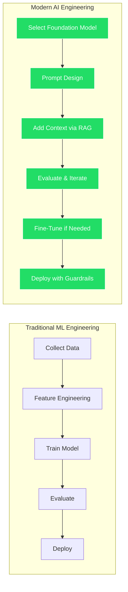

## 1. What Is AI Engineering?

### Table of Contents

- [Core Responsibilities](#core-responsibilities)
- [The Paradigm Shift](#the-paradigm-shift)

**AI Engineering** is an emerging software engineering discipline focused on **building products and systems on top of foundation models** (large language models, vision models, multimodal models) rather than training them from scratch.

> **The key insight:** AI Engineers are *consumers* of models, not *creators*. They leverage pre-trained models through APIs, fine-tuning, and orchestration to build production-grade applications.

### Core Responsibilities

| Responsibility | Description |
|---|---|
| **System Design** | Architect AI-native applications with appropriate model selection, data pipelines, and serving infrastructure |
| **Prompt Engineering** | Design, version, and optimize prompts as a core software artifact |
| **RAG Pipelines** | Build retrieval systems that ground LLM outputs in domain-specific data |
| **Fine-Tuning** | Adapt foundation models to specific domains and tasks |
| **Agent Orchestration** | Design autonomous agent workflows with tool use and planning |
| **Evaluation** | Build robust evaluation frameworks (automated + human-in-the-loop) |
| **Safety & Guardrails** | Implement input/output filtering, content moderation, and alignment checks |
| **Production Operations** | Deploy, monitor, and scale AI systems (LLMOps) |

### The Paradigm Shift

---

