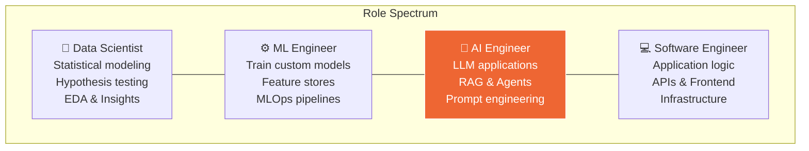

## 2. AI Engineering vs. Adjacent Roles

| Dimension | Data Scientist | ML Engineer | **AI Engineer** | Software Engineer |
|---|---|---|---|---|
| **Primary tool** | Notebooks, stats | PyTorch, TF | LLM APIs, orchestrators | Languages, frameworks |
| **Data focus** | Analysis & insight | Training data pipelines | Context & retrieval data | Application data |
| **Model relationship** | Builds statistical models | Trains/deploys ML models | **Consumes & orchestrates** foundation models | Uses APIs |
| **Key metric** | Statistical significance | Model accuracy / F1 | Task completion, user satisfaction, cost | Uptime, latency |
| **Iteration loop** | Experiment → Analyze | Train → Evaluate → Retrain | **Prompt → Evaluate → Refine** | Code → Test → Ship |

---

