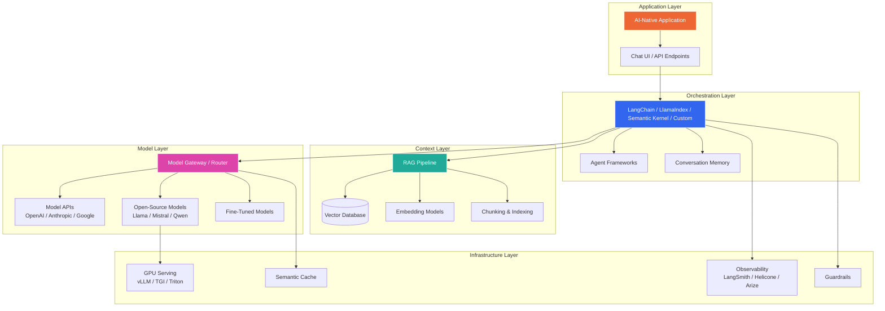

## 3. The Modern AI Stack

### Table of Contents

- [Key Technology Categories](#key-technology-categories)

### Key Technology Categories

| Category | Tools / Services |
|---|---|
| **Model Providers** | OpenAI, Anthropic, Google (Gemini), Mistral, Cohere, AWS Bedrock |
| **Open-Source Models** | Llama 3/4, Mistral, Qwen, DeepSeek, Gemma, Phi |
| **Orchestration** | LangChain, LlamaIndex, Semantic Kernel, Haystack, DSPy |
| **Agent Frameworks** | LangGraph, CrewAI, AutoGen, OpenAI Agents SDK |
| **Vector Databases** | Pinecone, Weaviate, Qdrant, Milvus, Chroma, pgvector |
| **Embedding Models** | OpenAI `text-embedding-3`, Cohere Embed, BGE, E5, Jina |
| **Model Serving** | vLLM, TGI (HuggingFace), Ollama, Triton, TensorRT-LLM |
| **Evaluation** | RAGAS, DeepEval, Promptfoo, Braintrust, custom harnesses |
| **Observability** | LangSmith, Langfuse, Helicone, Arize Phoenix, Weights & Biases |
| **Guardrails** | Guardrails AI, NeMo Guardrails, Lakera, custom classifiers |

---

