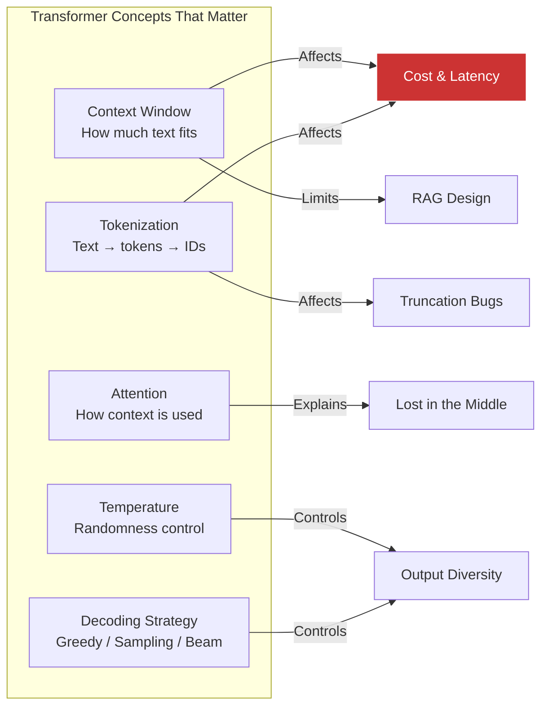
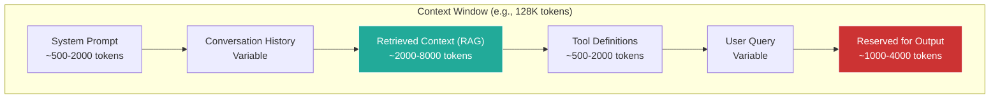

## 1. Foundation Model Fundamentals

### Table of Contents

- [1.1 Transformer Architecture — What AI Engineers Must Know](#11-transformer-architecture-what-ai-engineers-must-know)
- [1.2 Key Concepts](#12-key-concepts)
  - [Tokenization](#tokenization)
  - [Decoding Parameters](#decoding-parameters)
- [1.3 Context Window Management](#13-context-window-management)


### 1.1 Transformer Architecture — What AI Engineers Must Know

You don't need to implement transformers, but you **must** understand the concepts that affect your engineering decisions:



### 1.2 Key Concepts

#### Tokenization

```python
import tiktoken

# Understanding tokenization is essential for cost estimation and context management
encoder = tiktoken.encoding_for_model("gpt-4o")

text = "AI Engineering is the discipline of building applications with LLMs."
tokens = encoder.encode(text)

print(f"Text: {text}")
print(f"Token count: {len(tokens)}")           # ~13 tokens
print(f"Tokens: {tokens}")
print(f"Decoded individually:")
for t in tokens:
    print(f"  {t} → '{encoder.decode([t])}'")

# Cost estimation helper
def estimate_cost(
    input_text: str,
    output_tokens: int = 500,
    model: str = "gpt-4o",
    pricing: dict = None
) -> dict:
    """Estimate API call cost."""
    pricing = pricing or {
        "gpt-4o":       {"input": 2.50 / 1_000_000, "output": 10.00 / 1_000_000},
        "gpt-4o-mini":  {"input": 0.15 / 1_000_000, "output": 0.60  / 1_000_000},
        "gpt-4.1":      {"input": 2.00 / 1_000_000, "output": 8.00  / 1_000_000},
    }
    enc = tiktoken.encoding_for_model(model)
    input_tokens = len(enc.encode(input_text))
    rates = pricing[model]
    return {
        "model": model,
        "input_tokens": input_tokens,
        "output_tokens": output_tokens,
        "input_cost": input_tokens * rates["input"],
        "output_cost": output_tokens * rates["output"],
        "total_cost": input_tokens * rates["input"] + output_tokens * rates["output"],
    }
```

#### Decoding Parameters

```python
from openai import OpenAI
client = OpenAI()

# TEMPERATURE — controls randomness
# Low temperature (0.0–0.3): deterministic, factual tasks
response_factual = client.chat.completions.create(
    model="gpt-4o",
    temperature=0.0,       # Nearly deterministic
    messages=[{"role": "user", "content": "What is the capital of France?"}]
)

# High temperature (0.7–1.2): creative tasks
response_creative = client.chat.completions.create(
    model="gpt-4o",
    temperature=1.0,       # More diverse
    messages=[{"role": "user", "content": "Write a poem about recursion"}]
)

# TOP_P (nucleus sampling) — alternative to temperature
response_nucleus = client.chat.completions.create(
    model="gpt-4o",
    temperature=1.0,
    top_p=0.9,             # Only sample from top 90% probability mass
    messages=[{"role": "user", "content": "Generate a creative story opening"}]
)

# KEY RULE: Adjust temperature OR top_p, not both simultaneously
```

### 1.3 Context Window Management



> ⚠️ **"Lost in the Middle" Problem:** LLMs attend more strongly to information at the *beginning* and *end* of their context window. Place the most important retrieved context first or last — not buried in the middle.

---

