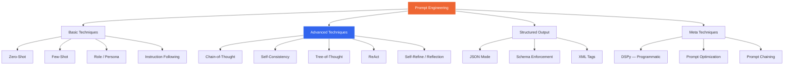

## 5. Prompt Engineering — Deep Dive

### Table of Contents

- [5.1 Taxonomy of Prompting Techniques](#51-taxonomy-of-prompting-techniques)
- [5.2 Prompting Patterns with Examples](#52-prompting-patterns-with-examples)
  - [Zero-Shot vs. Few-Shot](#zero-shot-vs-few-shot)
  - [Chain-of-Thought (CoT)](#chain-of-thought-cot)
  - [Self-Consistency (Ensemble Reasoning)](#self-consistency-ensemble-reasoning)
  - [Structured Output](#structured-output)
- [5.3 Prompt Management as Software Engineering](#53-prompt-management-as-software-engineering)


Prompt engineering is not ad-hoc; at senior level it is a **systematic discipline** with patterns, versioning, and evaluation.

### 5.1 Taxonomy of Prompting Techniques



### 5.2 Prompting Patterns with Examples

#### Zero-Shot vs. Few-Shot

```python
# ZERO-SHOT — rely on model's pre-existing knowledge
zero_shot_prompt = """
Classify the following customer review as POSITIVE, NEGATIVE, or NEUTRAL.

Review: "The product arrived on time but the packaging was damaged."
Classification:
"""

# FEW-SHOT — provide examples to establish the pattern
few_shot_prompt = """
Classify customer reviews as POSITIVE, NEGATIVE, or NEUTRAL.

Review: "Absolutely love this product! Best purchase ever."
Classification: POSITIVE

Review: "Terrible quality. Broke after two days."
Classification: NEGATIVE

Review: "It works as expected. Nothing special."
Classification: NEUTRAL

Review: "The product arrived on time but the packaging was damaged."
Classification:
"""
```

#### Chain-of-Thought (CoT)

```python
# Standard CoT — explicit reasoning steps
cot_prompt = """
Solve this step by step:

A store has 45 apples. They sell 60% in the morning and half of the 
remainder in the afternoon. How many apples are left?

Let's think step by step:
1. Morning sales: 45 × 0.60 = 27 apples sold
2. Remaining after morning: 45 - 27 = 18 apples
3. Afternoon sales: 18 / 2 = 9 apples sold
4. Remaining: 18 - 9 = 9 apples

Answer: 9 apples
---
Now solve this:

A warehouse has 120 boxes. They ship 35% on Monday, then 40% of what 
remains on Tuesday. How many boxes are left?

Let's think step by step:
"""

# Zero-Shot CoT — just add the magic phrase
zero_shot_cot = """
A warehouse has 120 boxes. They ship 35% on Monday, then 40% of what 
remains on Tuesday. How many boxes are left?

Let's think step by step.
"""
```

#### Self-Consistency (Ensemble Reasoning)

```python
import json
from collections import Counter
from openai import OpenAI

client = OpenAI()

def self_consistency(prompt: str, n: int = 5, model: str = "gpt-4o") -> str:
    """
    Generate N reasoning paths with high temperature, 
    then take majority vote on the final answer.
    """
    answers = []

    for _ in range(n):
        response = client.chat.completions.create(
            model=model,
            temperature=0.9,  # High temp for diverse reasoning paths
            messages=[
                {"role": "system", "content": (
                    "Solve the problem step by step. "
                    "End with: FINAL_ANSWER: <your answer>"
                )},
                {"role": "user", "content": prompt}
            ]
        )
        text = response.choices[0].message.content
        # Extract final answer
        if "FINAL_ANSWER:" in text:
            answer = text.split("FINAL_ANSWER:")[-1].strip()
            answers.append(answer)

    # Majority vote
    counter = Counter(answers)
    most_common = counter.most_common(1)[0]
    return {
        "answer": most_common[0],
        "confidence": most_common[1] / len(answers),
        "all_answers": dict(counter)
    }
```

#### Structured Output

```python
from openai import OpenAI
from pydantic import BaseModel

client = OpenAI()

# Using Pydantic models for structured outputs
class ExtractedEntity(BaseModel):
    name: str
    entity_type: str          # PERSON, ORGANIZATION, LOCATION, DATE
    confidence: float         # 0.0 - 1.0
    context_snippet: str      # surrounding text

class ExtractionResult(BaseModel):
    entities: list[ExtractedEntity]
    summary: str

response = client.responses.parse(
    model="gpt-4o",
    input=[
        {"role": "system", "content": "Extract named entities from the text."},
        {"role": "user", "content": (
            "Apple CEO Tim Cook announced the new iPhone at the "
            "Steve Jobs Theater in Cupertino on September 9, 2025."
        )}
    ],
    text_format=ExtractionResult,
)

result: ExtractionResult = response.output_parsed
for entity in result.entities:
    print(f"  {entity.name} ({entity.entity_type}) — {entity.confidence:.0%}")
```

### 5.3 Prompt Management as Software Engineering

```python
from dataclasses import dataclass, field
from datetime import datetime
from string import Template
import hashlib
import json


@dataclass
class PromptTemplate:
    """Production-grade prompt template with versioning and metadata."""
    name: str
    version: str
    template: str
    model: str
    temperature: float = 0.0
    max_tokens: int = 1024
    metadata: dict = field(default_factory=dict)
    created_at: str = field(default_factory=lambda: datetime.utcnow().isoformat())

    @property
    def content_hash(self) -> str:
        return hashlib.sha256(self.template.encode()).hexdigest()[:12]

    def render(self, **kwargs) -> str:
        return Template(self.template).safe_substitute(**kwargs)

    def to_message(self, role: str = "system", **kwargs) -> dict:
        return {"role": role, "content": self.render(**kwargs)}


# Example: versioned prompt registry
PROMPT_REGISTRY = {
    "classification_v1": PromptTemplate(
        name="customer_review_classifier",
        version="1.0.0",
        model="gpt-4o-mini",
        temperature=0.0,
        template="""You are a customer review classifier.

Classify the review into exactly one category: $categories

Rules:
- Respond ONLY with the category name
- If uncertain, choose the closest match
- Consider the overall sentiment, not individual phrases

Review: $review
Category:""",
        metadata={"task": "classification", "owner": "ml-team"}
    ),

    "classification_v2": PromptTemplate(
        name="customer_review_classifier",
        version="2.0.0",
        model="gpt-4o-mini",
        temperature=0.0,
        template="""You are a customer review classification system.

## Task
Classify the following review into one of these categories: $categories

## Rules
1. Respond with a JSON object: {"category": "...", "reasoning": "..."}
2. Consider the OVERALL sentiment, not individual words
3. "Mixed" reviews that lean positive → POSITIVE
4. "Mixed" reviews that lean negative → NEGATIVE

## Review
$review""",
        metadata={"task": "classification", "owner": "ml-team", "format": "json"}
    ),
}
```

---

