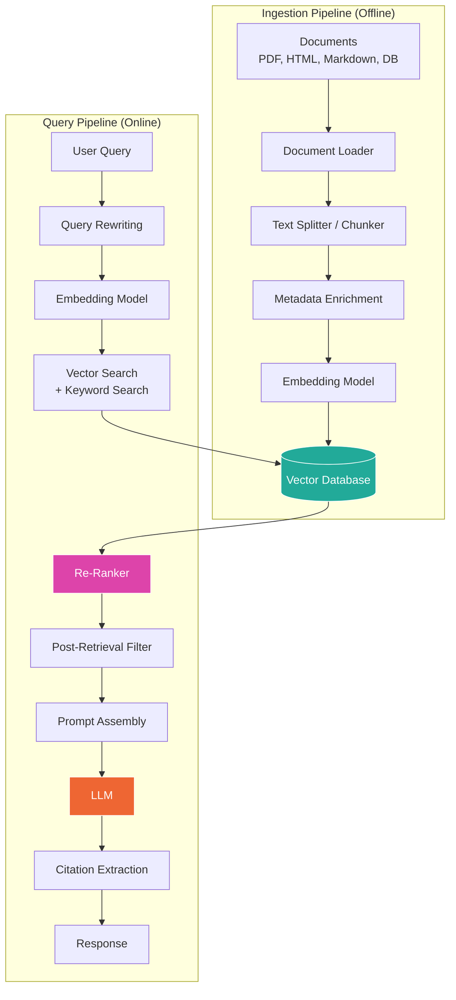
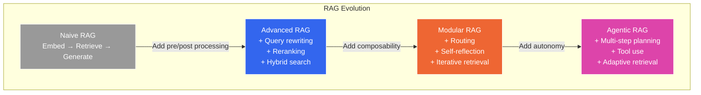

## 1. Retrieval-Augmented Generation (RAG)

### Table of Contents

- [1.1 Architecture Overview](#11-architecture-overview)
- [1.2 Chunking Strategies](#12-chunking-strategies)
- [Chunking Strategy Decision Matrix](#chunking-strategy-decision-matrix)
- [1.3 Full RAG Pipeline](#13-full-rag-pipeline)
- [1.4 Advanced RAG Patterns](#14-advanced-rag-patterns)
  - [Hybrid Search (Vector + Keyword)](#hybrid-search-vector-keyword)
  - [Self-Reflective RAG (CRAG Pattern)](#self-reflective-rag-crag-pattern)


RAG is the most common pattern in AI Engineering. It grounds LLM responses in your proprietary data without retraining the model.

### 1.1 Architecture Overview



### 1.2 Chunking Strategies

```python
from dataclasses import dataclass
from enum import Enum


class ChunkStrategy(Enum):
    FIXED_SIZE = "fixed_size"
    RECURSIVE = "recursive"
    SEMANTIC = "semantic"
    DOCUMENT_STRUCTURE = "document_structure"


@dataclass
class Chunk:
    content: str
    metadata: dict
    chunk_id: str
    token_count: int


def recursive_character_split(
    text: str,
    chunk_size: int = 512,
    chunk_overlap: int = 50,
    separators: list[str] = None,
) -> list[str]:
    """
    Recursively split text using a hierarchy of separators.
    Tries to keep semantically coherent units together.
    """
    separators = separators or ["\n\n", "\n", ". ", " ", ""]

    chunks = []
    current_sep = separators[0]
    remaining_seps = separators[1:]

    parts = text.split(current_sep) if current_sep else list(text)

    current_chunk = ""
    for part in parts:
        candidate = current_chunk + current_sep + part if current_chunk else part

        if len(candidate) <= chunk_size:
            current_chunk = candidate
        else:
            if current_chunk:
                chunks.append(current_chunk)
            # If single part exceeds chunk_size, split with finer separator
            if len(part) > chunk_size and remaining_seps:
                sub_chunks = recursive_character_split(
                    part, chunk_size, chunk_overlap, remaining_seps
                )
                chunks.extend(sub_chunks)
                current_chunk = ""
            else:
                current_chunk = part

    if current_chunk:
        chunks.append(current_chunk)

    # Apply overlap
    if chunk_overlap > 0 and len(chunks) > 1:
        overlapped = [chunks[0]]
        for i in range(1, len(chunks)):
            overlap_text = chunks[i - 1][-chunk_overlap:]
            overlapped.append(overlap_text + chunks[i])
        return overlapped

    return chunks


def semantic_chunking(
    text: str,
    embedding_fn: callable,
    similarity_threshold: float = 0.8,
) -> list[str]:
    """
    Split text into chunks based on semantic similarity between 
    consecutive sentences. When similarity drops below threshold, 
    create a new chunk boundary.
    """
    import numpy as np

    # Split into sentences first
    sentences = [s.strip() for s in text.split(". ") if s.strip()]

    if len(sentences) <= 1:
        return [text]

    # Get embeddings for all sentences
    embeddings = embedding_fn(sentences)

    # Calculate cosine similarity between consecutive sentences
    chunks = []
    current_chunk = [sentences[0]]

    for i in range(1, len(sentences)):
        sim = np.dot(embeddings[i - 1], embeddings[i]) / (
            np.linalg.norm(embeddings[i - 1]) * np.linalg.norm(embeddings[i])
        )

        if sim >= similarity_threshold:
            current_chunk.append(sentences[i])
        else:
            chunks.append(". ".join(current_chunk) + ".")
            current_chunk = [sentences[i]]

    if current_chunk:
        chunks.append(". ".join(current_chunk) + ".")

    return chunks
```

### Chunking Strategy Decision Matrix

| Strategy | Best For | Chunk Size | Pros | Cons |
|---|---|---|---|---|
| **Fixed-size** | Homogeneous docs | 256–512 tokens | Simple, predictable | Breaks mid-sentence |
| **Recursive** | General purpose | 256–1024 tokens | Respects structure | Needs tuning of separators |
| **Semantic** | Dense narratives | Variable | Coherent meaning units | Expensive (needs embeddings) |
| **Document-based** | Structured docs (MD, HTML) | Variable | Preserves hierarchy | Requires format-specific parsing |
| **Agentic (LLM-based)** | High-value corpora | Variable | Best quality | Very expensive |

### 1.3 Full RAG Pipeline

```python
from dataclasses import dataclass
from openai import OpenAI
import numpy as np


@dataclass
class RetrievedDocument:
    content: str
    metadata: dict
    score: float
    doc_id: str


class RAGPipeline:
    """Production RAG pipeline with query rewriting, retrieval, 
    reranking, and answer generation."""

    def __init__(
        self,
        vector_store,                 # Your vector DB client
        llm_model: str = "gpt-4o",
        embedding_model: str = "text-embedding-3-small",
        reranker=None,                # Optional cross-encoder reranker
        top_k: int = 10,
        top_n_after_rerank: int = 5,
    ):
        self.client = OpenAI()
        self.vector_store = vector_store
        self.llm_model = llm_model
        self.embedding_model = embedding_model
        self.reranker = reranker
        self.top_k = top_k
        self.top_n = top_n_after_rerank

    def rewrite_query(self, query: str, chat_history: list[dict] = None) -> list[str]:
        """
        Generate multiple search queries from the user's question.
        Handles ambiguity, coreference resolution, and multi-faceted questions.
        """
        history_context = ""
        if chat_history:
            history_context = "\n".join(
                f"{m['role']}: {m['content']}" for m in chat_history[-6:]
            )

        response = self.client.chat.completions.create(
            model="gpt-4o-mini",
            temperature=0.0,
            messages=[
                {"role": "system", "content": """You are a search query optimizer.
Given a user question (and optional chat history), generate 3 diverse search 
queries that would help find relevant documents. Consider:
- Synonyms and alternative phrasings
- Breaking complex questions into sub-queries
- Resolving pronouns using chat history

Return one query per line, no numbering."""},
                {"role": "user", "content": (
                    f"Chat history:\n{history_context}\n\n"
                    f"User question: {query}" if history_context
                    else f"User question: {query}"
                )}
            ]
        )
        queries = response.choices[0].message.content.strip().split("\n")
        return [q.strip() for q in queries if q.strip()]

    def embed(self, texts: list[str]) -> list[list[float]]:
        """Get embeddings for a list of texts."""
        response = self.client.embeddings.create(
            model=self.embedding_model,
            input=texts
        )
        return [d.embedding for d in response.data]

    def retrieve(self, queries: list[str]) -> list[RetrievedDocument]:
        """Retrieve and deduplicate documents for multiple queries."""
        seen_ids = set()
        all_docs = []

        for query in queries:
            query_embedding = self.embed([query])[0]
            results = self.vector_store.search(
                vector=query_embedding,
                top_k=self.top_k,
            )
            for doc in results:
                if doc.doc_id not in seen_ids:
                    seen_ids.add(doc.doc_id)
                    all_docs.append(doc)

        return all_docs

    def rerank(
        self, query: str, documents: list[RetrievedDocument]
    ) -> list[RetrievedDocument]:
        """Re-rank retrieved documents using a cross-encoder for higher precision."""
        if not self.reranker or not documents:
            return documents[:self.top_n]

        pairs = [(query, doc.content) for doc in documents]
        scores = self.reranker.predict(pairs)

        for doc, score in zip(documents, scores):
            doc.score = float(score)

        ranked = sorted(documents, key=lambda d: d.score, reverse=True)
        return ranked[:self.top_n]

    def generate(
        self,
        query: str,
        documents: list[RetrievedDocument],
        chat_history: list[dict] = None,
    ) -> dict:
        """Generate an answer grounded in retrieved documents."""

        # Build context block
        context_parts = []
        for i, doc in enumerate(documents):
            source = doc.metadata.get("source", "Unknown")
            context_parts.append(
                f"[Document {i+1}] (Source: {source})\n{doc.content}"
            )
        context = "\n\n---\n\n".join(context_parts)

        system_prompt = """You are a helpful assistant that answers questions 
based ONLY on the provided context documents.

Rules:
1. Only use information from the provided documents
2. If the documents don't contain the answer, say "I don't have enough 
   information to answer this question based on the available documents."
3. Cite your sources using [Document N] notation
4. Be precise and concise
5. Never make up information not present in the documents"""

        messages = [{"role": "system", "content": system_prompt}]
        if chat_history:
            messages.extend(chat_history[-10:])
        messages.append({
            "role": "user",
            "content": f"Context:\n{context}\n\n---\n\nQuestion: {query}"
        })

        response = self.client.chat.completions.create(
            model=self.llm_model,
            temperature=0.0,
            messages=messages,
        )

        return {
            "answer": response.choices[0].message.content,
            "sources": [d.metadata for d in documents],
            "token_usage": {
                "prompt": response.usage.prompt_tokens,
                "completion": response.usage.completion_tokens,
            }
        }

    def query(self, question: str, chat_history: list[dict] = None) -> dict:
        """End-to-end RAG query."""
        # Step 1: Query rewriting
        queries = self.rewrite_query(question, chat_history)

        # Step 2: Retrieval
        documents = self.retrieve(queries)

        # Step 3: Reranking
        documents = self.rerank(question, documents)

        # Step 4: Generation
        result = self.generate(question, documents, chat_history)
        result["rewritten_queries"] = queries
        return result
```

### 1.4 Advanced RAG Patterns



#### Hybrid Search (Vector + Keyword)

```python
def hybrid_search(
    query: str,
    vector_store,
    bm25_index,
    embedding_fn: callable,
    top_k: int = 10,
    alpha: float = 0.7,     # Weight for vector search (1-alpha for BM25)
) -> list[RetrievedDocument]:
    """
    Combine dense vector search with sparse BM25 keyword search
    using Reciprocal Rank Fusion (RRF).
    """
    # Dense retrieval
    query_vec = embedding_fn(query)
    vector_results = vector_store.search(vector=query_vec, top_k=top_k * 2)

    # Sparse retrieval
    bm25_results = bm25_index.search(query, top_k=top_k * 2)

    # Reciprocal Rank Fusion
    k = 60  # RRF constant
    rrf_scores = {}

    for rank, doc in enumerate(vector_results):
        rrf_scores[doc.doc_id] = rrf_scores.get(doc.doc_id, 0) + \
            alpha * (1 / (k + rank + 1))

    for rank, doc in enumerate(bm25_results):
        rrf_scores[doc.doc_id] = rrf_scores.get(doc.doc_id, 0) + \
            (1 - alpha) * (1 / (k + rank + 1))

    # Build result list sorted by RRF score
    all_docs = {d.doc_id: d for d in vector_results + bm25_results}
    ranked = sorted(rrf_scores.items(), key=lambda x: x[1], reverse=True)

    return [
        RetrievedDocument(
            content=all_docs[doc_id].content,
            metadata=all_docs[doc_id].metadata,
            score=score,
            doc_id=doc_id,
        )
        for doc_id, score in ranked[:top_k]
        if doc_id in all_docs
    ]
```

#### Self-Reflective RAG (CRAG Pattern)

```python
class CorrectiveRAG:
    """
    Corrective RAG — evaluates retrieval quality before generation.
    If retrieved docs are irrelevant, falls back to web search or 
    rephrases the query.
    """

    def __init__(self, rag_pipeline: RAGPipeline):
        self.rag = rag_pipeline
        self.client = OpenAI()

    def evaluate_relevance(
        self, query: str, documents: list[RetrievedDocument]
    ) -> list[dict]:
        """Use LLM to grade document relevance."""
        graded = []
        for doc in documents:
            response = self.client.chat.completions.create(
                model="gpt-4o-mini",
                temperature=0.0,
                messages=[
                    {"role": "system", "content": (
                        "You are a relevance grader. Given a question and a "
                        "document, determine if the document is relevant.\n"
                        "Respond with ONLY 'relevant' or 'irrelevant'."
                    )},
                    {"role": "user", "content": (
                        f"Question: {query}\n\n"
                        f"Document: {doc.content[:1000]}"
                    )}
                ]
            )
            grade = response.choices[0].message.content.strip().lower()
            graded.append({"doc": doc, "grade": grade})
        return graded

    def query(self, question: str) -> dict:
        # Step 1: Initial retrieval
        queries = self.rag.rewrite_query(question)
        documents = self.rag.retrieve(queries)
        documents = self.rag.rerank(question, documents)

        # Step 2: Grade relevance
        graded = self.evaluate_relevance(question, documents)
        relevant_docs = [g["doc"] for g in graded if g["grade"] == "relevant"]

        # Step 3: Decide action
        relevance_ratio = len(relevant_docs) / max(len(graded), 1)

        if relevance_ratio >= 0.5:
            # Sufficient relevant documents — proceed with generation
            return self.rag.generate(question, relevant_docs)
        elif relevance_ratio > 0:
            # Partial relevance — supplement with query refinement
            refined = self.rag.rewrite_query(
                f"I need more specific information about: {question}"
            )
            extra_docs = self.rag.retrieve(refined)
            all_docs = relevant_docs + extra_docs
            return self.rag.generate(question, all_docs)
        else:
            # No relevant documents — indicate knowledge gap
            return {
                "answer": (
                    "I couldn't find relevant information in the knowledge base "
                    "to answer this question. Please try rephrasing or ask about "
                    "a different topic."
                ),
                "sources": [],
                "retrieval_status": "no_relevant_documents",
            }
```

---

