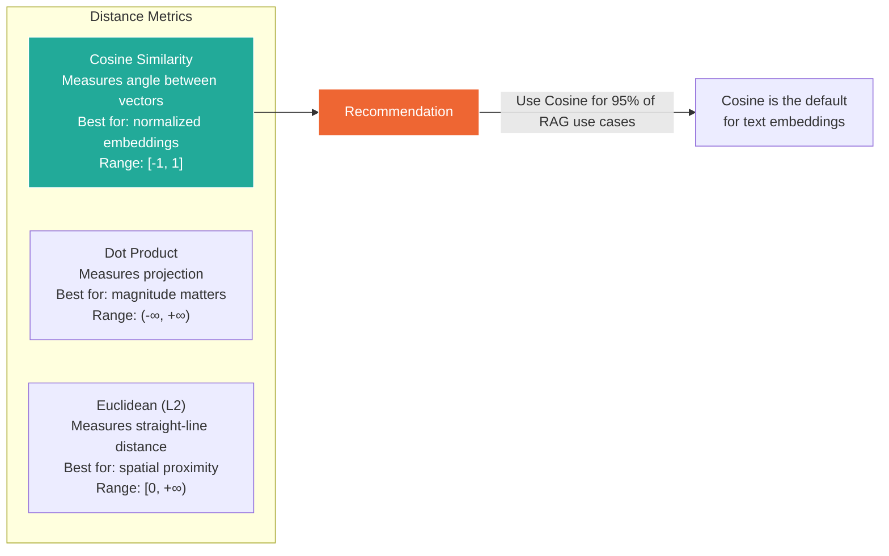

## 7. Embeddings & Vector Databases

### Table of Contents

- [7.1 Embedding Models Comparison](#71-embedding-models-comparison)
- [7.2 Vector Database Operations](#72-vector-database-operations)
- [7.3 Distance Metrics](#73-distance-metrics)


### 7.1 Embedding Models Comparison

| Model | Dimensions | Max Tokens | Use Case | Provider |
|---|---|---|---|---|
| `text-embedding-3-small` | 1536 | 8191 | Cost-effective general | OpenAI |
| `text-embedding-3-large` | 3072 | 8191 | High-quality general | OpenAI |
| `embed-v4` | 1024 | 128000 | Long-document | Cohere |
| `bge-large-en-v1.5` | 1024 | 512 | Open-source, strong | BAAI |
| `e5-mistral-7b` | 4096 | 32768 | Open-source, long ctx | Microsoft |
| `jina-embeddings-v3` | 1024 | 8192 | Multilingual | Jina AI |

### 7.2 Vector Database Operations

```python
# Example: Qdrant vector database operations
from qdrant_client import QdrantClient
from qdrant_client.models import (
    Distance, VectorParams, PointStruct,
    Filter, FieldCondition, MatchValue,
    SearchParams, HnswConfigDiff,
)
import uuid


class VectorStore:
    """Production vector store wrapper with Qdrant."""

    def __init__(
        self,
        collection_name: str,
        vector_size: int = 1536,
        url: str = "http://localhost:6333",
    ):
        self.client = QdrantClient(url=url)
        self.collection = collection_name
        self.vector_size = vector_size
        self._ensure_collection()

    def _ensure_collection(self):
        collections = [c.name for c in self.client.get_collections().collections]
        if self.collection not in collections:
            self.client.create_collection(
                collection_name=self.collection,
                vectors_config=VectorParams(
                    size=self.vector_size,
                    distance=Distance.COSINE,
                ),
                hnsw_config=HnswConfigDiff(
                    m=16,                  # Max connections per node
                    ef_construct=100,      # Build-time search width
                ),
            )

    def upsert(
        self,
        texts: list[str],
        embeddings: list[list[float]],
        metadatas: list[dict] = None,
        ids: list[str] = None,
    ):
        """Insert or update vectors with metadata."""
        ids = ids or [str(uuid.uuid4()) for _ in texts]
        metadatas = metadatas or [{} for _ in texts]

        points = [
            PointStruct(
                id=uid,
                vector=emb,
                payload={"text": text, **meta},
            )
            for uid, emb, text, meta in zip(ids, embeddings, texts, metadatas)
        ]

        # Batch upsert for performance
        batch_size = 100
        for i in range(0, len(points), batch_size):
            self.client.upsert(
                collection_name=self.collection,
                points=points[i:i + batch_size],
            )

    def search(
        self,
        vector: list[float],
        top_k: int = 10,
        filters: dict = None,
        score_threshold: float = None,
    ) -> list[RetrievedDocument]:
        """Search for similar vectors with optional metadata filtering."""

        # Build filter
        qdrant_filter = None
        if filters:
            conditions = [
                FieldCondition(key=k, match=MatchValue(value=v))
                for k, v in filters.items()
            ]
            qdrant_filter = Filter(must=conditions)

        results = self.client.search(
            collection_name=self.collection,
            query_vector=vector,
            limit=top_k,
            query_filter=qdrant_filter,
            score_threshold=score_threshold,
            search_params=SearchParams(
                hnsw_ef=128,  # Query-time search width (higher = more accurate)
            ),
        )

        return [
            RetrievedDocument(
                content=r.payload.get("text", ""),
                metadata={k: v for k, v in r.payload.items() if k != "text"},
                score=r.score,
                doc_id=str(r.id),
            )
            for r in results
        ]
```

### 7.3 Distance Metrics



---

