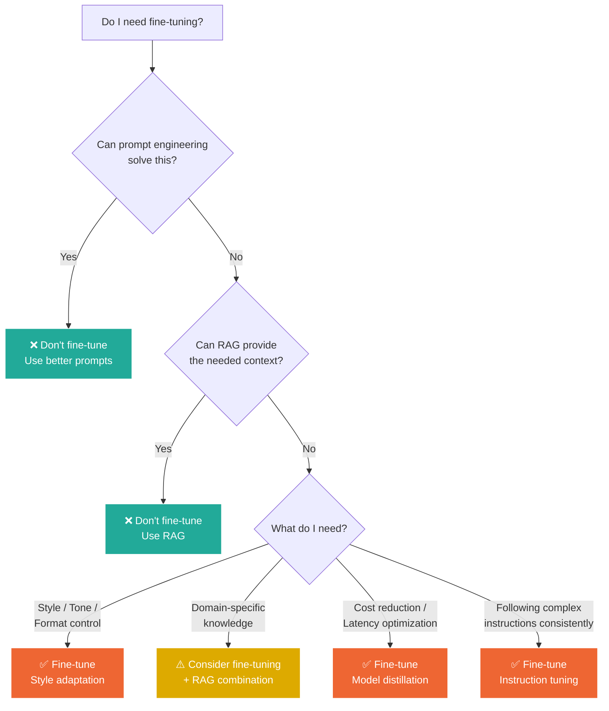

## 1. Fine-Tuning Strategies

### Table of Contents

- [1.1 When to Fine-Tune](#11-when-to-fine-tune)
- [1.2 Fine-Tuning Approaches](#12-fine-tuning-approaches)
- [1.3 Preparing Fine-Tuning Data](#13-preparing-fine-tuning-data)


### 1.1 When to Fine-Tune



### 1.2 Fine-Tuning Approaches

| Approach | What Changes | Data Needed | Cost | Use Case |
|---|---|---|---|---|
| **Full Fine-Tune** | All weights | 10K+ examples | $$$$ | Maximum customization |
| **LoRA / QLoRA** | Low-rank adapters | 1K–10K examples | $$ | Most common approach |
| **Prompt Tuning** | Soft prompt embeddings | 100–1K examples | $ | Lightweight adaptation |
| **Distillation** | Smaller model trained on larger model's outputs | Varies | $$ | Cost/latency reduction |
| **DPO / RLHF** | Alignment fine-tuning | Preference pairs | $$$ | Behavior alignment |

### 1.3 Preparing Fine-Tuning Data

```python
import json
from pathlib import Path


def create_openai_finetune_dataset(
    examples: list[dict],
    output_path: str = "finetune_data.jsonl",
    system_prompt: str = "You are a helpful assistant.",
    val_split: float = 0.1,
) -> dict:
    """
    Create a fine-tuning dataset in OpenAI's JSONL format.

    Each example should have:
    - 'input': user message
    - 'output': desired assistant response
    - 'context' (optional): additional context
    """
    formatted = []
    for ex in examples:
        messages = [{"role": "system", "content": system_prompt}]

        if "context" in ex:
            messages.append({
                "role": "user",
                "content": f"Context: {ex['context']}\n\nQuestion: {ex['input']}"
            })
        else:
            messages.append({"role": "user", "content": ex["input"]})

        messages.append({"role": "assistant", "content": ex["output"]})
        formatted.append({"messages": messages})

    # Split train/val
    split_idx = int(len(formatted) * (1 - val_split))
    train_data = formatted[:split_idx]
    val_data = formatted[split_idx:]

    # Write JSONL files
    train_path = Path(output_path)
    val_path = train_path.with_stem(train_path.stem + "_val")

    for path, data in [(train_path, train_data), (val_path, val_data)]:
        with open(path, "w") as f:
            for item in data:
                f.write(json.dumps(item) + "\n")

    return {
        "train_path": str(train_path),
        "val_path": str(val_path),
        "train_examples": len(train_data),
        "val_examples": len(val_data),
    }


# Distillation: Generate training data from a larger model
async def distill_dataset(
    prompts: list[str],
    teacher_model: str = "gpt-4o",
    system_prompt: str = "You are a helpful assistant.",
) -> list[dict]:
    """
    Generate fine-tuning examples by running a teacher model (large, expensive)
    to create training data for a student model (small, cheap).
    """
    from openai import AsyncOpenAI
    import asyncio

    client = AsyncOpenAI()
    examples = []

    semaphore = asyncio.Semaphore(10)  # Rate limiting

    async def generate_one(prompt: str) -> dict:
        async with semaphore:
            response = await client.chat.completions.create(
                model=teacher_model,
                temperature=0.3,
                messages=[
                    {"role": "system", "content": system_prompt},
                    {"role": "user", "content": prompt},
                ],
            )
            return {
                "input": prompt,
                "output": response.choices[0].message.content,
            }

    tasks = [generate_one(p) for p in prompts]
    examples = await asyncio.gather(*tasks, return_exceptions=True)

    return [ex for ex in examples if not isinstance(ex, Exception)]
```

---

