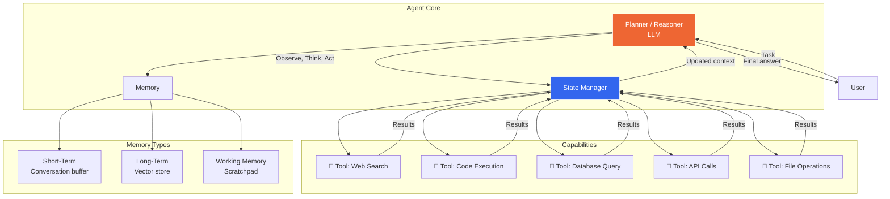
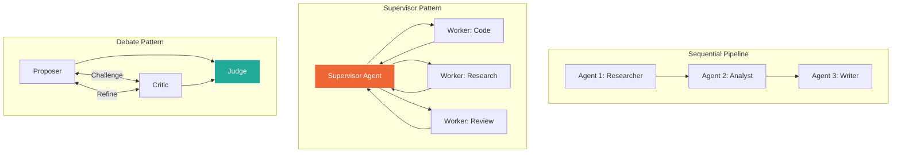

## 9. AI Agents & Tool Use

### Table of Contents

- [9.1 Agent Architecture](#91-agent-architecture)
- [9.2 ReAct Pattern (Reasoning + Acting)](#92-react-pattern-reasoning-acting)
- [9.3 Multi-Agent Patterns](#93-multi-agent-patterns)


### 9.1 Agent Architecture



### 9.2 ReAct Pattern (Reasoning + Acting)

```python
from openai import OpenAI
from typing import Any
import json


class Tool:
    def __init__(self, name: str, description: str, parameters: dict, fn: callable):
        self.name = name
        self.description = description
        self.parameters = parameters
        self.fn = fn

    def to_openai_tool(self) -> dict:
        return {
            "type": "function",
            "function": {
                "name": self.name,
                "description": self.description,
                "parameters": self.parameters,
            }
        }

    def execute(self, **kwargs) -> str:
        result = self.fn(**kwargs)
        return json.dumps(result) if not isinstance(result, str) else result


class ReActAgent:
    """
    ReAct agent using OpenAI's function calling.
    Implements the Thought → Action → Observation loop.
    """

    def __init__(
        self,
        model: str = "gpt-4o",
        tools: list[Tool] = None,
        max_iterations: int = 10,
        system_prompt: str = None,
    ):
        self.client = OpenAI()
        self.model = model
        self.tools = {t.name: t for t in (tools or [])}
        self.max_iterations = max_iterations
        self.system_prompt = system_prompt or (
            "You are a helpful AI assistant with access to tools. "
            "Use them when needed to answer the user's question accurately. "
            "Think step-by-step before acting."
        )

    def run(self, user_message: str) -> dict:
        messages = [
            {"role": "system", "content": self.system_prompt},
            {"role": "user", "content": user_message},
        ]

        openai_tools = [t.to_openai_tool() for t in self.tools.values()]
        trace = []  # Record all steps for observability

        for iteration in range(self.max_iterations):
            response = self.client.chat.completions.create(
                model=self.model,
                messages=messages,
                tools=openai_tools if openai_tools else None,
                tool_choice="auto",
            )

            choice = response.choices[0]

            # If no tool calls, we have the final answer
            if choice.finish_reason == "stop":
                trace.append({
                    "step": iteration + 1,
                    "type": "final_answer",
                    "content": choice.message.content,
                })
                return {
                    "answer": choice.message.content,
                    "trace": trace,
                    "iterations": iteration + 1,
                }

            # Process tool calls
            messages.append(choice.message)

            for tool_call in choice.message.tool_calls:
                fn_name = tool_call.function.name
                fn_args = json.loads(tool_call.function.arguments)

                trace.append({
                    "step": iteration + 1,
                    "type": "tool_call",
                    "tool": fn_name,
                    "arguments": fn_args,
                })

                # Execute tool
                if fn_name in self.tools:
                    try:
                        result = self.tools[fn_name].execute(**fn_args)
                    except Exception as e:
                        result = f"Error executing {fn_name}: {str(e)}"
                else:
                    result = f"Unknown tool: {fn_name}"

                trace.append({
                    "step": iteration + 1,
                    "type": "tool_result",
                    "tool": fn_name,
                    "result": result[:1000],  # Truncate for trace
                })

                messages.append({
                    "role": "tool",
                    "tool_call_id": tool_call.id,
                    "content": result,
                })

        return {
            "answer": "Max iterations reached without a final answer.",
            "trace": trace,
            "iterations": self.max_iterations,
        }


# --- Example usage ---

def search_database(query: str, table: str = "products") -> list[dict]:
    """Simulated database search."""
    # In production: actual DB query
    return [{"id": 1, "name": "Widget A", "price": 29.99, "stock": 150}]

def calculate(expression: str) -> float:
    """Safe math evaluation."""
    import ast
    return float(eval(ast.literal_eval(repr(expression))))  # simplified

# Define tools
tools = [
    Tool(
        name="search_database",
        description="Search the product database with a natural language query",
        parameters={
            "type": "object",
            "properties": {
                "query": {"type": "string", "description": "Search query"},
                "table": {
                    "type": "string",
                    "enum": ["products", "orders", "customers"],
                    "description": "Table to search",
                },
            },
            "required": ["query"],
        },
        fn=search_database,
    ),
    Tool(
        name="calculate",
        description="Perform mathematical calculations",
        parameters={
            "type": "object",
            "properties": {
                "expression": {
                    "type": "string",
                    "description": "Math expression to evaluate, e.g. '2 + 2 * 3'",
                },
            },
            "required": ["expression"],
        },
        fn=calculate,
    ),
]

agent = ReActAgent(tools=tools)
result = agent.run("What's the total value of Widget A if we sell all stock at full price?")
```

### 9.3 Multi-Agent Patterns



---

