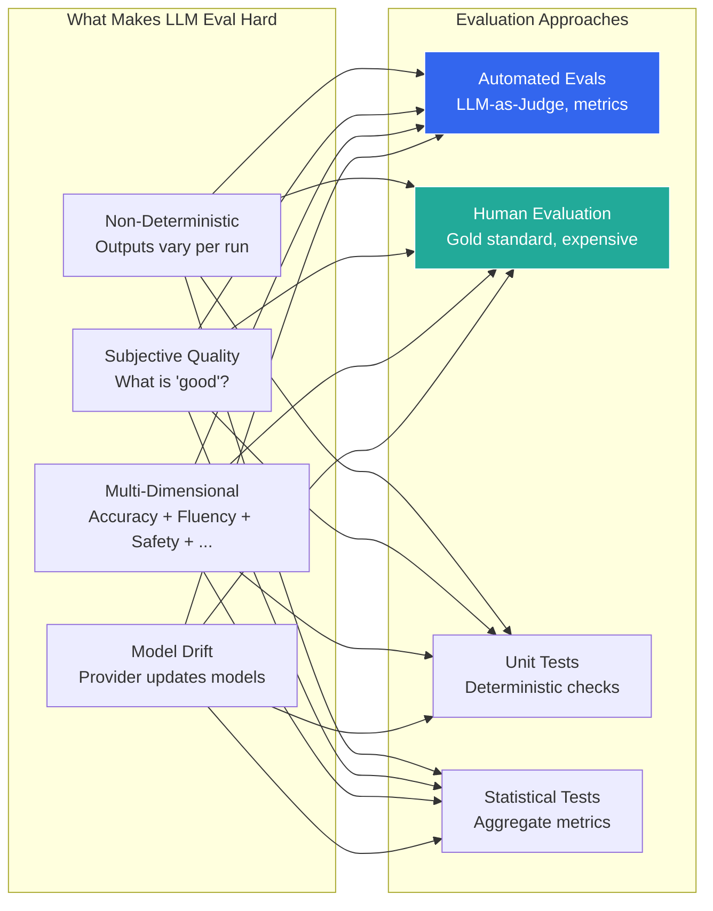
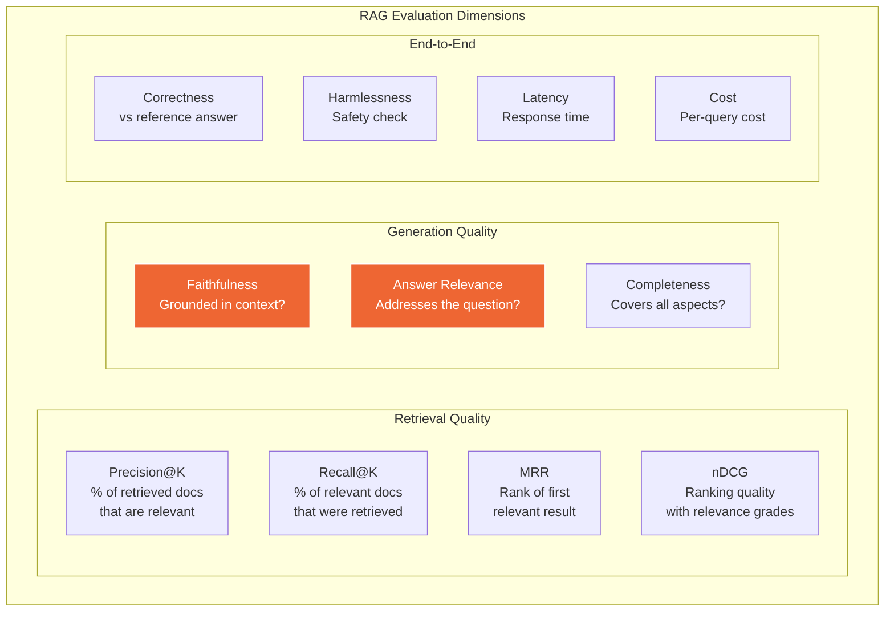

## 11. Evaluation & Observability

### Table of Contents

- [11.1 The Evaluation Problem](#111-the-evaluation-problem)
- [11.2 Evaluation Framework](#112-evaluation-framework)
- [11.3 RAG-Specific Evaluation Metrics](#113-rag-specific-evaluation-metrics)
- [11.4 Observability Stack](#114-observability-stack)


### 11.1 The Evaluation Problem



### 11.2 Evaluation Framework

```python
from dataclasses import dataclass
from enum import Enum
import json
import re


class EvalMetric(Enum):
    FAITHFULNESS = "faithfulness"        # Does the answer use only provided context?
    RELEVANCE = "relevance"              # Is the answer relevant to the question?
    CORRECTNESS = "correctness"          # Is the answer factually correct?
    COMPLETENESS = "completeness"        # Does it address all parts of the question?
    CONCISENESS = "conciseness"          # Is it appropriately brief?
    HARMFULNESS = "harmfulness"          # Does it contain harmful content?
    HALLUCINATION = "hallucination"      # Does it make up facts?


@dataclass
class EvalResult:
    metric: EvalMetric
    score: float              # 0.0 - 1.0
    reasoning: str
    test_case_id: str


class LLMJudge:
    """
    LLM-as-Judge evaluation framework.
    Uses a strong model to evaluate outputs of the system under test.
    """

    EVAL_PROMPTS = {
        EvalMetric.FAITHFULNESS: """You are evaluating whether an AI answer is 
faithful to the provided context (i.e., does NOT contain information 
not present in the context).

Context: {context}
Question: {question}
Answer: {answer}

Score the faithfulness from 0.0 to 1.0:
- 1.0: Every claim in the answer is supported by the context
- 0.5: Some claims are supported, some are not
- 0.0: The answer contains mostly unsupported claims

Respond in JSON: {{"score": <float>, "reasoning": "<explanation>"}}""",

        EvalMetric.RELEVANCE: """You are evaluating whether an AI answer is 
relevant to the user's question.

Question: {question}
Answer: {answer}

Score the relevance from 0.0 to 1.0:
- 1.0: Directly and completely addresses the question
- 0.5: Partially addresses the question
- 0.0: Does not address the question at all

Respond in JSON: {{"score": <float>, "reasoning": "<explanation>"}}""",

        EvalMetric.HALLUCINATION: """You are a hallucination detector. Determine 
if the AI answer contains fabricated information not grounded in the context.

Context: {context}
Question: {question}
Answer: {answer}

Score from 0.0 to 1.0 where:
- 1.0: No hallucination detected — all facts are grounded
- 0.5: Minor hallucinations or embellishments
- 0.0: Severe hallucination — major fabricated claims

Respond in JSON: {{"score": <float>, "reasoning": "<explanation>", 
"hallucinated_claims": [<list of specific hallucinated statements>]}}""",
    }

    def __init__(self, judge_model: str = "gpt-4o"):
        from openai import OpenAI
        self.client = OpenAI()
        self.model = judge_model

    def evaluate(
        self,
        metric: EvalMetric,
        question: str,
        answer: str,
        context: str = "",
        reference_answer: str = "",
        test_case_id: str = "",
    ) -> EvalResult:
        prompt_template = self.EVAL_PROMPTS.get(metric)
        if not prompt_template:
            raise ValueError(f"No eval prompt for metric: {metric}")

        prompt = prompt_template.format(
            question=question,
            answer=answer,
            context=context,
            reference_answer=reference_answer,
        )

        response = self.client.chat.completions.create(
            model=self.model,
            temperature=0.0,
            response_format={"type": "json_object"},
            messages=[
                {"role": "system", "content": (
                    "You are an expert AI evaluation judge. "
                    "Always respond with valid JSON."
                )},
                {"role": "user", "content": prompt},
            ],
        )

        result = json.loads(response.choices[0].message.content)

        return EvalResult(
            metric=metric,
            score=float(result["score"]),
            reasoning=result.get("reasoning", ""),
            test_case_id=test_case_id,
        )

    def run_eval_suite(
        self,
        test_cases: list[dict],
        metrics: list[EvalMetric],
    ) -> dict:
        """Run multiple metrics across multiple test cases."""
        results = []

        for case in test_cases:
            for metric in metrics:
                result = self.evaluate(
                    metric=metric,
                    question=case["question"],
                    answer=case["answer"],
                    context=case.get("context", ""),
                    reference_answer=case.get("reference_answer", ""),
                    test_case_id=case.get("id", ""),
                )
                results.append(result)

        # Aggregate
        by_metric = {}
        for r in results:
            by_metric.setdefault(r.metric.value, []).append(r.score)

        summary = {
            metric: {
                "mean": sum(scores) / len(scores),
                "min": min(scores),
                "max": max(scores),
                "count": len(scores),
            }
            for metric, scores in by_metric.items()
        }

        return {
            "summary": summary,
            "detailed_results": [
                {
                    "id": r.test_case_id,
                    "metric": r.metric.value,
                    "score": r.score,
                    "reasoning": r.reasoning,
                }
                for r in results
            ],
        }
```

### 11.3 RAG-Specific Evaluation Metrics



### 11.4 Observability Stack

```python
# Using Langfuse for production observability (open-source alternative to LangSmith)
from langfuse import Langfuse
from langfuse.decorators import observe, langfuse_context
from openai import OpenAI
import time


langfuse = Langfuse()  # Reads LANGFUSE_* env vars
client = OpenAI()


@observe()                     # Auto-traces this function
def rag_query(question: str) -> str:
    """Full RAG pipeline with observability."""

    # Track retrieval as a span
    retrieval_start = time.time()

    langfuse_context.update_current_observation(
        metadata={"pipeline": "rag_v2", "question_length": len(question)},
    )

    with langfuse_context.observe(name="query-rewrite") as span:
        rewritten = rewrite_query(question)
        span.update(output=rewritten)

    with langfuse_context.observe(name="retrieval") as span:
        docs = retrieve_documents(rewritten)
        span.update(
            output={"num_docs": len(docs)},
            metadata={"retrieval_time_ms": (time.time() - retrieval_start) * 1000},
        )

    with langfuse_context.observe(name="generation") as span:
        response = generate_answer(question, docs)
        span.update(output=response)

    # Score the trace (can be done async, by humans, or by LLM judge)
    langfuse_context.score_current_trace(
        name="user_feedback",
        value=1,          # Will be updated when user provides feedback
        comment="pending",
    )

    return response
```

---

