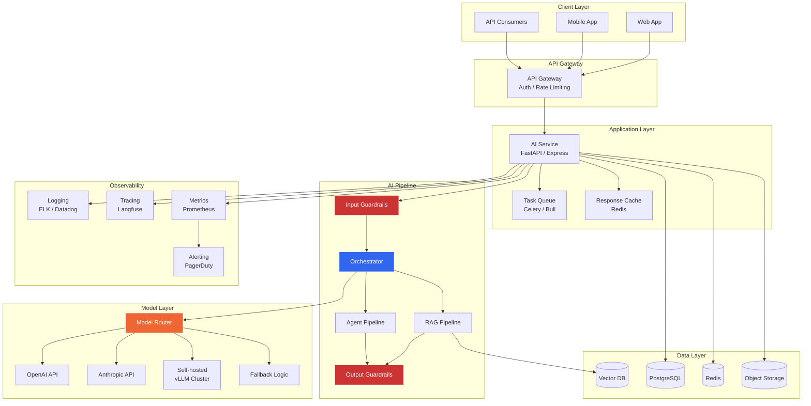

## 13. LLMOps & Production Systems

### Table of Contents

- [13.1 Production Architecture](#131-production-architecture)
- [13.2 Model Router & Fallback](#132-model-router-and-fallback)
- [13.3 Streaming Responses](#133-streaming-responses)


### 13.1 Production Architecture



### 13.2 Model Router & Fallback

```python
from dataclasses import dataclass
from enum import Enum
import time
from openai import OpenAI
from anthropic import Anthropic


class ModelTier(Enum):
    FAST = "fast"           # Simple tasks, low cost
    STANDARD = "standard"   # General tasks
    PREMIUM = "premium"     # Complex tasks requiring top quality


@dataclass
class ModelConfig:
    provider: str            # "openai", "anthropic", "self-hosted"
    model: str
    tier: ModelTier
    cost_per_1k_input: float
    cost_per_1k_output: float
    max_tokens: int
    timeout: int = 30
    is_fallback: bool = False


class ModelRouter:
    """
    Routes requests to appropriate models based on task complexity,
    with automatic fallback on failures.
    """

    MODELS = [
        ModelConfig("openai", "gpt-4o-mini", ModelTier.FAST, 0.00015, 0.0006, 16384),
        ModelConfig("openai", "gpt-4o", ModelTier.STANDARD, 0.0025, 0.01, 16384),
        ModelConfig("anthropic", "claude-sonnet-4-20250514", ModelTier.STANDARD, 0.003, 0.015, 8192),
        ModelConfig("anthropic", "claude-opus-4-20250514", ModelTier.PREMIUM, 0.015, 0.075, 4096),
        # Fallbacks
        ModelConfig("openai", "gpt-4o-mini", ModelTier.STANDARD, 0.00015, 0.0006, 16384, is_fallback=True),
    ]

    def __init__(self):
        self.openai = OpenAI()
        self.anthropic = Anthropic()
        self._failure_counts: dict[str, int] = {}
        self._circuit_breaker: dict[str, float] = {}  # model -> cooldown until

    def classify_complexity(self, messages: list[dict]) -> ModelTier:
        """Simple heuristic to route to appropriate model tier."""
        total_text = " ".join(m.get("content", "") for m in messages)
        word_count = len(total_text.split())

        # Heuristic classification (in production, use a small classifier)
        if word_count < 50 and not any(
            kw in total_text.lower()
            for kw in ["analyze", "compare", "explain in detail", "complex"]
        ):
            return ModelTier.FAST
        elif word_count > 500 or any(
            kw in total_text.lower()
            for kw in ["step by step", "comprehensive", "detailed analysis"]
        ):
            return ModelTier.PREMIUM
        return ModelTier.STANDARD

    def _is_circuit_open(self, model: str) -> bool:
        """Check if circuit breaker is active for a model."""
        cooldown = self._circuit_breaker.get(model, 0)
        if time.time() < cooldown:
            return True
        if time.time() >= cooldown and model in self._circuit_breaker:
            del self._circuit_breaker[model]
            self._failure_counts[model] = 0
        return False

    def _record_failure(self, model: str):
        self._failure_counts[model] = self._failure_counts.get(model, 0) + 1
        if self._failure_counts[model] >= 3:
            self._circuit_breaker[model] = time.time() + 60  # 60s cooldown

    def call(
        self,
        messages: list[dict],
        tier: ModelTier = None,
        **kwargs,
    ) -> dict:
        """Route and call the appropriate model with fallback."""
        tier = tier or self.classify_complexity(messages)

        # Get candidates for this tier
        candidates = [
            m for m in self.MODELS
            if m.tier == tier and not m.is_fallback
        ]
        fallbacks = [m for m in self.MODELS if m.is_fallback]

        for config in candidates + fallbacks:
            if self._is_circuit_open(config.model):
                continue

            try:
                start = time.time()
                result = self._call_provider(config, messages, **kwargs)
                latency = time.time() - start

                return {
                    "content": result,
                    "model": config.model,
                    "provider": config.provider,
                    "tier": tier.value,
                    "latency_ms": latency * 1000,
                    "is_fallback": config.is_fallback,
                }

            except Exception as e:
                self._record_failure(config.model)
                continue  # Try next candidate

        raise RuntimeError("All models failed — no available providers")

    def _call_provider(
        self, config: ModelConfig, messages: list[dict], **kwargs
    ) -> str:
        if config.provider == "openai":
            response = self.openai.chat.completions.create(
                model=config.model,
                messages=messages,
                max_tokens=kwargs.get("max_tokens", config.max_tokens),
                temperature=kwargs.get("temperature", 0.0),
                timeout=config.timeout,
            )
            return response.choices[0].message.content

        elif config.provider == "anthropic":
            # Convert OpenAI format to Anthropic
            system = next(
                (m["content"] for m in messages if m["role"] == "system"), ""
            )
            non_system = [m for m in messages if m["role"] != "system"]

            response = self.anthropic.messages.create(
                model=config.model,
                max_tokens=kwargs.get("max_tokens", config.max_tokens),
                system=system,
                messages=non_system,
            )
            return response.content[0].text

        raise ValueError(f"Unknown provider: {config.provider}")
```

### 13.3 Streaming Responses

```python
from fastapi import FastAPI, Request
from fastapi.responses import StreamingResponse
from openai import OpenAI
import json

app = FastAPI()
client = OpenAI()


@app.post("/chat/stream")
async def chat_stream(request: Request):
    body = await request.json()
    messages = body.get("messages", [])

    async def event_generator():
        stream = client.chat.completions.create(
            model="gpt-4o",
            messages=messages,
            stream=True,
        )

        for chunk in stream:
            delta = chunk.choices[0].delta
            if delta.content:
                # Server-Sent Events format
                data = json.dumps({
                    "type": "content",
                    "content": delta.content,
                })
                yield f"data: {data}\n\n"

            if chunk.choices[0].finish_reason:
                data = json.dumps({
                    "type": "done",
                    "finish_reason": chunk.choices[0].finish_reason,
                })
                yield f"data: {data}\n\n"

    return StreamingResponse(
        event_generator(),
        media_type="text/event-stream",
        headers={
            "Cache-Control": "no-cache",
            "Connection": "keep-alive",
        }
    )
```

---

