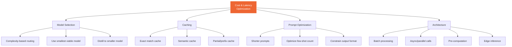

## 14. Cost Optimization & Latency

### Table of Contents

- [14.1 Optimization Strategies](#141-optimization-strategies)
- [14.2 Semantic Cache](#142-semantic-cache)
- [14.3 Cost Tracking](#143-cost-tracking)


### 14.1 Optimization Strategies



### 14.2 Semantic Cache

```python
import hashlib
import json
import numpy as np
from openai import OpenAI
from dataclasses import dataclass
import time


@dataclass
class CacheEntry:
    key: str
    query_embedding: list[float]
    response: str
    model: str
    created_at: float
    ttl: int
    hit_count: int = 0


class SemanticCache:
    """
    Cache LLM responses based on semantic similarity of queries.
    Avoids redundant API calls for semantically equivalent questions.
    """

    def __init__(
        self,
        similarity_threshold: float = 0.95,
        max_entries: int = 10000,
        default_ttl: int = 3600,
    ):
        self.client = OpenAI()
        self.threshold = similarity_threshold
        self.max_entries = max_entries
        self.default_ttl = default_ttl
        self.cache: dict[str, CacheEntry] = {}

    def _embed(self, text: str) -> list[float]:
        response = self.client.embeddings.create(
            model="text-embedding-3-small",
            input=text,
        )
        return response.data[0].embedding

    def _cosine_similarity(self, a: list[float], b: list[float]) -> float:
        a, b = np.array(a), np.array(b)
        return float(np.dot(a, b) / (np.linalg.norm(a) * np.linalg.norm(b)))

    def get(self, query: str) -> str | None:
        """Find a semantically similar cached response."""
        query_emb = self._embed(query)

        best_match = None
        best_score = 0.0

        now = time.time()
        expired_keys = []

        for key, entry in self.cache.items():
            # Check TTL
            if now - entry.created_at > entry.ttl:
                expired_keys.append(key)
                continue

            sim = self._cosine_similarity(query_emb, entry.query_embedding)
            if sim > best_score:
                best_score = sim
                best_match = entry

        # Cleanup expired
        for key in expired_keys:
            del self.cache[key]

        if best_match and best_score >= self.threshold:
            best_match.hit_count += 1
            return best_match.response

        return None

    def put(self, query: str, response: str, model: str, ttl: int = None):
        """Cache a new response."""
        query_emb = self._embed(query)
        key = hashlib.sha256(query.encode()).hexdigest()

        self.cache[key] = CacheEntry(
            key=key,
            query_embedding=query_emb,
            response=response,
            model=model,
            created_at=time.time(),
            ttl=ttl or self.default_ttl,
        )

        # Evict if over capacity (LRU-style)
        if len(self.cache) > self.max_entries:
            oldest_key = min(self.cache, key=lambda k: self.cache[k].created_at)
            del self.cache[oldest_key]


# Usage with LLM calls
cache = SemanticCache(similarity_threshold=0.95)

def cached_llm_call(messages: list[dict], model: str = "gpt-4o") -> str:
    query = messages[-1]["content"]

    # Check cache
    cached = cache.get(query)
    if cached:
        return cached  # Cache hit — zero API cost!

    # Cache miss — call LLM
    client = OpenAI()
    response = client.chat.completions.create(model=model, messages=messages)
    result = response.choices[0].message.content

    # Store in cache
    cache.put(query, result, model)
    return result
```

### 14.3 Cost Tracking

```python
from dataclasses import dataclass, field
from datetime import datetime
from collections import defaultdict


@dataclass
class UsageRecord:
    timestamp: datetime
    model: str
    input_tokens: int
    output_tokens: int
    input_cost: float
    output_cost: float
    total_cost: float
    endpoint: str = ""
    user_id: str = ""
    cached: bool = False


class CostTracker:
    """Track and analyze LLM API costs."""

    PRICING = {
        "gpt-4o":           {"input": 2.50,  "output": 10.00},  # per 1M tokens
        "gpt-4o-mini":      {"input": 0.15,  "output": 0.60},
        "gpt-4.1":          {"input": 2.00,  "output": 8.00},
        "gpt-4.1-mini":     {"input": 0.40,  "output": 1.60},
        "gpt-4.1-nano":     {"input": 0.10,  "output": 0.40},
        "claude-sonnet-4-20250514": {"input": 3.00, "output": 15.00},
        "claude-opus-4-20250514":   {"input": 15.00, "output": 75.00},
    }

    def __init__(self):
        self.records: list[UsageRecord] = []

    def record(
        self, model: str, input_tokens: int, output_tokens: int,
        endpoint: str = "", user_id: str = "", cached: bool = False,
    ) -> UsageRecord:
        rates = self.PRICING.get(model, {"input": 0, "output": 0})
        input_cost = input_tokens * rates["input"] / 1_000_000
        output_cost = output_tokens * rates["output"] / 1_000_000

        record = UsageRecord(
            timestamp=datetime.utcnow(),
            model=model,
            input_tokens=input_tokens,
            output_tokens=output_tokens,
            input_cost=0.0 if cached else input_cost,
            output_cost=0.0 if cached else output_cost,
            total_cost=0.0 if cached else (input_cost + output_cost),
            endpoint=endpoint,
            user_id=user_id,
            cached=cached,
        )
        self.records.append(record)
        return record

    def summary(self, days: int = 30) -> dict:
        cutoff = datetime.utcnow().timestamp() - (days * 86400)
        recent = [r for r in self.records if r.timestamp.timestamp() > cutoff]

        by_model = defaultdict(lambda: {"cost": 0, "calls": 0, "tokens": 0})
        for r in recent:
            by_model[r.model]["cost"] += r.total_cost
            by_model[r.model]["calls"] += 1
            by_model[r.model]["tokens"] += r.input_tokens + r.output_tokens

        cache_hits = sum(1 for r in recent if r.cached)
        total_calls = len(recent)

        return {
            "period_days": days,
            "total_cost": sum(r.total_cost for r in recent),
            "total_calls": total_calls,
            "cache_hit_rate": cache_hits / max(total_calls, 1),
            "estimated_savings_from_cache": cache_hits * 0.003,  # rough estimate
            "by_model": dict(by_model),
        }
```

---

