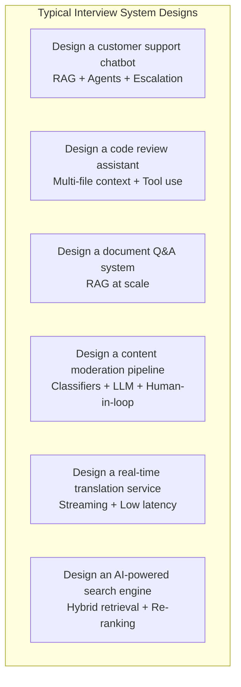
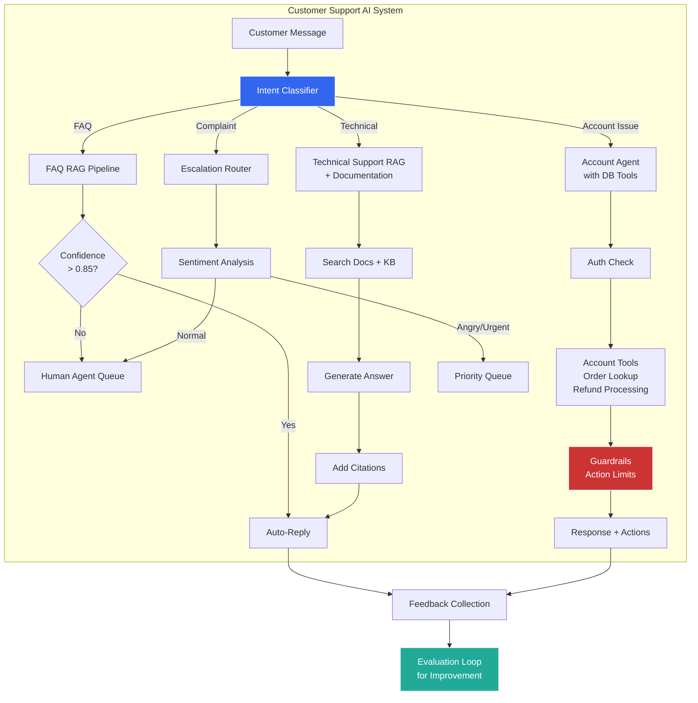

## 1. System Design Patterns

### Table of Contents

- [1.1 Common AI System Design Questions](#11-common-ai-system-design-questions)
- [1.2 Design Template: AI-Powered Customer Support](#12-design-template-ai-powered-customer-support)
- [1.3 Key Design Considerations Checklist](#13-key-design-considerations-checklist)
- [📐 Requirements](#requirements)
- [🏗️ Architecture Decisions](#architecture-decisions)
- [📊 Data](#data)
- [🛡️ Safety & Reliability](#safety-and-reliability)
- [📈 Observability & Evaluation](#observability-and-evaluation)
- [💰 Cost & Scale](#cost-and-scale)


### 1.1 Common AI System Design Questions



### 1.2 Design Template: AI-Powered Customer Support



### 1.3 Key Design Considerations Checklist

```markdown
## System Design Checklist for AI Applications

### 📐 Requirements
- [ ] What is the acceptable latency? (Real-time vs. batch)
- [ ] What accuracy/quality threshold is needed?
- [ ] What is the expected QPS (queries per second)?
- [ ] What is the cost budget per query?
- [ ] What compliance/privacy requirements exist?

### 🏗️ Architecture Decisions
- [ ] Which model(s) to use? (API vs. self-hosted, size)
- [ ] RAG vs. fine-tuning vs. both?
- [ ] Synchronous vs. asynchronous processing?
- [ ] Single-model vs. multi-model routing?
- [ ] Agentic vs. pipeline architecture?

### 📊 Data
- [ ] What data sources feed the system?
- [ ] How is data kept current? (Ingestion frequency)
- [ ] What is the chunking/indexing strategy?
- [ ] How to handle data quality issues?

### 🛡️ Safety & Reliability
- [ ] Input validation and injection prevention
- [ ] Output guardrails (PII, toxicity, hallucination)
- [ ] Fallback strategy when AI fails
- [ ] Human-in-the-loop escalation paths
- [ ] Rate limiting and abuse prevention

### 📈 Observability & Evaluation
- [ ] How are you measuring quality in production?
- [ ] What is your evaluation dataset? How is it maintained?
- [ ] How do you detect model drift or degradation?
- [ ] What alerting exists for quality drops?
- [ ] A/B testing framework for prompt changes?

### 💰 Cost & Scale
- [ ] Cost per query estimation
- [ ] Caching strategy (exact, semantic, prefix)
- [ ] Batching opportunities
- [ ] Model distillation opportunities
- [ ] Auto-scaling configuration
```

---

