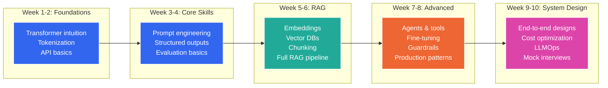

## 1. Interview Questions Bank

### Table of Contents

- [1.1 Conceptual Questions (Senior)](#11-conceptual-questions-senior)
- [1.2 System Design Questions (Principal)](#12-system-design-questions-principal)
- [1.3 Coding Questions](#13-coding-questions)


### 1.1 Conceptual Questions (Senior)

| # | Question | Key Points to Cover |
|---|---|---|
| 1 | **What is the difference between RAG and fine-tuning? When do you use each?** | RAG = external knowledge at inference; FT = bake knowledge into weights. RAG for dynamic data, FT for style/format/cost optimization. Often combined. |
| 2 | **Explain the "lost in the middle" problem and how to mitigate it.** | LLMs attend better to start/end of context. Mitigations: rerank to put relevant docs first, reduce total context, use models with better long-context attention. |
| 3 | **How would you evaluate an LLM-based system in production?** | Multi-dimensional: faithfulness, relevance, harmlessness. LLM-as-judge, human eval, automated metrics. Track regression over time. Statistical significance. |
| 4 | **What are the key failure modes of RAG systems?** | Poor retrieval (wrong chunks), poor generation (hallucination despite context), stale data, chunking artifacts, embedding model mismatch, wrong k value. |
| 5 | **How do you prevent prompt injection in production?** | Defense in depth: input filtering, pattern matching, classifier-based detection, system prompt hardening, output validation, privilege separation. |
| 6 | **Explain embedding models — what are they and how do they work?** | Neural nets that map text to dense vectors where semantic similarity ≈ cosine distance. Trained with contrastive learning. Different from LLM embeddings. Dimensions, normalization, domain adaptation. |
| 7 | **What is temperature and how does it affect outputs?** | Scales logits before softmax. T=0: argmax (deterministic). T>1: flatter distribution (creative). Interplay with top_p. When to use which. |
| 8 | **How do you handle model provider outages?** | Multi-provider strategy, circuit breakers, fallback chains, graceful degradation, cached responses, queue-based async processing. |
| 9 | **What is model distillation and when would you use it?** | Train smaller model on larger model's outputs. Use when: need lower latency, lower cost, edge deployment, consistent behavior. |
| 10 | **Explain the tradeoffs of using open-source vs. API-based models.** | API: faster start, no infra, better models, vendor lock-in, data privacy concerns. OSS: full control, data stays private, infra complexity, potentially lower quality, but rapidly improving. |

### 1.2 System Design Questions (Principal)

| # | Question | Key Evaluation Criteria |
|---|---|---|
| 1 | **Design a multi-tenant RAG system for an enterprise SaaS product** | Data isolation, per-tenant indexing, auth integration, cost attribution, scale-to-zero, shared vs. dedicated vector stores |
| 2 | **Design an AI coding assistant that works across a large monorepo** | Repository indexing, code-aware chunking, AST parsing, context window management, caching strategies, real-time vs. batch |
| 3 | **Design a real-time AI moderation system for a social platform** | Latency requirements, classifier cascade, LLM fallback, false positive handling, human review queue, feedback loops |
| 4 | **Design an AI agent that can perform multi-step data analysis** | Planning, tool selection, error recovery, sandboxed code execution, intermediate result caching, user confirmation for actions |
| 5 | **Design an evaluation platform for LLM applications** | Dataset management, metric definitions, LLM-as-judge calibration, human eval workflows, regression detection, CI/CD integration |

### 1.3 Coding Questions

```python
# QUESTION 1: Implement a token-aware text splitter
"""
Write a function that splits text into chunks such that each chunk 
is at most `max_tokens` tokens. Chunks should split on sentence 
boundaries when possible. Include overlap.
"""

def token_aware_split(
    text: str,
    max_tokens: int = 512,
    overlap_tokens: int = 50,
    model: str = "gpt-4o",
) -> list[str]:
    import tiktoken
    enc = tiktoken.encoding_for_model(model)

    sentences = []
    for s in text.replace('\n', ' ').split('. '):
        s = s.strip()
        if s:
            sentences.append(s + '.')

    chunks = []
    current_sentences = []
    current_tokens = 0

    for sentence in sentences:
        sentence_tokens = len(enc.encode(sentence))

        if current_tokens + sentence_tokens > max_tokens and current_sentences:
            chunks.append(' '.join(current_sentences))

            # Calculate overlap
            overlap_sentences = []
            overlap_count = 0
            for s in reversed(current_sentences):
                s_tokens = len(enc.encode(s))
                if overlap_count + s_tokens <= overlap_tokens:
                    overlap_sentences.insert(0, s)
                    overlap_count += s_tokens
                else:
                    break

            current_sentences = overlap_sentences + [sentence]
            current_tokens = sum(len(enc.encode(s)) for s in current_sentences)
        else:
            current_sentences.append(sentence)
            current_tokens += sentence_tokens

    if current_sentences:
        chunks.append(' '.join(current_sentences))

    return chunks


# QUESTION 2: Implement retry with exponential backoff for LLM API calls
"""
Write a robust API caller with:
- Exponential backoff with jitter
- Different handling for rate limit vs. server errors
- Budget awareness (stop if cost exceeds limit)
"""

import time
import random
from openai import (
    OpenAI, RateLimitError, APITimeoutError,
    InternalServerError, APIConnectionError,
)


def resilient_llm_call(
    messages: list[dict],
    model: str = "gpt-4o",
    max_retries: int = 5,
    base_delay: float = 1.0,
    max_delay: float = 60.0,
    timeout: float = 30.0,
) -> dict:
    client = OpenAI(timeout=timeout)

    retryable_errors = (
        RateLimitError,
        APITimeoutError,
        InternalServerError,
        APIConnectionError,
    )

    for attempt in range(max_retries + 1):
        try:
            response = client.chat.completions.create(
                model=model,
                messages=messages,
            )
            return {
                "content": response.choices[0].message.content,
                "usage": {
                    "input": response.usage.prompt_tokens,
                    "output": response.usage.completion_tokens,
                },
                "attempts": attempt + 1,
            }

        except RateLimitError as e:
            if attempt == max_retries:
                raise
            # Check for Retry-After header
            retry_after = getattr(e, 'headers', {}).get('retry-after')
            if retry_after:
                delay = float(retry_after)
            else:
                delay = min(base_delay * (2 ** attempt), max_delay)
                delay += random.uniform(0, delay * 0.1)  # Jitter
            time.sleep(delay)

        except retryable_errors as e:
            if attempt == max_retries:
                raise
            delay = min(base_delay * (2 ** attempt), max_delay)
            delay += random.uniform(0, delay * 0.1)
            time.sleep(delay)

        # Non-retryable errors (AuthenticationError, BadRequestError, etc.)
        # will propagate immediately
```

---

## Quick Reference Card

```
┌──────────────────────────────────────────────────────────────┐
│                  AI ENGINEERING CHEAT SHEET                   │
├──────────────────────────────────────────────────────────────┤
│                                                              │
│  WHEN TO USE WHAT:                                           │
│  ┌─────────────┬────────────────────────────────────────┐    │
│  │ Need        │ Solution                               │    │
│  ├─────────────┼────────────────────────────────────────┤    │
│  │ Add knowledge│ RAG                                   │    │
│  │ Change style │ Fine-tuning                           │    │
│  │ Cut cost     │ Distillation + caching                │    │
│  │ Multi-step   │ Agents                                │    │
│  │ Reliable JSON│ Structured output + schema            │    │
│  │ Better quality│ Better prompt → better model → FT    │    │
│  └─────────────┴────────────────────────────────────────┘    │
│                                                              │
│  RAG OPTIMIZATION ORDER:                                     │
│  1. Fix chunking strategy                                    │
│  2. Improve embeddings / try hybrid search                   │
│  3. Add reranking                                            │
│  4. Implement query rewriting                                │
│  5. Add self-reflection / corrective RAG                     │
│                                                              │
│  COST REDUCTION ORDER:                                       │
│  1. Cache (exact → semantic)                                 │
│  2. Route to smaller models when possible                    │
│  3. Shorten prompts                                          │
│  4. Batch requests                                           │
│  5. Distill to smaller fine-tuned model                      │
│                                                              │
│  EVALUATION PRIORITIES:                                      │
│  1. Build golden test set (≥50 examples)                     │
│  2. Automate with LLM-as-judge                               │
│  3. Track metrics over time                                  │
│  4. Run evals in CI/CD                                       │
│  5. Regular human eval calibration                           │
│                                                              │
│  LATENCY BUDGET (typical P50):                               │
│  Embedding:    ~50ms    │  Vector search: ~20ms              │
│  Reranking:    ~100ms   │  LLM (small):   ~500ms             │
│  LLM (large):  ~2000ms  │  Total RAG:     ~2-3s              │
│                                                              │
└──────────────────────────────────────────────────────────────┘
```

---

## Recommended Learning Path



---

## Key Resources

| Resource | Type | Focus |
|---|---|---|
| [AI Engineer Summit Talks](https://www.ai.engineer/) | Conference | Industry trends |
| [Anthropic Cookbook](https://github.com/anthropics/anthropic-cookbook) | Code examples | Prompt patterns |
| [OpenAI Cookbook](https://cookbook.openai.com/) | Code examples | API patterns |
| [LangChain Docs](https://python.langchain.com/) | Documentation | Orchestration |
| [RAGAS](https://docs.ragas.io/) | Library | RAG evaluation |
| [DSPy](https://dspy.ai/) | Library | Programmatic prompting |
| [Chip Huyen — Building LLM Apps](https://huyenchip.com/2023/04/11/llm-engineering.html) | Blog | Architecture |
| [Eugene Yan — Patterns for LLM Systems](https://eugeneyan.com/writing/llm-patterns/) | Blog | Design patterns |

---

> **Last updated:** July 2025. The AI engineering landscape evolves rapidly — always verify tool versions, model capabilities, and pricing against the latest documentation from the respective providers.
