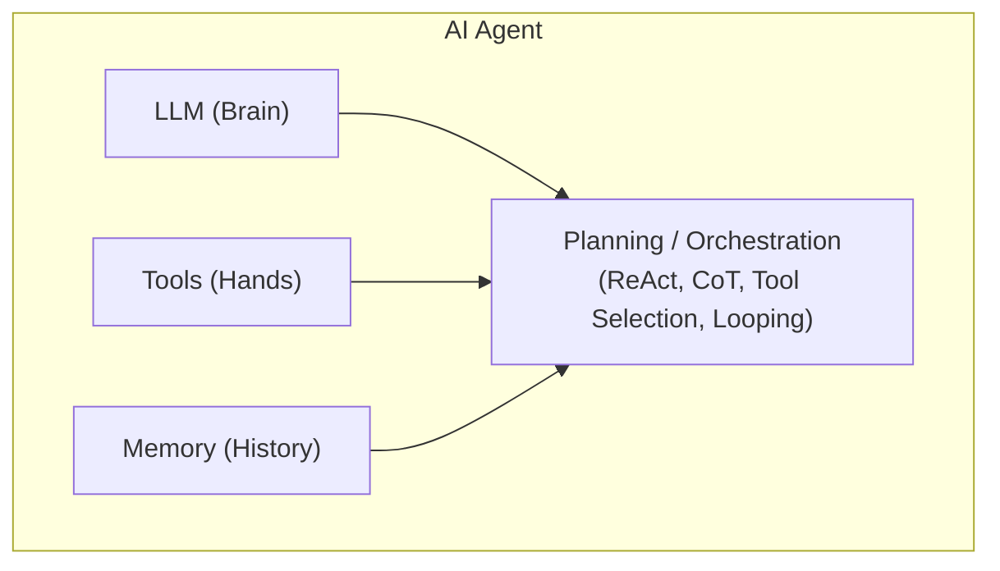
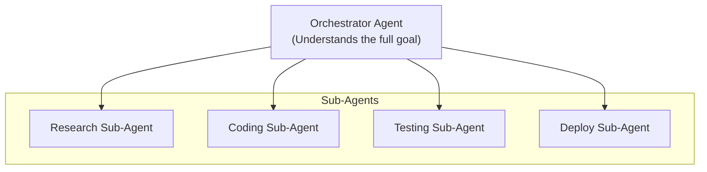

## 1. AI Agents & Sub-Agents

### Table of Contents

- [1.1 What Is an AI Agent?](#11-what-is-an-ai-agent)
- [1.2 The ReAct Pattern (Reasoning + Acting)](#12-the-react-pattern-reasoning-acting)
- [1.3 What Is a Sub-Agent?](#13-what-is-a-sub-agent)
- [1.4 Pros and Cons](#14-pros-and-cons)
- [1.5 Frameworks for Building Agents](#15-frameworks-for-building-agents)

### 1.1 What Is an AI Agent?

An **AI agent** is a software system that uses an LLM as its "brain" to
autonomously **perceive**, **plan**, **decide**, and **act** in pursuit of a goal.
It combines the reasoning capabilities of an LLM with the ability to use external
**tools** (APIs, databases, file systems, browsers, code interpreters).

**Core components:**



### 1.2 The ReAct Pattern (Reasoning + Acting)

The most common agent loop:

```
Goal: "Find the current stock price of AAPL and email it to john@example.com"

Step 1 — THOUGHT:  I need to look up the stock price of AAPL.
Step 2 — ACTION:   call tool `get_stock_price(ticker="AAPL")`
Step 3 — OBSERVATION: $213.47
Step 4 — THOUGHT:  Now I have the price. I need to send an email.
Step 5 — ACTION:   call tool `send_email(to="john@example.com",
                   subject="AAPL Price", body="Current price: $213.47")`
Step 6 — OBSERVATION: Email sent successfully.
Step 7 — THOUGHT:  Task complete.
Step 8 — FINAL ANSWER: "Done. Emailed AAPL price ($213.47) to john@example.com."
```

### 1.3 What Is a Sub-Agent?

A **sub-agent** is a specialized agent that is **delegated to by a parent agent**
to handle a specific subtask. This creates a **hierarchical multi-agent system**.



**How sub-agents work:**

1. The **orchestrator** receives a high-level goal
2. It **decomposes** the goal into subtasks
3. Each subtask is **delegated** to a specialized sub-agent
4. Sub-agents execute independently, potentially with their own tools and memory
5. Results are **returned** to the orchestrator
6. The orchestrator **synthesizes** results and continues

**Example — Devin-style coding agent:**

```
User: "Add user authentication to the Express app"

Orchestrator Agent:
  ├── Planning Sub-Agent → Creates implementation plan
  ├── Research Sub-Agent → Looks up best practices, checks docs
  ├── Coding Sub-Agent   → Writes the actual code (passport.js setup, routes, etc.)
  ├── Testing Sub-Agent  → Writes and runs tests
  └── Review Sub-Agent   → Reviews code for security issues
```

### 1.4 Pros and Cons

| Aspect | Pros | Cons |
|---|---|---|
| Single Agent | Simple, easy to debug | Limited capability, context overload |
| Multi-Agent (Sub-Agents) | Separation of concerns, specialized tools per agent | Complex orchestration, higher cost, error propagation |

### 1.5 Frameworks for Building Agents

| Framework | Creator | Key Feature |
|---|---|---|
| **OpenAI Agents SDK** | OpenAI | Native handoffs, tool calling, guardrails |
| **LangGraph** | LangChain | Graph-based stateful agent workflows |
| **CrewAI** | CrewAI | Role-based multi-agent collaboration |
| **AutoGen** | Microsoft | Multi-agent conversation framework |
| **Semantic Kernel** | Microsoft | Enterprise-grade agent orchestration |
