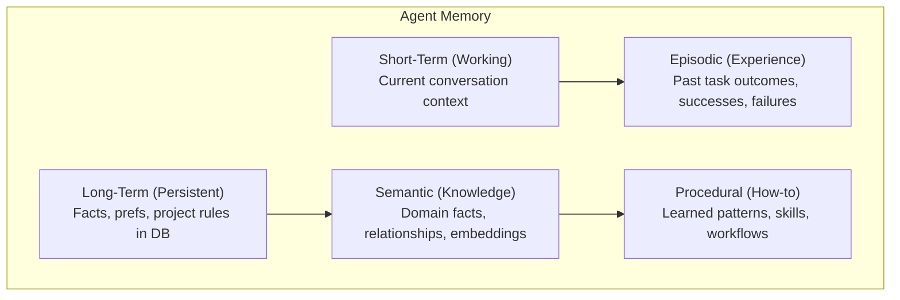

## 1. Agent Memory

### Table of Contents

- [1.1 Definition](#11-definition)
- [1.2 Types of Memory](#12-types-of-memory)
- [1.3 Detailed Breakdown](#13-detailed-breakdown)
- [1.4 Implementation Patterns](#14-implementation-patterns)

### 1.1 Definition

**Agent memory** is the mechanism by which AI agents store, retrieve, and use
information across interactions. Without memory, every interaction starts from
scratch.

### 1.2 Types of Memory


### 1.3 Detailed Breakdown

#### Short-Term Memory (Working Memory)
- **What:** The current context window contents
- **Lifespan:** Single session / conversation
- **Capacity:** Limited by context window (e.g., 128K tokens)
- **Example:** The current chat history in Cursor or Windsurf

#### Long-Term Memory (Persistent Memory)
- **What:** Information stored externally and retrieved when needed
- **Lifespan:** Persists across sessions indefinitely
- **Storage:** Vector databases, key-value stores, relational DBs
- **Example:** Windsurf remembering your coding preferences across projects

```
Session 1: User says "I prefer tabs over spaces and use 4-width indentation"
   → Stored in long-term memory

Session 47: Agent retrieves preference automatically when generating code
   → Code uses tabs with 4-width indentation
```

#### Episodic Memory
- **What:** Records of past interactions, tasks, and their outcomes
- **Purpose:** Learn from experience — avoid repeating mistakes
- **Example:** "Last time I tried to refactor auth.ts, tests broke because
  of mock dependencies. I should update mocks first."

#### Semantic Memory
- **What:** Factual knowledge about the codebase, domain, or world
- **Storage:** Often vector databases with embeddings
- **Example:** Embeddings of all project documentation for RAG retrieval

#### Procedural Memory
- **What:** Knowledge of *how* to do things — patterns, workflows, skills
- **Example:** "When creating a new API endpoint, always: create route → 
  controller → service → test → update OpenAPI spec"

### 1.4 Implementation Patterns

```python
# Conceptual example: Memory-augmented agent

class AgentMemory:
    def __init__(self):
        self.short_term = []           # Current conversation
        self.long_term = VectorDB()    # Persistent knowledge
        self.episodic = []             # Past experiences
    
    def remember(self, fact: str, memory_type: str = "long_term"):
        if memory_type == "long_term":
            embedding = embed(fact)
            self.long_term.store(fact, embedding)
        elif memory_type == "episodic":
            self.episodic.append({
                "event": fact,
                "timestamp": now(),
                "outcome": None  # filled in later
            })
    
    def recall(self, query: str, top_k: int = 5) -> list[str]:
        """Retrieve relevant memories for the current context."""
        query_embedding = embed(query)
        return self.long_term.search(query_embedding, top_k=top_k)
    
    def get_context(self, current_query: str) -> str:
        """Build full context from all memory types."""
        relevant_memories = self.recall(current_query)
        recent_episodes = self.episodic[-5:]  # Last 5 episodes
        
        return f"""
        ## Relevant Knowledge
        {relevant_memories}
        
        ## Recent Experience
        {recent_episodes}
        
        ## Current Conversation
        {self.short_term[-20:]}  # Last 20 messages
        """
```
