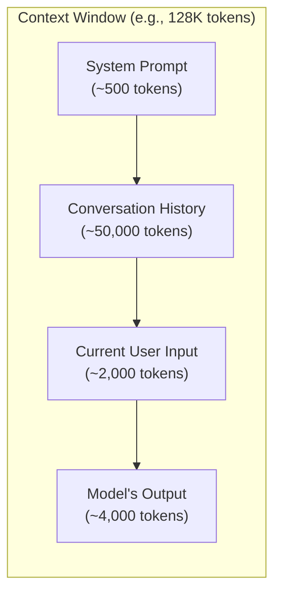

## 4. Context Window & Context Rot

### 4.1 Context Window

**Definition:**
The **context window** is the maximum number of tokens an LLM can process in a
single inference call. It includes *everything* — the system prompt, conversation
history, user input, tool results, AND the model's output.



**Context windows by model (as of mid-2025):**

| Model | Context Window |
|---|---|
| GPT-4o | 128K tokens |
| Claude 3.5 / Claude 4 | 200K tokens |
| Gemini 1.5 Pro | 1M–2M tokens |
| Llama 3 | 8K–128K tokens |
| Mistral Large | 128K tokens |

**Important:**
A larger context window does NOT mean the model pays equal attention to all parts.
Research (e.g., "Lost in the Middle" paper) shows models attend most to the
**beginning** and **end** of the context, with degraded attention in the middle.

### 4.2 Context Rot (Context Degradation)

**Definition:**
**Context rot** is the progressive degradation of an AI agent's effectiveness as
its context window fills up during a long-running session. The model begins to
"forget," contradict itself, lose track of earlier instructions, or hallucinate.

**Why it happens:**

1. **Attention dilution** — With more tokens, self-attention scores spread thinner
2. **Lost in the middle** — Important information buried in the middle is ignored
3. **Instruction drift** — System prompt influence weakens as conversation grows
4. **Conflicting signals** — Earlier and later messages may contradict each other
5. **Summarization loss** — When history is compressed, nuance is lost

**Symptoms of context rot:**

```
Early in conversation:          Late in conversation:
✅ Follows coding standards      ❌ Ignores established patterns
✅ Remembers file structure      ❌ Creates duplicate files
✅ Consistent variable naming    ❌ Mixes naming conventions
✅ Accurate references           ❌ Hallucinates function names
✅ Follows system prompt         ❌ Drifts from original instructions
```

**Mitigation strategies:**

| Strategy | How It Helps |
|---|---|
| **Chunked sessions** | Start fresh sessions for new tasks |
| **Context summarization** | Periodically summarize and replace history |
| **RAG** | Keep knowledge external; retrieve only what's needed |
| **Pinned instructions** | Repeat critical instructions at the end of the prompt |
| **Spec files** | Feed structured specs instead of relying on memory |
| **Agent memory systems** | Store important facts externally, inject as needed |
