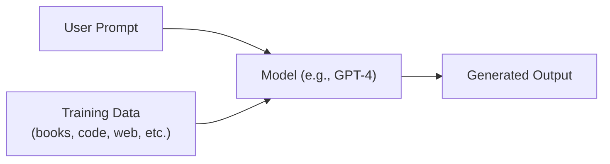
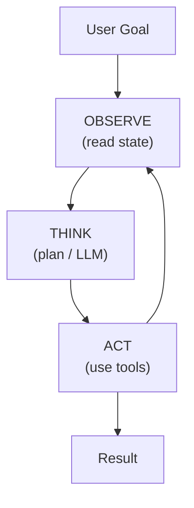

## 1. Generative AI vs Agentic AI

### 1.1 Generative AI

**Definition:**
Generative AI refers to a class of artificial-intelligence models that can *generate*
new content — text, images, audio, video, or code — by learning statistical patterns
from massive training datasets. The model produces outputs that are *novel* but
*statistically consistent* with the data it was trained on.

**Key characteristics:**

| Characteristic    | Detail                                                    |
| -------------------| -----------------------------------------------------------|
| Output type       | Content creation (text, image, code, music, etc.)         |
| Interaction model | Single prompt → single response (stateless by default)    |
| Decision making   | None — it *generates*, it does not *decide* or *act*      |
| Examples          | ChatGPT, DALL·E, Stable Diffusion, GitHub Copilot, Claude |

**How it works (simplified):**



### 1.2 Agentic AI

**Definition:**
Agentic AI refers to AI systems that can *autonomously plan, reason, use tools,
and take multi-step actions* to accomplish a goal. Rather than producing a single
response, an agent **loops** — it observes, thinks, acts, and re-evaluates until
the task is complete.

**Key characteristics:**

| Characteristic | Detail |
|---|---|
| Output type | Actions + decisions + content |
| Interaction model | Goal → plan → iterative tool use → result |
| Decision making | Yes — autonomous planning and execution |
| Persistence | Maintains state, memory, and context across steps |
| Examples | Devin, OpenAI Agents SDK, AutoGPT, CrewAI, LangGraph agents |

**How it works (simplified):**



### 1.3 Side-by-Side Comparison

| Dimension | Generative AI | Agentic AI |
|---|---|---|
| Autonomy | Low — responds to prompts | High — pursues goals |
| State | Stateless (unless chat history is managed externally) | Stateful — maintains memory |
| Tool use | None (unless explicitly integrated) | Core capability |
| Planning | None | Multi-step planning & re-planning |
| Error recovery | None — user must re-prompt | Self-correcting loops |
| Example use case | "Write me a function that sorts an array" | "Build and deploy a REST API for user management" |

### 1.4 The Spectrum

It is more accurate to think of this as a **spectrum** rather than a binary:

```
Pure Generative ◄────────────────────────────────────► Fully Agentic
     │                        │                              │
  Single-turn           Multi-turn with               Autonomous
  completion            tool calling                   goal pursuit
  (GPT completion)      (ChatGPT + plugins)            (Devin, AutoGPT)
```
