## 1. SDD — Spec-Driven Development

### Table of Contents

- [1.1 Definition](#11-definition)
- [1.2 Why SDD Matters in the AI Era](#12-why-sdd-matters-in-the-ai-era)
- [1.3 The SDD Workflow](#13-the-sdd-workflow)
- [1.4 What a Good Spec Looks Like](#14-what-a-good-spec-looks-like)
- [1.5 SpecKit and SDD Tools](#15-speckit-and-sdd-tools)
- [1.6 SDD Pros and Cons](#16-sdd-pros-and-cons)
- [1.7 SDD vs Vibe Coding — Summary](#17-sdd-vs-vibe-coding-summary)

### 1.1 Definition

**Spec-Driven Development (SDD)** is a software development methodology where
**detailed specifications are written *before* code** and serve as the **single
source of truth** for both human developers and AI coding agents. The spec
documents the *what*, *why*, and *how* of every feature before a single line of
code is written.

SDD is the **antidote to vibe coding**.

### 1.2 Why SDD Matters in the AI Era

```mermaid
flowchart TB
    subgraph Traditional[Traditional Development]
        T1[Human writes code]
        T2[Human reviews code]
        T3[Human understands code]
    end

    subgraph Vibe[AI-Assisted Vibe Coding]
        V1[Human describes loosely]
        V2[AI generates code]
        V3[Human doesn't understand code, ships anyway]
    end

    subgraph SDD[SDD]
        S1[Human writes detailed spec]
        S2[AI generates code from spec]
        S3[Spec validates code]
        S4[Human + AI verify against spec]
    end

    T1 --> T2 --> T3
    V1 --> V2 --> V3
    S1 --> S2 --> S3 --> S4
```



**Key insight:** In an AI-coding world, the **spec becomes the primary artifact**
that humans write and own. The code becomes a *derivative* of the spec.

### 1.3 The SDD Workflow

```mermaid
flowchart TB
    SpecCreation[1. SPEC CREATION\n- Requirements gathering\n- Architecture decisions\n- API contracts (OpenAPI, GraphQL)\n- Data models\n- Acceptance criteria\n- Edge cases & error handling]

    SpecReview[2. SPEC REVIEW\n- Team review (humans)\n- AI review (ambiguity, gaps, inconsistency)\n- Stakeholder approval]

    CodeGen[3. CODE GENERATION\n- AI generates code FROM the spec\n- Functions/modules map to spec\n- Spec injected into AI context]

    Verification[4. VERIFICATION\n- Code validated AGAINST the spec\n- Tests from acceptance criteria\n- AI self-checks vs spec\n- Human review]

    Iteration[5. ITERATION\n- Spec updates when requirements change\n- Code regenerated/updated\n- Spec and code stay in sync]

    SpecCreation --> SpecReview --> CodeGen --> Verification --> Iteration
```

### 1.4 What a Good Spec Looks Like

````markdown
# Feature Spec: User Authentication

## 1. Overview
Implement JWT-based authentication with email/password login, registration,
and password reset functionality.

## 2. Architecture Decision
- Use bcrypt (cost factor 12) for password hashing
- JWT with RS256 signing, 15-minute access token, 7-day refresh token
- Refresh tokens stored in HTTP-only secure cookies
- Access tokens sent via Authorization header

## 3. Data Models

### User
| Field        | Type      | Constraints              |
|--------------|-----------|--------------------------|
| id           | UUID      | PK, auto-generated       |
| email        | string    | unique, max 255, indexed  |
| passwordHash | string    | bcrypt hash               |
| createdAt    | timestamp | auto-set                  |
| updatedAt    | timestamp | auto-updated              |
| isVerified   | boolean   | default: false            |

### RefreshToken
| Field     | Type      | Constraints              |
|-----------|-----------|--------------------------|
| id        | UUID      | PK                        |
| userId    | UUID      | FK → User.id              |
| token     | string    | unique, indexed           |
| expiresAt | timestamp | createdAt + 7 days        |
| revoked   | boolean   | default: false            |

## 4. API Endpoints

### POST /api/auth/register
**Request:**
```json
{
  "email": "user@example.com",
  "password": "SecureP@ss123"
}
```

**Validation:**
- Email: valid format, max 255 chars
- Password: min 8 chars, must include uppercase, lowercase, number, special char

**Success Response (201):**
```json
{
  "user": { "id": "uuid", "email": "user@example.com" },
  "message": "Registration successful. Please verify your email."
}
```

**Error Responses:**
- 409: `{ "error": "Email already registered" }`
- 422: `{ "error": "Validation failed", "details": [...] }`

### POST /api/auth/login
[... similar detail ...]

## 5. Acceptance Criteria
- [ ] User can register with valid email and password
- [ ] Duplicate email returns 409
- [ ] Passwords are hashed with bcrypt (cost 12)
- [ ] JWT contains user ID and email in payload
- [ ] Access token expires after 15 minutes
- [ ] Refresh token is HTTP-only, secure, SameSite=Strict
- [ ] Invalid login returns 401 with generic message (no user enumeration)
- [ ] Rate limiting: max 5 login attempts per minute per IP

## 6. Edge Cases
- User registers, then tries to register again with same email
- Token expires mid-request
- Simultaneous refresh token usage (token rotation race condition)
- SQL injection attempts in email field
- Password with unicode characters

## 7. Security Requirements
- No password in logs or error messages
- Timing-safe comparison for tokens
- CSRF protection on cookie-based auth
- Account lockout after 10 failed attempts (15-minute cooldown)
````

### 1.5 SpecKit and SDD Tools

#### SpecKit

**SpecKit** is a tool/framework designed to streamline Spec-Driven Development.
It provides utilities for creating, managing, and feeding specifications to AI
coding agents.

**Core capabilities:**

| Capability | Description |
|---|---|
| **Spec templates** | Pre-built templates for common features (auth, CRUD, API, etc.) |
| **Spec validation** | Checks specs for completeness, ambiguity, and inconsistency |
| **AI integration** | Feeds specs directly into AI agent context |
| **Spec ↔ Code mapping** | Tracks which code implements which spec section |
| **Spec diffing** | Shows what changed when specs are updated |
| **Test generation** | Auto-generates test cases from acceptance criteria |

#### Typical SpecKit Workflow

```bash
speckit init                          # Initialize SpecKit in project
speckit new feature auth-system       # Create new feature spec from template
speckit validate specs/auth.md        # Validate spec completeness
speckit generate specs/auth.md        # Feed spec to AI and generate code
speckit verify specs/auth.md          # Verify code matches spec
speckit test-gen specs/auth.md        # Generate tests from spec criteria
```

#### Other SDD-Adjacent Tools & Concepts

| Tool/Concept | Description |
|---|---|
| **OpenAPI / Swagger** | API specification standard — define endpoints before implementing |
| **Storybook** | UI component specification through visual stories |
| **ADRs** (Architecture Decision Records) | Document architectural decisions |
| **RFC Process** | Design documents for significant changes |
| **BDD / Gherkin** | Behavior specs: Given-When-Then acceptance criteria |
| **Design Docs** | Google-style design documents before implementation |
| **PRD Templates** | Product requirement documents as formal specs |
| **Cursor Rules / Windsurf Rules** | `.cursorrules` or `.windsurfrules` files that provide spec-like context |

### 1.6 SDD Pros and Cons

| Pros | Cons |
|---|---|
| AI generates higher-quality code from clear specs | Upfront time investment to write specs |
| Forces thorough thinking before coding | Specs can become stale if not maintained |
| Creates documentation as a side effect | Over-specification can limit creativity |
| Enables meaningful code review (against spec) | Learning curve for teams new to the process |
| Reduces context rot (spec re-injected each session) | Requires discipline and cultural buy-in |
| Makes AI output verifiable and auditable | Not all tasks warrant a full spec |
| Specs survive even if code is thrown away | Balancing spec granularity is an art |

### 1.7 SDD vs Vibe Coding — Summary

```mermaid
flowchart TB
    subgraph VibeCoding[VIBE CODING]
        VPrompt["Build me a login page"]
        VAI[AI generates "whatever"]
        VDev[Dev: "Looks good enough" → ships]
        VResult[Result: Gambling on quality]
    end

    subgraph SDD[SDD]
        SSpec["Here is a 3-page spec with data models, API contracts, validation rules, error handling, security requirements, and acceptance criteria."]
        SBuild["Build the implementation."]
        SAI[AI generates code that matches the spec]
        SDev[Dev verifies against spec]
        SResult[Result: Verifiable quality]
    end

    VPrompt --> VAI --> VDev --> VResult
    SSpec --> SBuild --> SAI --> SDev --> SResult
```
