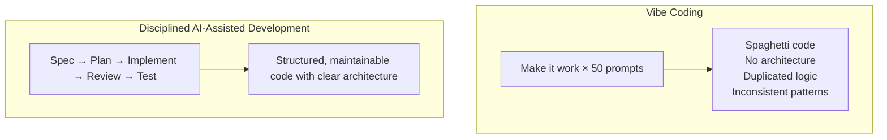

## 13. Vibe Coding — And Why It Is Problematic

### 13.1 What Is Vibe Coding?

**Vibe coding** is a term (coined by Andrej Karpathy in February 2025) describing a
style of software development where the programmer **describes what they want in
natural language** and lets an AI (Copilot, Cursor, Windsurf, etc.) generate all
the code — accepting the output with **minimal review or understanding**.

> "You just see things, say things, run things, and copy-paste things,
> and it mostly works." — Andrej Karpathy

**The core behavior:**

```mermaid
flowchart TB
    Prompt1[Developer: "Make a dashboard with charts showing user signups"]
    CodeGen1[AI generates 500 lines of code]
    Ship1[Developer: Glances → "Looks right" → Ships]
    Prompt2[Developer: "Now add filtering by date range"]
    CodeGen2[AI generates more code (may conflict with previous code)]
    Bug[Developer: "There's a bug" → Pastes error]
    Fix[AI "fixes" it]
    Loop[Repeat until it seems to work...]

    Prompt1 --> CodeGen1 --> Ship1 --> Prompt2 --> CodeGen2 --> Bug --> Fix --> Loop
```

### 13.2 Why Vibe Coding Is Problematic

#### 🔴 Technical Debt Explosion



#### 🔴 Critical Issues

| Problem | Description |
|---|---|
| **No comprehension** | Developer doesn't understand the generated code |
| **Hidden bugs** | Code appears to work but has subtle logic errors |
| **Security vulnerabilities** | AI may generate SQL injection, XSS, or auth bypass patterns |
| **Unmaintainable code** | No human has a mental model of the system |
| **Context rot** | Long sessions degrade AI output quality; developer doesn't notice |
| **Architecture erosion** | No deliberate design; patterns emerge randomly |
| **Dependency hell** | AI pulls in unnecessary or outdated dependencies |
| **Test illusion** | AI writes tests that pass but don't test the right things |
| **Debugging impossibility** | When it breaks, no one knows how it works |

#### 🔴 The "Works on My Machine" Amplified

```
SURFACE TESTING:    ✅ It renders!  ✅ Button clicks!  ✅ Data appears!

REAL-WORLD ISSUES:
  ❌ Race condition when two users edit simultaneously
  ❌ Memory leak in WebSocket handler after 1000 connections
  ❌ SQL injection via the search parameter
  ❌ No rate limiting on the API
  ❌ PII logged to console in production
  ❌ State desync between client cache and server
```

### 13.3 When Vibe Coding Is Acceptable

To be fair, there ARE legitimate uses:

| Acceptable | Not Acceptable |
|---|---|
| Quick prototypes / POCs | Production systems |
| Personal scripts / tools | Customer-facing applications |
| Hackathons | Healthcare, financial, security-critical systems |
| Learning & exploration | Team codebases others must maintain |
| One-off data analysis | Long-lived systems |

### 13.4 The Better Alternative: Structured AI-Assisted Development

```
                    VIBE CODING              SDD / STRUCTURED
                    ─────────────            ─────────────────
Planning:           None                     Spec → Architecture → Plan
Prompting:          Ad-hoc, vague            Precise, context-rich
Review:             Glance / none            Line-by-line code review
Testing:            "It seems to work"       Comprehensive test suite
Understanding:      Minimal                  Full comprehension
Documentation:      None                     Spec + comments + ADRs
Iteration:          "Fix this error"         Planned refactoring
```
