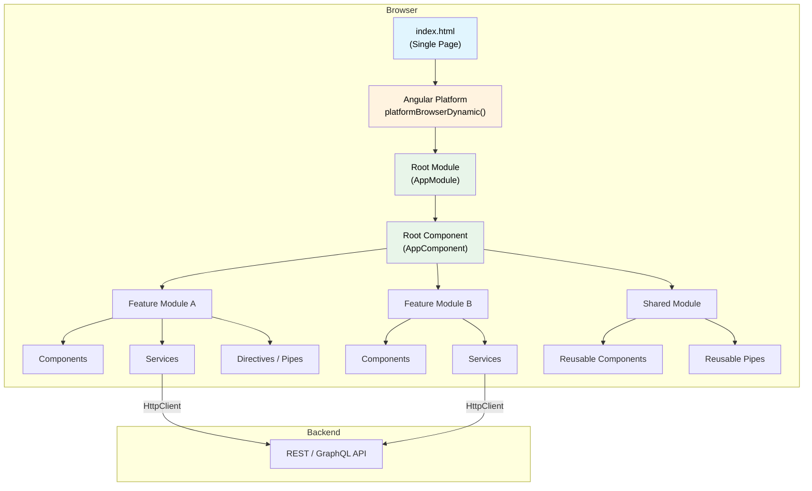

# 1. Angular Architecture & Philosophy

## Table of Contents

- [1.1 High-Level Architecture](#11-high-level-architecture)
- [1.2 Core Principles](#12-core-principles)
- [1.3 Angular vs AngularJS — Know the Difference](#13-angular-vs-angularjs-know-the-difference)

---


## 1.1 High-Level Architecture



## 1.2 Core Principles

| Principle | Description |
|---|---|
| **Component-Based** | UI built from a tree of components each owning its own template, styles, and logic |
| **Dependency Injection** | Hierarchical injector tree provides services at configurable scopes |
| **Reactive** | Built on RxJS Observables for async data flow |
| **TypeScript-First** | Full static typing, decorators, interfaces |
| **Opinionated** | Convention over configuration — routing, forms, HTTP, testing all built-in |
| **Ahead-of-Time (AOT)** | Templates compiled at build time for smaller bundles and early error detection |

## 1.3 Angular vs AngularJS — Know the Difference

```
AngularJS (1.x)              Angular (2+)
──────────────               ─────────────
$scope / controllers    →    Components + TypeScript
Two-way binding default →    Unidirectional data flow (default)
No module bundling      →    Webpack / esbuild
Dirty checking all      →    Zone.js + targeted change detection
No CLI                  →    Angular CLI (ng)
JavaScript              →    TypeScript
```
