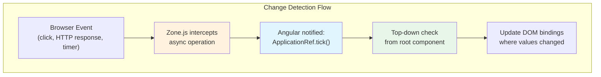
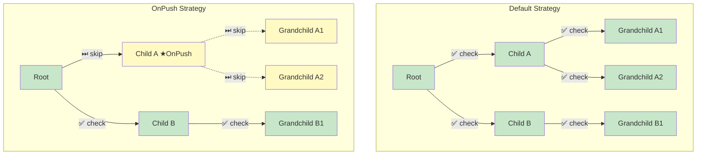

# 1. Change Detection

## Table of Contents

- [1.1 How Change Detection Works](#11-how-change-detection-works)
- [1.2 Default vs OnPush](#12-default-vs-onpush)
- [1.3 Zone.js and NgZone](#13-zonejs-and-ngzone)
- [1.4 Zoneless Angular (Experimental v18+)](#14-zoneless-angular-experimental-v18)

---


## 1.1 How Change Detection Works



## 1.2 Default vs OnPush



**OnPush components are checked ONLY when:**
1. An `@Input()` reference changes (identity, not deep equality)
2. An event handler in the component (or child) fires
3. An Observable bound via `| async` emits
4. `ChangeDetectorRef.markForCheck()` is called
5. A signal read in the template updates (v17+)

```typescript
@Component({
  changeDetection: ChangeDetectionStrategy.OnPush,   // ALWAYS prefer this
  template: `
    <div>{{ user.name }}</div>
    <div>{{ data$ | async }}</div>
  `
})
export class UserCardComponent {
  @Input() user!: User;                // Must pass new object reference to trigger
  data$ = this.dataService.getData();  // async pipe triggers markForCheck internally

  constructor(private cdr: ChangeDetectorRef) {}

  // Manual trigger if needed
  forceUpdate() {
    this.cdr.markForCheck();  // Mark component and ancestors as dirty
    // this.cdr.detectChanges();  // Immediately run CD for this component subtree
  }
}
```

## 1.3 Zone.js and NgZone

```typescript
@Injectable()
export class PerformanceService {
  constructor(private ngZone: NgZone) {}

  // Run OUTSIDE Angular's zone — prevents change detection triggers
  startPolling() {
    this.ngZone.runOutsideAngular(() => {
      setInterval(() => {
        // This won't trigger change detection
        this.collectMetrics();

        // When you DO need to update the UI:
        if (this.hasImportantUpdate) {
          this.ngZone.run(() => {
            this.updateUI();   // This WILL trigger change detection
          });
        }
      }, 1000);
    });
  }
}
```

## 1.4 Zoneless Angular (Experimental v18+)

```typescript
// main.ts — Zoneless bootstrap
bootstrapApplication(AppComponent, {
  providers: [
    provideExperimentalZonelessChangeDetection(),
    // Zone.js is no longer needed in polyfills
  ]
});

// Components must use Signals or manually notify Angular
@Component({
  template: `<div>{{ count() }}</div>`,
  changeDetection: ChangeDetectionStrategy.OnPush,
})
export class CounterComponent {
  count = signal(0);    // Signal updates automatically schedule change detection

  increment() {
    this.count.update(c => c + 1);  // Angular knows to re-render
  }
}
```
