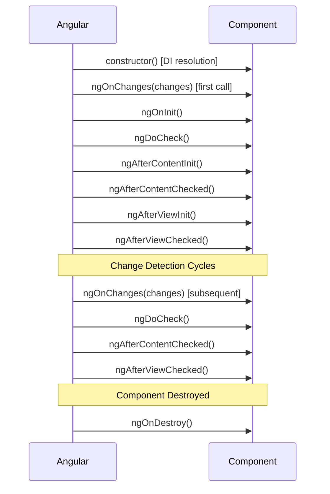
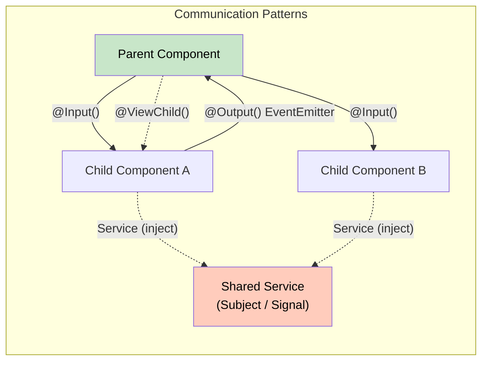

# 1. Components Deep Dive

## Table of Contents

- [1.1 Component Lifecycle](#11-component-lifecycle)
- [1.2 Lifecycle Hook Details](#12-lifecycle-hook-details)
- [1.3 Component Communication Patterns](#13-component-communication-patterns)
- [1.4 Component Encapsulation](#14-component-encapsulation)

---


## 1.1 Component Lifecycle



## 1.2 Lifecycle Hook Details

| Hook | Timing | Common Use |
|---|---|---|
| `ngOnChanges` | Before `ngOnInit` and whenever `@Input` reference changes | React to input changes; `SimpleChanges` parameter |
| `ngOnInit` | Once after first `ngOnChanges` | Fetch data, initialize subscriptions |
| `ngDoCheck` | Every change detection cycle | Custom change detection logic |
| `ngAfterContentInit` | After `<ng-content>` projected | Access `@ContentChild` |
| `ngAfterContentChecked` | After every content check | |
| `ngAfterViewInit` | After view + child views init | Access `@ViewChild`, 3rd party DOM libs |
| `ngAfterViewChecked` | After every view check | |
| `ngOnDestroy` | Before Angular destroys component | Unsubscribe, detach listeners, cleanup |

## 1.3 Component Communication Patterns



### Parent → Child: `@Input()`

```typescript
// Child
@Component({ selector: 'app-user-card' })
export class UserCardComponent {
  @Input({ required: true }) user!: User;       // Required input (v16+)
  @Input({ alias: 'highlighted' }) isHighlighted = false;
  @Input({ transform: booleanAttribute }) disabled = false; // v16+ transform

  ngOnChanges(changes: SimpleChanges) {
    if (changes['user'] && !changes['user'].firstChange) {
      console.log('User changed:', changes['user'].previousValue, '→', changes['user'].currentValue);
    }
  }
}

// Parent Template
// <app-user-card [user]="selectedUser" highlighted [disabled]="true" />
```

### Child → Parent: `@Output()` with `EventEmitter`

```typescript
// Child
@Component({ selector: 'app-search-bar' })
export class SearchBarComponent {
  @Output() search = new EventEmitter<string>();
  @Output() filterChange = new EventEmitter<FilterCriteria>();

  onSearch(term: string) {
    this.search.emit(term);
  }
}

// Parent Template
// <app-search-bar (search)="onSearch($event)" (filterChange)="applyFilter($event)" />
```

### Parent → Child: `@ViewChild()` & `@ViewChildren()`

```typescript
@Component({ /* ... */ })
export class ParentComponent implements AfterViewInit {
  @ViewChild(ChildComponent) child!: ChildComponent;
  @ViewChild('myInput') inputRef!: ElementRef<HTMLInputElement>;
  @ViewChildren(TabComponent) tabs!: QueryList<TabComponent>;

  ngAfterViewInit() {
    this.child.doSomething();
    this.inputRef.nativeElement.focus();
    this.tabs.changes.subscribe(tabs => console.log('Tabs changed:', tabs.length));
  }
}
```

### Content Projection: `<ng-content>` & `@ContentChild()`

```typescript
// Card Component (Host)
@Component({
  selector: 'app-card',
  template: `
    <div class="card">
      <div class="card-header">
        <ng-content select="[card-header]"></ng-content>
      </div>
      <div class="card-body">
        <ng-content></ng-content>           <!-- Default slot -->
      </div>
      <div class="card-footer">
        <ng-content select="app-card-footer"></ng-content>
      </div>
    </div>
  `
})
export class CardComponent {
  @ContentChild('cardAction') actionRef!: TemplateRef<any>;
}

// Usage:
// <app-card>
//   <h2 card-header>Title</h2>
//   <p>Body content here</p>
//   <app-card-footer>Footer</app-card-footer>
// </app-card>
```

### Sibling Communication via Service

```typescript
@Injectable({ providedIn: 'root' })
export class NotificationService {
  private notificationSubject = new Subject<Notification>();
  notifications$ = this.notificationSubject.asObservable();

  push(notification: Notification) {
    this.notificationSubject.next(notification);
  }
}

// Component A (Sender)
constructor(private notificationService: NotificationService) {}
sendNotification() {
  this.notificationService.push({ message: 'Item saved', type: 'success' });
}

// Component B (Receiver)
ngOnInit() {
  this.notificationService.notifications$
    .pipe(takeUntilDestroyed())
    .subscribe(n => this.display(n));
}
```

## 1.4 Component Encapsulation

```typescript
@Component({
  encapsulation: ViewEncapsulation.Emulated,    // DEFAULT — scoped CSS via attributes
  // encapsulation: ViewEncapsulation.None,      // Global CSS — no scoping
  // encapsulation: ViewEncapsulation.ShadowDom, // Native Shadow DOM
})
```

```
Emulated:   Angular adds unique attributes like _ngcontent-abc-1 to elements
            and rewrites CSS selectors to scope them.

ShadowDom:  Uses browser's Shadow DOM. True isolation. Inherited styles
            (font, color) still penetrate.

None:       Styles become global. Useful for theming or overriding
            third-party library styles.
```

**Special CSS selectors:**
```scss
:host { display: block; }                          // Target the host element
:host(.active) { border: 2px solid blue; }         // Conditional host styling
:host-context(.dark-theme) { background: #333; }   // Ancestor-based styling
::ng-deep .child-class { color: red; }             // DEPRECATED — pierce encapsulation
```
