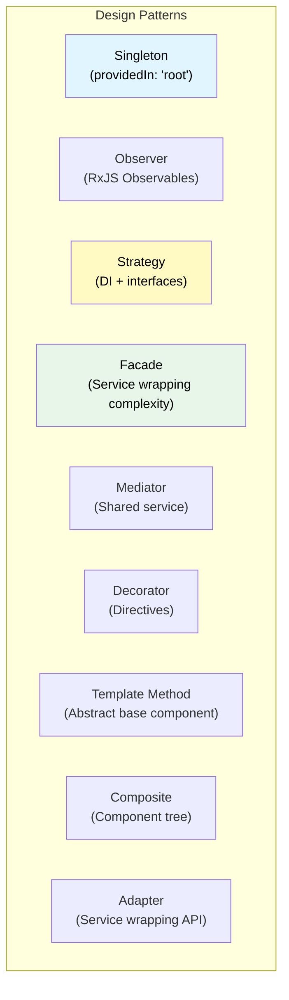

# 1. Design Patterns in Angular

## 1.1 Common Patterns



### Facade Pattern

```typescript
// Hides complexity of multiple services behind a simple API
@Injectable({ providedIn: 'root' })
export class OrderFacade {
  constructor(
    private store: Store,
    private orderApi: OrderApiService,
    private notificationService: NotificationService,
    private analyticsService: AnalyticsService,
  ) {}

  // Simple public API
  orders$ = this.store.select(selectAllOrders);
  loading$ = this.store.select(selectOrdersLoading);
  selectedOrder$ = this.store.select(selectSelectedOrder);

  loadOrders() {
    this.store.dispatch(OrderActions.loadOrders());
  }

  createOrder(dto: CreateOrderDto) {
    this.store.dispatch(OrderActions.createOrder({ dto }));
    this.analyticsService.track('order_created');
  }

  selectOrder(id: string) {
    this.store.dispatch(OrderActions.selectOrder({ id }));
  }
}
```

### Strategy Pattern via DI

```typescript
// Abstract strategy
export abstract class PaymentStrategy {
  abstract processPayment(amount: number): Observable<PaymentResult>;
}

// Concrete strategies
@Injectable()
export class StripePaymentStrategy extends PaymentStrategy {
  processPayment(amount: number): Observable<PaymentResult> {
    return this.http.post<PaymentResult>('/api/stripe/charge', { amount });
  }
  constructor(private http: HttpClient) { super(); }
}

@Injectable()
export class PayPalPaymentStrategy extends PaymentStrategy {
  processPayment(amount: number): Observable<PaymentResult> {
    return this.http.post<PaymentResult>('/api/paypal/charge', { amount });
  }
  constructor(private http: HttpClient) { super(); }
}

// Provide the strategy
// In a module or route config:
providers: [
  {
    provide: PaymentStrategy,
    useClass: environment.paymentProvider === 'stripe'
      ? StripePaymentStrategy
      : PayPalPaymentStrategy,
  },
]

// Consumer doesn't know which implementation
@Injectable()
export class CheckoutService {
  constructor(private payment: PaymentStrategy) {}

  checkout(amount: number) {
    return this.payment.processPayment(amount);
  }
}
```

### Abstract Base Component (Template Method)

```typescript
@Directive()
export abstract class BaseListComponent<T> implements OnInit, OnDestroy {
  items = signal<T[]>([]);
  loading = signal(false);
  error = signal<string | null>(null);
  selectedItem = signal<T | null>(null);

  // Template methods — subclasses implement
  protected abstract fetchItems(): Observable<T[]>;
  protected abstract trackBy(item: T): string | number;

  // Optional hooks
  protected onItemsFetched(items: T[]): void {}
  protected onItemSelected(item: T): void {}

  ngOnInit() {
    this.loadItems();
  }

  loadItems() {
    this.loading.set(true);
    this.fetchItems().pipe(
      takeUntilDestroyed(inject(DestroyRef)),
    ).subscribe({
      next: (items) => {
        this.items.set(items);
        this.loading.set(false);
        this.onItemsFetched(items);
      },
      error: (err) => {
        this.error.set(err.message);
        this.loading.set(false);
      },
    });
  }

  selectItem(item: T) {
    this.selectedItem.set(item);
    this.onItemSelected(item);
  }

  ngOnDestroy() {}
}

// Concrete implementation
@Component({
  selector: 'app-user-list',
  template: `...`,
})
export class UserListComponent extends BaseListComponent<User> {
  private userService = inject(UserService);

  protected fetchItems() {
    return this.userService.getAll();
  }

  protected trackBy(user: User) {
    return user.id;
  }

  protected override onItemSelected(user: User) {
    // Custom behavior
    this.router.navigate(['/users', user.id]);
  }
}
```
