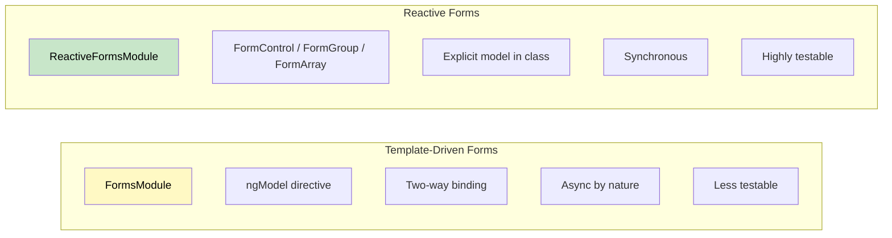

# 1. Forms: Template-Driven vs Reactive

## Table of Contents

- [1.1 Comparison](#11-comparison)
- [1.2 Reactive Forms in Depth](#12-reactive-forms-in-depth)
- [1.3 Custom Validators](#13-custom-validators)
- [1.4 ControlValueAccessor — Custom Form Controls](#14-controlvalueaccessor-custom-form-controls)

---


## 1.1 Comparison



| Aspect | Template-Driven | Reactive |
|---|---|---|
| Module | `FormsModule` | `ReactiveFormsModule` |
| Logic Location | Template | Component class |
| Data Model | Implicit (ngModel) | Explicit (FormControl) |
| Validation | Directive-based | Function-based |
| Testability | Requires DOM | Pure unit tests |
| Dynamic Forms | Difficult | Easy (FormArray) |
| Recommended For | Simple forms | Complex/enterprise forms |

## 1.2 Reactive Forms in Depth

### Typed Forms (Angular 14+)

```typescript
@Component({})
export class OrderFormComponent implements OnInit {
  private fb = inject(NonNullableFormBuilder);  // All controls non-nullable by default

  orderForm = this.fb.group({
    customerName: ['', [Validators.required, Validators.minLength(2)]],
    email: ['', [Validators.required, Validators.email]],
    orderType: ['standard' as 'standard' | 'express'],
    items: this.fb.array<FormGroup<{
      productId: FormControl<string>;
      quantity: FormControl<number>;
      price: FormControl<number>;
    }>>([]),
    address: this.fb.group({
      street: ['', Validators.required],
      city: ['', Validators.required],
      zipCode: ['', [Validators.required, Validators.pattern(/^\d{5}$/)]],
      country: ['US'],
    }),
    agreeToTerms: [false, Validators.requiredTrue],
  });

  // Typed access — no casting needed
  get items() {
    return this.orderForm.controls.items;
  }

  addItem() {
    this.items.push(this.fb.group({
      productId: ['', Validators.required],
      quantity: [1, [Validators.required, Validators.min(1)]],
      price: [0, Validators.required],
    }));
  }

  removeItem(index: number) {
    this.items.removeAt(index);
  }

  ngOnInit() {
    // Value changes observable
    this.orderForm.controls.orderType.valueChanges
      .pipe(takeUntilDestroyed())
      .subscribe(type => {
        // Dynamically add/remove validators
        const zipControl = this.orderForm.controls.address.controls.zipCode;
        if (type === 'express') {
          zipControl.addValidators(Validators.required);
        } else {
          zipControl.removeValidators(Validators.required);
        }
        zipControl.updateValueAndValidity();
      });
  }

  onSubmit() {
    if (this.orderForm.valid) {
      const value = this.orderForm.getRawValue(); // Fully typed!
      console.log(value.customerName); // string
    } else {
      this.orderForm.markAllAsTouched(); // Show all validation errors
    }
  }
}
```

### Template

```html
<form [formGroup]="orderForm" (ngSubmit)="onSubmit()">
  <div>
    <label>Customer Name</label>
    <input formControlName="customerName" />
    @if (orderForm.controls.customerName.hasError('required')
         && orderForm.controls.customerName.touched) {
      <span class="error">Name is required</span>
    }
    @if (orderForm.controls.customerName.hasError('minlength')) {
      <span class="error">Minimum 2 characters</span>
    }
  </div>

  <div formGroupName="address">
    <input formControlName="street" placeholder="Street" />
    <input formControlName="city" placeholder="City" />
    <input formControlName="zipCode" placeholder="ZIP" />
  </div>

  <div formArrayName="items">
    @for (item of items.controls; track item; let i = $index) {
      <div [formGroupName]="i">
        <input formControlName="productId" placeholder="Product ID" />
        <input formControlName="quantity" type="number" />
        <input formControlName="price" type="number" />
        <button type="button" (click)="removeItem(i)">Remove</button>
      </div>
    }
  </div>
  <button type="button" (click)="addItem()">Add Item</button>

  <button type="submit" [disabled]="orderForm.invalid">Submit</button>
</form>
```

## 1.3 Custom Validators

```typescript
// Sync validator
export function forbiddenNameValidator(forbidden: RegExp): ValidatorFn {
  return (control: AbstractControl): ValidationErrors | null => {
    const match = forbidden.test(control.value);
    return match ? { forbiddenName: { value: control.value } } : null;
  };
}

// Async validator (e.g., check uniqueness via API)
export function uniqueEmailValidator(
  userService: UserService
): AsyncValidatorFn {
  return (control: AbstractControl): Observable<ValidationErrors | null> => {
    return userService.checkEmailAvailable(control.value).pipe(
      debounceTime(300),
      map(isAvailable => isAvailable ? null : { emailTaken: true }),
      catchError(() => of(null)),
      first(),
    );
  };
}

// Cross-field validator
export const passwordMatchValidator: ValidatorFn = (
  form: AbstractControl
): ValidationErrors | null => {
  const password = form.get('password')?.value;
  const confirm = form.get('confirmPassword')?.value;
  return password === confirm ? null : { passwordMismatch: true };
};

// Usage
this.fb.group({
  name: ['', [forbiddenNameValidator(/admin/i)]],
  email: ['', {
    validators: [Validators.required],
    asyncValidators: [uniqueEmailValidator(this.userService)],
    updateOn: 'blur',  // Trigger validation on blur
  }],
  password: [''],
  confirmPassword: [''],
}, { validators: passwordMatchValidator });
```

## 1.4 ControlValueAccessor — Custom Form Controls

```typescript
@Component({
  selector: 'app-star-rating',
  template: `
    @for (star of stars; track star) {
      <span
        [class.filled]="star <= value"
        (click)="onRate(star)"
        (keyup.enter)="onRate(star)"
        tabindex="0"
        role="button"
        [attr.aria-label]="star + ' stars'"
      >★</span>
    }
  `,
  providers: [
    {
      provide: NG_VALUE_ACCESSOR,
      useExisting: forwardRef(() => StarRatingComponent),
      multi: true,
    },
  ],
})
export class StarRatingComponent implements ControlValueAccessor {
  stars = [1, 2, 3, 4, 5];
  value = 0;
  disabled = false;

  private onChange: (val: number) => void = () => {};
  private onTouched: () => void = () => {};

  writeValue(val: number): void {
    this.value = val ?? 0;
  }

  registerOnChange(fn: (val: number) => void): void {
    this.onChange = fn;
  }

  registerOnTouched(fn: () => void): void {
    this.onTouched = fn;
  }

  setDisabledState(isDisabled: boolean): void {
    this.disabled = isDisabled;
  }

  onRate(star: number) {
    if (!this.disabled) {
      this.value = star;
      this.onChange(star);
      this.onTouched();
    }
  }
}

// Usage with reactive forms:
// <app-star-rating formControlName="rating"></app-star-rating>
```
