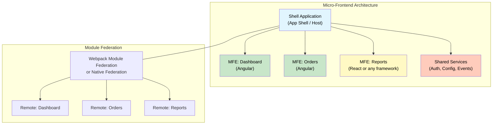

# 1. Micro-Frontend Architecture

## Table of Contents

- [1.1 Architecture Overview](#11-architecture-overview)
- [1.2 Module Federation Setup](#12-module-federation-setup)

---


## 1.1 Architecture Overview



## 1.2 Module Federation Setup

```typescript
// Shell (Host) — webpack.config.js
module.exports = withModuleFederationPlugin({
  remotes: {
    dashboard: 'dashboard@http://localhost:4201/remoteEntry.js',
    orders: 'orders@http://localhost:4202/remoteEntry.js',
  },
  shared: {
    '@angular/core': { singleton: true, strictVersion: true },
    '@angular/common': { singleton: true, strictVersion: true },
    '@angular/router': { singleton: true, strictVersion: true },
    rxjs: { singleton: true, strictVersion: true },
  },
});

// Shell routing
const routes: Routes = [
  {
    path: 'dashboard',
    loadChildren: () => import('dashboard/Module').then(m => m.DashboardModule),
  },
  {
    path: 'orders',
    loadChildren: () => import('orders/Routes').then(m => m.routes),
  },
];
```
