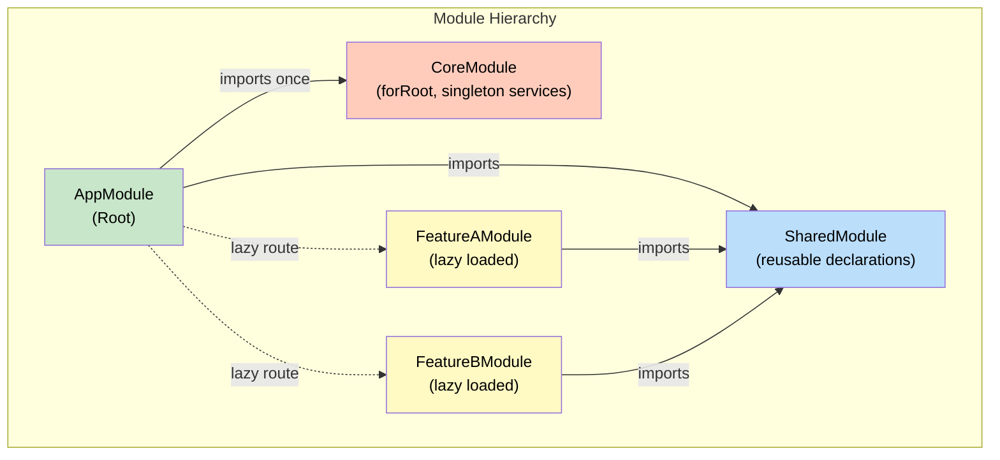
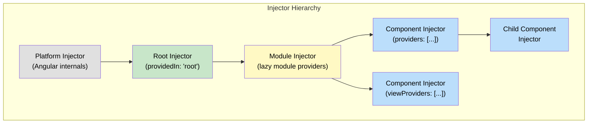

# 1. Modules & the Injection System

## Table of Contents

- [1.1 NgModule Architecture](#11-ngmodule-architecture)
- [1.2 NgModule Anatomy](#12-ngmodule-anatomy)
- [1.3 Dependency Injection — Hierarchical Injector Tree](#13-dependency-injection-hierarchical-injector-tree)
- [1.4 Provider Strategies](#14-provider-strategies)
- [1.5 Injection Tokens](#15-injection-tokens)
- [1.6 Resolution Modifiers](#16-resolution-modifiers)

---


## 1.1 NgModule Architecture



## 1.2 NgModule Anatomy

```typescript
@NgModule({
  declarations: [         // Components, Directives, Pipes that BELONG to this module
    OrderListComponent,
    OrderDetailComponent,
    OrderStatusPipe,
  ],
  imports: [              // Other modules whose EXPORTS this module needs
    CommonModule,
    SharedModule,
    OrdersRoutingModule,
    ReactiveFormsModule,
  ],
  providers: [            // Services scoped to this module's injector
    OrderService,         // (if lazy loaded → gets its own injector)
  ],
  exports: [              // Declarations available to importing modules
    OrderListComponent,
  ],
})
export class OrdersModule {}
```

## 1.3 Dependency Injection — Hierarchical Injector Tree



## 1.4 Provider Strategies

```typescript
// 1. Tree-shakable (PREFERRED) — providedIn
@Injectable({
  providedIn: 'root'       // Singleton at root injector, tree-shakable
})
export class AuthService {}

@Injectable({
  providedIn: 'any'        // Each lazy module gets its own instance
})
export class AnalyticsService {}

@Injectable({
  providedIn: 'platform'   // Shared across Angular apps on same page
})
export class SharedService {}

// 2. Module-level providers
@NgModule({
  providers: [OrderService]  // Scoped if lazy-loaded, else root
})

// 3. Component-level providers
@Component({
  providers: [FormStateService]     // New instance per component
})

// 4. viewProviders — not available to content-projected children
@Component({
  viewProviders: [InternalService]
})

// 5. useFactory, useValue, useExisting, useClass
providers: [
  { provide: API_URL, useValue: 'https://api.example.com' },
  { provide: LoggerService, useClass: environment.production ? ProdLogger : DevLogger },
  { provide: AbstractDataService, useExisting: ConcreteDataService },
  {
    provide: APP_INITIALIZER,
    useFactory: (config: ConfigService) => () => config.load(),
    deps: [ConfigService],
    multi: true
  },
]
```

## 1.5 Injection Tokens

```typescript
// Avoid string tokens — use InjectionToken for type safety
export const API_BASE_URL = new InjectionToken<string>('API_BASE_URL', {
  providedIn: 'root',
  factory: () => 'https://api.default.com',
});

export const FEATURE_FLAGS = new InjectionToken<FeatureFlags>('FEATURE_FLAGS');

// Usage
constructor(@Inject(API_BASE_URL) private apiUrl: string) {}
```

## 1.6 Resolution Modifiers

```typescript
constructor(
  private required: UserService,                  // Throws if not found

  @Optional() private optional: LogService,       // null if not found

  @Self() private self: FormService,              // Only THIS injector

  @SkipSelf() private parent: TreeService,        // Skip this, look parent+

  @Host() private host: TabGroupService,          // Up to host component only
) {}
```
