# 1. Performance Optimization

## Table of Contents

- [1.1 Performance Checklist](#11-performance-checklist)
- [1.2 Key Optimization Techniques](#12-key-optimization-techniques)

---


## 1.1 Performance Checklist

```mermaid
graph TB
    subgraph "Angular Performance Optimization"
        direction TB
        A["🔄 Change Detection"]
        B["📦 Bundle Size"]
        C["🖼️ Rendering"]
        D["🌐 Network"]
        E["⚡ Runtime"]
    end

    A --> A1["OnPush everywhere"]
    A --> A2["Signals over Observables"]
    A --> A3["runOutsideAngular()"]
    A --> A4["trackBy / track in @for"]

    B --> B1["Lazy loading routes"]
    B --> B2["@defer blocks"]
    B --> B3["Tree-shaking (providedIn)"]
    B --> B4["Bundle analyzer"]
    B --> B5["Import only needed RxJS operators"]

    C --> C1["Virtual scrolling (CDK)"]
    C --> C2["Pure pipes instead of methods in template"]
    C --> C3["Avoid complex expressions in templates"]
    C --> C4["*ngFor trackBy"]

    D --> D1["HTTP caching interceptor"]
    D --> D2["Preloading strategies"]
    D --> D3["Service worker (PWA)"]
    D --> D4["SSR / SSG"]

    E --> E1["Web Workers"]
    E --> E2["Memoization"]
    E --> E3["Unsubscribe / cleanup"]

    style A fill:#e1f5fe
    style B fill:#e8f5e9
    style C fill:#fff9c4
    style D fill:#ffccbc
    style E fill:#e1bee7
```



## 1.2 Key Optimization Techniques

### Virtual Scrolling

```typescript
import { ScrollingModule } from '@angular/cdk/scrolling';

@Component({
  template: `
    <cdk-virtual-scroll-viewport itemSize="50" class="viewport">
      <div *cdkVirtualFor="let item of items; trackBy: trackById" class="item">
        {{ item.name }}
      </div>
    </cdk-virtual-scroll-viewport>
  `,
  styles: [`.viewport { height: 400px; }`],
})
export class LargeListComponent {
  items: Item[] = []; // Can be thousands of items

  trackById(index: number, item: Item): string {
    return item.id;
  }
}
```

### Avoid Template Method Calls

```typescript
// ❌ BAD — method called on every change detection cycle
@Component({
  template: `<div>{{ getFullName(user) }}</div>`
})

// ✅ GOOD — pure pipe, only recalculated when input changes
@Pipe({ name: 'fullName', pure: true })
export class FullNamePipe implements PipeTransform {
  transform(user: User): string {
    return `${user.firstName} ${user.lastName}`;
  }
}
// Template: {{ user | fullName }}

// ✅ ALSO GOOD — computed property or signal
fullName = computed(() => `${this.user().firstName} ${this.user().lastName}`);
// Template: {{ fullName() }}
```

### Bundle Analysis

```bash
# Generate stats
ng build --stats-json

# Analyze
npx webpack-bundle-analyzer dist/my-app/stats.json

# Or use source-map-explorer
npx source-map-explorer dist/my-app/main.*.js
```

### Budget Configuration

```json
// angular.json
"budgets": [
  {
    "type": "initial",
    "maximumWarning": "500kb",
    "maximumError": "1mb"
  },
  {
    "type": "anyComponentStyle",
    "maximumWarning": "2kb",
    "maximumError": "4kb"
  }
]
```

### Image Optimization (Angular 15+)

```html
<!-- NgOptimizedImage directive -->

```

```typescript
// providers
provideImageKitLoader('https://ik.imagekit.io/mysite')
// or provideCloudflareLoader, provideCloudinaryLoader, provideImgixLoader
```
