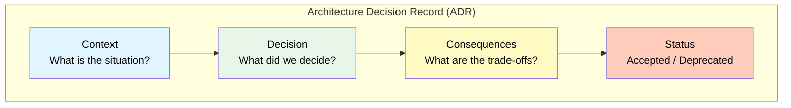

# 1. Principal-Level Architecture Decisions

## Table of Contents

- [1.1 Decision Framework](#11-decision-framework)
- [1.2 Key Decisions a Principal Must Make](#12-key-decisions-a-principal-must-make)
- [1.3 Scalability Patterns](#13-scalability-patterns)
- [1.4 Interview Discussion Topics](#14-interview-discussion-topics)
- [1.5 Common Interview Questions & Answers](#15-common-interview-questions-answers)

---


## 1.1 Decision Framework



## 1.2 Key Decisions a Principal Must Make

### Monorepo Strategy (Nx)

```
When to choose Nx monorepo:
├── Multiple Angular apps sharing code
├── Shared component libraries
├── Consistent tooling across teams
├── Affected-based CI/CD (only rebuild what changed)
└── Enforced module boundaries (linting rules)

nx.json → Task orchestration, caching
project.json → Per-project configuration
```

### State Management Decision Matrix

```
┌──────────────────────┬─────────────────────────┬──────────────┐
│ Complexity           │ Recommended Approach    │ Team Size    │
├──────────────────────┼─────────────────────────┼──────────────┤
│ Simple (1-3 pages)   │ Component state         │ 1-2 devs     │
│ Medium (3-10 pages)  │ Services + Signals      │ 2-5 devs     │
│ Complex (10+ pages)  │ NgRx Store or           │ 5+ devs      │
│ shared state, undo   │ NgRx SignalStore        │              │
│ Multi-app, audit log │ NgRx Store + Effects    │ 10+ devs     │
└──────────────────────┴─────────────────────────┴──────────────┘
```

### Module Architecture Decision

```
Feature Module vs Standalone:
├── New projects (v17+): Standalone by default
├── Existing projects: Gradual migration to standalone
├── Libraries: Can be either; standalone more portable
└── Shared UI kit: Standalone components recommended

Lazy Loading Granularity:
├── Per feature route: Most common, good balance
├── Per sub-feature: For very large features
├── @defer: For in-page lazy loading (below fold, on interaction)
└── Dynamic import: For conditionally loaded features
```

## 1.3 Scalability Patterns

```typescript
// 1. Feature shell pattern
// Each feature is self-contained with its own:
//   - Routes
//   - State
//   - Services
//   - Components

// 2. Smart/Dumb component pattern
//   Smart (Container): Handles state, services, side effects
//   Dumb (Presentational): Pure @Input/@Output, OnPush, no injected services

// 3. Facade pattern per feature
//   Components → Feature Facade → State + API Services + Side Effects

// 4. Barrel exports for clean public APIs
// features/users/index.ts
export { UserListComponent } from './components/user-list/user-list.component';
export { UserFacade } from './services/user.facade';
export { User, CreateUserDto } from './models/user.model';
// Internal components are NOT exported
```

## 1.4 Interview Discussion Topics

### When asked "How would you architect a large-scale Angular application?"

```
1. PROJECT STRUCTURE
   → Nx monorepo with libs/ for shared code
   → Feature-based organization
   → Enforce boundaries with ESLint rules

2. COMPONENT ARCHITECTURE
   → Smart/Dumb pattern
   → OnPush everywhere
   → Signals for component state, RxJS for streams
   → Standalone components

3. STATE MANAGEMENT
   → Local state: Signals
   → Feature state: NgRx ComponentStore or SignalStore
   → Global state: NgRx Store (if needed)
   → URL state: Router

4. API LAYER
   → Typed API services with generics
   → Interceptors for auth, errors, caching, logging
   → Retry and circuit breaker patterns

5. PERFORMANCE
   → Lazy loading (routes + @defer)
   → Bundle budgets
   → Virtual scrolling for large lists
   → Web workers for heavy computation
   → CDN, compression, caching headers

6. TESTING
   → Unit tests for services, pipes, reducers (fast, many)
   → Integration tests for components (medium)
   → E2E for critical flows (few, Playwright)
   → Minimum 80% coverage, meaningful tests

7. CI/CD
   → Affected-based builds (Nx)
   → Automated testing, linting, bundle analysis
   → Preview environments for PRs
   → Feature flags for progressive rollout

8. SECURITY
   → CSP headers
   → XSRF protection
   → Route guards for auth/authz
   → Input sanitization (Angular handles most)
   → Regular dependency audits

9. MONITORING
   → Error tracking (Sentry)
   → Performance monitoring (Lighthouse CI)
   → Analytics
   → Logging strategy

10. DOCUMENTATION
    → ADRs for key decisions
    → Storybook for component library
    → API documentation
    → Onboarding guides
```

## 1.5 Common Interview Questions & Answers

| Question | Key Points |
|---|---|
| How does Angular's DI differ from other frameworks? | Hierarchical injector tree; resolution modifiers; InjectionToken for type safety; tree-shakable with `providedIn` |
| Explain change detection strategies | Default checks entire tree; OnPush checks only on input ref change, events, async pipe, markForCheck(); Signals bypass Zone.js |
| How would you migrate a large AngularJS app? | ngUpgrade for hybrid; strangler fig pattern; route-by-route migration; shared services bridge |
| Signals vs Observables? | Signals: synchronous, always have value, no cleanup. Observables: async streams, operators, cancellation. Use both — bridge with toSignal/toObservable |
| How to handle authentication? | JWT in HttpOnly cookies > localStorage; auth interceptor; route guards; refresh token rotation; silent refresh with iframe or interceptor retry |
| Micro-frontends with Angular? | Module Federation; shared singleton deps; shell routing; event-bus for cross-MFE communication; contract testing |
| Performance debugging workflow? | Chrome DevTools Performance tab → Angular DevTools → identify excessive CD cycles → apply OnPush/signals → bundle analyze → lazy load → measure again |

---

# Quick Reference Card

```
┌─────────────────────────────────────────────────────────────┐
│                   ANGULAR QUICK REFERENCE                   │
├─────────────────────────────────────────────────────────────┤
│ SIGNALS          signal() computed() effect() toSignal()    │
│ DI               providedIn inject() InjectionToken         │
│ CHANGE DETECT    OnPush + Signals = optimal                 │
│ FORMS            ReactiveFormsModule + Typed Forms           │
│ HTTP             provideHttpClient + functional interceptors │
│ ROUTING          provideRouter + functional guards           │
│ STATE            Signals → Service → SignalStore → NgRx     │
│ TESTING          Jasmine/Jest + TestBed + HttpTestingCtrl    │
│ PERFORMANCE      OnPush, lazy load, @defer, virtual scroll  │
│ SECURITY         Auto-sanitization, XSRF, CSP, guards       │
│ SSR              @angular/ssr + hydration + afterNextRender  │
│ MODERN (17+)     Standalone, control flow, @defer, signals  │
└─────────────────────────────────────────────────────────────┘
```

---

> **Study Tip:** For a principal-level interview, focus less on memorizing syntax and more on *why* you'd choose one approach over another, *trade-offs* of each decision, and how you'd *lead a team* through architectural decisions. Be ready to draw architecture diagrams and walk through real-world scenarios.
