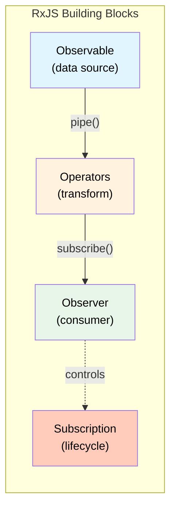
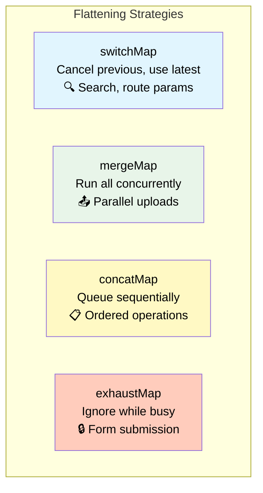

# 1. Reactive Programming with RxJS

## Table of Contents

- [1.1 Core Concepts](#11-core-concepts)
- [1.2 Observable Types](#12-observable-types)
- [1.3 Essential Operators Cheat Sheet](#13-essential-operators-cheat-sheet)
- [1.4 Unsubscription Patterns](#14-unsubscription-patterns)
- [1.5 shareReplay & Multicasting](#15-sharereplay-multicasting)

---


## 1.1 Core Concepts



## 1.2 Observable Types

```typescript
// --- Cold Observable (unicast — each subscriber gets own execution) ---
const cold$ = new Observable<number>(subscriber => {
  console.log('Side effect runs PER subscriber');
  subscriber.next(Math.random());
  subscriber.complete();
});

// --- Hot Observable (multicast — shared execution) ---
// Subject — no replay
const subject = new Subject<string>();

// BehaviorSubject — has current value, replays last to new subscribers
const behaviorSubject = new BehaviorSubject<User | null>(null);

// ReplaySubject — replays N last values
const replaySubject = new ReplaySubject<LogEntry>(10);  // Buffer 10

// AsyncSubject — emits only last value on complete
const asyncSubject = new AsyncSubject<Result>();
```

## 1.3 Essential Operators Cheat Sheet

```typescript
import {
  map, filter, tap, switchMap, mergeMap, concatMap, exhaustMap,
  debounceTime, distinctUntilChanged, throttleTime,
  catchError, retry, retryWhen,
  take, takeUntil, takeWhile, first, last,
  combineLatest, forkJoin, merge, concat, zip, race,
  shareReplay, share,
  startWith, pairwise, scan, reduce,
  withLatestFrom, delay, timeout,
} from 'rxjs/operators';
// (some from 'rxjs' directly)
```

### Transformation Operators

```typescript
// map — transform each emission
source$.pipe(map(user => user.name));

// scan — running accumulator (like reduce but emits intermediate values)
clicks$.pipe(scan((total, click) => total + 1, 0));

// switchMap — cancel previous inner, subscribe to new (HTTP search, route params)
searchTerm$.pipe(
  debounceTime(300),
  distinctUntilChanged(),
  switchMap(term => this.http.get(`/api/search?q=${term}`))
);

// mergeMap — run inner observables concurrently (fire-and-forget)
fileList$.pipe(
  mergeMap(file => this.uploadService.upload(file), 3)  // concurrency limit: 3
);

// concatMap — queue inner observables sequentially (order matters)
actions$.pipe(
  concatMap(action => this.api.process(action))
);

// exhaustMap — ignore new emissions while inner is active (prevent double-submit)
submitClick$.pipe(
  exhaustMap(() => this.api.submitOrder(this.form.value))
);
```

### Flattening Strategy Comparison



### Combination Operators

```typescript
// combineLatest — emits when ANY source emits (after all have emitted once)
combineLatest([filters$, sorting$, page$]).pipe(
  switchMap(([filters, sorting, page]) => this.api.getList(filters, sorting, page))
);

// forkJoin — emits ONCE when ALL sources complete (parallel HTTP calls)
forkJoin({
  users: this.http.get<User[]>('/api/users'),
  roles: this.http.get<Role[]>('/api/roles'),
  permissions: this.http.get<Permission[]>('/api/permissions'),
}).subscribe(({ users, roles, permissions }) => {
  // All three have completed
});

// withLatestFrom — combine with latest from another source (only when primary emits)
saveClick$.pipe(
  withLatestFrom(formValue$, user$),
  switchMap(([_, formValue, user]) => this.api.save(formValue, user.id))
);

// merge — interleave emissions from multiple sources
merge(
  fromEvent(el, 'mouseenter').pipe(map(() => true)),
  fromEvent(el, 'mouseleave').pipe(map(() => false)),
);
```

## 1.4 Unsubscription Patterns

```typescript
// ✅ Pattern 1: takeUntilDestroyed() — Angular 16+ (PREFERRED)
@Component({})
export class MyComponent {
  private destroyRef = inject(DestroyRef);

  ngOnInit() {
    this.service.data$
      .pipe(takeUntilDestroyed(this.destroyRef))
      .subscribe(data => this.handle(data));
  }
}

// ✅ Pattern 2: takeUntilDestroyed() in constructor/field initializer
@Component({})
export class MyComponent {
  data$ = this.service.data$.pipe(takeUntilDestroyed());  // injection context
}

// ✅ Pattern 3: async pipe (auto-unsubscribes)
// <div *ngIf="data$ | async as data">{{ data.name }}</div>

// ✅ Pattern 4: takeUntil with Subject (classic)
@Component({})
export class MyComponent implements OnDestroy {
  private destroy$ = new Subject<void>();

  ngOnInit() {
    this.service.data$
      .pipe(takeUntil(this.destroy$))
      .subscribe();
  }

  ngOnDestroy() {
    this.destroy$.next();
    this.destroy$.complete();
  }
}

// ✅ Pattern 5: Subscription collection
private subs = new Subscription();

ngOnInit() {
  this.subs.add(this.a$.subscribe());
  this.subs.add(this.b$.subscribe());
}

ngOnDestroy() {
  this.subs.unsubscribe();
}
```

## 1.5 shareReplay & Multicasting

```typescript
@Injectable({ providedIn: 'root' })
export class ConfigService {
  // Cache the HTTP response — share among subscribers, replay last value
  config$ = this.http.get<AppConfig>('/api/config').pipe(
    shareReplay({ bufferSize: 1, refCount: true }),
    // refCount: true → unsubscribes from source when all subscribers leave
    // refCount: false → keeps subscription alive forever (memory leak risk)
  );

  constructor(private http: HttpClient) {}
}
```
