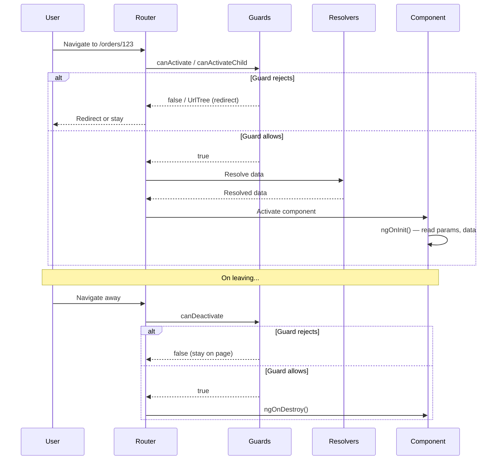

# 1. Routing & Navigation

## Table of Contents

- [1.1 Route Configuration](#11-route-configuration)
- [1.2 Route Flow](#12-route-flow)
- [1.3 Functional Guards & Resolvers (Angular 15+)](#13-functional-guards-resolvers-angular-15)
- [1.4 Reading Route Data in Components](#14-reading-route-data-in-components)
- [1.5 Preloading Strategies](#15-preloading-strategies)

---


## 1.1 Route Configuration

```typescript
const routes: Routes = [
  { path: '', redirectTo: 'dashboard', pathMatch: 'full' },
  { path: 'dashboard', component: DashboardComponent },

  // Lazy-loaded module
  {
    path: 'orders',
    loadChildren: () => import('./features/orders/orders.module').then(m => m.OrdersModule),
    canActivate: [AuthGuard],
    data: { roles: ['admin', 'manager'] },
  },

  // Lazy-loaded standalone component (Angular 15+)
  {
    path: 'profile',
    loadComponent: () => import('./features/profile/profile.component').then(c => c.ProfileComponent),
  },

  // Route with parameters
  {
    path: 'users/:userId',
    component: UserDetailComponent,
    resolve: { user: UserResolver },
    canDeactivate: [UnsavedChangesGuard],
    children: [
      { path: '', redirectTo: 'overview', pathMatch: 'full' },
      { path: 'overview', component: UserOverviewComponent },
      { path: 'orders', component: UserOrdersComponent },
    ],
  },

  // Wildcard
  { path: '**', component: NotFoundComponent },
];

@NgModule({
  imports: [RouterModule.forRoot(routes, {
    preloadingStrategy: PreloadAllModules,  // or custom strategy
    scrollPositionRestoration: 'enabled',
    anchorScrolling: 'enabled',
    paramsInheritanceStrategy: 'always',    // Child routes inherit parent params
    onSameUrlNavigation: 'reload',
  })],
  exports: [RouterModule],
})
export class AppRoutingModule {}
```

## 1.2 Route Flow



## 1.3 Functional Guards & Resolvers (Angular 15+)

```typescript
// Functional guard (replaces class-based CanActivate)
export const authGuard: CanActivateFn = (route, state) => {
  const authService = inject(AuthService);
  const router = inject(Router);

  if (authService.isAuthenticated()) {
    const requiredRoles = route.data['roles'] as string[];
    if (!requiredRoles || authService.hasAnyRole(requiredRoles)) {
      return true;
    }
    return router.createUrlTree(['/forbidden']);
  }

  return router.createUrlTree(['/login'], {
    queryParams: { returnUrl: state.url },
  });
};

// Functional resolver
export const userResolver: ResolveFn<User> = (route) => {
  const userService = inject(UserService);
  const userId = route.paramMap.get('userId')!;
  return userService.getById(userId).pipe(
    catchError(() => {
      inject(Router).navigate(['/not-found']);
      return EMPTY;
    })
  );
};

// Usage in routes
{
  path: 'users/:userId',
  component: UserDetailComponent,
  canActivate: [authGuard],
  resolve: { user: userResolver },
}
```

## 1.4 Reading Route Data in Components

```typescript
@Component({})
export class UserDetailComponent implements OnInit {
  private route = inject(ActivatedRoute);
  private router = inject(Router);

  // Reactive approach (recommended for OnPush)
  user$ = this.route.data.pipe(map(data => data['user'] as User));
  userId$ = this.route.paramMap.pipe(map(pm => pm.get('userId')));
  searchTerm$ = this.route.queryParamMap.pipe(map(qpm => qpm.get('q')));
  fragment$ = this.route.fragment;

  // Snapshot approach (one-time read)
  ngOnInit() {
    const userId = this.route.snapshot.paramMap.get('userId');
    const page = this.route.snapshot.queryParamMap.get('page');
  }

  // Input binding (Angular 16+ with withComponentInputBinding())
  @Input() userId!: string;   // Route param auto-bound

  // Programmatic navigation
  goToOrder(orderId: string) {
    this.router.navigate(['orders', orderId], {
      queryParams: { tab: 'details' },
      queryParamsHandling: 'merge',
      fragment: 'top',
    });
  }
}

// Enable input binding in bootstrap:
// provideRouter(routes, withComponentInputBinding())
```

## 1.5 Preloading Strategies

```typescript
// 1. Preload all modules
{ preloadingStrategy: PreloadAllModules }

// 2. No preloading
{ preloadingStrategy: NoPreloading }

// 3. Custom preloading
@Injectable({ providedIn: 'root' })
export class SelectivePreloadingStrategy implements PreloadingStrategy {
  preload(route: Route, load: () => Observable<any>): Observable<any> {
    // Preload only routes marked with data.preload = true
    return route.data?.['preload'] ? load() : of(null);
  }
}

// Route config:
{ path: 'dashboard', loadChildren: ..., data: { preload: true } }
```
