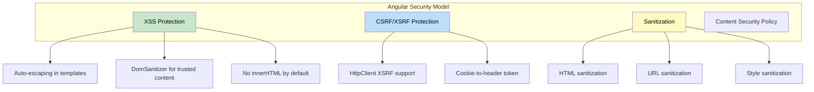

# 1. Security

## Table of Contents

- [1.1 Built-in Protections](#11-built-in-protections)
- [1.2 XSS Prevention](#12-xss-prevention)
- [1.3 CSRF Protection](#13-csrf-protection)
- [1.4 Route Guard for Authorization](#14-route-guard-for-authorization)
- [1.5 Security Best Practices](#15-security-best-practices)

---


## 1.1 Built-in Protections



## 1.2 XSS Prevention

```typescript
// Angular auto-escapes interpolation
// {{ userInput }} → safely escaped

// When you NEED to render HTML (use with caution):
@Component({
  template: `<div [innerHTML]="trustedHtml"></div>`
})
export class RichTextComponent {
  private sanitizer = inject(DomSanitizer);

  // Angular sanitizes innerHTML by default, but for URLs/styles:
  trustedUrl = this.sanitizer.bypassSecurityTrustResourceUrl('https://trusted-source.com/embed');
  trustedHtml = this.sanitizer.bypassSecurityTrustHtml('<b>Bold text</b>');

  // ⚠️ NEVER bypass sanitization for user input!
  // Only use for content you fully control.
}
```

## 1.3 CSRF Protection

```typescript
// Angular's HttpClient automatically reads XSRF-TOKEN cookie
// and sends it as X-XSRF-TOKEN header

provideHttpClient(
  withXsrfConfiguration({
    cookieName: 'XSRF-TOKEN',    // default
    headerName: 'X-XSRF-TOKEN',  // default
  })
)
```

## 1.4 Route Guard for Authorization

```typescript
export const roleGuard: CanActivateFn = (route) => {
  const auth = inject(AuthService);
  const required = route.data['roles'] as string[];

  if (!auth.isAuthenticated()) {
    return inject(Router).createUrlTree(['/login']);
  }

  if (required && !auth.hasAnyRole(required)) {
    return inject(Router).createUrlTree(['/forbidden']);
  }

  return true;
};
```

## 1.5 Security Best Practices

| Practice | Implementation |
|---|---|
| Never use `bypassSecurityTrust*` for user input | Only for content you control |
| Use `HttpOnly` cookies for tokens | Backend configuration |
| Implement CSP headers | Server-side header |
| Avoid `document.createElement` | Use `Renderer2` |
| Validate on server side | Never trust client-side validation alone |
| Keep Angular updated | Security patches in minor releases |
| Audit dependencies | `npm audit`, Snyk, etc. |
