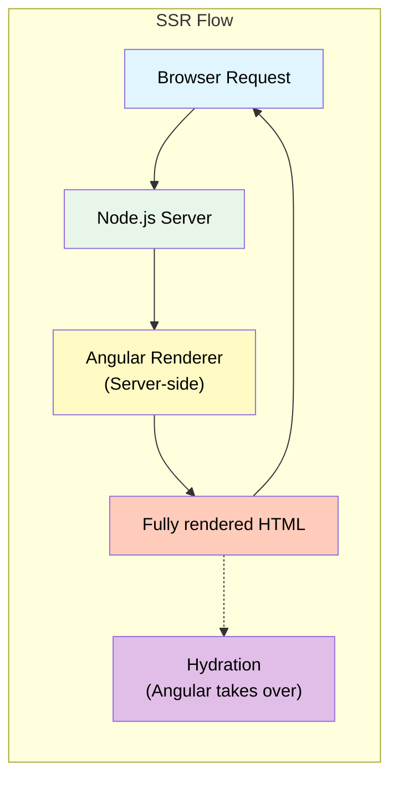

# 1. Server-Side Rendering (Angular Universal)

## Table of Contents

- [1.1 Setup (Angular 17+)](#11-setup-angular-17)
- [1.2 Hydration (Angular 16+)](#12-hydration-angular-16)
- [1.3 Platform-Aware Code](#13-platform-aware-code)

---




## 1.1 Setup (Angular 17+)

```bash
ng add @angular/ssr
```

```typescript
// app.config.server.ts
import { mergeApplicationConfig } from '@angular/core';
import { provideServerRendering } from '@angular/platform-server';
import { appConfig } from './app.config';

const serverConfig: ApplicationConfig = {
  providers: [
    provideServerRendering(),
  ],
};

export const config = mergeApplicationConfig(appConfig, serverConfig);
```

## 1.2 Hydration (Angular 16+)

```typescript
// app.config.ts
export const appConfig: ApplicationConfig = {
  providers: [
    provideClientHydration(
      withEventReplay(),                    // v18+ replay events during hydration
      withHttpTransferCacheOptions({
        includePostRequests: false,
      }),
    ),
  ],
};
```

## 1.3 Platform-Aware Code

```typescript
@Injectable({ providedIn: 'root' })
export class PlatformService {
  private platformId = inject(PLATFORM_ID);

  get isBrowser(): boolean {
    return isPlatformBrowser(this.platformId);
  }

  get isServer(): boolean {
    return isPlatformServer(this.platformId);
  }
}

// Usage
@Component({})
export class AnalyticsComponent implements OnInit {
  private platform = inject(PlatformService);

  ngOnInit() {
    if (this.platform.isBrowser) {
      // Only run in browser — not during SSR
      window.addEventListener('scroll', this.onScroll);
      this.initAnalytics();
    }
  }
}

// Or use afterNextRender / afterRender (Angular 16+)
@Component({})
export class ChartComponent {
  constructor() {
    afterNextRender(() => {
      // This runs ONLY in the browser, after the component is rendered
      this.initD3Chart();
    });
  }
}
```
