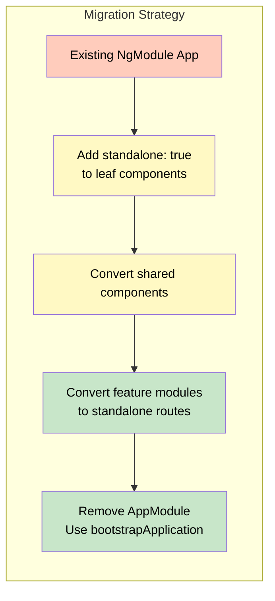

# 1. Standalone Components & New APIs

## Table of Contents

- [1.1 Standalone Components](#11-standalone-components)
- [1.2 Standalone Bootstrap](#12-standalone-bootstrap)
- [1.3 Migration Path](#13-migration-path)

---


## 1.1 Standalone Components

```typescript
// No NgModule needed
@Component({
  selector: 'app-user-list',
  standalone: true,            // Declares this is standalone
  imports: [                   // Import what you need directly
    CommonModule,
    RouterLink,
    UserCardComponent,         // Another standalone component
    HighlightDirective,
    FileSizePipe,
    ReactiveFormsModule,
  ],
  template: `...`,
  changeDetection: ChangeDetectionStrategy.OnPush,
})
export class UserListComponent {}
```

## 1.2 Standalone Bootstrap

```typescript
// main.ts — No AppModule!
import { bootstrapApplication } from '@angular/platform-browser';
import { AppComponent } from './app/app.component';
import { appConfig } from './app/app.config';

bootstrapApplication(AppComponent, appConfig)
  .catch(err => console.error(err));

// app.config.ts
import { ApplicationConfig } from '@angular/core';

export const appConfig: ApplicationConfig = {
  providers: [
    provideRouter(routes,
      withComponentInputBinding(),
      withViewTransitions(),
      withRouterConfig({ paramsInheritanceStrategy: 'always' }),
    ),
    provideHttpClient(
      withInterceptors([authInterceptor, errorInterceptor]),
      withFetch(),
    ),
    provideAnimationsAsync(),
    provideClientHydration(),

    // Environment-specific
    { provide: API_BASE_URL, useValue: environment.apiUrl },

    // NgRx
    provideStore({ users: usersReducer }),
    provideEffects([UsersEffects]),
    provideStoreDevtools({ maxAge: 25, logOnly: !isDevMode() }),
  ],
};
```

## 1.3 Migration Path



```bash
# Angular CLI schematic for automated migration
ng generate @angular/core:standalone
```
