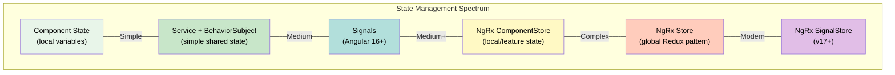
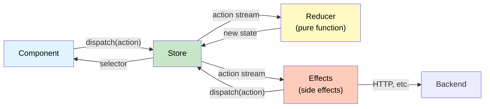

# 1. State Management

## Table of Contents

- [1.1 Options Overview](#11-options-overview)
- [1.2 Service + BehaviorSubject Pattern](#12-service-behaviorsubject-pattern)
- [1.3 NgRx Store (Redux Pattern)](#13-ngrx-store-redux-pattern)
- [1.4 NgRx SignalStore (v17+)](#14-ngrx-signalstore-v17)

---


## 1.1 Options Overview



## 1.2 Service + BehaviorSubject Pattern

```typescript
export interface AppState {
  users: User[];
  selectedUser: User | null;
  loading: boolean;
  error: string | null;
}

const initialState: AppState = {
  users: [],
  selectedUser: null,
  loading: false,
  error: null,
};

@Injectable({ providedIn: 'root' })
export class UserStateService {
  private state$ = new BehaviorSubject<AppState>(initialState);

  // Selectors — expose slices as observables
  users$ = this.state$.pipe(map(s => s.users), distinctUntilChanged());
  selectedUser$ = this.state$.pipe(map(s => s.selectedUser), distinctUntilChanged());
  loading$ = this.state$.pipe(map(s => s.loading), distinctUntilChanged());
  error$ = this.state$.pipe(map(s => s.error), distinctUntilChanged());

  constructor(private http: HttpClient) {}

  // Actions
  loadUsers() {
    this.patchState({ loading: true, error: null });
    this.http.get<User[]>('/api/users').pipe(
      tap(users => this.patchState({ users, loading: false })),
      catchError(err => {
        this.patchState({ error: err.message, loading: false });
        return EMPTY;
      }),
    ).subscribe();
  }

  selectUser(user: User) {
    this.patchState({ selectedUser: user });
  }

  private patchState(patch: Partial<AppState>) {
    this.state$.next({ ...this.state$.value, ...patch });
  }
}
```

## 1.3 NgRx Store (Redux Pattern)



```typescript
// --- Actions ---
export const UsersActions = createActionGroup({
  source: 'Users',
  events: {
    'Load Users': emptyProps(),
    'Load Users Success': props<{ users: User[] }>(),
    'Load Users Failure': props<{ error: string }>(),
    'Select User': props<{ userId: string }>(),
  },
});

// --- Reducer ---
export interface UsersState {
  users: User[];
  selectedUserId: string | null;
  loading: boolean;
  error: string | null;
}

const initialState: UsersState = {
  users: [],
  selectedUserId: null,
  loading: false,
  error: null,
};

export const usersReducer = createReducer(
  initialState,
  on(UsersActions.loadUsers, (state) => ({
    ...state,
    loading: true,
    error: null,
  })),
  on(UsersActions.loadUsersSuccess, (state, { users }) => ({
    ...state,
    users,
    loading: false,
  })),
  on(UsersActions.loadUsersFailure, (state, { error }) => ({
    ...state,
    error,
    loading: false,
  })),
  on(UsersActions.selectUser, (state, { userId }) => ({
    ...state,
    selectedUserId: userId,
  })),
);

// --- Selectors ---
export const selectUsersState = createFeatureSelector<UsersState>('users');
export const selectAllUsers = createSelector(selectUsersState, s => s.users);
export const selectLoading = createSelector(selectUsersState, s => s.loading);
export const selectSelectedUser = createSelector(
  selectUsersState,
  (state) => state.users.find(u => u.id === state.selectedUserId) ?? null,
);

// --- Effects ---
@Injectable()
export class UsersEffects {
  private actions$ = inject(Actions);
  private http = inject(HttpClient);

  loadUsers$ = createEffect(() =>
    this.actions$.pipe(
      ofType(UsersActions.loadUsers),
      switchMap(() =>
        this.http.get<User[]>('/api/users').pipe(
          map(users => UsersActions.loadUsersSuccess({ users })),
          catchError(error =>
            of(UsersActions.loadUsersFailure({ error: error.message }))
          ),
        )
      ),
    )
  );
}

// --- Component Usage ---
@Component({
  template: `
    @if (loading$ | async) {
      <app-spinner />
    }
    @for (user of users$ | async; track user.id) {
      <app-user-card [user]="user" (click)="select(user.id)" />
    }
  `,
  changeDetection: ChangeDetectionStrategy.OnPush,
})
export class UsersListComponent implements OnInit {
  private store = inject(Store);

  users$ = this.store.select(selectAllUsers);
  loading$ = this.store.select(selectLoading);

  ngOnInit() {
    this.store.dispatch(UsersActions.loadUsers());
  }

  select(userId: string) {
    this.store.dispatch(UsersActions.selectUser({ userId }));
  }
}
```

## 1.4 NgRx SignalStore (v17+)

```typescript
type UsersState = {
  users: User[];
  loading: boolean;
  filter: string;
};

export const UsersStore = signalStore(
  { providedIn: 'root' },
  withState<UsersState>({
    users: [],
    loading: false,
    filter: '',
  }),

  // Computed signals (selectors)
  withComputed((store) => ({
    filteredUsers: computed(() => {
      const filter = store.filter().toLowerCase();
      return store.users().filter(u => u.name.toLowerCase().includes(filter));
    }),
    totalCount: computed(() => store.users().length),
  })),

  // Methods
  withMethods((store, http = inject(HttpClient)) => ({
    setFilter(filter: string) {
      patchState(store, { filter });
    },

    async loadUsers() {
      patchState(store, { loading: true });
      const users = await firstValueFrom(http.get<User[]>('/api/users'));
      patchState(store, { users, loading: false });
    },
  })),

  // Hooks
  withHooks({
    onInit(store) {
      store.loadUsers();
    },
  }),
);

// Component usage
@Component({
  template: `
    <input (input)="store.setFilter($any($event.target).value)" />
    @for (user of store.filteredUsers(); track user.id) {
      <div>{{ user.name }}</div>
    }
    <p>Total: {{ store.totalCount() }}</p>
  `,
  providers: [UsersStore],  // or use providedIn: 'root'
})
export class UsersComponent {
  store = inject(UsersStore);
}
```
