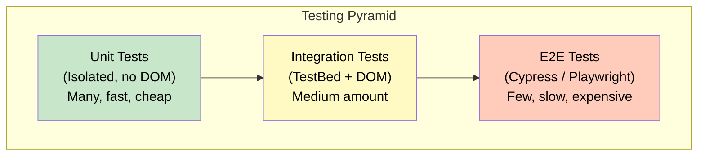

# 1. Testing Strategy

## Table of Contents

- [1.1 Testing Pyramid for Angular](#11-testing-pyramid-for-angular)
- [1.2 Unit Testing Services](#12-unit-testing-services)
- [1.3 Component Testing](#13-component-testing)
- [1.4 Testing with Signals](#14-testing-with-signals)
- [1.5 Testing NgRx](#15-testing-ngrx)

---


## 1.1 Testing Pyramid for Angular



## 1.2 Unit Testing Services

```typescript
describe('UserService', () => {
  let service: UserService;
  let httpMock: HttpTestingController;

  beforeEach(() => {
    TestBed.configureTestingModule({
      imports: [HttpClientTestingModule],
      providers: [
        UserService,
        { provide: API_BASE_URL, useValue: 'http://test-api' },
      ],
    });
    service = TestBed.inject(UserService);
    httpMock = TestBed.inject(HttpTestingController);
  });

  afterEach(() => {
    httpMock.verify();  // Ensure no outstanding requests
  });

  it('should fetch users', () => {
    const mockUsers: User[] = [
      { id: '1', name: 'Alice', email: 'alice@test.com' },
      { id: '2', name: 'Bob', email: 'bob@test.com' },
    ];

    service.getAll().subscribe(users => {
      expect(users.length).toBe(2);
      expect(users[0].name).toBe('Alice');
    });

    const req = httpMock.expectOne('http://test-api/users');
    expect(req.request.method).toBe('GET');
    req.flush(mockUsers);
  });

  it('should handle errors', () => {
    service.getById('999').subscribe({
      error: (error) => {
        expect(error.status).toBe(404);
      },
    });

    const req = httpMock.expectOne('http://test-api/users/999');
    req.flush('Not Found', { status: 404, statusText: 'Not Found' });
  });
});
```

## 1.3 Component Testing

```typescript
describe('UserListComponent', () => {
  let component: UserListComponent;
  let fixture: ComponentFixture<UserListComponent>;
  let userServiceSpy: jasmine.SpyObj<UserService>;

  beforeEach(async () => {
    userServiceSpy = jasmine.createSpyObj('UserService', ['getAll']);

    await TestBed.configureTestingModule({
      imports: [UserListComponent],  // Standalone component
      providers: [
        { provide: UserService, useValue: userServiceSpy },
      ],
    }).compileComponents();

    fixture = TestBed.createComponent(UserListComponent);
    component = fixture.componentInstance;
  });

  it('should display users when loaded', () => {
    const mockUsers: User[] = [
      { id: '1', name: 'Alice', email: 'alice@test.com' },
    ];
    userServiceSpy.getAll.and.returnValue(of(mockUsers));

    fixture.detectChanges();  // Triggers ngOnInit

    const userCards = fixture.debugElement.queryAll(By.css('.user-card'));
    expect(userCards.length).toBe(1);
    expect(userCards[0].nativeElement.textContent).toContain('Alice');
  });

  it('should show loading spinner initially', () => {
    userServiceSpy.getAll.and.returnValue(new Subject());  // Never emits

    fixture.detectChanges();

    const spinner = fixture.debugElement.query(By.css('app-spinner'));
    expect(spinner).toBeTruthy();
  });

  it('should show error message on failure', () => {
    userServiceSpy.getAll.and.returnValue(throwError(() => new Error('Network error')));

    fixture.detectChanges();

    const error = fixture.debugElement.query(By.css('.error-message'));
    expect(error.nativeElement.textContent).toContain('Network error');
  });
});
```

## 1.4 Testing with Signals

```typescript
describe('CounterComponent (Signals)', () => {
  it('should increment counter', () => {
    const fixture = TestBed.createComponent(CounterComponent);
    const component = fixture.componentInstance;

    expect(component.count()).toBe(0);

    component.increment();
    expect(component.count()).toBe(1);

    fixture.detectChanges();
    const display = fixture.nativeElement.querySelector('.count');
    expect(display.textContent).toBe('1');
  });
});
```

## 1.5 Testing NgRx

```typescript
describe('UsersEffects', () => {
  let effects: UsersEffects;
  let actions$: Observable<Action>;
  let httpMock: HttpTestingController;

  beforeEach(() => {
    TestBed.configureTestingModule({
      imports: [HttpClientTestingModule],
      providers: [
        UsersEffects,
        provideMockActions(() => actions$),
      ],
    });

    effects = TestBed.inject(UsersEffects);
    httpMock = TestBed.inject(HttpTestingController);
  });

  it('should load users successfully', (done) => {
    const mockUsers: User[] = [{ id: '1', name: 'Alice', email: 'alice@test.com' }];
    actions$ = of(UsersActions.loadUsers());

    effects.loadUsers$.subscribe(action => {
      expect(action).toEqual(UsersActions.loadUsersSuccess({ users: mockUsers }));
      done();
    });

    const req = httpMock.expectOne('/api/users');
    req.flush(mockUsers);
  });
});

// Testing selectors (pure functions — no TestBed needed)
describe('User Selectors', () => {
  it('should select all users', () => {
    const state: UsersState = {
      users: [{ id: '1', name: 'Alice', email: 'alice@test.com' }],
      selectedUserId: null,
      loading: false,
      error: null,
    };

    const result = selectAllUsers.projector(state);
    expect(result.length).toBe(1);
  });
});

// Testing reducers (pure functions)
describe('Users Reducer', () => {
  it('should set loading on loadUsers', () => {
    const newState = usersReducer(initialState, UsersActions.loadUsers());
    expect(newState.loading).toBe(true);
    expect(newState.error).toBeNull();
  });
});
```
