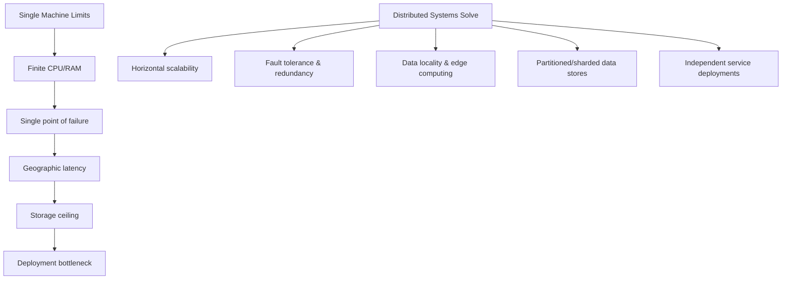

## Introduction

### Table of Contents

- [Why Distributed Systems?](#why-distributed-systems)
- [The Eight Fallacies of Distributed Computing (Peter Deutsch)](#the-eight-fallacies-of-distributed-computing-peter-deutsch)

A **distributed system** is a collection of independent computers that appears to its users as a single coherent system. These systems are essential because no single machine can handle the scale, reliability, or geographic reach that modern applications demand.

### Why Distributed Systems?

### The Eight Fallacies of Distributed Computing (Peter Deutsch)

Every engineer entering the distributed systems space must internalize these false assumptions:

| # | Fallacy | Reality |
|---|---------|---------|
| 1 | The network is reliable | Packets drop, cables get cut, switches fail |
| 2 | Latency is zero | Cross-region calls can take 50–300ms |
| 3 | Bandwidth is infinite | Video, telemetry, and replication saturate links |
| 4 | The network is secure | Every hop is an attack surface |
| 5 | Topology doesn't change | Autoscaling, failovers, and migrations change it constantly |
| 6 | There is one administrator | Multiple teams, cloud providers, and third-party APIs |
| 7 | Transport cost is zero | Serialization, encryption, and egress fees add up |
| 8 | The network is homogeneous | Mixed protocols, hardware generations, and OS versions |

> **Key takeaway:** Distributed systems introduce *partial failure* — some components can fail while others continue operating, and the system must handle this gracefully.

---

