## Part I: Fundamental Theorems & Trade-offs

### Table of Contents

- [CAP Theorem](#cap-theorem)
  - [Origin & Statement](#origin-and-statement)
  - [Defining Each Property](#defining-each-property)
  - [Why "Pick 2" Is Misleading](#why-pick-2-is-misleading)
  - [Real-World System Classifications](#real-world-system-classifications)
  - [Detailed Example: CP System Behavior](#detailed-example-cp-system-behavior)
  - [Detailed Example: AP System Behavior](#detailed-example-ap-system-behavior)
  - [Common Misconceptions](#common-misconceptions)
- [PACELC Theorem](#pacelc-theorem)
  - [Motivation](#motivation)
  - [Statement (Daniel Abadi, 2010)](#statement-daniel-abadi-2010)
  - [The Else (E) Clause — Why It Matters](#the-else-e-clause-why-it-matters)
  - [Real-World PACELC Classifications](#real-world-pacelc-classifications)
  - [Why PACELC Is More Useful Than CAP for System Design](#why-pacelc-is-more-useful-than-cap-for-system-design)
- [Consistency Models](#consistency-models)
  - [Spectrum of Consistency Models](#spectrum-of-consistency-models)
  - [1. Strong Consistency (Linearizability)](#1-strong-consistency-linearizability)
  - [2. Eventual Consistency](#2-eventual-consistency)
  - [3. Read-Your-Writes (Session Consistency)](#3-read-your-writes-session-consistency)
  - [4. Causal Consistency](#4-causal-consistency)
  - [Consistency Models Comparison Summary](#consistency-models-comparison-summary)


---

### CAP Theorem

#### Origin & Statement

Proposed by **Eric Brewer** in 2000 (proven by Gilbert and Lynch in 2002), the CAP theorem states:

> **A distributed data store can provide at most two of the following three guarantees simultaneously:**

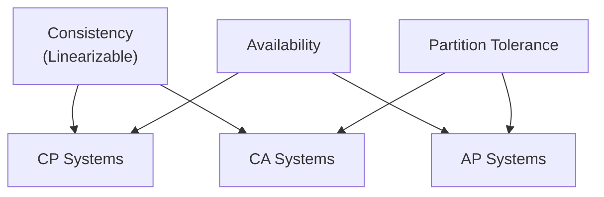

#### Defining Each Property

**Consistency (C) — Linearizability**
Every read receives the most recent write or an error. All nodes see the same data at the same time.
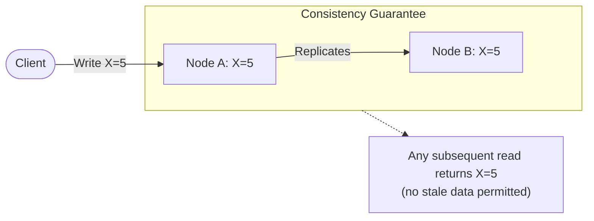

**Availability (A)**
Every request (read or write) receives a non-error response, without the guarantee that it contains the most recent write. No request is ever rejected (as long as a non-failing node receives it).
Client sends request to Node B
─────────────────────────────────────────────
  Node B MUST respond, even if it hasn't 
  received the latest update from Node A.
  Response may be stale, but it IS a response.

**Partition Tolerance (P)**
The system continues to operate despite an arbitrary number of messages being dropped or delayed between nodes.

```
  Node A ◄──── ✕ NETWORK PARTITION ✕ ────► Node B
  
  Both nodes are alive but cannot communicate.
  The system must still function in some capacity.
```

#### Why "Pick 2" Is Misleading

In any real-world distributed system, **network partitions WILL happen** (cables fail, switches die, cloud availability zones lose connectivity). Therefore, the practical choice is:

> **When a partition occurs, do you sacrifice Consistency or Availability?**

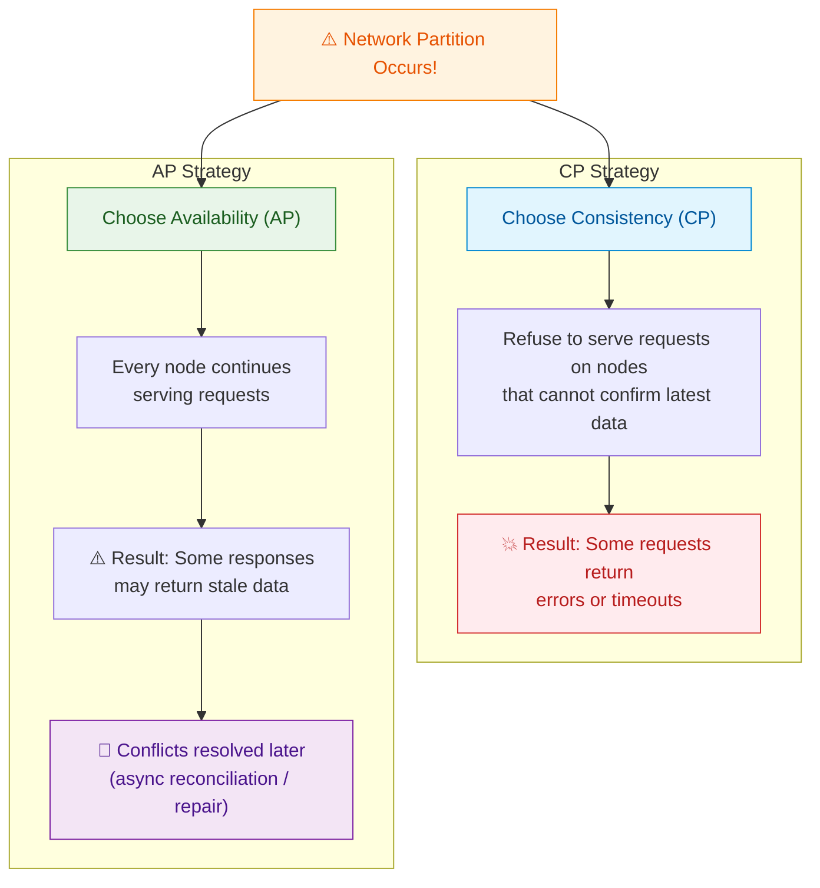

#### Real-World System Classifications

| Category | System | Trade-off Behavior |
|----------|--------|--------------------|
| **CP** | HBase, MongoDB (default), Zookeeper, etcd, Consul, Google Spanner | During partition: rejects writes/reads on minority partition to preserve consistency |
| **AP** | Cassandra, DynamoDB, CouchDB, Riak, Eureka | During partition: all nodes continue serving; may return stale data; conflicts resolved via vector clocks, LWW, or CRDTs |
| **CA** | Traditional RDBMS (single-node PostgreSQL, MySQL) | Not truly distributed — no partition tolerance because there's only one node or a tightly coupled cluster |

#### Detailed Example: CP System Behavior

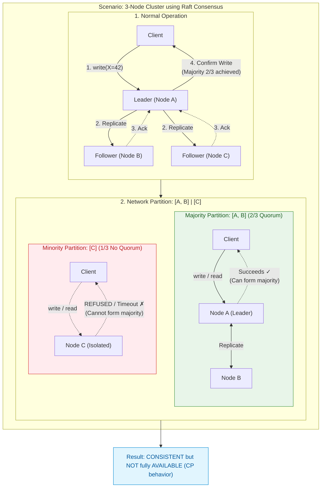

#### Detailed Example: AP System Behavior

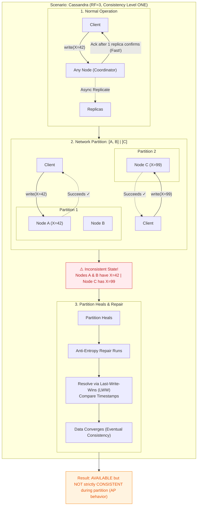

#### Common Misconceptions

```
 ✗ WRONG: "CAP means you always pick exactly two and never get the third"
 ✓ RIGHT: During NORMAL operation, you can have all three. The trade-off
           only manifests DURING a partition.

 ✗ WRONG: "Consistency in CAP means ACID consistency"
 ✓ RIGHT: CAP Consistency specifically means LINEARIZABILITY — 
           every read sees the latest write. ACID consistency is about
           database invariants/constraints.

 ✗ WRONG: "AP systems have no consistency at all"
 ✓ RIGHT: AP systems typically provide EVENTUAL consistency. Data
           converges over time. Many also offer tunable consistency.
```

---

### PACELC Theorem

#### Motivation

CAP only addresses what happens **during** a partition. But partitions are rare events. What about the **99.9% of the time** when the network is functioning normally? That's where PACELC comes in.

#### Statement (Daniel Abadi, 2010)

> **If there is a Partition (P), how does the system trade off between Availability (A) and Consistency (C); Else (E), when operating normally, how does it trade off between Latency (L) and Consistency (C)?**

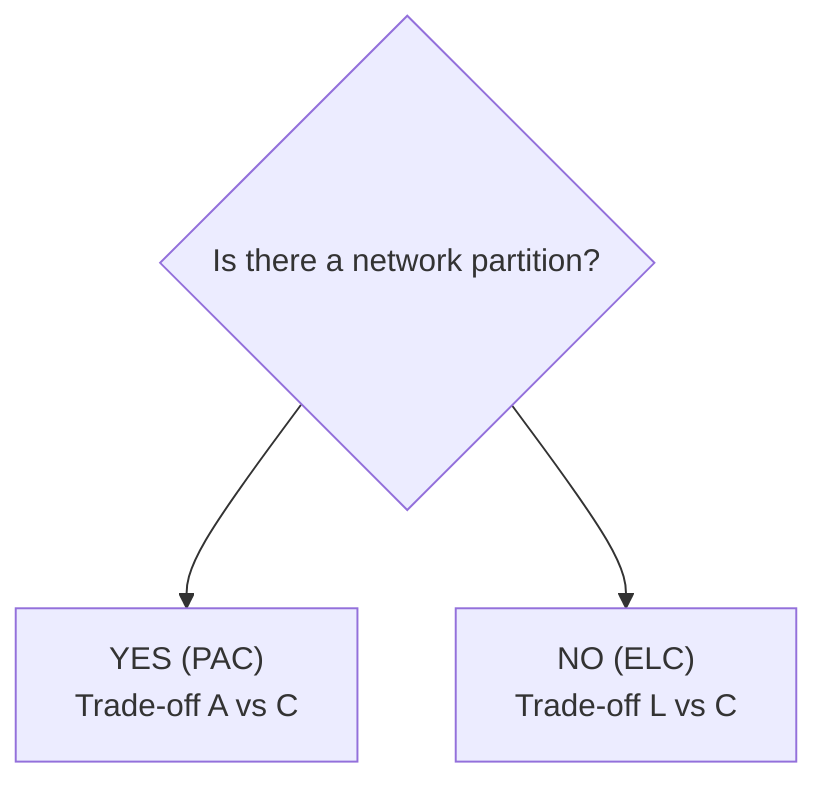

#### The Else (E) Clause — Why It Matters

Even without partitions, replicating data across nodes takes time. A system must choose:

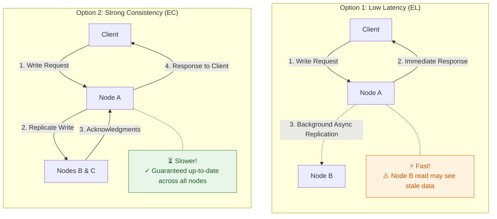

#### Real-World PACELC Classifications

| System | PAC Choice | ELC Choice | Full Classification | Explanation |
|--------|-----------|-----------|--------------------|----|
| **DynamoDB / Cassandra** | PA | EL | PA/EL | During partition: stay available. Normally: prioritize low latency over strict consistency |
| **MongoDB (default)** | PC | EC | PC/EC | During partition: sacrifice availability. Normally: wait for replication to ensure consistency |
| **Google Spanner** | PC | EC | PC/EC | Uses TrueTime + synchronized clocks for global consistency. Accepts higher latency |
| **Cosmos DB** | PA or PC (tunable) | EL or EC (tunable) | Tunable | Offers five consistency levels; the developer chooses the trade-off per request |
| **PNUTS (Yahoo)** | PC | EL | PC/EL | During partition: prefers consistency. Normally: optimizes for latency via async replication with per-record timeline consistency |

#### Why PACELC Is More Useful Than CAP for System Design

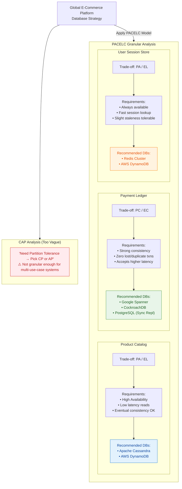

---

### Consistency Models

Consistency models define the **contract** between a distributed data store and its clients regarding the order and visibility of operations.

#### Spectrum of Consistency Models

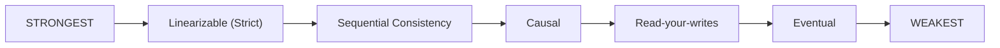

#### 1. Strong Consistency (Linearizability)

> **Once a write completes, ALL subsequent reads (from any node) return that written value or a more recent one.**

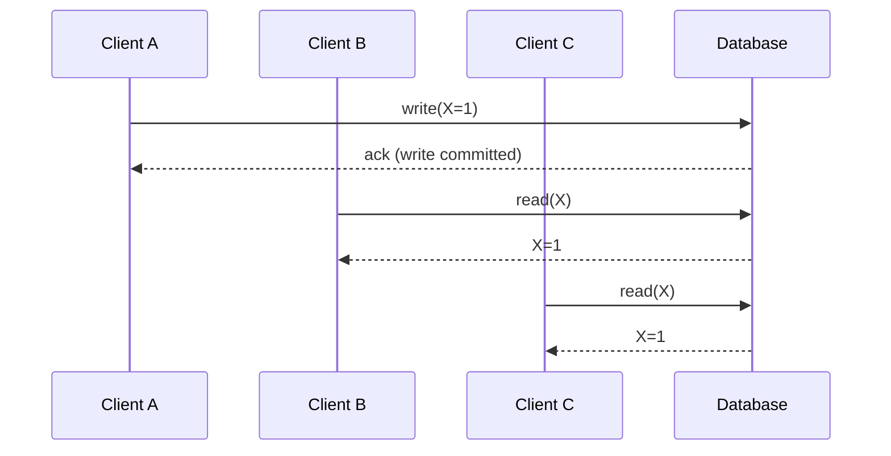

**Implementation Mechanisms:**
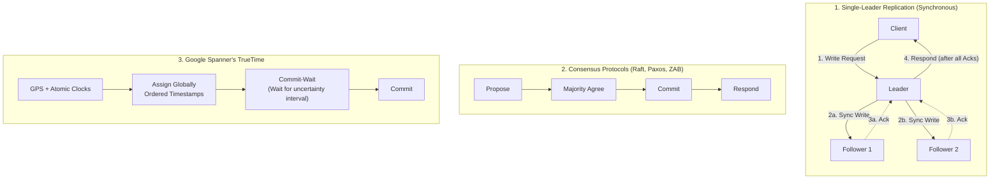

**Trade-offs:**
```
  ✓ Simplest mental model for developers
  ✓ No stale reads, no anomalies
  ✗ Highest latency (must coordinate across nodes)
  ✗ Lowest availability (unavailable during partitions in CP systems)
  ✗ Lower throughput (serialized operations)
```

**Use cases:** Financial transactions, inventory management, distributed locks, leader election.

---

#### 2. Eventual Consistency

> **If no new writes are made, all replicas will EVENTUALLY converge to the same value. There is no bound on how long "eventually" takes.**

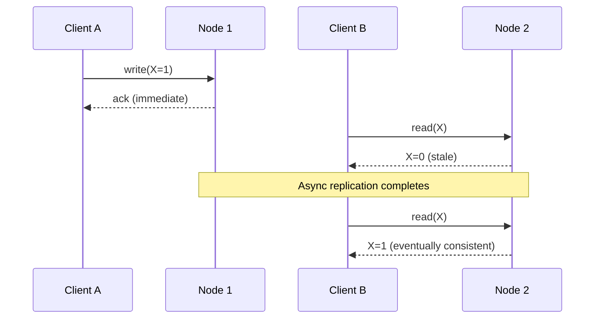

**How Convergence Happens:**
```
1. Anti-entropy (background repair)
   Nodes periodically compare Merkle trees of their data
   Differences are synchronized
   
2. Read repair
   When a read detects stale data, trigger background update
   Coordinator reads from multiple replicas, returns freshest,
   sends update to stale replicas

3. Hinted handoff
   If target node is down, another node stores a "hint"
   When target recovers, hints are forwarded

4. Conflict resolution
   Last-Write-Wins (LWW): Timestamp-based, simple but can lose data
   Vector Clocks: Detect concurrent writes, surface conflicts
   CRDTs: Data structures that mathematically guarantee convergence
```

**Conflict Resolution Deep Dive:**
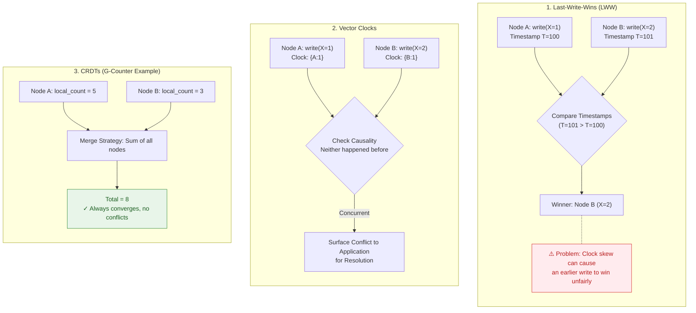

**Trade-offs:**
```
  ✓ Highest availability (always accept writes)
  ✓ Lowest latency (no coordination needed)
  ✓ Best throughput
  ✗ Stale reads possible (inconsistency window)
  ✗ Conflict resolution complexity
  ✗ Hard to reason about application correctness
```

**Use cases:** Social media feeds, DNS, product reviews, shopping cart (Amazon's original Dynamo paper).

---

#### 3. Read-Your-Writes (Session Consistency)

> **A client will always see its own writes. Other clients may see stale data.**

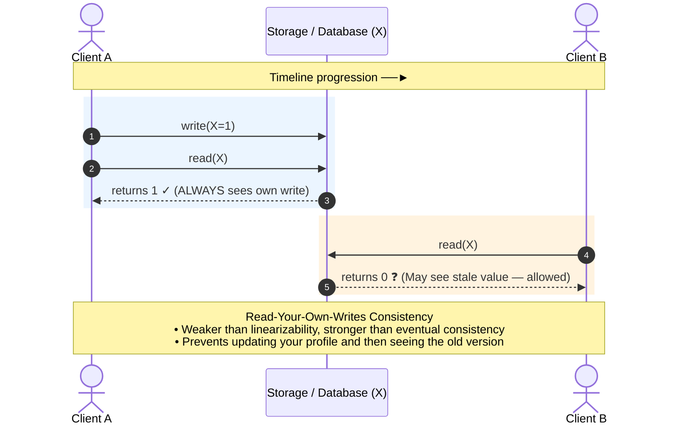

**Implementation Strategies:**
```
Strategy 1: Sticky Sessions (Session Affinity)
  Load balancer routes all requests from same client to same node
  Since the node has the write, reads will see it
  Problem: If that node dies, session is lost
  
Strategy 2: Read from leader/writer
  Client reads from the same node that handled its write
  Other reads can go to any replica
  
Strategy 3: Logical timestamps
  After a write, client receives a token/timestamp
  On subsequent reads, client sends the token
  Server only responds if its data is at least as fresh as the token
  
  Client ──write──► Server returns version=42
  Client ──read(min_version=42)──► Server
    If server version >= 42 → respond
    If server version < 42  → wait or redirect to fresher replica
```

**Use cases:** User profile updates, email (sent mail appears in Sent folder immediately), any UI where user expects to see their own changes.

---

#### 4. Causal Consistency

> **Operations that are causally related are seen by all nodes in the same order. Concurrent (unrelated) operations may be seen in different orders.**

```
Causal Relationship:
  If operation A could have INFLUENCED operation B,
  then A "happened before" B, and all nodes must see A before B.

Example — Social media comments:

  User A posts:    "What's your favorite language?"     (op1)
  User B replies:  "I love Rust!"                       (op2, caused by op1)
  User C replies:  "Python for me!"                     (op3, caused by op1)

  Causal ordering requires:
    op1 BEFORE op2  ✓ (op2 is a reply to op1)
    op1 BEFORE op3  ✓ (op3 is a reply to op1)
    op2 and op3 are CONCURRENT (no causal relationship)
    → Some nodes may show op2 before op3, others op3 before op2. Both valid!
    
  INVALID ordering:
    Showing op2 without op1 ✗ (reply before the original post makes no sense)
```

**Implementation — Lamport Clocks & Vector Clocks:**
```
Lamport Clocks (logical timestamps):
  Each node maintains a counter
  On local event: counter++
  On send: attach counter to message
  On receive: counter = max(local, received) + 1
  
  Gives total order but CANNOT determine concurrency

Vector Clocks:
  Each node maintains a vector of counters [A:0, B:0, C:0]
  
  Node A writes: [A:1, B:0, C:0]
  Node B reads A's write, then writes: [A:1, B:1, C:0]
    → B's write is causally AFTER A's write
    
  Node C writes independently: [A:0, B:0, C:1]
    → C's write is CONCURRENT with both A and B
    
  Comparison rules:
    V1 < V2  if all V1[i] ≤ V2[i] and at least one V1[i] < V2[i]
    V1 ∥ V2  if neither V1 < V2 nor V2 < V1 (concurrent)
```

**Trade-offs:**
```
  ✓ Preserves intuitive ordering of related events
  ✓ Better availability than linearizability (concurrent ops are flexible)
  ✓ Matches human expectations in many applications
  ✗ More metadata overhead (vector clocks grow with number of nodes)
  ✗ More complex implementation than eventual consistency
  ✗ Still allows some reordering (concurrent operations)
```

**Use cases:** Collaborative editing, social media, distributed version control (Git), chat applications.

---

#### Consistency Models Comparison Summary

| Model | Guarantee | Latency | Availability | Complexity | Example System |
|-------|-----------|---------|--------------|------------|---------------|
| **Linearizable** | All ops appear in single global order | Highest | Lowest | Simplest mental model | Spanner, etcd, Zookeeper |
| **Sequential** | All nodes see same order (but not real-time) | High | Low | Moderate | ZooKeeper (per-client) |
| **Causal** | Causally related ops ordered; concurrent ops flexible | Moderate | Moderate | High implementation | MongoDB (causal sessions), COPS |
| **Read-your-writes** | Client sees own writes | Low-Moderate | High | Moderate | DynamoDB (with session tokens) |
| **Eventual** | All replicas converge eventually | Lowest | Highest | Complex (conflict resolution) | Cassandra, DNS, S3 |

---

