## Part II: Scalability & Reliability Patterns

### Table of Contents

- [Load Balancing](#load-balancing)
  - [Load Balancing Algorithms](#load-balancing-algorithms)
  - [Layer 4 (L4) vs. Layer 7 (L7) Load Balancing](#layer-4-l4-vs-layer-7-l7-load-balancing)
  - [Advanced: Global Server Load Balancing (GSLB)](#advanced-global-server-load-balancing-gslb)
- [Caching Strategies](#caching-strategies)
  - [Caching Patterns](#caching-patterns)
  - [Eviction Policies](#eviction-policies)
  - [Distributed Caching](#distributed-caching)
  - [**Redis Cluster Architecture**](#redis-cluster-architecture)
    - [🏗️ Overview](#overview)
    - [🗺️ Hash Slot Distribution](#hash-slot-distribution)
    - [🔑 Key Assignment Formula](#key-assignment-formula)
    - [📝 Routing Example — Writing `"user:123"`](#routing-example-writing-user123)
    - [💥 Failover Scenario — Master B Goes Down](#failover-scenario-master-b-goes-down)
      - [Before Failure](#before-failure)
      - [After Failure](#after-failure)
      - [Failover Steps](#failover-steps)
    - [🔄 Failover Phase Summary](#failover-phase-summary)
    - [🧠 Summary](#summary)
  - [Cache Stampede Prevention](#cache-stampede-prevention)
  - [**Cache Stampede (Thundering Herd)**](#cache-stampede-thundering-herd)
    - [⚠️ The Problem](#the-problem)
    - [✅ Solutions](#solutions)
      - [Solution 1 — Locking (Mutex)](#solution-1-locking-mutex)
      - [Solution 2 — Probabilistic Early Expiration](#solution-2-probabilistic-early-expiration)
      - [Probability Formula](#probability-formula)
      - [Solution 3 — Background Refresh](#solution-3-background-refresh)
    - [📊 Solutions Comparison](#solutions-comparison)
    - [🧠 Summary](#summary)
- [Asynchronous Processing & Messaging](#asynchronous-processing-and-messaging)
  - [Message Queues vs. Event Streams](#message-queues-vs-event-streams)
  - [**Message Queue vs Event Stream**](#message-queue-vs-event-stream)
  - [📬 Message Queue (Point-to-Point)](#message-queue-point-to-point)
    - [How It Works](#how-it-works)
    - [Lifecycle of a Message](#lifecycle-of-a-message)
  - [📰 Event Stream (Pub-Sub Log)](#event-stream-pub-sub-log)
    - [How It Works](#how-it-works)
    - [Consumer Offset Visualization](#consumer-offset-visualization)
  - [🔄 Side-by-Side Comparison](#side-by-side-comparison)
  - [🧠 Summary](#summary)
  - [**Kafka vs RabbitMQ Architecture**](#kafka-vs-rabbitmq-architecture)
  - [**Apache Kafka**](#apache-kafka)
    - [📰 Overview](#overview)
    - [🗂️ Topic & Partition Structure](#topic-and-partition-structure)
    - [🔑 Partition Key Assignment](#partition-key-assignment)
    - [👥 Consumer Groups](#consumer-groups)
    - [📦 Partition Replication Across Brokers](#partition-replication-across-brokers)
    - [📈 Scaling Out](#scaling-out)
    - [🧠 Kafka Summary](#kafka-summary)
  - [**RabbitMQ**](#rabbitmq)
    - [📬 Overview](#overview)
    - [🏗️ Core Architecture](#core-architecture)
    - [📡 Exchange Types](#exchange-types)
      - [Exchange Types Summary](#exchange-types-summary)
      - [Wildcard Reference (Topic Exchange)](#wildcard-reference-topic-exchange)
    - [🧠 RabbitMQ Summary](#rabbitmq-summary)
  - [**Kafka vs RabbitMQ Comparison**](#kafka-vs-rabbitmq-comparison)
    - [🔄 Side-by-Side](#side-by-side)
    - [🧠 Combined Summary](#combined-summary)
  - [Idempotency](#idempotency)
  - [Dead Letter Queues (DLQ)](#dead-letter-queues-dlq)
  - [**Dead Letter Queue (DLQ)**](#dead-letter-queue-dlq)
    - [📬 Overview](#overview)
    - [✅ Normal Flow](#normal-flow)
    - [❌ Failure Flow](#failure-flow)
      - [Detailed Failure Sequence](#detailed-failure-sequence)
    - [🔄 Retry Strategy — Exponential Backoff](#retry-strategy-exponential-backoff)
    - [🛠️ Operations Response Workflow](#operations-response-workflow)
      - [Operations Steps Summary](#operations-steps-summary)
    - [☠️ Common Reasons Messages End Up in DLQ](#common-reasons-messages-end-up-in-dlq)
    - [🏗️ Full Architecture — Where DLQ Fits](#full-architecture-where-dlq-fits)
    - [🧠 Summary](#summary)
  - [Exactly-Once Processing Guarantees](#exactly-once-processing-guarantees)
  - [**Kafka Exactly-Once Semantics (EOS)**](#kafka-exactly-once-semantics-eos)
    - [📰 Overview](#overview)
    - [1️⃣ Idempotent Producer (Prevents Duplicate Sends)](#1-idempotent-producer-prevents-duplicate-sends)
      - [How It Works](#how-it-works)
      - [Broker Tracking Table](#broker-tracking-table)
    - [2️⃣ Transactional Producer (Atomic Writes Across Partitions)](#2-transactional-producer-atomic-writes-across-partitions)
      - [How It Works](#how-it-works)
      - [Commit vs Abort](#commit-vs-abort)
    - [3️⃣ Consumer + Producer Transaction (Read-Process-Write)](#3-consumer-producer-transaction-read-process-write)
      - [Normal Flow (No Crash)](#normal-flow-no-crash)
      - [Crash Recovery Flow](#crash-recovery-flow)
      - [The Atomic Bundle](#the-atomic-bundle)
    - [🏗️ How All Three Mechanisms Work Together](#how-all-three-mechanisms-work-together)
    - [🧠 Summary](#summary)
- [Resilience Patterns](#resilience-patterns)
  - [**Circuit Breaker Pattern**](#circuit-breaker-pattern)
    - [⚡ Overview](#overview)
    - [🔄 State Machine](#state-machine)
    - [📊 State Details](#state-details)
    - [🎬 Scenario Walkthrough](#scenario-walkthrough)
    - [🔁 Half-Open Failure Path](#half-open-failure-path)
    - [📈 Timeline Visualization](#timeline-visualization)
    - [⚙️ Configuration Parameters](#configuration-parameters)
    - [🛡️ What Happens When Circuit Is OPEN](#what-happens-when-circuit-is-open)
    - [🧠 Summary](#summary)
  - [**Bulkhead Pattern**](#bulkhead-pattern)
    - [🚢 Overview](#overview)
    - [❌ WITHOUT Bulkhead — Shared Thread Pool](#without-bulkhead-shared-thread-pool)
      - [Failure Cascade Sequence](#failure-cascade-sequence)
    - [✅ WITH Bulkhead — Isolated Thread Pools](#with-bulkhead-isolated-thread-pools)
      - [Contained Failure Sequence](#contained-failure-sequence)
    - [🔄 Side-by-Side Comparison](#side-by-side-comparison)
    - [🏗️ Bulkhead Implementation Types](#bulkhead-implementation-types)
    - [⚡ Bulkhead + Circuit Breaker (Combined)](#bulkhead-circuit-breaker-combined)
    - [🧠 Summary](#summary)
  - [3. Rate Limiting / Throttling](#3-rate-limiting-throttling)
  - [4. Retry with Exponential Backoff and Jitter](#4-retry-with-exponential-backoff-and-jitter)
  - [⚠️ The Problem — Retry Storms](#the-problem-retry-storms)
    - [📈 Solution 1 — Exponential Backoff](#solution-1-exponential-backoff)
      - [Delay Growth](#delay-growth)
    - [⚠️ The Problem with Pure Exponential Backoff](#the-problem-with-pure-exponential-backoff)
    - [🎲 Solution 2 — Add Jitter (Randomization)](#solution-2-add-jitter-randomization)
      - [Three Jitter Strategies](#three-jitter-strategies)
      - [Jitter Comparison for Attempt 3 (base=1s)](#jitter-comparison-for-attempt-3-base1s)
    - [📊 Visualization — 3 Clients Retrying](#visualization-3-clients-retrying)
      - [❌ Pure Exponential (Synchronized)](#pure-exponential-synchronized)
      - [✅ Exponential + Full Jitter (Desynchronized)](#exponential-full-jitter-desynchronized)
      - [Side-by-Side Comparison](#side-by-side-comparison)
    - [🔄 Complete Retry Flow](#complete-retry-flow)
      - [Full Sequence with Jitter](#full-sequence-with-jitter)
    - [📋 Strategy Recommendation](#strategy-recommendation)
    - [🧠 Summary](#summary)
  - [Resilience Patterns Combined — The Full Picture](#resilience-patterns-combined-the-full-picture)


---

### Load Balancing

A **load balancer** distributes incoming traffic across multiple backend servers (targets) to ensure no single server is overwhelmed, improving responsiveness and availability.

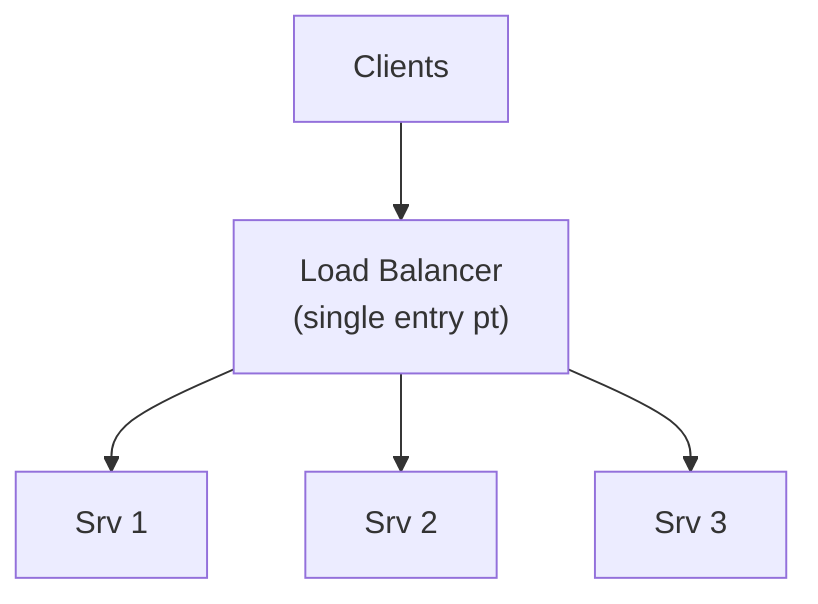

#### Load Balancing Algorithms

**1. Round Robin**

***1.1 Incoming Requests & Distribution***
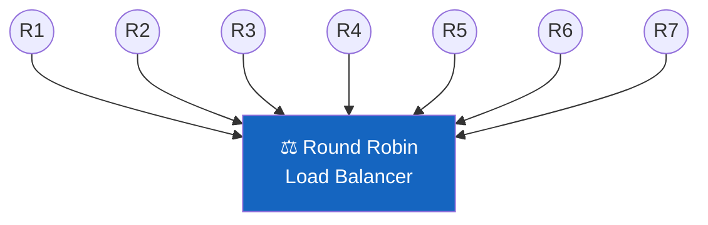

---

***1.2 Round Robin Routing***
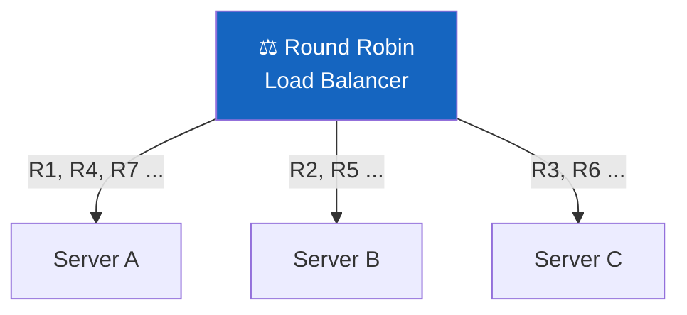

---

***1.3 Pros***
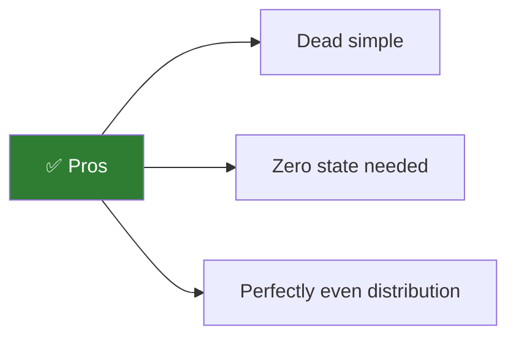

---

***1.4 Cons***
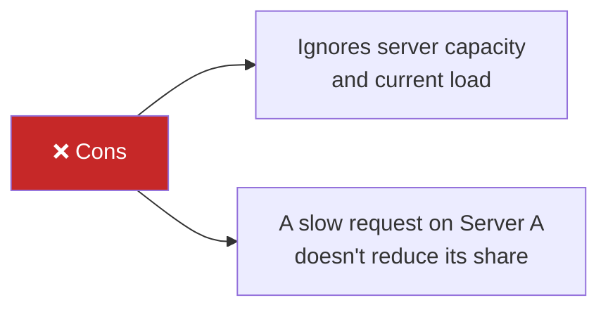

---

***1.5 Weighted Round Robin Variant***
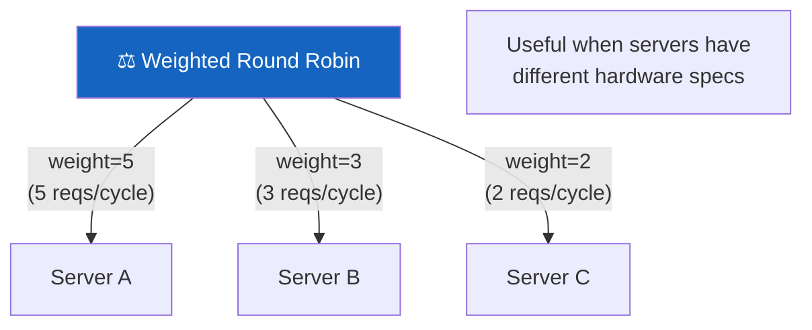

---

**2. Least Connections**

***2.1 Current State***
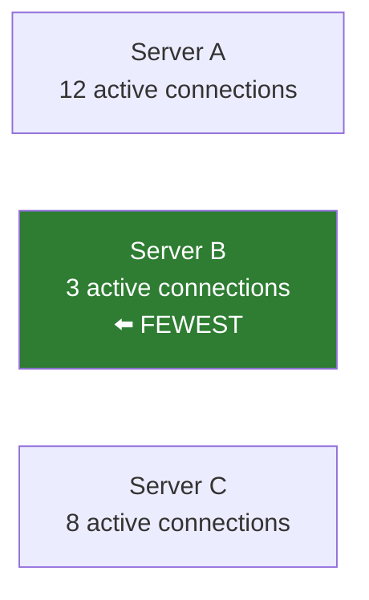

---

***2.2 Routing Decision***
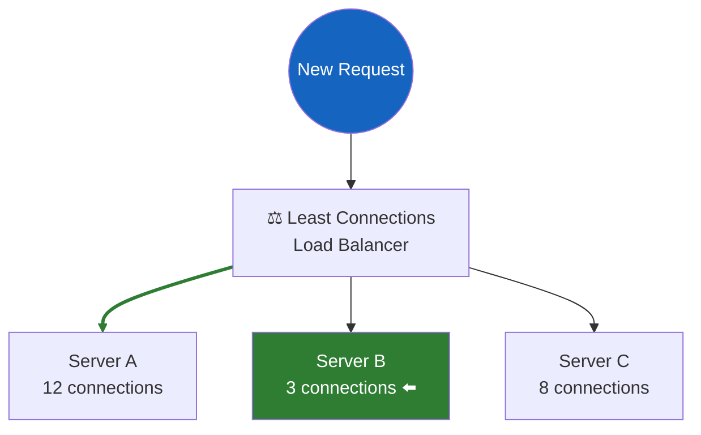

---

***2.3 After Routing***
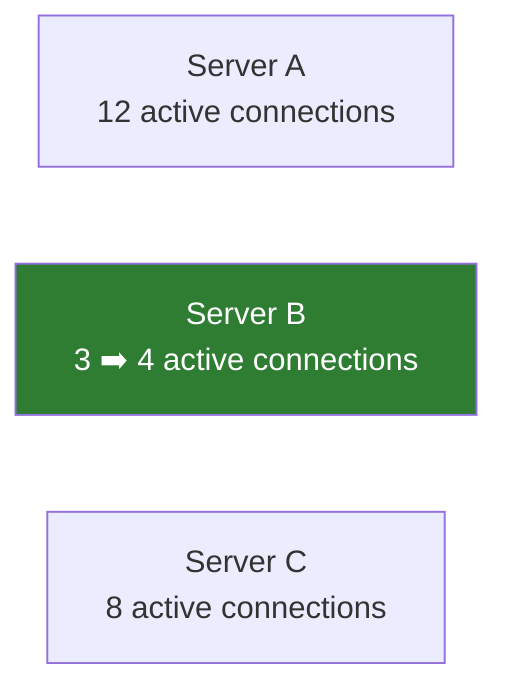

---

***2.4 Pros***
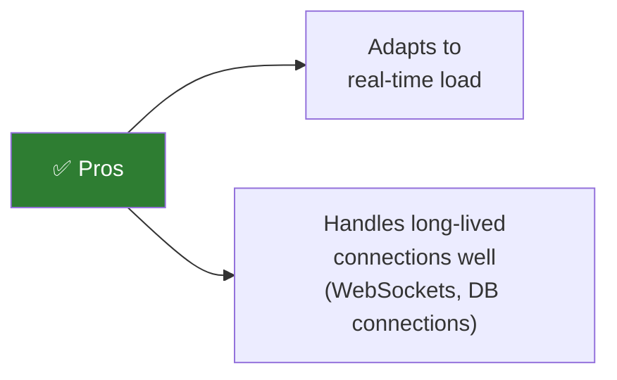

---

***2.5 Cons***
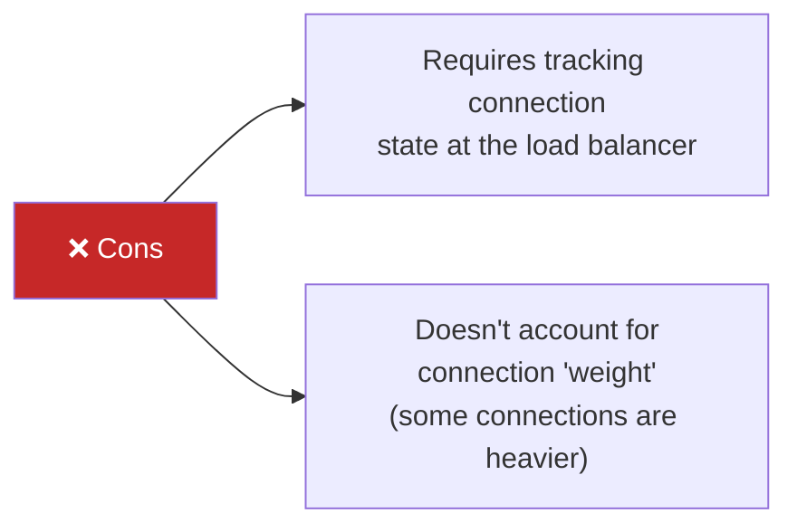

---

***2.6 Weighted Least Connections Variant***
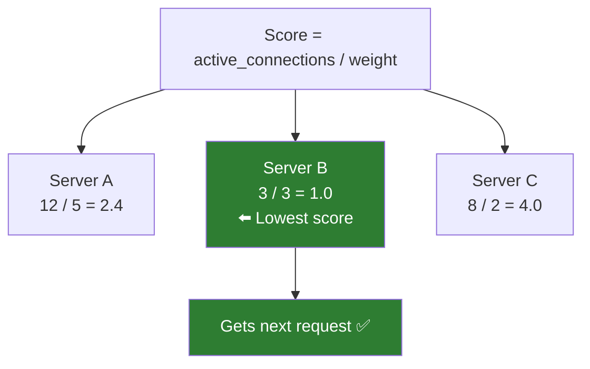

---

**3. Consistent Hashing**


***3.1 · Traditional Hashing Problem***

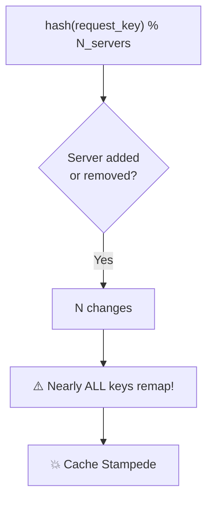

***3.2 · Consistent Hashing — Hash Ring***

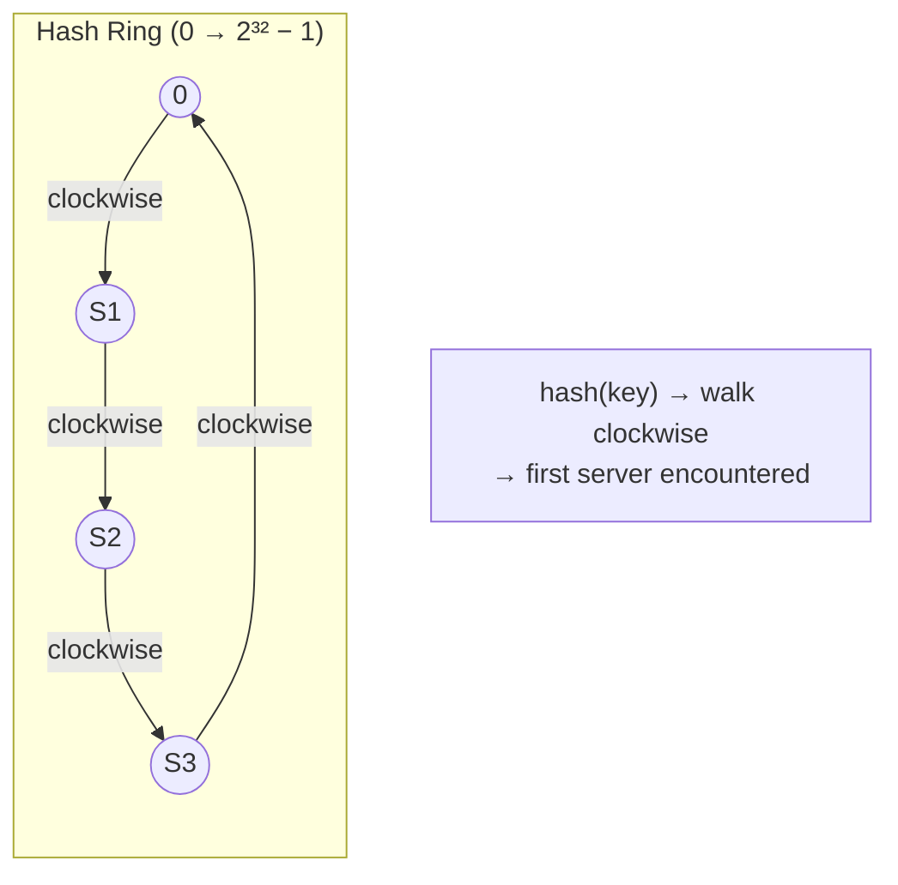

***3.3 · Adding Server S4***

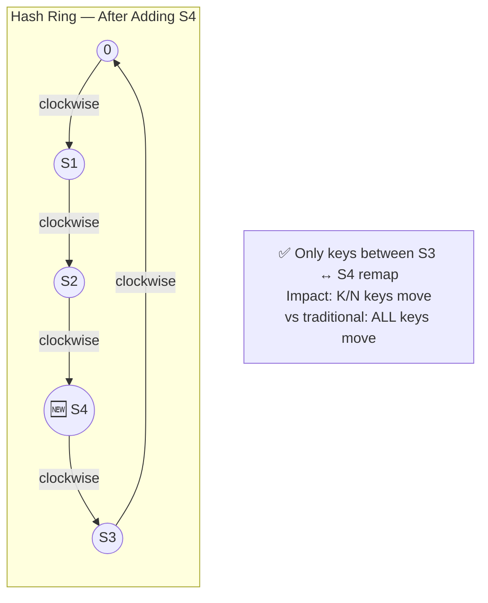

***3.4 · Virtual Nodes (vnodes)***

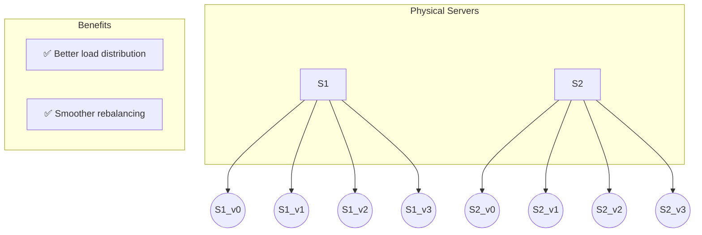

---

```python
# Simplified consistent hashing implementation
import hashlib
import bisect

class ConsistentHash:
    def __init__(self, nodes=None, virtual_nodes=150):
        self.virtual_nodes = virtual_nodes
        self.ring = {}        # hash_value → node
        self.sorted_keys = [] # sorted list of hash values on the ring
        if nodes:
            for node in nodes:
                self.add_node(node)
    
    def _hash(self, key):
        return int(hashlib.md5(key.encode()).hexdigest(), 16)
    
    def add_node(self, node):
        for i in range(self.virtual_nodes):
            virtual_key = f"{node}:vnode{i}"
            hash_val = self._hash(virtual_key)
            self.ring[hash_val] = node
            bisect.insort(self.sorted_keys, hash_val)
    
    def remove_node(self, node):
        for i in range(self.virtual_nodes):
            virtual_key = f"{node}:vnode{i}"
            hash_val = self._hash(virtual_key)
            del self.ring[hash_val]
            self.sorted_keys.remove(hash_val)
    
    def get_node(self, key):
        if not self.ring:
            return None
        hash_val = self._hash(key)
        idx = bisect.bisect_right(self.sorted_keys, hash_val)
        if idx == len(self.sorted_keys):
            idx = 0  # wrap around the ring
        return self.ring[self.sorted_keys[idx]]
```

#### Layer 4 (L4) vs. Layer 7 (L7) Load Balancing

```
OSI Model Context:
  Layer 4 = Transport Layer (TCP/UDP)
  Layer 7 = Application Layer (HTTP, gRPC, WebSocket)
```

| Aspect                    | L4 Load Balancer                              | L7 Load Balancer                                        |
| ---------------------------| -----------------------------------------------| ---------------------------------------------------------|
| **Operates on**           | IP address + TCP/UDP port                     | HTTP headers, URL path, cookies, body                   |
| **Routing decisions**     | Based on source/destination IP and port       | Based on URL path, host header, cookies, content type   |
| **Performance**           | Faster (fewer bytes to inspect)               | Slower (must parse application protocol)                |
| **SSL Termination**       | No (passes encrypted traffic through)         | Yes (decrypts, inspects, re-encrypts or forwards plain) |
| **Connection to backend** | Same TCP connection passed through (or NAT'd) | New TCP connection established to backend               |
| **Content-based routing** | Not possible                                  | `/api/*` → API servers, `/static/*` → CDN               |
| **Health checks**         | TCP port open?                                | HTTP 200 on `/health`?                                  |
| **Session persistence**   | Source IP based                               | Cookie-based (more reliable)                            |
| **Example tools**         | AWS NLB, HAProxy (TCP mode), IPVS             | AWS ALB, Nginx, HAProxy (HTTP mode), Envoy              |

---

***4.1 · L4 Load Balancing (Transport Layer)***

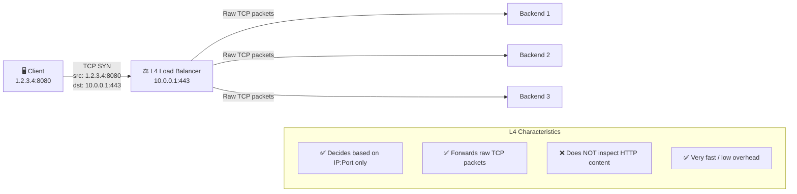

---

***4.2 · L7 Load Balancing (Application Layer)***

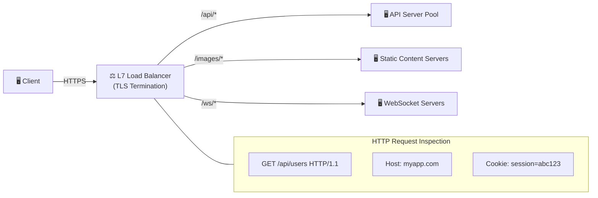

---

***4.3 · L7 Routing Rules***

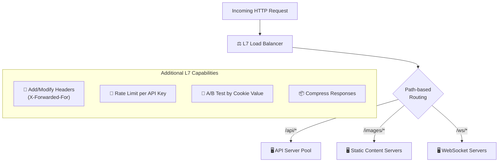

---

***4.4 · L4 vs L7 Comparison***

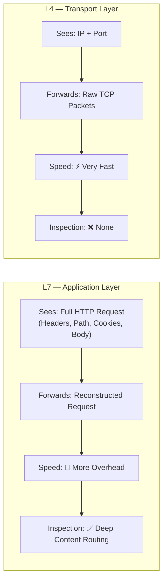

---

#### Advanced: Global Server Load Balancing (GSLB)

```mermaid
flowchart TD
    GSLB["🌐 DNS-based\nGSLB"]

    GSLB --> US["🇺🇸 US-East\nRegion"]
    GSLB --> EU["🇪🇺 EU-West\nRegion"]

    US --> USLB["⚖️ Regional LB\n(US-East)"]
    EU --> EULB["⚖️ Regional LB\n(EU-West)"]

    USLB --> US1["🖥️ Server 1"]
    USLB --> US2["🖥️ Server 2"]

    EULB --> EU1["🖥️ Server 1"]
    EULB --> EU2["🖥️ Server 2"]
```

---

### Caching Strategies

Caching stores frequently accessed data in a faster storage layer to reduce latency, database load, and cost.

```mermaid
graph LR
    subgraph Without Cache
        A[Client] -->|request| B[App Server]
        B -->|query| C[Database]
        C -->|response 50-100ms| A
    end

    subgraph With Cache
        D[Client] -->|request| E[App Server]
        E -->|check cache| F{Cache}
        F -->|HIT - 1-5ms| D
    end
```

#### Caching Patterns

**1. Cache-Aside (Lazy Loading)**

The most common pattern. The application manages the cache directly.

```mermaid
graph TD
    App[App Server] -->|"1. Read (check cache)"| Cache[(Cache)]
    Cache -->|"Cache HIT"| App
    App -->|"2. Cache MISS → Query DB"| DB[(Database)]
    DB -->|"3. Return result"| App
    App -->|"4. Populate cache with result"| Cache

    style Cache fill:#f9f,stroke:#333,stroke-width:2px,color: #000000
    style DB fill:#bbf,stroke:#333,stroke-width:2px,color: #000000
    style App fill:#bfb,stroke:#333,stroke-width:2px,color: #000000
```
Flow:
  1. App checks cache for data
  2. Cache MISS → App queries database directly
  3. App writes result into cache (for future reads)
  4. Future reads → Cache HIT → return cached data

Code Example:


```python
def get_user(user_id):
    # Step 1: Check cache
    cached = cache.get(f"user:{user_id}")
    if cached:
        return cached  # Cache HIT
    
    # Step 2: Cache MISS - query database
    user = database.query("SELECT * FROM users WHERE id = ?", user_id)
    
    # Step 3: Populate cache (with TTL)
    cache.set(f"user:{user_id}", user, ttl=300)  # 5 minutes
    
    return user

def update_user(user_id, data):
    # Update database
    database.execute("UPDATE users SET ... WHERE id = ?", user_id, data)
    
    # Invalidate cache (NOT update — avoids race conditions)
    cache.delete(f"user:{user_id}")
```

```
Pros:
  ✓ Only requested data is cached (memory efficient)
  ✓ Cache failure doesn't break the application (degrades to direct DB reads)
  ✓ Simple to implement

Cons:
  ✗ Cache miss penalty (three round trips: cache check + DB read + cache write)
  ✗ Stale data possible if DB is updated without invalidating cache
  ✗ "Cache stampede" when many requests hit the same cold key simultaneously
```

**2. Read-Through**

```mermaid
graph LR
    Client[Client] -->|request| Cache[(Cache\nManages Loading)]
    Cache -->|"Cache MISS → fetch"| DB[(Database)]
    DB -->|return data| Cache
    Cache -->|response| Client

    style Cache fill:#f9f,stroke:#333,stroke-width:2px,color: #000000
    style DB fill:#bbf,stroke:#333,stroke-width:2px,color: #000000
    style Client fill:#bfb,stroke:#333,stroke-width:2px,color: #000000
```
Flow:
  1. App requests data from cache
  2. Cache HIT → return data
  3. Cache MISS → Cache itself fetches from database
  4. Cache stores the result and returns it

Difference from Cache-Aside:
  The CACHE is responsible for loading data, not the application.
  The app only ever talks to the cache.
```
Pros:
  ✓ Application code is simpler (just reads from cache)
  ✓ Cache loading logic is centralized
Cons:
  ✗ First request is always slow (cache is cold)
  ✗ Cache library must know how to query your data source
  ✗ Data model in cache must match the data source
```

**3. Write-Through**

```mermaid
graph LR
    Client[Client] -->|"write"| Cache[(Cache\nWrites to Both)]
    Cache -->|"write-through"| DB[(Database)]
    Cache -->|"acknowledge"| Client

    style Cache fill:#f9f,stroke:#333,stroke-width:2px,color: #000000
    style DB fill:#bbf,stroke:#333,stroke-width:2px,color: #000000
    style Client fill:#bfb,stroke:#333,stroke-width:2px,color: #000000
```

```
Flow:
  1. App writes data to cache
  2. Cache synchronously writes to database
  3. Cache confirms write to app only after DB write succeeds

  Write: App → Cache → DB (synchronous, both updated atomically)
  Read:  App → Cache (always has latest data)

Pros:
  ✓ Cache is always consistent with database
  ✓ Reads are always fast and fresh
  ✓ Combined with read-through: complete caching solution
Cons:
  ✗ Write latency is HIGHER (must write to both cache and DB)
  ✗ All written data is cached, even if never read (wasted memory)
  ✗ New nodes have empty caches (solved with cache warming)
```

**4. Write-Behind (Write-Back)**

```mermaid
graph LR
    Client[Client] -->|"write"| Cache[(Cache\nBuffers Writes)]
    Cache -.->|"async batch flush\n(after delay or\nbatch threshold)"| DB[(Database)]
    Cache -->|"acknowledge\n(immediate)"| Client

    style Cache fill:#f9f,stroke:#333,stroke-width:2px,color: #000000
    style DB fill:#bbf,stroke:#333,stroke-width:2px,color: #000000
    style Client fill:#bfb,stroke:#333,stroke-width:2px,color: #000000
```

```

Flow:
  1. App writes data to cache
  2. Cache immediately confirms write to app
  3. Cache asynchronously flushes writes to database (in batches)

Pros:
  ✓ Extremely fast writes (no DB latency in critical path)
  ✓ Batching reduces DB load (100 individual writes → 1 batch write)
  ✓ Smooths out write spikes
Cons:
  ✗ Risk of DATA LOSS if cache crashes before flushing to DB!
  ✗ Complexity: must handle flush failures, retries, ordering
  ✗ DB and cache can be temporarily inconsistent
```

**Comparison of All Four Patterns:**

|                      | Cache-Aside             | Read-Through         | Write-Through                     | Write-Behind           |
| ----------------------| -------------------------| ----------------------| -----------------------------------| ------------------------|
| **Who loads cache?** | Application             | Cache itself         | N/A (writes)                      | N/A (writes)           |
| **Write path**       | App→DB, then invalidate | N/A (reads)          | App→Cache→DB (sync)               | App→Cache→DB (async)   |
| **Consistency**      | Manual invalidation     | Automatic on read    | Strong (sync write)               | Eventual (async flush) |
| **Write speed**      | Fast (DB only)          | N/A                  | Slow (2 writes)                   | Very fast              |
| **Data loss risk**   | Low                     | Low                  | Low                               | HIGH (cache crash)     |
| **Best for**         | General purpose         | Read-heavy workloads | Read-heavy + consistency critical | Write-heavy workloads  |

#### Eviction Policies

When the cache is full, which items should be removed?

**LRU — Least Recently Used**

Cache capacity: 3 items

| Step | Operation | Cache State (← most recent) | Event |
|:----:|:---------:|:---------------------------:|:------|
| 1 | `access(A)` | `[A]` | A added |
| 2 | `access(B)` | `[B, A]` | B added |
| 3 | `access(C)` | `[C, B, A]` | ⚠️ **Cache full** |
| 4 | `access(D)` | `[D, C, B]` | 🗑️ **A evicted** (least recently used) |
| 5 | `access(B)` | `[B, D, C]` | 🔁 **B moved to front** (re-accessed) |
| 6 | `access(E)` | `[E, B, D]` | 🗑️ **C evicted** |

Implementation: Doubly-linked list + HashMap
  - HashMap: key → pointer to list node         O(1) lookup
  - On access: move node to front of list       O(1) update
  - On eviction: remove from tail of list       O(1) removal

When to use: General-purpose; works well when recent items 
             are more likely to be accessed again
             
Weakness: A full table scan (accessing every item once) 
          pollutes the cache with items that won't be re-accessed

---

**LFU — Least Frequently Used**

Cache capacity: 3 items

| Step | Operation   | Cache State `{item: frequency}` | Event　　　　　　　　　　　　　　　　　　　　|
| :----:| :-----------:| :-------------------------------:| :---------------------------------------------|
| 1    | `access(A)` | `{A:1}`                         | A added (freq = 1)　　　　　　　　　　　　　 |
| 2    | `access(A)` | `{A:2}`                         | 🔺 A frequency **bumped to 2**　　　　　　　 |
| 3    | `access(B)` | `{A:2, B:1}`                    | B added (freq = 1)　　　　　　　　　　　　　 |
| 4    | `access(C)` | `{A:2, B:1, C:1}`               | ⚠️ **Cache full**　　　　　　　　　　　　　　 |
| 5    | `access(D)` | `{A:2, D:1, C:1}`               | 🗑️ **B evicted** (freq=1, oldest among ties) |
                      
  Note: B and C both had frequency 1.
  Tie-breaking: evict the OLDEST among equal frequencies.

Implementation: Multiple frequency buckets (often a min-heap or 
                frequency-indexed doubly-linked lists)
                
When to use: When some items are consistently popular (hot items)
             and should stay cached regardless of recency

Weakness: "Frequency aging" problem — an item popular in the past 
          but no longer relevant keeps a high count and stays cached.
          Solution: Time-decayed frequency counts

---

**Other Eviction Policies:**

| Policy        | Rule                                              | Use Case                                     |
| ---------------| ---------------------------------------------------| ----------------------------------------------|
| **FIFO**      | First In, First Out                               | Simple; predictable eviction order           |
| **Random**    | Evict a random entry                              | Low overhead; surprisingly effective         |
| **TTL-based** | Expire after fixed time                           | Time-sensitive data (sessions, tokens)       |
| **LRU-K**     | Evict based on K-th most recent access            | Handles scan pollution better than LRU       |
| **ARC**       | Adaptive Replacement Cache (balances LRU and LFU) | Self-tuning; used in ZFS                     |
| **W-TinyLFU** | Admission filter + LFU + LRU segments             | Used by Caffeine (Java); excellent hit rates |

#### Distributed Caching

**Redis vs. Memcached**

| Feature | Redis | Memcached |
|---------|-------|-----------|
| **Data structures** | Strings, Hashes, Lists, Sets, Sorted Sets, Streams, HyperLogLog, Bitmaps | Strings only (key-value) |
| **Persistence** | RDB snapshots + AOF (Append Only File) | None (pure in-memory) |
| **Replication** | Built-in master-replica | Not built-in |
| **Clustering** | Redis Cluster (auto-sharding) | Client-side sharding |
| **Pub/Sub** | Yes | No |
| **Lua scripting** | Yes | No |
| **Transactions** | MULTI/EXEC (optimistic locking) | CAS (Compare-And-Swap) |
| **Memory efficiency** | Higher overhead per key | More memory efficient for simple strings |
| **Threading** | Single-threaded event loop (6.0+ has I/O threads) | Multi-threaded |
| **Max value size** | 512MB | 1MB (default) |
| **Use case** | Feature-rich caching, session store, leaderboards, rate limiting, queues | Simple, high-throughput key-value caching |

---

#### **Redis Cluster Architecture**


##### 🏗️ Overview

Redis Cluster distributes data across multiple master nodes using a **hash slot** system with **16,384 total slots**.

---

##### 🗺️ Hash Slot Distribution

```mermaid
graph TB
    subgraph CLUSTER["🗄️ Redis Cluster — 16,384 Hash Slots"]
        direction LR
        subgraph GA["Slots 0 – 5460"]
            MA["🟢 Master A"]
        end
        subgraph GB["Slots 5461 – 10922"]
            MB["🟢 Master B"]
        end
        subgraph GC["Slots 10923 – 16383"]
            MC["🟢 Master C"]
        end
    end

    MA -- "replication" --> RA["🔵 Replica A'"]
    MB -- "replication" --> RB["🔵 Replica B'"]
    MC -- "replication" --> RC["🔵 Replica C'"]

    style MA fill:#2ecc71,color:#fff,stroke:#27ae60
    style MB fill:#2ecc71,color:#fff,stroke:#27ae60
    style MC fill:#2ecc71,color:#fff,stroke:#27ae60
    style RA fill:#3498db,color:#fff,stroke:#2980b9
    style RB fill:#3498db,color:#fff,stroke:#2980b9
    style RC fill:#3498db,color:#fff,stroke:#2980b9
```

| Node | Role | Slot Range | Slot Count |
|:-----|:-----|:----------:|:----------:|
| **Master A** | Primary | `0 – 5460` | 5,461 |
| **Master B** | Primary | `5461 – 10922` | 5,462 |
| **Master C** | Primary | `10923 – 16383` | 5,461 |
| Replica A' | Failover for A | — | — |
| Replica B' | Failover for B | — | — |
| Replica C' | Failover for C | — | — |

---

##### 🔑 Key Assignment Formula

```
slot = CRC16(key) mod 16384
```

```mermaid
flowchart LR
    K["🔑 Key"] --> H["CRC16(key)"]
    H --> M["mod 16384"]
    M --> S["📍 Slot Number"]
    S --> N["🖥️ Target Node"]

    style K fill:#f39c12,color:#fff,stroke:#e67e22
    style H fill:#9b59b6,color:#fff,stroke:#8e44ad
    style M fill:#9b59b6,color:#fff,stroke:#8e44ad
    style S fill:#e74c3c,color:#fff,stroke:#c0392b
    style N fill:#2ecc71,color:#fff,stroke:#27ae60
```

---

##### 📝 Routing Example — Writing `"user:123"`

```mermaid
flowchart TD
    CLIENT["👤 Client writes key 'user:123'"]
    HASH["🔢 CRC16('user:123') mod 16384 = 7845"]
    CHECK{"📍 Slot 7845 belongs to?"}
    A_RANGE["Master A\nSlots 0 – 5460\n❌ 7845 > 5460"]
    B_RANGE["Master B\nSlots 5461 – 10922\n✅ 5461 ≤ 7845 ≤ 10922"]
    C_RANGE["Master C\nSlots 10923 – 16383\n❌ 7845 < 10923"]
    WRITE["✍️ Master B handles write"]
    REPLICATE["📋 Replica B' receives copy"]

    CLIENT --> HASH
    HASH --> CHECK
    CHECK --> A_RANGE
    CHECK --> B_RANGE
    CHECK --> C_RANGE
    B_RANGE --> WRITE
    WRITE --> REPLICATE

    style CLIENT fill:#f39c12,color:#fff,stroke:#e67e22
    style HASH fill:#9b59b6,color:#fff,stroke:#8e44ad
    style CHECK fill:#3498db,color:#fff,stroke:#2980b9
    style A_RANGE fill:#e74c3c,color:#fff,stroke:#c0392b
    style B_RANGE fill:#2ecc71,color:#fff,stroke:#27ae60
    style C_RANGE fill:#e74c3c,color:#fff,stroke:#c0392b
    style WRITE fill:#2ecc71,color:#fff,stroke:#27ae60
    style REPLICATE fill:#3498db,color:#fff,stroke:#2980b9
```

---

##### 💥 Failover Scenario — Master B Goes Down

###### Before Failure

```mermaid
graph LR
    subgraph HEALTHY["✅ All Nodes Healthy"]
        MA["🟢 Master A\nSlots 0–5460"] --> RA["🔵 Replica A'"]
        MB["🟢 Master B\nSlots 5461–10922"] --> RB["🔵 Replica B'"]
        MC["🟢 Master C\nSlots 10923–16383"] --> RC["🔵 Replica C'"]
    end

    style MA fill:#2ecc71,color:#fff,stroke:#27ae60
    style MB fill:#2ecc71,color:#fff,stroke:#27ae60
    style MC fill:#2ecc71,color:#fff,stroke:#27ae60
    style RA fill:#3498db,color:#fff,stroke:#2980b9
    style RB fill:#3498db,color:#fff,stroke:#2980b9
    style RC fill:#3498db,color:#fff,stroke:#2980b9
```

###### After Failure

```mermaid
graph LR
    subgraph RECOVERED["🔄 Cluster After Failover"]
        MA2["🟢 Master A\nSlots 0–5460"] --> RA2["🔵 Replica A'"]
        MB2["🔴 Master B\n❌ DOWN"]
        RB2["⬆️ Replica B' → PROMOTED\n🟢 New Master\nSlots 5461–10922"]
        MC2["🟢 Master C\nSlots 10923–16383"] --> RC2["🔵 Replica C'"]
    end

    style MA2 fill:#2ecc71,color:#fff,stroke:#27ae60
    style MB2 fill:#e74c3c,color:#fff,stroke:#c0392b
    style RB2 fill:#f39c12,color:#fff,stroke:#e67e22
    style MC2 fill:#2ecc71,color:#fff,stroke:#27ae60
    style RA2 fill:#3498db,color:#fff,stroke:#2980b9
    style RC2 fill:#3498db,color:#fff,stroke:#2980b9
```

###### Failover Steps

```mermaid
sequenceDiagram
    participant MA as Master A
    participant MB as Master B
    participant MC as Master C
    participant RB as Replica B'

    Note over MB: 💥 Master B crashes

    MA->>MB: 💓 Heartbeat ping
    MB--xMA: ❌ No response

    MC->>MB: 💓 Heartbeat ping
    MB--xMC: ❌ No response

    Note over MA,MC: 🔴 Master B marked as PFAIL → FAIL

    MA->>RB: 🗳️ Vote: promote Replica B'
    MC->>RB: 🗳️ Vote: promote Replica B'

    Note over RB: ⬆️ Replica B' promoted to Master<br/>Now owns slots 5461–10922

    RB->>MA: 📢 I am the new Master for slots 5461–10922
    RB->>MC: 📢 I am the new Master for slots 5461–10922

    Note over MA,RC: ✅ Cluster continues operating
```

---

##### 🔄 Failover Phase Summary

```mermaid
flowchart LR
    D["🔴 Detection\nHeartbeat timeout"]
    E["🟡 Election\nReplica requests votes"]
    P["🟢 Promotion\nReplica becomes master"]
    R["✅ Recovery\nCluster fully operational"]

    D --> E --> P --> R

    style D fill:#e74c3c,color:#fff,stroke:#c0392b
    style E fill:#f1c40f,color:#333,stroke:#f39c12
    style P fill:#2ecc71,color:#fff,stroke:#27ae60
    style R fill:#3498db,color:#fff,stroke:#2980b9
```

| Phase | What Happens |
|:------|:-------------|
| 🔴 **Detection** | Other masters detect Master B is **unreachable** via gossip protocol heartbeats |
| 🟡 **Election** | Replica B' is **elected** as the new master for slots `5461–10922` |
| 🟢 **Promotion** | Replica B' is **promoted** — now serves both reads and writes |
| ✅ **Recovery** | Cluster **continues operating** with no slot coverage gaps |

---

##### 🧠 Summary

```mermaid
mindmap
  root((Redis Cluster))
    Hash Slots
      16,384 total
      CRC16 key mod 16384
      Contiguous ranges per node
    Replication
      Each master has ≥1 replica
      Async replication
      Automatic failover
    Scaling
      Add nodes → reshard slots
      Remove nodes → migrate slots
      Zero downtime
    Gossip Protocol
      Node discovery
      Failure detection
      Heartbeat messages ~2KB
```

| Aspect | Detail |
|:-------|:-------|
| **Total hash slots** | **16,384** — fixed, never changes |
| **Key → Slot** | `CRC16(key) mod 16384` |
| **Slot → Node** | Each master owns a contiguous range of slots |
| **Replication** | Each master has **at least one replica** for failover |
| **Failover** | **Automatic** — replica promoted, cluster stays online |
| **Scaling** | Add/remove masters → slots are **resharded** across nodes |

> **Why 16,384?** It's large enough to distribute keys evenly across nodes, but small enough that the slot-to-node mapping (a bitmap) can be efficiently exchanged between nodes in heartbeat messages (~2 KB).

---

#### Cache Stampede Prevention

#### **Cache Stampede (Thundering Herd)**

---

##### ⚠️ The Problem

A popular cache key expires → **1,000 concurrent requests** all miss → **1,000 identical database queries** fire simultaneously!

```mermaid
flowchart LR
    subgraph CLIENTS["👥 1000 Concurrent Clients"]
        C1["Client 1"]
        C2["Client 2"]
        C3["Client 3"]
        C4["Client ..."]
        C5["Client 1000"]
    end

    CACHE["🗄️ Cache\n❌ KEY EXPIRED"]

    subgraph DB["🛢️ Database"]
        DBI["⚠️ OVERLOADED!"]
    end

    C1 -- "cache miss" --> CACHE
    C2 -- "cache miss" --> CACHE
    C3 -- "cache miss" --> CACHE
    C4 -- "cache miss" --> CACHE
    C5 -- "cache miss" --> CACHE

    CACHE -- "query 1" --> DB
    CACHE -- "query 2" --> DB
    CACHE -- "query 3" --> DB
    CACHE -- "query ..." --> DB
    CACHE -- "query 1000" --> DB

    style CACHE fill:#e74c3c,color:#fff,stroke:#c0392b
    style DBI fill:#e74c3c,color:#fff,stroke:#c0392b
    style C1 fill:#3498db,color:#fff,stroke:#2980b9
    style C2 fill:#3498db,color:#fff,stroke:#2980b9
    style C3 fill:#3498db,color:#fff,stroke:#2980b9
    style C4 fill:#3498db,color:#fff,stroke:#2980b9
    style C5 fill:#3498db,color:#fff,stroke:#2980b9
```

```mermaid
sequenceDiagram
    participant C1 as Client 1
    participant C2 as Client 2
    participant C3 as Client 1000
    participant CA as Cache
    participant DB as Database

    Note over CA: 💥 Popular key expires!

    par All requests hit at once
        C1->>CA: GET popular_key
        C2->>CA: GET popular_key
        C3->>CA: GET popular_key
    end

    CA-->>C1: ❌ MISS
    CA-->>C2: ❌ MISS
    CA-->>C3: ❌ MISS

    par 1000 identical queries
        C1->>DB: SELECT * FROM ...
        C2->>DB: SELECT * FROM ...
        C3->>DB: SELECT * FROM ...
    end

    Note over DB: 🔥 OVERLOADED!<br/>1000 identical queries simultaneously
```

---

##### ✅ Solutions

---

###### Solution 1 — Locking (Mutex)

> **First request** acquires a lock and fetches from DB.
> **All other requests** wait for the lock, then read from the now-populated cache.

```mermaid
sequenceDiagram
    participant C1 as Client 1
    participant C2 as Client 2
    participant C3 as Client 1000
    participant CA as Cache
    participant LK as Lock
    participant DB as Database

    Note over CA: 💥 Key expires

    C1->>CA: GET key → ❌ MISS
    C1->>LK: 🔒 Acquire lock
    LK-->>C1: ✅ Lock granted

    C2->>CA: GET key → ❌ MISS
    C2->>LK: 🔒 Acquire lock
    LK-->>C2: ⏳ WAIT (lock held by C1)

    C3->>CA: GET key → ❌ MISS
    C3->>LK: 🔒 Acquire lock
    LK-->>C3: ⏳ WAIT (lock held by C1)

    C1->>DB: SELECT * FROM ...
    DB-->>C1: 📦 Result

    C1->>CA: SET key = result
    C1->>LK: 🔓 Release lock

    Note over CA: ✅ Cache repopulated!

    C2->>CA: GET key → ✅ HIT
    C3->>CA: GET key → ✅ HIT
```

```mermaid
flowchart TD
    REQ["📨 Request arrives"]
    CHECK{"🗄️ Cache hit?"}
    RET1["✅ Return cached data"]
    LOCK{"🔒 Acquire lock?"}
    WAIT["⏳ Wait & retry"]
    FETCH["🛢️ Fetch from DB"]
    POP["📥 Populate cache"]
    UNLOCK["🔓 Release lock"]
    RET2["✅ Return fresh data"]

    REQ --> CHECK
    CHECK -- "HIT" --> RET1
    CHECK -- "MISS" --> LOCK
    LOCK -- "Lock acquired" --> FETCH
    LOCK -- "Lock held by another" --> WAIT
    WAIT --> CHECK
    FETCH --> POP --> UNLOCK --> RET2

    style REQ fill:#3498db,color:#fff,stroke:#2980b9
    style RET1 fill:#2ecc71,color:#fff,stroke:#27ae60
    style RET2 fill:#2ecc71,color:#fff,stroke:#27ae60
    style FETCH fill:#9b59b6,color:#fff,stroke:#8e44ad
    style WAIT fill:#f1c40f,color:#333,stroke:#f39c12
    style LOCK fill:#e67e22,color:#fff,stroke:#d35400
```

| Aspect | Detail |
|:-------|:-------|
| **How it works** | Only **one request** hits the DB; others wait |
| **Pros** | Simple, guaranteed single DB fetch |
| **Cons** | Adds **latency** for waiting clients; risk of **deadlocks** if lock isn't released |

---

###### Solution 2 — Probabilistic Early Expiration

> Each reader has a **small random chance** of refreshing the cache **before** it actually expires, spreading the refresh load over time.

```mermaid
flowchart TD
    REQ["📨 Request arrives"]
    CHECK{"🗄️ Cache hit?"}
    RET1["✅ Return cached data"]
    CALC["🎲 Calculate probability\ngap = TTL - now\nP = β × log(rand()) × compute_time / gap"]
    ROLL{"🎲 Random refresh?"}
    SERVE["✅ Return current cached data"]
    REFRESH["🔄 Recompute & update cache"]
    RET2["✅ Return fresh data"]

    REQ --> CHECK
    CHECK -- "MISS" --> REFRESH
    CHECK -- "HIT" --> CALC
    CALC --> ROLL
    ROLL -- "probability NOT met\n(most requests)" --> SERVE
    ROLL -- "probability MET\n(rare, lucky request)" --> REFRESH
    REFRESH --> RET2

    style REQ fill:#3498db,color:#fff,stroke:#2980b9
    style CALC fill:#9b59b6,color:#fff,stroke:#8e44ad
    style ROLL fill:#f39c12,color:#fff,stroke:#e67e22
    style SERVE fill:#2ecc71,color:#fff,stroke:#27ae60
    style REFRESH fill:#e67e22,color:#fff,stroke:#d35400
    style RET1 fill:#2ecc71,color:#fff,stroke:#27ae60
    style RET2 fill:#2ecc71,color:#fff,stroke:#27ae60
```

###### Probability Formula

```
if random() < (β × log(random())) × compute_time / gap:
    recompute()    # refresh the cache early
```

```mermaid
flowchart LR
    subgraph FORMULA["🎲 Probability Increases As Expiry Approaches"]
        direction LR
        T1["⏳ TTL = 60s remaining\n🎲 P ≈ very low"]
        T2["⏳ TTL = 10s remaining\n🎲 P ≈ moderate"]
        T3["⏳ TTL = 2s remaining\n🎲 P ≈ high"]
    end

    T1 --> T2 --> T3

    style T1 fill:#2ecc71,color:#fff,stroke:#27ae60
    style T2 fill:#f1c40f,color:#333,stroke:#f39c12
    style T3 fill:#e74c3c,color:#fff,stroke:#c0392b
```

| Variable | Meaning |
|:---------|:--------|
| `β` (beta) | Tuning parameter — higher = more aggressive early refresh |
| `compute_time` | How long the DB query takes |
| `gap` | Time remaining until actual TTL expiry |
| **Key insight** | As `gap → 0`, probability **increases** → someone refreshes before expiry |

| Aspect | Detail |
|:-------|:-------|
| **How it works** | Random chance of early refresh; **higher** as TTL nears expiry |
| **Pros** | **No locks**, no waiting, naturally distributes refresh load |
| **Cons** | Not deterministic; small chance of **occasional duplicate** DB queries |

---

###### Solution 3 — Background Refresh

> A **background job** proactively refreshes popular keys **before** they expire. From the client's perspective, cache items **never expire**.

```mermaid
sequenceDiagram
    participant BG as 🔄 Background Job
    participant CA as 🗄️ Cache
    participant DB as 🛢️ Database
    participant C1 as Client 1
    participant C2 as Client 2

    loop Every N seconds (before TTL expires)
        BG->>DB: SELECT * FROM ... (popular keys)
        DB-->>BG: 📦 Fresh data
        BG->>CA: SET key = fresh data (reset TTL)
        Note over CA: ✅ Key always fresh!
    end

    C1->>CA: GET key
    CA-->>C1: ✅ HIT (always fresh)

    C2->>CA: GET key
    CA-->>C2: ✅ HIT (always fresh)

    Note over C1,C2: Clients NEVER experience a cache miss<br/>on popular keys
```

```mermaid
flowchart TD
    subgraph BG_PROCESS["🔄 Background Refresh Process"]
        SCAN["📋 Identify popular/hot keys"]
        CHECK{"⏳ Key expiring soon?"}
        FETCH["🛢️ Fetch fresh data from DB"]
        UPDATE["📥 Update cache + reset TTL"]
        SKIP["⏭️ Skip (still fresh)"]
    end

    subgraph CLIENT_SIDE["👤 Client Experience"]
        REQ["📨 Client request"]
        HIT["✅ Cache HIT (always)"]
    end

    SCAN --> CHECK
    CHECK -- "Yes, within threshold" --> FETCH --> UPDATE
    CHECK -- "No, still valid" --> SKIP
    UPDATE --> SCAN
    SKIP --> SCAN

    REQ --> HIT

    style FETCH fill:#9b59b6,color:#fff,stroke:#8e44ad
    style UPDATE fill:#2ecc71,color:#fff,stroke:#27ae60
    style HIT fill:#2ecc71,color:#fff,stroke:#27ae60
    style REQ fill:#3498db,color:#fff,stroke:#2980b9
    style SKIP fill:#95a5a6,color:#fff,stroke:#7f8c8d
```

| Aspect | Detail |
|:-------|:-------|
| **How it works** | Background worker refreshes keys **proactively** before TTL expires |
| **Pros** | Clients **never** see a miss; **zero** stampede risk |
| **Cons** | Requires a **separate process**; must track which keys are "hot" |

---

##### 📊 Solutions Comparison

```mermaid
quadrantChart
    title Solution Trade-offs
    x-axis "Simple" --> "Complex"
    y-axis "Reactive" --> "Proactive"
    "Mutex Locking": [0.25, 0.30]
    "Probabilistic Early Expiry": [0.55, 0.60]
    "Background Refresh": [0.80, 0.90]
```

| | 🔒 Mutex Locking | 🎲 Probabilistic Early Expiry | 🔄 Background Refresh |
|:--|:-----------------|:------------------------------|:----------------------|
| **DB queries on miss** | **1** (others wait) | **~1–2** (rare duplicates) | **0** (never misses) |
| **Client latency** | ⚠️ Waiting clients delayed | ✅ No delay | ✅ No delay |
| **Complexity** | 🟢 Low | 🟡 Medium | 🟠 High |
| **Extra infra** | Distributed lock (e.g. Redis) | None | Background worker process |
| **Best for** | Low-to-medium traffic | High traffic, tunable | Critical hot keys, zero-miss SLA |

---

##### 🧠 Summary

```mermaid
mindmap
  root((Cache Stampede))
    Problem
      Popular key expires
      Many simultaneous misses
      Database overwhelmed
    Solution 1 — Mutex
      Lock on miss
      One fetches, others wait
      Simple but adds latency
    Solution 2 — Probabilistic
      Random early refresh
      No locks needed
      Probability rises near TTL
    Solution 3 — Background
      Proactive refresh
      Keys never expire for clients
      Requires worker process
```

> **Key takeaway:** The cache stampede is a **concurrency problem** — many clients independently discover a missing key at the same time. All three solutions address this by ensuring **only one (or zero) actual DB queries** happen at the critical moment, but they differ in **complexity**, **latency impact**, and **infrastructure requirements**.

---

### Asynchronous Processing & Messaging

#### Message Queues vs. Event Streams


#### **Message Queue vs Event Stream**

---

#### 📬 Message Queue (Point-to-Point)

> **Like a task inbox:** once a task is picked up, it's **gone**.

Each message is consumed by **EXACTLY ONE** consumer and **REMOVED** from the queue after acknowledgment.

```mermaid
flowchart LR
    P["📤 Producer"] --> Q

    subgraph Q["📬 Queue"]
        direction LR
        M1["msg1"]
        M2["msg2"]
        M3["msg3"]
    end

    Q --> CA["👤 Consumer A"]

    style P fill:#9b59b6,color:#fff,stroke:#8e44ad
    style CA fill:#2ecc71,color:#fff,stroke:#27ae60
    style M1 fill:#f39c12,color:#fff,stroke:#e67e22
    style M2 fill:#f39c12,color:#fff,stroke:#e67e22
    style M3 fill:#f39c12,color:#fff,stroke:#e67e22
```

##### How It Works

```mermaid
sequenceDiagram
    participant P as 📤 Producer
    participant Q as 📬 Queue
    participant CA as 👤 Consumer A
    participant CB as 👤 Consumer B

    P->>Q: Send msg1
    P->>Q: Send msg2
    P->>Q: Send msg3

    Note over Q: [msg1, msg2, msg3]

    Q->>CA: Deliver msg1
    CA-->>Q: ✅ ACK msg1
    Note over Q: msg1 REMOVED ❌

    Q->>CB: Deliver msg2
    CB-->>Q: ✅ ACK msg2
    Note over Q: msg2 REMOVED ❌

    Q->>CA: Deliver msg3
    CA-->>Q: ✅ ACK msg3
    Note over Q: msg3 REMOVED ❌

    Note over Q: Queue is now EMPTY
```

##### Lifecycle of a Message

```mermaid
flowchart LR
    PRODUCE["📤 Produced"]
    ENQUEUE["📬 Enqueued"]
    DELIVER["📨 Delivered to\nONE consumer"]
    ACK["✅ Acknowledged"]
    GONE["❌ Removed\nfrom queue"]

    PRODUCE --> ENQUEUE --> DELIVER --> ACK --> GONE

    style PRODUCE fill:#9b59b6,color:#fff,stroke:#8e44ad
    style ENQUEUE fill:#f39c12,color:#fff,stroke:#e67e22
    style DELIVER fill:#3498db,color:#fff,stroke:#2980b9
    style ACK fill:#2ecc71,color:#fff,stroke:#27ae60
    style GONE fill:#e74c3c,color:#fff,stroke:#c0392b
```

| Property | Detail |
|:---------|:-------|
| **Delivery** | Each message goes to **exactly one** consumer |
| **After ACK** | Message is **removed** from queue |
| **Ordering** | Typically **FIFO** (first in, first out) |
| **Analogy** | 📥 A **task inbox** — once picked up, it's gone |
| **Examples** | RabbitMQ, Amazon SQS, ActiveMQ |

---

#### 📰 Event Stream (Pub-Sub Log)

> **Like a newspaper:** everyone reads it, it's **not "consumed"**.

Each event can be read by **MULTIPLE consumers independently**. Events are **RETAINED** and each consumer tracks its own **offset**.

```mermaid
flowchart LR
    P["📤 Producer"]
    
    P --> LOG

    subgraph LOG["📜 Append-Only Log"]
        direction LR
        E1["evt1\noffset 0"]
        E2["evt2\noffset 1"]
        E3["evt3\noffset 2"]
        E4["evt4\noffset 3"]
    end

    LOG --> CA["👤 Consumer A\n📍 offset: 3"]
    LOG --> CB["👤 Consumer B\n📍 offset: 1"]
    LOG --> CC["👤 Consumer C\n📍 offset: 4"]

    style P fill:#9b59b6,color:#fff,stroke:#8e44ad
    style CA fill:#2ecc71,color:#fff,stroke:#27ae60
    style CB fill:#3498db,color:#fff,stroke:#2980b9
    style CC fill:#e67e22,color:#fff,stroke:#d35400
    style E1 fill:#f39c12,color:#fff,stroke:#e67e22
    style E2 fill:#f39c12,color:#fff,stroke:#e67e22
    style E3 fill:#f39c12,color:#fff,stroke:#e67e22
    style E4 fill:#f39c12,color:#fff,stroke:#e67e22
```

##### How It Works

```mermaid
sequenceDiagram
    participant P as 📤 Producer
    participant LOG as 📜 Event Log
    participant CA as 👤 Consumer A
    participant CB as 👤 Consumer B
    participant CC as 👤 Consumer C

    P->>LOG: Append evt1 (offset 0)
    P->>LOG: Append evt2 (offset 1)
    P->>LOG: Append evt3 (offset 2)
    P->>LOG: Append evt4 (offset 3)

    Note over LOG: [evt1, evt2, evt3, evt4]<br/>ALL events retained ✅

    CA->>LOG: Read from offset 0
    LOG-->>CA: evt1, evt2, evt3
    Note over CA: 📍 offset now at 3

    CB->>LOG: Read from offset 0
    LOG-->>CB: evt1
    Note over CB: 📍 offset now at 1

    CC->>LOG: Read from offset 0
    LOG-->>CC: evt1, evt2, evt3, evt4
    Note over CC: 📍 offset now at 4

    Note over LOG: Log UNCHANGED<br/>All events still there!
```

##### Consumer Offset Visualization

```mermaid
flowchart TB
    subgraph LOG["📜 Append-Only Event Log"]
        direction LR
        E0["evt1\noffset 0"]
        E1["evt2\noffset 1"]
        E2["evt3\noffset 2"]
        E3["evt4\noffset 3"]
        E4["...\noffset N"]
    end

    CB["👤 Consumer B\n📍 offset: 1\n⏳ Behind"] -. "reading here" .-> E1
    CA["👤 Consumer A\n📍 offset: 3\n🔄 Catching up"] -. "reading here" .-> E3
    CC["👤 Consumer C\n📍 offset: 4\n✅ Fully caught up"] -. "reading here" .-> E4

    style CB fill:#e74c3c,color:#fff,stroke:#c0392b
    style CA fill:#f39c12,color:#fff,stroke:#e67e22
    style CC fill:#2ecc71,color:#fff,stroke:#27ae60
    style E0 fill:#ecf0f1,color:#333,stroke:#bdc3c7
    style E1 fill:#ecf0f1,color:#333,stroke:#bdc3c7
    style E2 fill:#ecf0f1,color:#333,stroke:#bdc3c7
    style E3 fill:#ecf0f1,color:#333,stroke:#bdc3c7
    style E4 fill:#ecf0f1,color:#333,stroke:#bdc3c7
```

| Property | Detail |
|:---------|:-------|
| **Delivery** | Each event readable by **all** consumers independently |
| **After read** | Events are **retained** (for configured duration or forever) |
| **Positioning** | Each consumer maintains its own **offset** |
| **Ordering** | Strict **append-only** order guaranteed |
| **Analogy** | 📰 A **newspaper** — everyone reads it, nobody "takes" it |
| **Examples** | Apache Kafka, Amazon Kinesis, Redis Streams, Pulsar |

---

#### 🔄 Side-by-Side Comparison

```mermaid
flowchart TB
    subgraph MQ["📬 Message Queue"]
        direction LR
        PQ["📤 Producer"] --> QU["Queue\n[msg1, msg2, msg3]"]
        QU --> CQ["👤 ONE Consumer\ngets each message"]
        QU -. "after ACK" .-> GONE["❌ Message\nremoved"]
    end

    subgraph ES["📰 Event Stream"]
        direction LR
        PS["📤 Producer"] --> LG["Log\n[evt1, evt2, evt3]"]
        LG --> CS1["👤 Consumer A"]
        LG --> CS2["👤 Consumer B"]
        LG --> CS3["👤 Consumer C"]
        LG -. "after read" .-> KEPT["✅ Events\nretained"]
    end

    style PQ fill:#9b59b6,color:#fff,stroke:#8e44ad
    style PS fill:#9b59b6,color:#fff,stroke:#8e44ad
    style GONE fill:#e74c3c,color:#fff,stroke:#c0392b
    style KEPT fill:#2ecc71,color:#fff,stroke:#27ae60
    style CQ fill:#3498db,color:#fff,stroke:#2980b9
    style CS1 fill:#2ecc71,color:#fff,stroke:#27ae60
    style CS2 fill:#2ecc71,color:#fff,stroke:#27ae60
    style CS3 fill:#2ecc71,color:#fff,stroke:#27ae60
```

| Aspect | 📬 Message Queue | 📰 Event Stream |
|:-------|:-----------------|:-----------------|
| **Consumers per message** | **One** | **Many** |
| **After consumption** | ❌ **Removed** | ✅ **Retained** |
| **Consumer position** | Managed by **queue** | Managed by **consumer** (offset) |
| **Replay possible?** | ❌ No (message is gone) | ✅ Yes (rewind offset) |
| **Pattern** | **Point-to-Point** | **Pub-Sub / Log** |
| **Best for** | Task distribution, work queues | Event sourcing, analytics, multi-system fan-out |
| **Analogy** | 📥 Task inbox | 📰 Newspaper |
| **Examples** | RabbitMQ, SQS, ActiveMQ | Kafka, Kinesis, Pulsar |

---

#### 🧠 Summary

```mermaid
mindmap
  root((Messaging Patterns))
    📬 Message Queue
      Point-to-Point
      One consumer per message
      Message removed after ACK
      Task distribution
      RabbitMQ, SQS
    📰 Event Stream
      Pub-Sub Log
      Multiple consumers
      Events retained
      Each consumer tracks offset
      Replay supported
      Kafka, Kinesis
```

> **Key takeaway:** Choose a **Message Queue** when each message represents a **task** that should be processed **once**. Choose an **Event Stream** when events need to be **broadcast** to multiple consumers, **replayed**, or **retained** for audit and analytics.

**Kafka vs. RabbitMQ — Detailed Comparison**

| Aspect | Apache Kafka | RabbitMQ |
|--------|-------------|----------|
| **Model** | Distributed commit log (event stream) | Message broker (queue) |
| **Message retention** | Retained for configured period (days/weeks/forever) | Deleted after consumer acknowledgment |
| **Consumer model** | Pull-based (consumers poll for messages) | Push-based (broker pushes to consumers) |
| **Ordering** | Guaranteed within a partition | Guaranteed within a queue |
| **Throughput** | Extremely high (millions msg/sec) | Moderate (tens of thousands msg/sec) |
| **Message routing** | Topic + partition key | Exchanges: direct, fanout, topic, headers |
| **Consumer groups** | Built-in (each group gets all messages; within group, partitions distributed) | Competing consumers on a queue |
| **Replay** | Yes (consumers can rewind offset) | No (messages deleted after ack) |
| **Protocol** | Custom binary protocol | AMQP, MQTT, STOMP |
| **Best for** | Event sourcing, log aggregation, stream processing, data pipelines | Task queues, RPC, complex routing, request-reply |


#### **Kafka vs RabbitMQ Architecture**

---

#### **Apache Kafka**

---

##### 📰 Overview

Kafka is a **distributed event streaming platform** built around an **append-only log** model. Data is organized into **Topics**, which are split into **Partitions** for parallelism and scalability.

---

##### 🗂️ Topic & Partition Structure

```mermaid
flowchart TB
    P["📤 Producer\nTopic: 'orders'"]

    P --> P0
    P --> P1
    P --> P2

    subgraph TOPIC["📁 Topic: 'orders'"]
        direction TB

        subgraph P0["Partition 0"]
            direction LR
            M0["msg0"] --> M3["msg3"] --> M6["msg6"] --> M9["msg9"]
        end

        subgraph P1["Partition 1"]
            direction LR
            M1["msg1"] --> M4["msg4"] --> M7["msg7"] --> M10["msg10"]
        end

        subgraph P2["Partition 2"]
            direction LR
            M2["msg2"] --> M5["msg5"] --> M8["msg8"] --> M11["msg11"]
        end
    end

    subgraph CGA["👥 Consumer Group A"]
        C1["👤 Consumer 1"]
        C2["👤 Consumer 2"]
        C3["👤 Consumer 3"]
    end

    subgraph CGB["👥 Consumer Group B"]
        C4["👤 Consumer 4\n(reads ALL partitions)"]
    end

    P0 --> C1
    P1 --> C2
    P2 --> C3

    P0 --> C4
    P1 --> C4
    P2 --> C4

    style P fill:#9b59b6,color:#fff,stroke:#8e44ad
    style C1 fill:#2ecc71,color:#fff,stroke:#27ae60
    style C2 fill:#2ecc71,color:#fff,stroke:#27ae60
    style C3 fill:#2ecc71,color:#fff,stroke:#27ae60
    style C4 fill:#3498db,color:#fff,stroke:#2980b9
```

---

##### 🔑 Partition Key Assignment

Messages with the **same key** always go to the **same partition**, guaranteeing ordering per key.

```
partition = hash(order_id) % number_of_partitions
```

```mermaid
flowchart LR
    KEY["🔑 order_id"]
    HASH["#️⃣ hash(order_id)"]
    MOD["➗ mod 3"]
    PART{"📍 Partition?"}
    PA0["Partition 0"]
    PA1["Partition 1"]
    PA2["Partition 2"]

    KEY --> HASH --> MOD --> PART
    PART -- "result = 0" --> PA0
    PART -- "result = 1" --> PA1
    PART -- "result = 2" --> PA2

    style KEY fill:#f39c12,color:#fff,stroke:#e67e22
    style HASH fill:#9b59b6,color:#fff,stroke:#8e44ad
    style MOD fill:#9b59b6,color:#fff,stroke:#8e44ad
    style PART fill:#3498db,color:#fff,stroke:#2980b9
    style PA0 fill:#2ecc71,color:#fff,stroke:#27ae60
    style PA1 fill:#2ecc71,color:#fff,stroke:#27ae60
    style PA2 fill:#2ecc71,color:#fff,stroke:#27ae60
```

```mermaid
flowchart TB
    subgraph EXAMPLE["📝 Example: Routing by order_id"]
        direction TB
        O1["order_id: 1001\nhash(1001) % 3 = 2"] --> EP2["Partition 2"]
        O2["order_id: 1002\nhash(1002) % 3 = 0"] --> EP0["Partition 0"]
        O3["order_id: 1003\nhash(1003) % 3 = 1"] --> EP1["Partition 1"]
        O4["order_id: 1001\nhash(1001) % 3 = 2"] --> EP2
    end

    style O1 fill:#f39c12,color:#fff,stroke:#e67e22
    style O2 fill:#e74c3c,color:#fff,stroke:#c0392b
    style O3 fill:#3498db,color:#fff,stroke:#2980b9
    style O4 fill:#f39c12,color:#fff,stroke:#e67e22
    style EP0 fill:#2ecc71,color:#fff,stroke:#27ae60
    style EP1 fill:#2ecc71,color:#fff,stroke:#27ae60
    style EP2 fill:#2ecc71,color:#fff,stroke:#27ae60
```

> ☝️ Notice `order_id: 1001` always lands in **Partition 2** — all events for that order are **ordered** within that partition.

---

##### 👥 Consumer Groups

Each partition is consumed by **exactly one** consumer within a group. Different groups read **independently**.

```mermaid
sequenceDiagram
    participant P0 as Partition 0
    participant P1 as Partition 1
    participant P2 as Partition 2
    participant C1 as Group A: Consumer 1
    participant C2 as Group A: Consumer 2
    participant C3 as Group A: Consumer 3
    participant C4 as Group B: Consumer 4

    Note over P0,P2: Consumer Group A<br/>Each partition → exactly ONE consumer

    P0->>C1: msg0, msg3, msg6, msg9...
    P1->>C2: msg1, msg4, msg7, msg10...
    P2->>C3: msg2, msg5, msg8, msg11...

    Note over P0,P2: Consumer Group B<br/>Consumer 4 reads ALL partitions independently

    P0->>C4: msg0, msg3, msg6, msg9...
    P1->>C4: msg1, msg4, msg7, msg10...
    P2->>C4: msg2, msg5, msg8, msg11...

    Note over C1,C4: Both groups read the SAME data<br/>independently, at their own pace
```

---

##### 📦 Partition Replication Across Brokers

Each partition is **replicated** across multiple brokers for **durability** and **fault tolerance**.

```mermaid
flowchart TB
    subgraph BROKER1["🖥️ Broker 1"]
        B1P0["Partition 0\n🟢 LEADER"]
        B1P1["Partition 1\n🔵 REPLICA"]
        B1P2["Partition 2\n🔵 REPLICA"]
    end

    subgraph BROKER2["🖥️ Broker 2"]
        B2P0["Partition 0\n🔵 REPLICA"]
        B2P1["Partition 1\n🟢 LEADER"]
        B2P2["Partition 2\n🔵 REPLICA"]
    end

    subgraph BROKER3["🖥️ Broker 3"]
        B3P0["Partition 0\n🔵 REPLICA"]
        B3P1["Partition 1\n🔵 REPLICA"]
        B3P2["Partition 2\n🟢 LEADER"]
    end

    B1P0 -. "replicates" .-> B2P0
    B1P0 -. "replicates" .-> B3P0
    B2P1 -. "replicates" .-> B1P1
    B2P1 -. "replicates" .-> B3P1
    B3P2 -. "replicates" .-> B1P2
    B3P2 -. "replicates" .-> B2P2

    style B1P0 fill:#2ecc71,color:#fff,stroke:#27ae60
    style B2P1 fill:#2ecc71,color:#fff,stroke:#27ae60
    style B3P2 fill:#2ecc71,color:#fff,stroke:#27ae60
    style B1P1 fill:#3498db,color:#fff,stroke:#2980b9
    style B1P2 fill:#3498db,color:#fff,stroke:#2980b9
    style B2P0 fill:#3498db,color:#fff,stroke:#2980b9
    style B2P2 fill:#3498db,color:#fff,stroke:#2980b9
    style B3P0 fill:#3498db,color:#fff,stroke:#2980b9
    style B3P1 fill:#3498db,color:#fff,stroke:#2980b9
```

| Concept | Detail |
|:--------|:-------|
| **Leader** | Handles all reads/writes for that partition |
| **Replica** | Syncs data from leader; takes over if leader fails |
| **Replication factor** | Typically **3** — data survives loss of 2 brokers |

---

##### 📈 Scaling Out

```mermaid
flowchart LR
    subgraph BEFORE["Before: 3 Partitions, 3 Consumers"]
        BP0["P0"] --> BC1["C1"]
        BP1["P1"] --> BC2["C2"]
        BP2["P2"] --> BC3["C3"]
    end

    ARROW["➡️ Add partitions\n& consumers"]

    subgraph AFTER["After: 6 Partitions, 6 Consumers"]
        AP0["P0"] --> AC1["C1"]
        AP1["P1"] --> AC2["C2"]
        AP2["P2"] --> AC3["C3"]
        AP3["P3"] --> AC4["C4"]
        AP4["P4"] --> AC5["C5"]
        AP5["P5"] --> AC6["C6"]
    end

    BEFORE --> ARROW --> AFTER

    style ARROW fill:#f39c12,color:#fff,stroke:#e67e22
```

---

##### 🧠 Kafka Summary

| Property | Detail |
|:---------|:-------|
| **Data model** | Append-only **log** |
| **Partitioning** | `hash(key) % N` → same key, same partition |
| **Ordering** | Guaranteed **within** a partition |
| **Consumer groups** | Each partition → **exactly one** consumer per group |
| **Retention** | Events **retained** (configurable duration or forever) |
| **Scaling** | Add **partitions + consumers** |
| **Durability** | Partitions **replicated** across brokers |

---

---

#### **RabbitMQ**

---

##### 📬 Overview

RabbitMQ is a **message broker** built around the **AMQP** protocol. Messages flow from producers through an **Exchange**, which routes them to **Queues** based on **binding rules**.

---

##### 🏗️ Core Architecture

```mermaid
flowchart LR
    P["📤 Producer"]

    P -- "msg + routing_key" --> EX

    subgraph EX["📡 Exchange"]
        RULES["Routing Rules\nType: direct / fanout / topic / headers"]
    end

    EX -- "binding_key = orders.us" --> Q1["📬 Queue 1"]
    EX -- "binding_key = orders.eu" --> Q2["📬 Queue 2"]
    EX -- "binding_key = orders.ap" --> Q3["📬 Queue 3"]

    Q1 --> CA["👤 Consumer A"]
    Q2 --> CB["👤 Consumer B"]
    Q3 --> CC["👤 Consumer C"]

    style P fill:#9b59b6,color:#fff,stroke:#8e44ad
    style RULES fill:#e67e22,color:#fff,stroke:#d35400
    style Q1 fill:#f39c12,color:#fff,stroke:#e67e22
    style Q2 fill:#f39c12,color:#fff,stroke:#e67e22
    style Q3 fill:#f39c12,color:#fff,stroke:#e67e22
    style CA fill:#2ecc71,color:#fff,stroke:#27ae60
    style CB fill:#2ecc71,color:#fff,stroke:#27ae60
    style CC fill:#2ecc71,color:#fff,stroke:#27ae60
```

```mermaid
sequenceDiagram
    participant P as 📤 Producer
    participant EX as 📡 Exchange
    participant Q1 as 📬 Queue 1
    participant Q2 as 📬 Queue 2
    participant CA as 👤 Consumer A
    participant CB as 👤 Consumer B

    P->>EX: Send msg (routing_key: "orders.us")
    Note over EX: Evaluate routing rules

    EX->>Q1: Route to Q1 (binding: "orders.us" ✅)
    Note over Q2: binding: "orders.eu" ❌ no match

    Q1->>CA: Deliver msg
    CA-->>Q1: ✅ ACK
    Note over Q1: msg REMOVED
```

---

##### 📡 Exchange Types

```mermaid
flowchart TB
    subgraph DIRECT["📡 Direct Exchange"]
        direction LR
        PD["📤 Producer\nrouting_key: 'pdf'"] --> ED["Exchange"]
        ED -- "key = 'pdf' ✅" --> QD1["📬 PDF Queue"]
        ED -- "key = 'email' ❌" --> QD2["📬 Email Queue"]
    end

    style PD fill:#9b59b6,color:#fff,stroke:#8e44ad
    style ED fill:#e67e22,color:#fff,stroke:#d35400
    style QD1 fill:#2ecc71,color:#fff,stroke:#27ae60
    style QD2 fill:#e74c3c,color:#fff,stroke:#c0392b
```

```mermaid
flowchart TB
    subgraph FANOUT["📡 Fanout Exchange"]
        direction LR
        PF["📤 Producer"] --> EF["Exchange"]
        EF -- "broadcast" --> QF1["📬 Queue 1 ✅"]
        EF -- "broadcast" --> QF2["📬 Queue 2 ✅"]
        EF -- "broadcast" --> QF3["📬 Queue 3 ✅"]
    end

    style PF fill:#9b59b6,color:#fff,stroke:#8e44ad
    style EF fill:#e67e22,color:#fff,stroke:#d35400
    style QF1 fill:#2ecc71,color:#fff,stroke:#27ae60
    style QF2 fill:#2ecc71,color:#fff,stroke:#27ae60
    style QF3 fill:#2ecc71,color:#fff,stroke:#27ae60
```

```mermaid
flowchart TB
    subgraph TOPIC_EX["📡 Topic Exchange"]
        direction LR
        PT["📤 Producer\nrouting_key:\n'order.us.created'"] --> ET["Exchange"]
        ET -- "pattern: order.*.created ✅" --> QT1["📬 All-Orders Queue"]
        ET -- "pattern: order.us.* ✅" --> QT2["📬 US-Orders Queue"]
        ET -- "pattern: order.eu.* ❌" --> QT3["📬 EU-Orders Queue"]
    end

    style PT fill:#9b59b6,color:#fff,stroke:#8e44ad
    style ET fill:#e67e22,color:#fff,stroke:#d35400
    style QT1 fill:#2ecc71,color:#fff,stroke:#27ae60
    style QT2 fill:#2ecc71,color:#fff,stroke:#27ae60
    style QT3 fill:#e74c3c,color:#fff,stroke:#c0392b
```

```mermaid
flowchart TB
    subgraph HEADERS_EX["📡 Headers Exchange"]
        direction LR
        PH["📤 Producer\nheaders:\nformat=pdf\ntype=report"] --> EH["Exchange"]
        EH -- "match: format=pdf ✅" --> QH1["📬 PDF Queue"]
        EH -- "match: format=csv ❌" --> QH2["📬 CSV Queue"]
    end

    style PH fill:#9b59b6,color:#fff,stroke:#8e44ad
    style EH fill:#e67e22,color:#fff,stroke:#d35400
    style QH1 fill:#2ecc71,color:#fff,stroke:#27ae60
    style QH2 fill:#e74c3c,color:#fff,stroke:#c0392b
```

###### Exchange Types Summary

| Type | Routing Logic | Example |
|:-----|:-------------|:--------|
| **Direct** | Exact **routing key** match | `routing_key = "pdf"` → PDF queue |
| **Fanout** | **Broadcast** to ALL bound queues | Notifications sent everywhere |
| **Topic** | **Pattern** match with wildcards (`*`, `#`) | `order.*.created` matches `order.us.created` |
| **Headers** | Match on **message header** attributes | `format=pdf` → PDF queue |

###### Wildcard Reference (Topic Exchange)

| Wildcard | Matches | Example |
|:---------|:--------|:--------|
| `*` | Exactly **one** word | `order.*.created` → `order.us.created` ✅ |
| `#` | **Zero or more** words | `order.#` → `order.us.created` ✅, `order` ✅ |

---

##### 🧠 RabbitMQ Summary

| Property | Detail |
|:---------|:-------|
| **Data model** | **Message queue** (point-to-point) |
| **Routing** | Exchange → Queues via **binding keys / patterns** |
| **After ACK** | Message **removed** from queue |
| **Exchange types** | Direct, Fanout, Topic, Headers |
| **Ordering** | Guaranteed **within** a single queue |
| **Replay** | ❌ Not supported (messages are consumed) |

---

---

#### **Kafka vs RabbitMQ Comparison**

---

##### 🔄 Side-by-Side

```mermaid
flowchart TB
    subgraph KAFKA["📰 Kafka"]
        direction LR
        KP["Producer"] --> KT["Topic\n(Partitioned Log)"]
        KT --> KCG1["Consumer Group A"]
        KT --> KCG2["Consumer Group B"]
    end

    subgraph RABBIT["📬 RabbitMQ"]
        direction LR
        RP["Producer"] --> REX["Exchange\n(Routing Rules)"]
        REX --> RQ1["Queue 1"] --> RC1["Consumer A"]
        REX --> RQ2["Queue 2"] --> RC2["Consumer B"]
    end

    style KP fill:#9b59b6,color:#fff,stroke:#8e44ad
    style RP fill:#9b59b6,color:#fff,stroke:#8e44ad
    style KT fill:#f39c12,color:#fff,stroke:#e67e22
    style REX fill:#e67e22,color:#fff,stroke:#d35400
    style KCG1 fill:#2ecc71,color:#fff,stroke:#27ae60
    style KCG2 fill:#2ecc71,color:#fff,stroke:#27ae60
    style RQ1 fill:#3498db,color:#fff,stroke:#2980b9
    style RQ2 fill:#3498db,color:#fff,stroke:#2980b9
    style RC1 fill:#2ecc71,color:#fff,stroke:#27ae60
    style RC2 fill:#2ecc71,color:#fff,stroke:#27ae60
```

| Aspect | 📰 Apache Kafka | 📬 RabbitMQ |
|:-------|:----------------|:------------|
| **Model** | Event stream (append-only log) | Message queue (broker) |
| **Routing** | Partition key → `hash(key) % N` | Exchange → binding rules |
| **Consumption** | Pull-based (consumers poll) | Push-based (broker delivers) |
| **After read** | ✅ Event **retained** | ❌ Message **removed** |
| **Replay** | ✅ Rewind offset anytime | ❌ Not possible |
| **Ordering** | Per **partition** | Per **queue** |
| **Routing flexibility** | 🟡 Limited (key-based) | 🟢 Rich (direct, fanout, topic, headers) |
| **Throughput** | 🟢 Very high (millions/sec) | 🟡 Moderate (thousands/sec) |
| **Best for** | Event sourcing, streaming, analytics, logs | Task queues, routing, request-reply |

---

##### 🧠 Combined Summary

```mermaid
mindmap
  root((Message Brokers))
    📰 Kafka
      Append-only log
      Partitioned topics
      Consumer groups
      Replay supported
      High throughput
      Event streaming
    📬 RabbitMQ
      Exchange → Queue routing
      Direct / Fanout / Topic / Headers
      Message removed after ACK
      Push-based delivery
      Rich routing logic
      Task queues
```

> **Choose Kafka** when you need **high-throughput event streaming**, **replay capability**, and **multiple independent consumers** reading the same data.
>
> **Choose RabbitMQ** when you need **flexible routing**, **point-to-point task distribution**, and **traditional message queue** semantics with acknowledgment.

#### Idempotency

> **An operation is idempotent if performing it multiple times produces the same result as performing it once.**

```
Why it matters in distributed systems:
  
  Producer → sends message → Broker
                                ↑
  Network timeout! Producer doesn't know if message was received.
  Producer retries → sends same message again
  → Message might be processed TWICE!
  
  Without idempotency:
    process_payment($100)  → account: -$100
    process_payment($100)  → account: -$200  ← DOUBLE CHARGE! 

  With idempotency:
    process_payment(idempotency_key="txn-abc-123", $100) → account: -$100
    process_payment(idempotency_key="txn-abc-123", $100) → already processed, skip
```

**Idempotency Implementation Strategies:**

```python
# Strategy 1: Idempotency Key in Database
def process_payment(idempotency_key, amount, account_id):
    # Check if already processed
    existing = db.query(
        "SELECT * FROM processed_payments WHERE idempotency_key = ?",
        idempotency_key
    )
    if existing:
        return existing.result  # Return cached result (same as first time)
    
    # Process the payment
    result = charge_account(account_id, amount)
    
    # Record that we processed this key
    db.execute(
        "INSERT INTO processed_payments (idempotency_key, result) VALUES (?, ?)",
        idempotency_key, result
    )
    return result

# Strategy 2: Database Constraints (natural idempotency)
# INSERT ... ON CONFLICT DO NOTHING
# If the unique constraint already exists, the duplicate is silently ignored

# Strategy 3: Conditional Updates (compare-and-set)
# UPDATE accounts SET balance = balance - 100 
# WHERE id = ? AND version = ?
# If version doesn't match (already updated), no change
```

**Naturally idempotent vs. non-idempotent operations:**

```
Idempotent (safe to retry):
  ✓ SET x = 5              (always results in x=5)
  ✓ DELETE WHERE id = 42   (deleting already-deleted item is a no-op)
  ✓ HTTP PUT /users/42     (replace entire resource, same result)
  ✓ HTTP GET /users        (reads are naturally idempotent)
  ✓ HTTP DELETE /users/42  (same result whether item exists or not)

NOT idempotent (dangerous to retry):
  ✗ x = x + 1             (incrementing twice gives wrong result)
  ✗ INSERT INTO orders ... (creates duplicate records)
  ✗ HTTP POST /orders      (may create duplicate orders)
  ✗ APPEND to list         (duplicates the item)
  
  → Make non-idempotent operations idempotent using deduplication keys
```

#### Dead Letter Queues (DLQ)


#### **Dead Letter Queue (DLQ)**

---

##### 📬 Overview

A Dead Letter Queue is a **holding area** for messages that **cannot be processed successfully** after exhausting all retry attempts. Instead of losing failed messages, they are **parked** for investigation and potential replay.

---

##### ✅ Normal Flow

```mermaid
flowchart LR
    Q["📬 Queue"]
    C["👤 Consumer"]
    P["⚙️ Process"]
    S["✅ Success"]
    A["📨 Acknowledge"]

    Q -- "message" --> C
    C -- "process" --> P
    P -- "success" --> S
    S -- "ACK" --> A

    style Q fill:#3498db,color:#fff,stroke:#2980b9
    style C fill:#9b59b6,color:#fff,stroke:#8e44ad
    style P fill:#f39c12,color:#fff,stroke:#e67e22
    style S fill:#2ecc71,color:#fff,stroke:#27ae60
    style A fill:#2ecc71,color:#fff,stroke:#27ae60
```

```mermaid
sequenceDiagram
    participant Q as 📬 Queue
    participant C as 👤 Consumer
    participant DB as 🛢️ Downstream Service

    Q->>C: Deliver message
    C->>DB: Process message
    DB-->>C: ✅ Success
    C-->>Q: ✅ ACK
    Note over Q: Message REMOVED from queue
```

---

##### ❌ Failure Flow

```mermaid
flowchart TD
    Q["📬 Queue"]
    C["👤 Consumer"]
    P["⚙️ Process"]
    F["❌ FAILURE!"]
    R1["🔄 Retry 1"]
    R2["🔄 Retry 2"]
    R3["🔄 Retry 3"]
    MAX["🚫 Max Retries\nExceeded!"]
    DLQ["💀 Dead Letter Queue\nFailed messages parked\nhere for investigation"]
    OPS["🛠️ Operations Team"]

    Q -- "message" --> C
    C -- "process" --> P
    P -- "fails" --> F
    F --> R1
    R1 -- "still failing" --> R2
    R2 -- "still failing" --> R3
    R3 -- "still failing" --> MAX
    MAX --> DLQ
    DLQ --> OPS

    style Q fill:#3498db,color:#fff,stroke:#2980b9
    style C fill:#9b59b6,color:#fff,stroke:#8e44ad
    style P fill:#f39c12,color:#fff,stroke:#e67e22
    style F fill:#e74c3c,color:#fff,stroke:#c0392b
    style R1 fill:#e67e22,color:#fff,stroke:#d35400
    style R2 fill:#e67e22,color:#fff,stroke:#d35400
    style R3 fill:#e67e22,color:#fff,stroke:#d35400
    style MAX fill:#c0392b,color:#fff,stroke:#962d22
    style DLQ fill:#2c3e50,color:#fff,stroke:#1a252f
    style OPS fill:#2ecc71,color:#fff,stroke:#27ae60
```

###### Detailed Failure Sequence

```mermaid
sequenceDiagram
    participant Q as 📬 Queue
    participant C as 👤 Consumer
    participant DB as 🛢️ Downstream Service
    participant DLQ as 💀 Dead Letter Queue
    participant OPS as 🛠️ Ops Team

    Q->>C: Deliver message
    C->>DB: Process message
    DB-->>C: ❌ FAILURE

    Note over C: 🔄 Retry 1 (wait 1s)
    C->>DB: Process message (attempt 2)
    DB-->>C: ❌ FAILURE

    Note over C: 🔄 Retry 2 (wait 5s)
    C->>DB: Process message (attempt 3)
    DB-->>C: ❌ FAILURE

    Note over C: 🔄 Retry 3 (wait 30s)
    C->>DB: Process message (attempt 4)
    DB-->>C: ❌ FAILURE

    Note over C: 🚫 Max retries exceeded!

    C->>DLQ: Move message to DLQ
    Note over DLQ: 💀 Message parked<br/>with metadata:<br/>• error reason<br/>• retry count<br/>• timestamps

    DLQ->>OPS: 🚨 Alert triggered!

    Note over OPS: 1. Inspect failed message<br/>2. Fix root cause<br/>3. Replay from DLQ
```

---

##### 🔄 Retry Strategy — Exponential Backoff

```mermaid
flowchart LR
    subgraph RETRIES["🔄 Retry Attempts with Backoff"]
        direction LR
        A1["Attempt 1\n⏱️ immediate"]
        A2["Attempt 2\n⏱️ wait 1s"]
        A3["Attempt 3\n⏱️ wait 5s"]
        A4["Attempt 4\n⏱️ wait 30s"]
        FAIL["🚫 Give up"]
    end

    A1 -- "❌ fail" --> A2
    A2 -- "❌ fail" --> A3
    A3 -- "❌ fail" --> A4
    A4 -- "❌ fail" --> FAIL

    style A1 fill:#f39c12,color:#fff,stroke:#e67e22
    style A2 fill:#e67e22,color:#fff,stroke:#d35400
    style A3 fill:#e74c3c,color:#fff,stroke:#c0392b
    style A4 fill:#c0392b,color:#fff,stroke:#962d22
    style FAIL fill:#2c3e50,color:#fff,stroke:#1a252f
```

| Attempt | Wait Time | Rationale |
|:-------:|:---------:|:----------|
| 1 | Immediate | Maybe a transient blip |
| 2 | 1 second | Brief pause to recover |
| 3 | 5 seconds | Longer backoff |
| 4 | 30 seconds | Final attempt with significant delay |
| ❌ | — | **Max retries exceeded → DLQ** |

---

##### 🛠️ Operations Response Workflow

```mermaid
flowchart TD
    ALERT["🚨 Alert Triggered\nMessage landed in DLQ"]
    INSPECT["🔍 Inspect Failed Message\n• Error details\n• Stack trace\n• Message payload"]
    DIAGNOSE{"🩺 Root Cause?"}
    
    BAD_MSG["📝 Malformed Message\nFix producer / schema"]
    SVC_DOWN["🖥️ Service Down\nRestore downstream service"]
    BUG["🐛 Logic Bug\nFix consumer code"]
    POISON["☠️ Poison Pill\nDiscard or transform message"]

    FIX["🔧 Apply Fix"]
    REPLAY["🔄 Replay Messages\nfrom DLQ"]
    VERIFY["✅ Verify Success"]

    ALERT --> INSPECT --> DIAGNOSE
    DIAGNOSE -- "Bad format" --> BAD_MSG --> FIX
    DIAGNOSE -- "Dependency failure" --> SVC_DOWN --> FIX
    DIAGNOSE -- "Code bug" --> BUG --> FIX
    DIAGNOSE -- "Poison pill" --> POISON --> FIX
    FIX --> REPLAY --> VERIFY

    style ALERT fill:#e74c3c,color:#fff,stroke:#c0392b
    style INSPECT fill:#3498db,color:#fff,stroke:#2980b9
    style DIAGNOSE fill:#f39c12,color:#fff,stroke:#e67e22
    style BAD_MSG fill:#9b59b6,color:#fff,stroke:#8e44ad
    style SVC_DOWN fill:#9b59b6,color:#fff,stroke:#8e44ad
    style BUG fill:#9b59b6,color:#fff,stroke:#8e44ad
    style POISON fill:#9b59b6,color:#fff,stroke:#8e44ad
    style FIX fill:#e67e22,color:#fff,stroke:#d35400
    style REPLAY fill:#2ecc71,color:#fff,stroke:#27ae60
    style VERIFY fill:#2ecc71,color:#fff,stroke:#27ae60
```

###### Operations Steps Summary

| Step | Action | Detail |
|:----:|:-------|:-------|
| 1 | 🚨 **Alert triggered** | Monitoring detects messages arriving in DLQ |
| 2 | 🔍 **Inspect failed messages** | Review payload, error reason, retry history |
| 3 | 🔧 **Fix root cause** | Patch code, restore service, fix schema, etc. |
| 4 | 🔄 **Replay messages from DLQ** | Re-submit fixed messages back to the main queue |

---

##### ☠️ Common Reasons Messages End Up in DLQ

```mermaid
mindmap
  root((💀 DLQ Causes))
    📝 Malformed Message
      Bad JSON
      Missing required fields
      Invalid data types
    🖥️ Downstream Service Down
      Permanently unavailable
      Timeout exceeded
      Network partition
    🐛 Business Logic Error
      Invalid state transition
      Constraint violation
      Authorization failure
    ☠️ Poison Pill
      Always crashes the consumer
      Infinite loop trigger
      Memory overflow payload
    📐 Schema Mismatch
      Producer updated schema
      Consumer expects old format
      Version incompatibility
```

| Cause | Description | Example |
|:------|:------------|:--------|
| 📝 **Malformed message** | Message body can't be parsed | `{"name": "John", "age": }` ← invalid JSON |
| 🖥️ **Downstream service down** | Dependency is permanently unreachable | Payment gateway is offline for hours |
| 🐛 **Business logic error** | Message violates application rules | Trying to cancel an already-shipped order |
| ☠️ **Poison pill** | Message always crashes the consumer | Extremely large payload causing OOM |
| 📐 **Schema mismatch** | Producer and consumer expect different formats | Producer sends `v2` schema, consumer only understands `v1` |

---

##### 🏗️ Full Architecture — Where DLQ Fits

```mermaid
flowchart TB
    PROD["📤 Producer"]
    MAIN_Q["📬 Main Queue"]
    CONSUMER["👤 Consumer"]
    SUCCESS["✅ Process\nSuccessfully"]
    RETRY_Q["🔄 Retry Queue\n(with backoff delay)"]
    DLQ["💀 Dead Letter Queue"]
    MONITOR["📊 Monitoring\n& Alerts"]
    OPS["🛠️ Ops Team"]
    REPLAY["🔄 Replay"]

    PROD --> MAIN_Q
    MAIN_Q --> CONSUMER
    CONSUMER -- "✅ success" --> SUCCESS
    CONSUMER -- "❌ transient failure" --> RETRY_Q
    RETRY_Q -- "delay elapsed" --> MAIN_Q
    CONSUMER -- "❌ max retries exceeded" --> DLQ
    DLQ --> MONITOR
    MONITOR -- "🚨 alert" --> OPS
    OPS -- "fix & replay" --> REPLAY
    REPLAY --> MAIN_Q

    style PROD fill:#9b59b6,color:#fff,stroke:#8e44ad
    style MAIN_Q fill:#3498db,color:#fff,stroke:#2980b9
    style CONSUMER fill:#f39c12,color:#fff,stroke:#e67e22
    style SUCCESS fill:#2ecc71,color:#fff,stroke:#27ae60
    style RETRY_Q fill:#e67e22,color:#fff,stroke:#d35400
    style DLQ fill:#2c3e50,color:#fff,stroke:#1a252f
    style MONITOR fill:#e74c3c,color:#fff,stroke:#c0392b
    style OPS fill:#2ecc71,color:#fff,stroke:#27ae60
    style REPLAY fill:#2ecc71,color:#fff,stroke:#27ae60
```

---

##### 🧠 Summary

| Aspect | Detail |
|:-------|:-------|
| **What** | A queue that holds **permanently failed** messages after all retries are exhausted |
| **Why** | Prevents **message loss** and enables **investigation + replay** |
| **When messages arrive** | After exceeding **max retry attempts** |
| **Who handles it** | **Operations / engineering team** via alerts and monitoring |
| **Resolution** | **Inspect → diagnose → fix → replay** from DLQ back to main queue |
| **Key benefit** | **No data loss** — even "impossible" messages are preserved |

> **Key takeaway:** A DLQ is your **safety net**. Without it, failed messages are silently lost. With it, every failure is **captured**, **visible**, and **recoverable** — turning a potential data loss into an operational workflow.

**DLQ Best Practices:**

```
1. Preserve original metadata
   - Original queue/topic
   - Timestamp of first delivery
   - Number of retry attempts
   - Error message/stack trace
   
2. Set up monitoring and alerting
   - Alert when DLQ depth > 0
   - Dashboard showing DLQ message rate
   
3. Build replay tooling
   - Ability to re-submit DLQ messages to original queue
   - Selective replay (filter by error type, date range)
   
4. DLQ for the DLQ?
   - If DLQ processing also fails, log to persistent storage
   - Don't create infinite chains of DLQs
```

#### Exactly-Once Processing Guarantees

```
Message delivery semantics:

At-most-once:
  Send and forget. Message may be lost.
  Producer ──msg──► Broker ──msg──► Consumer
                    (if lost, oh well)
  Used for: Metrics, logs (where some loss is acceptable)

At-least-once:
  Retry until acknowledged. Message may be duplicated.
  Producer ──msg──► Broker ──msg──► Consumer
                    ◄──ack────────┘
  If ack is lost: Producer retries → duplicate!
  Used for: Most business logic (with idempotent consumers)

Exactly-once:
  Each message processed exactly one time. HARD to achieve!
  
  Pure exactly-once delivery is IMPOSSIBLE in distributed systems
  (FLP impossibility, Two Generals' Problem).
  
  What systems actually implement is:
  "EFFECTIVELY exactly-once" = at-least-once delivery + idempotent processing
```


#### **Kafka Exactly-Once Semantics (EOS)**

---

##### 📰 Overview

Achieving **exactly-once** message processing is one of the hardest problems in distributed systems. Kafka solves it by combining **three mechanisms** that work together to eliminate duplicates and ensure atomicity.

```mermaid
flowchart LR
    subgraph EOS["🎯 Exactly-Once = Three Mechanisms Combined"]
        direction LR
        M1["1️⃣ Idempotent\nProducer"]
        M2["2️⃣ Transactional\nProducer"]
        M3["3️⃣ Consumer +\nProducer Transaction"]
    end

    M1 --> M2 --> M3

    style M1 fill:#3498db,color:#fff,stroke:#2980b9
    style M2 fill:#9b59b6,color:#fff,stroke:#8e44ad
    style M3 fill:#2ecc71,color:#fff,stroke:#27ae60
```

---

##### 1️⃣ Idempotent Producer (Prevents Duplicate Sends)

Every producer is assigned a **Producer ID (PID)** and attaches a **Sequence Number (SEQ)** to each message. The broker tracks `(PID, SEQ)` pairs and **deduplicates** any retransmissions.

###### How It Works

```mermaid
sequenceDiagram
    participant P as 📤 Producer<br/>PID=1
    participant B as 🖥️ Broker

    Note over P: Sends message with SEQ=42

    P->>B: msg (PID=1, SEQ=42)
    B-->>P: ✅ ACK

    Note over B: Records (PID=1, SEQ=42) ✅

    Note over P: ⚠️ ACK lost in network!<br/>Producer retries...

    P->>B: msg (PID=1, SEQ=42) [RETRY]

    Note over B: 🔍 (PID=1, SEQ=42)<br/>already seen!<br/>→ DEDUPLICATE

    B-->>P: ✅ ACK (but message NOT written again)
```

```mermaid
flowchart TD
    MSG["📨 Incoming Message\nPID=1, SEQ=42"]
    CHECK{"🔍 Broker checks:\n(PID=1, SEQ=42)\nalready seen?"}
    NEW["✅ NEW\nWrite to partition\nRecord (PID, SEQ)"]
    DUP["🔁 DUPLICATE\nSkip write\nReturn ACK anyway"]

    MSG --> CHECK
    CHECK -- "No (first time)" --> NEW
    CHECK -- "Yes (already seen)" --> DUP

    style MSG fill:#3498db,color:#fff,stroke:#2980b9
    style CHECK fill:#f39c12,color:#fff,stroke:#e67e22
    style NEW fill:#2ecc71,color:#fff,stroke:#27ae60
    style DUP fill:#e67e22,color:#fff,stroke:#d35400
```

###### Broker Tracking Table

```mermaid
flowchart TB
    subgraph BROKER["🖥️ Broker — (PID, SEQ) Tracking"]
        direction TB
        subgraph TABLE["📋 Deduplication Registry"]
            R1["PID=1 → last SEQ=42"]
            R2["PID=2 → last SEQ=17"]
            R3["PID=3 → last SEQ=108"]
        end
    end

    IN1["📨 PID=1, SEQ=43\n🆕 New → ✅ Accept"] --> TABLE
    IN2["📨 PID=1, SEQ=42\n🔁 Duplicate → ❌ Skip"] --> TABLE

    style IN1 fill:#2ecc71,color:#fff,stroke:#27ae60
    style IN2 fill:#e74c3c,color:#fff,stroke:#c0392b
    style R1 fill:#ecf0f1,color:#333,stroke:#bdc3c7
    style R2 fill:#ecf0f1,color:#333,stroke:#bdc3c7
    style R3 fill:#ecf0f1,color:#333,stroke:#bdc3c7
```

| Component | Detail |
|:----------|:-------|
| **PID** | Unique **Producer ID** assigned on initialization |
| **SEQ** | Monotonically increasing **sequence number** per partition |
| **Broker** | Tracks last `(PID, SEQ)` — rejects duplicates |
| **Scope** | Prevents duplicates within a **single producer session** |

---

##### 2️⃣ Transactional Producer (Atomic Writes Across Partitions)

Allows a producer to write to **multiple topics/partitions** within a **single atomic transaction** — either **all** messages are committed or **none** are.

###### How It Works

```mermaid
sequenceDiagram
    participant P as 📤 Producer
    participant TC as 📋 Transaction<br/>Coordinator
    participant TA as 📁 Topic A
    participant TB as 📁 Topic B

    P->>TC: beginTransaction()
    Note over TC: 🟡 Transaction OPEN

    P->>TA: send(topic_A, msg1)
    Note over TA: msg1 written but<br/>⏳ UNCOMMITTED

    P->>TB: send(topic_B, msg2)
    Note over TB: msg2 written but<br/>⏳ UNCOMMITTED

    P->>TC: commitTransaction()

    TC->>TA: ✅ Mark msg1 COMMITTED
    TC->>TB: ✅ Mark msg2 COMMITTED

    Note over TA,TB: 🎉 Both messages now visible<br/>to consumers atomically!
```

###### Commit vs Abort

```mermaid
flowchart TD
    BEGIN["🟡 beginTransaction()"]
    SEND1["📨 send(topic_A, msg1)"]
    SEND2["📨 send(topic_B, msg2)"]
    DECISION{"✅ All sends\nsuccessful?"}
    COMMIT["✅ commitTransaction()\nBOTH messages visible"]
    ABORT["❌ abortTransaction()\nNEITHER message visible"]

    BEGIN --> SEND1 --> SEND2 --> DECISION
    DECISION -- "Yes" --> COMMIT
    DECISION -- "No / crash" --> ABORT

    style BEGIN fill:#f1c40f,color:#333,stroke:#f39c12
    style SEND1 fill:#3498db,color:#fff,stroke:#2980b9
    style SEND2 fill:#3498db,color:#fff,stroke:#2980b9
    style DECISION fill:#f39c12,color:#fff,stroke:#e67e22
    style COMMIT fill:#2ecc71,color:#fff,stroke:#27ae60
    style ABORT fill:#e74c3c,color:#fff,stroke:#c0392b
```

```
producer.beginTransaction()
producer.send(topic_A, msg1)
producer.send(topic_B, msg2)
producer.commitTransaction()    // Both committed or neither
```

| Property | Detail |
|:---------|:-------|
| **Atomicity** | All writes succeed together or fail together |
| **Scope** | Can span **multiple topics and partitions** |
| **Visibility** | Uncommitted messages are **invisible** to consumers (with `read_committed` isolation) |
| **Coordinator** | Kafka's internal **Transaction Coordinator** manages state |

---

##### 3️⃣ Consumer + Producer Transaction (Read-Process-Write)

The **full exactly-once pattern**: consuming from an input topic, processing, producing to an output topic, and committing the consumer offset — **all within a single transaction**.

###### Normal Flow (No Crash)

```mermaid
sequenceDiagram
    participant IN as 📥 Input Topic
    participant C as 👤 Consumer/<br/>Producer
    participant OUT as 📤 Output Topic
    participant TC as 📋 Transaction<br/>Coordinator

    C->>TC: beginTransaction()
    Note over TC: 🟡 Transaction OPEN

    IN->>C: Consume message (offset 5)
    Note over C: ⚙️ Process message

    C->>OUT: Produce result to output topic
    C->>TC: sendOffsetsToTransaction(offset=6)

    C->>TC: commitTransaction()

    Note over TC: ✅ ATOMICALLY commits:<br/>1. Output message<br/>2. Consumer offset → 6

    Note over IN,OUT: 🎯 Exactly-once achieved!<br/>Message processed and output<br/>written exactly one time
```

###### Crash Recovery Flow

```mermaid
sequenceDiagram
    participant IN as 📥 Input Topic
    participant C as 👤 Consumer/<br/>Producer
    participant OUT as 📤 Output Topic
    participant TC as 📋 Transaction<br/>Coordinator

    C->>TC: beginTransaction()

    IN->>C: Consume message (offset 5)
    Note over C: ⚙️ Process message

    C->>OUT: Produce result to output topic

    Note over C: 💥 CRASH!<br/>Before commit!

    Note over TC: ⏰ Transaction timeout<br/>❌ ABORT transaction

    Note over OUT: Output message ROLLED BACK ↩️
    Note over IN: Consumer offset NOT committed ↩️<br/>Still at offset 5

    Note over C: 🔄 Consumer restarts...<br/>Reads from offset 5 again

    C->>TC: beginTransaction()
    IN->>C: Re-consume message (offset 5)
    Note over C: ⚙️ Re-process message
    C->>OUT: Produce result (same transaction context)
    C->>TC: sendOffsetsToTransaction(offset=6)
    C->>TC: commitTransaction()

    Note over TC: ✅ Committed!<br/>Broker deduplicates via (PID, SEQ)

    Note over IN,OUT: 🎯 Net effect: EXACTLY ONCE!<br/>Message was reprocessed but<br/>output written only once
```

###### The Atomic Bundle

```mermaid
flowchart TB
    subgraph TX["🔒 Single Kafka Transaction"]
        direction TB
        CONSUME["📥 Consume from\ninput topic\n(offset 5)"]
        PROCESS["⚙️ Process\nmessage"]
        PRODUCE["📤 Produce to\noutput topic"]
        OFFSET["📍 Commit consumer\noffset → 6"]
    end

    CONSUME --> PROCESS --> PRODUCE --> OFFSET

    COMMIT_RESULT{"Transaction\noutcome?"}

    TX --> COMMIT_RESULT

    ALL_YES["✅ ALL committed\n• Output written\n• Offset advanced"]
    ALL_NO["❌ ALL rolled back\n• Output discarded\n• Offset unchanged\n• Message reprocessed"]

    COMMIT_RESULT -- "commit" --> ALL_YES
    COMMIT_RESULT -- "abort / crash" --> ALL_NO

    style CONSUME fill:#3498db,color:#fff,stroke:#2980b9
    style PROCESS fill:#f39c12,color:#fff,stroke:#e67e22
    style PRODUCE fill:#9b59b6,color:#fff,stroke:#8e44ad
    style OFFSET fill:#9b59b6,color:#fff,stroke:#8e44ad
    style ALL_YES fill:#2ecc71,color:#fff,stroke:#27ae60
    style ALL_NO fill:#e74c3c,color:#fff,stroke:#c0392b
```

| Scenario | What Happens | Result |
|:---------|:-------------|:-------|
| ✅ **Success** | Transaction commits → output written + offset advanced | Processed **once** |
| 💥 **Crash before commit** | Transaction aborted → output rolled back + offset unchanged | Message **reprocessed**, but broker **deduplicates** output |
| 🎯 **Net effect** | Whether it succeeded first try or crashed and retried | **Exactly once** |

---

##### 🏗️ How All Three Mechanisms Work Together

```mermaid
flowchart TB
    subgraph LAYER1["1️⃣ Idempotent Producer"]
        IDEMP["PID + SEQ tracking\n→ No duplicate writes\nto a single partition"]
    end

    subgraph LAYER2["2️⃣ Transactional Producer"]
        TRANS["Atomic multi-partition writes\n→ All-or-nothing commits\nacross topics"]
    end

    subgraph LAYER3["3️⃣ Read-Process-Write Transaction"]
        RPW["Consume + Produce + Offset commit\n→ All in ONE transaction\n→ Crash-safe exactly-once"]
    end

    LAYER1 -- "foundation for" --> LAYER2
    LAYER2 -- "enables" --> LAYER3

    style IDEMP fill:#3498db,color:#fff,stroke:#2980b9
    style TRANS fill:#9b59b6,color:#fff,stroke:#8e44ad
    style RPW fill:#2ecc71,color:#fff,stroke:#27ae60
```

```mermaid
flowchart LR
    subgraph GUARANTEES["📊 Delivery Guarantees Spectrum"]
        direction LR
        ALO["At-Most-Once\n😟 May lose messages\nNo retries"]
        ALE["At-Least-Once\n🔁 May duplicate\nRetries without dedup"]
        EO["Exactly-Once\n🎯 No loss, no duplicates\nIdempotent + Transactions"]
    end

    ALO --> ALE --> EO

    style ALO fill:#e74c3c,color:#fff,stroke:#c0392b
    style ALE fill:#f39c12,color:#fff,stroke:#e67e22
    style EO fill:#2ecc71,color:#fff,stroke:#27ae60
```

| Guarantee | Risk | How |
|:----------|:-----|:----|
| **At-most-once** | ⚠️ May **lose** messages | Fire-and-forget, no retries |
| **At-least-once** | ⚠️ May **duplicate** messages | Retries, but no deduplication |
| **Exactly-once** | ✅ **No loss, no duplicates** | Idempotent producer + transactions |

---

##### 🧠 Summary

```mermaid
mindmap
  root((Kafka EOS))
    1️⃣ Idempotent Producer
      PID + Sequence Number
      Broker deduplicates retries
      Per-partition guarantee
    2️⃣ Transactional Producer
      beginTransaction / commitTransaction
      Atomic multi-partition writes
      All-or-nothing semantics
    3️⃣ Read-Process-Write
      Consume + Process + Produce
      Offset commit in same transaction
      Crash recovery via abort + replay
      Broker deduplicates reprocessed output
    Result
      Exactly-once end-to-end
      No data loss
      No duplicates
```

---

| Mechanism | Solves | Scope |
|:----------|:-------|:------|
| **Idempotent Producer** | Duplicate sends from retries | Single partition |
| **Transactional Producer** | Partial writes across partitions | Multiple topics/partitions |
| **Read-Process-Write TX** | Crash during consume→process→produce cycle | End-to-end pipeline |
| **Combined** | 🎯 **Exactly-once semantics** | Full Kafka streaming application |

> **Key takeaway:** "Exactly-once" in Kafka isn't a single feature — it's a **layered architecture**. Idempotent producers **prevent duplicate writes**, transactions **ensure atomicity**, and the read-process-write pattern **ties consumption and production together** so that crashes never result in lost or duplicated data.

```
Comparison of delivery guarantees:

                At-most-once    At-least-once    Exactly-once
  ─────────     ────────────    ─────────────    ────────────
  Duplicates    No              YES              No
  Data loss     YES             No               No
  Complexity    Low             Medium           HIGH
  Performance   Fastest         Fast             Slowest
  Use case      Metrics,        Orders, payments Critical
                telemetry       (with idempotent financial
                                consumers)       transactions
```

---

### Resilience Patterns


#### **Circuit Breaker Pattern**

---

##### ⚡ Overview

Inspired by **electrical circuit breakers**, this pattern prevents an application from **repeatedly trying an operation that's likely to fail**. Instead of wasting resources on doomed requests, the circuit breaker **fails fast** and gives the downstream service time to recover.

```mermaid
flowchart LR
    subgraph ANALOGY["⚡ Electrical Analogy"]
        direction LR
        NORMAL["🔌 Normal\nElectricity flows"] --> OVERLOAD["⚠️ Overload\nDetected"]
        OVERLOAD --> TRIP["🔴 Breaker Trips\nCircuit cut off"]
        TRIP --> PROTECT["🛡️ Prevents\nfurther damage"]
    end

    style NORMAL fill:#2ecc71,color:#fff,stroke:#27ae60
    style OVERLOAD fill:#f39c12,color:#fff,stroke:#e67e22
    style TRIP fill:#e74c3c,color:#fff,stroke:#c0392b
    style PROTECT fill:#3498db,color:#fff,stroke:#2980b9
```

---

##### 🔄 State Machine

The circuit breaker has **three states** that transition based on **success/failure counts** and **timeouts**.

```mermaid
stateDiagram-v2
    [*] --> CLOSED

    CLOSED --> OPEN : failure_count > threshold
    OPEN --> HALF_OPEN : timeout expires
    HALF_OPEN --> CLOSED : ✅ test request succeeds
    HALF_OPEN --> OPEN : ❌ test request fails

    CLOSED --> CLOSED : ✅ success (reset failure count)
    OPEN --> OPEN : ❌ fail fast (reject immediately)

    state CLOSED {
        [*] --> NormalFlow
        NormalFlow : 🟢 Requests flow through normally
        NormalFlow : Failures are counted
    }

    state OPEN {
        [*] --> FailFast
        FailFast : 🔴 All requests rejected immediately
        FailFast : No calls to downstream service
        FailFast : Waiting for timeout to expire
    }

    state HALF_OPEN {
        [*] --> Testing
        Testing : 🟡 Limited test requests allowed
        Testing : Probing if service recovered
    }
```

---

##### 📊 State Details

```mermaid
flowchart TD
    subgraph CLOSED_STATE["🟢 CLOSED (Normal)"]
        direction TB
        C_DESC["Requests flow through normally\nFailures are counted"]
        C_RULE["If failure_count > threshold\n→ trip to OPEN"]
    end

    subgraph OPEN_STATE["🔴 OPEN (Fail Fast)"]
        direction TB
        O_DESC["All requests rejected immediately\nReturns error without calling service"]
        O_RULE["After timeout expires\n→ move to HALF-OPEN"]
    end

    subgraph HALF_OPEN_STATE["🟡 HALF-OPEN (Testing)"]
        direction TB
        H_DESC["Allow limited test requests through\nProbing if service has recovered"]
        H_RULE_OK["✅ Success → reset to CLOSED"]
        H_RULE_FAIL["❌ Failure → back to OPEN"]
    end

    CLOSED_STATE -- "failures exceed\nthreshold" --> OPEN_STATE
    OPEN_STATE -- "timeout\nexpires" --> HALF_OPEN_STATE
    HALF_OPEN_STATE -- "✅ success" --> CLOSED_STATE
    HALF_OPEN_STATE -- "❌ failure" --> OPEN_STATE

    style C_DESC fill:#2ecc71,color:#fff,stroke:#27ae60
    style C_RULE fill:#2ecc71,color:#fff,stroke:#27ae60
    style O_DESC fill:#e74c3c,color:#fff,stroke:#c0392b
    style O_RULE fill:#e74c3c,color:#fff,stroke:#c0392b
    style H_DESC fill:#f1c40f,color:#333,stroke:#f39c12
    style H_RULE_OK fill:#2ecc71,color:#fff,stroke:#27ae60
    style H_RULE_FAIL fill:#e74c3c,color:#fff,stroke:#c0392b
```

| State | Behavior | Transitions |
|:------|:---------|:------------|
| 🟢 **CLOSED** | Requests flow **normally**; failures are counted | → **OPEN** when `failure_count > threshold` |
| 🔴 **OPEN** | All requests **rejected immediately** (fail fast) | → **HALF-OPEN** after timeout expires |
| 🟡 **HALF-OPEN** | **Limited test requests** sent to probe recovery | → **CLOSED** on success / → **OPEN** on failure |

---

##### 🎬 Scenario Walkthrough

```mermaid
sequenceDiagram
    participant APP as 🖥️ Application
    participant CB as ⚡ Circuit Breaker
    participant SVC as 🛢️ Downstream Service

    Note over CB: 🟢 State: CLOSED

    APP->>CB: Request 1
    CB->>SVC: Forward request
    SVC-->>CB: ✅ Success
    CB-->>APP: ✅ Response
    Note over CB: failures = 0

    APP->>CB: Request 2
    CB->>SVC: Forward request
    SVC-->>CB: ❌ Failure
    CB-->>APP: ❌ Error
    Note over CB: failures = 1

    APP->>CB: Request 3
    CB->>SVC: Forward request
    SVC-->>CB: ❌ Failure
    CB-->>APP: ❌ Error
    Note over CB: failures = 2

    APP->>CB: Request 4
    CB->>SVC: Forward request
    SVC-->>CB: ❌ Failure
    CB-->>APP: ❌ Error
    Note over CB: failures = 3 ≥ threshold!

    Note over CB: 🔴 State: OPEN (tripped!)

    APP->>CB: Request 5
    CB-->>APP: 🚫 REJECTED (fail fast)
    Note over CB: No call to service!

    APP->>CB: Request 6
    CB-->>APP: 🚫 REJECTED (fail fast)

    APP->>CB: Request 7
    CB-->>APP: 🚫 REJECTED (fail fast)

    Note over CB: ⏰ Timeout expires...

    Note over CB: 🟡 State: HALF-OPEN

    APP->>CB: Request 8 (test probe)
    CB->>SVC: Forward test request
    SVC-->>CB: ✅ Success!
    CB-->>APP: ✅ Response

    Note over CB: 🟢 State: CLOSED (reset!)
    Note over CB: failures = 0

    APP->>CB: Request 9
    CB->>SVC: Forward request
    SVC-->>CB: ✅ Success
    CB-->>APP: ✅ Response
```

---

##### 🔁 Half-Open Failure Path

```mermaid
sequenceDiagram
    participant APP as 🖥️ Application
    participant CB as ⚡ Circuit Breaker
    participant SVC as 🛢️ Downstream Service

    Note over CB: 🔴 State: OPEN

    Note over CB: ⏰ Timeout expires...

    Note over CB: 🟡 State: HALF-OPEN

    APP->>CB: Test request
    CB->>SVC: Forward test request
    SVC-->>CB: ❌ Still failing!
    CB-->>APP: ❌ Error

    Note over CB: 🔴 State: OPEN (again!)<br/>Reset timeout timer

    APP->>CB: Next request
    CB-->>APP: 🚫 REJECTED (fail fast)

    Note over CB: ⏰ Wait for timeout again...
```

---

##### 📈 Timeline Visualization

```mermaid
flowchart LR
    subgraph TIMELINE["📈 Circuit Breaker Timeline"]
        direction LR
        T1["🟢 CLOSED\n\nRequests succeed\nfailures = 0"]
        T2["🟢 CLOSED\n\nFailures start\nfailures = 1, 2..."]
        T3["🔴 OPEN\n\nThreshold exceeded!\nAll requests rejected\nfail fast"]
        T4["⏰ Timeout\n\nCooldown period\nexpires"]
        T5["🟡 HALF-OPEN\n\nTest probe sent"]
        T6A["✅ Success\n→ 🟢 CLOSED\nBack to normal"]
        T6B["❌ Failure\n→ 🔴 OPEN\nReset timeout"]
    end

    T1 --> T2 --> T3 --> T4 --> T5
    T5 --> T6A
    T5 --> T6B
    T6B -.-> T3

    style T1 fill:#2ecc71,color:#fff,stroke:#27ae60
    style T2 fill:#f39c12,color:#fff,stroke:#e67e22
    style T3 fill:#e74c3c,color:#fff,stroke:#c0392b
    style T4 fill:#95a5a6,color:#fff,stroke:#7f8c8d
    style T5 fill:#f1c40f,color:#333,stroke:#f39c12
    style T6A fill:#2ecc71,color:#fff,stroke:#27ae60
    style T6B fill:#e74c3c,color:#fff,stroke:#c0392b
```

---

##### ⚙️ Configuration Parameters

```mermaid
flowchart TB
    subgraph CONFIG["⚙️ Circuit Breaker Configuration"]
        direction TB
        FT["🔢 Failure Threshold\nHow many failures before tripping?\ne.g., 5 failures"]
        TO["⏱️ Timeout Duration\nHow long to stay OPEN before testing?\ne.g., 30 seconds"]
        HO["🧪 Half-Open Limit\nHow many test requests to allow?\ne.g., 1–3 requests"]
        MW["📊 Monitoring Window\nTime window for counting failures?\ne.g., rolling 60 seconds"]
    end

    style FT fill:#3498db,color:#fff,stroke:#2980b9
    style TO fill:#9b59b6,color:#fff,stroke:#8e44ad
    style HO fill:#f39c12,color:#fff,stroke:#e67e22
    style MW fill:#2ecc71,color:#fff,stroke:#27ae60
```

| Parameter | Purpose | Example |
|:----------|:--------|:--------|
| 🔢 **Failure threshold** | Number of failures before tripping to **OPEN** | `5 failures` |
| ⏱️ **Timeout duration** | How long to stay in **OPEN** before testing | `30 seconds` |
| 🧪 **Half-open limit** | How many **test requests** to allow in HALF-OPEN | `1–3 requests` |
| 📊 **Monitoring window** | Rolling time window for counting failures | `60 seconds` |

---

##### 🛡️ What Happens When Circuit Is OPEN

```mermaid
flowchart TD
    REQ["📨 Incoming Request"]
    CB_CHECK{"⚡ Circuit State?"}

    CLOSED_PATH["🟢 CLOSED\nForward to service"]
    OPEN_PATH["🔴 OPEN\nFail fast!"]
    HALF_PATH["🟡 HALF-OPEN\nAllow test probe"]

    FALLBACK{"🛡️ Fallback Strategy"}
    CACHED["📦 Return cached\nresponse"]
    DEFAULT["📋 Return default\nvalue"]
    ERROR["❌ Return friendly\nerror message"]
    QUEUE["📬 Queue for\nlater retry"]

    REQ --> CB_CHECK
    CB_CHECK -- "CLOSED" --> CLOSED_PATH
    CB_CHECK -- "OPEN" --> OPEN_PATH
    CB_CHECK -- "HALF-OPEN" --> HALF_PATH

    OPEN_PATH --> FALLBACK
    FALLBACK --> CACHED
    FALLBACK --> DEFAULT
    FALLBACK --> ERROR
    FALLBACK --> QUEUE

    style REQ fill:#3498db,color:#fff,stroke:#2980b9
    style CLOSED_PATH fill:#2ecc71,color:#fff,stroke:#27ae60
    style OPEN_PATH fill:#e74c3c,color:#fff,stroke:#c0392b
    style HALF_PATH fill:#f1c40f,color:#333,stroke:#f39c12
    style CACHED fill:#9b59b6,color:#fff,stroke:#8e44ad
    style DEFAULT fill:#9b59b6,color:#fff,stroke:#8e44ad
    style ERROR fill:#9b59b6,color:#fff,stroke:#8e44ad
    style QUEUE fill:#9b59b6,color:#fff,stroke:#8e44ad
```

---

##### 🧠 Summary

```mermaid
mindmap
  root((⚡ Circuit Breaker))
    🟢 CLOSED
      Normal operation
      Count failures
      Trip when threshold exceeded
    🔴 OPEN
      Fail fast — reject all
      No calls to downstream
      Wait for timeout
      Use fallback responses
    🟡 HALF-OPEN
      Allow limited test requests
      Success → CLOSED
      Failure → back to OPEN
    Benefits
      Prevents cascade failures
      Gives services time to recover
      Fails fast — saves resources
      Provides fallback responses
    Configuration
      Failure threshold
      Timeout duration
      Half-open request limit
      Monitoring window
```

---

| Aspect | Detail |
|:-------|:-------|
| **Purpose** | Prevent repeated calls to a **failing service** |
| **Mechanism** | Three-state machine: **CLOSED → OPEN → HALF-OPEN** |
| **CLOSED** | Normal flow; count failures; trip if threshold exceeded |
| **OPEN** | **Fail fast** — reject immediately, no downstream calls |
| **HALF-OPEN** | Send **test probe**; recover or re-trip |
| **Benefit** | Prevents **cascade failures**, saves resources, enables **graceful degradation** |

> **Key takeaway:** The circuit breaker acts as a **safety valve** between your application and unreliable dependencies. Instead of hammering a failing service with doomed requests (making things worse), it **fails fast**, gives the service **time to recover**, and **automatically tests** for recovery — all while providing **fallback responses** to users.

```
Detailed behavior:

CLOSED State (Normal):
  All requests pass through to the downstream service
  Circuit breaker counts consecutive failures
  
  request() → downstream_service()
  if success → reset failure counter
  if failure → increment failure counter
  if failure_count >= THRESHOLD (e.g., 5):
      → transition to OPEN

OPEN State (Fail Fast):
  ALL requests immediately fail WITHOUT calling downstream
  Returns fallback response or error
  Timer starts (e.g., 30 seconds)
  
  request() → immediately throw CircuitOpenException
  (No network call made — fast failure, protects downstream)
  
  After timeout expires → transition to HALF-OPEN

HALF-OPEN State (Testing):
  Allow LIMITED number of test requests through
  
  request() → downstream_service() (just 1-3 requests)
  if success → transition to CLOSED (service recovered!)
  if failure → transition back to OPEN (still broken)
```

```python
import time
from enum import Enum

class CircuitState(Enum):
    CLOSED = "closed"
    OPEN = "open"
    HALF_OPEN = "half_open"

class CircuitBreaker:
    def __init__(self, failure_threshold=5, recovery_timeout=30, 
                 half_open_max_calls=3):
        self.failure_threshold = failure_threshold
        self.recovery_timeout = recovery_timeout
        self.half_open_max_calls = half_open_max_calls
        
        self.state = CircuitState.CLOSED
        self.failure_count = 0
        self.last_failure_time = None
        self.half_open_calls = 0
    
    def call(self, func, *args, **kwargs):
        if self.state == CircuitState.OPEN:
            if time.time() - self.last_failure_time > self.recovery_timeout:
                self.state = CircuitState.HALF_OPEN
                self.half_open_calls = 0
            else:
                raise CircuitOpenError("Circuit is OPEN — failing fast")
        
        if self.state == CircuitState.HALF_OPEN:
            if self.half_open_calls >= self.half_open_max_calls:
                raise CircuitOpenError("Half-open call limit reached")
            self.half_open_calls += 1
        
        try:
            result = func(*args, **kwargs)
            self._on_success()
            return result
        except Exception as e:
            self._on_failure()
            raise e
    
    def _on_success(self):
        self.failure_count = 0
        if self.state == CircuitState.HALF_OPEN:
            self.state = CircuitState.CLOSED  # Service recovered!
    
    def _on_failure(self):
        self.failure_count += 1
        self.last_failure_time = time.time()
        if self.failure_count >= self.failure_threshold:
            self.state = CircuitState.OPEN

# Usage
breaker = CircuitBreaker(failure_threshold=5, recovery_timeout=30)

try:
    result = breaker.call(payment_service.charge, user_id=42, amount=100)
except CircuitOpenError:
    # Return cached data, default response, or queue for later
    result = {"status": "pending", "message": "Service temporarily unavailable"}
```

---


#### **Bulkhead Pattern**

---

##### 🚢 Overview

Named after **watertight compartments in ships** — if one compartment floods, the others remain intact and the ship stays afloat. Applied to software: **isolate failures so they don't cascade across the entire system.**

```mermaid
flowchart LR
    subgraph SHIP["🚢 Ship Analogy"]
        direction LR
        C1["Compartment 1\n✅ Intact"]
        C2["Compartment 2\n🌊 FLOODED"]
        C3["Compartment 3\n✅ Intact"]
        C4["Compartment 4\n✅ Intact"]
    end

    C1 -.- C2
    C2 -.- C3
    C3 -.- C4

    RESULT["🛡️ Ship stays afloat!\nDamage is CONTAINED"]

    SHIP --> RESULT

    style C1 fill:#2ecc71,color:#fff,stroke:#27ae60
    style C2 fill:#e74c3c,color:#fff,stroke:#c0392b
    style C3 fill:#2ecc71,color:#fff,stroke:#27ae60
    style C4 fill:#2ecc71,color:#fff,stroke:#27ae60
    style RESULT fill:#3498db,color:#fff,stroke:#2980b9
```

---

##### ❌ WITHOUT Bulkhead — Shared Thread Pool

All services share a **single thread pool**. One slow dependency can **consume all threads**, bringing down **everything**.

```mermaid
flowchart LR
    SA["🖥️ Service A\ncalls"]
    SB["🖥️ Service B\ncalls"]
    SC["🖥️ Service C\ncalls"]

    subgraph POOL["📦 Shared Thread Pool (20 threads)"]
        direction TB
        T1["Thread 1 → Downstream OK ✅"]
        T2["Thread 2 → Downstream OK ✅"]
        T3["Thread 3 → Downstream SLOW... 🐌"]
        T4["Thread 4 → Downstream SLOW... 🐌"]
        T5["Thread 5 → Downstream SLOW... 🐌"]
        T6["... all remaining threads"]
        T20["Thread 20 → Downstream SLOW... 🐌"]
    end

    SA --> POOL
    SB --> POOL
    SC --> POOL

    RESULT["💥 TOTAL SYSTEM FAILURE\nAll 20 threads consumed!\nService A, B, C ALL blocked\neven if A's downstream is healthy!"]

    POOL --> RESULT

    style SA fill:#3498db,color:#fff,stroke:#2980b9
    style SB fill:#3498db,color:#fff,stroke:#2980b9
    style SC fill:#3498db,color:#fff,stroke:#2980b9
    style T1 fill:#2ecc71,color:#fff,stroke:#27ae60
    style T2 fill:#2ecc71,color:#fff,stroke:#27ae60
    style T3 fill:#e74c3c,color:#fff,stroke:#c0392b
    style T4 fill:#e74c3c,color:#fff,stroke:#c0392b
    style T5 fill:#e74c3c,color:#fff,stroke:#c0392b
    style T6 fill:#e74c3c,color:#fff,stroke:#c0392b
    style T20 fill:#e74c3c,color:#fff,stroke:#c0392b
    style RESULT fill:#c0392b,color:#fff,stroke:#962d22
```

###### Failure Cascade Sequence

```mermaid
sequenceDiagram
    participant SA as 🖥️ Service A
    participant SB as 🖥️ Service B
    participant SC as 🖥️ Service C
    participant POOL as 📦 Shared Pool<br/>(20 threads)
    participant DS as 🛢️ Downstream<br/>(SLOW)

    Note over POOL: 20 threads available

    SA->>POOL: Request (needs thread)
    POOL->>DS: Thread 1 → call downstream
    Note over DS: ✅ OK (returns quickly)
    DS-->>POOL: Response
    Note over POOL: Thread 1 freed

    SB->>POOL: Request (needs thread)
    POOL->>DS: Thread 2 → call downstream
    Note over DS: 🐌 SLOW... hanging...

    SC->>POOL: Request (needs thread)
    POOL->>DS: Thread 3 → call downstream
    Note over DS: 🐌 SLOW... hanging...

    SB->>POOL: More requests...
    SC->>POOL: More requests...
    SA->>POOL: More requests...

    Note over POOL: Threads 2–20 ALL stuck<br/>waiting on slow downstream! 🐌

    SA->>POOL: New request
    POOL-->>SA: 🚫 REJECTED — no threads available!

    SB->>POOL: New request
    POOL-->>SB: 🚫 REJECTED — no threads available!

    SC->>POOL: New request
    POOL-->>SC: 🚫 REJECTED — no threads available!

    Note over SA,SC: 💥 TOTAL SYSTEM FAILURE<br/>ALL services down because of<br/>ONE slow dependency!
```

---

##### ✅ WITH Bulkhead — Isolated Thread Pools

Each service gets its **own dedicated pool**. A slow dependency only exhausts **its own pool**, leaving others **unaffected**.

```mermaid
flowchart TB
    SA["🖥️ Service A calls"]
    SB["🖥️ Service B calls"]
    SC["🖥️ Service C calls"]

    subgraph POOL_A["🟢 Pool A (8 threads)"]
        TA1["Thread 1 ✅"]
        TA2["Thread 2 ✅"]
        TA3["Thread ... ✅"]
        TA8["Thread 8 ✅"]
    end

    subgraph POOL_B["🔴 Pool B (6 threads)"]
        TB1["Thread 1 🐌"]
        TB2["Thread 2 🐌"]
        TB3["Thread ... 🐌"]
        TB6["Thread 6 🐌"]
    end

    subgraph POOL_C["🟢 Pool C (6 threads)"]
        TC1["Thread 1 ✅"]
        TC2["Thread 2 ✅"]
        TC3["Thread ... ✅"]
        TC6["Thread 6 ✅"]
    end

    DA["🛢️ Downstream A\n✅ OK"]
    DB["🛢️ Downstream B\n🐌 SLOW"]
    DC["🛢️ Downstream C\n✅ OK"]

    SA --> POOL_A --> DA
    SB --> POOL_B --> DB
    SC --> POOL_C --> DC

    style SA fill:#2ecc71,color:#fff,stroke:#27ae60
    style SB fill:#e74c3c,color:#fff,stroke:#c0392b
    style SC fill:#2ecc71,color:#fff,stroke:#27ae60
    style TA1 fill:#2ecc71,color:#fff,stroke:#27ae60
    style TA2 fill:#2ecc71,color:#fff,stroke:#27ae60
    style TA3 fill:#2ecc71,color:#fff,stroke:#27ae60
    style TA8 fill:#2ecc71,color:#fff,stroke:#27ae60
    style TB1 fill:#e74c3c,color:#fff,stroke:#c0392b
    style TB2 fill:#e74c3c,color:#fff,stroke:#c0392b
    style TB3 fill:#e74c3c,color:#fff,stroke:#c0392b
    style TB6 fill:#e74c3c,color:#fff,stroke:#c0392b
    style TC1 fill:#2ecc71,color:#fff,stroke:#27ae60
    style TC2 fill:#2ecc71,color:#fff,stroke:#27ae60
    style TC3 fill:#2ecc71,color:#fff,stroke:#27ae60
    style TC6 fill:#2ecc71,color:#fff,stroke:#27ae60
    style DA fill:#2ecc71,color:#fff,stroke:#27ae60
    style DB fill:#e74c3c,color:#fff,stroke:#c0392b
    style DC fill:#2ecc71,color:#fff,stroke:#27ae60
```

###### Contained Failure Sequence

```mermaid
sequenceDiagram
    participant SA as 🖥️ Service A
    participant PA as 🟢 Pool A<br/>(8 threads)
    participant DA as 🛢️ Downstream A

    participant SB as 🖥️ Service B
    participant PB as 🔴 Pool B<br/>(6 threads)
    participant DB as 🛢️ Downstream B

    participant SC as 🖥️ Service C
    participant PC as 🟢 Pool C<br/>(6 threads)
    participant DC as 🛢️ Downstream C

    Note over PB,DB: 🐌 Downstream B is SLOW

    SB->>PB: Request
    PB->>DB: Thread 1 → 🐌 hanging...
    SB->>PB: Request
    PB->>DB: Thread 2 → 🐌 hanging...
    SB->>PB: Request
    PB->>DB: Thread 3–6 → 🐌 all hanging...

    Note over PB: 🔴 Pool B EXHAUSTED!<br/>All 6 threads stuck

    SB->>PB: New request
    PB-->>SB: 🚫 REJECTED (pool full)

    Note over PA,DA: Pool A is UNAFFECTED ✅

    SA->>PA: Request
    PA->>DA: Thread 1 → call downstream
    DA-->>PA: ✅ Success!
    PA-->>SA: ✅ Response

    Note over PC,DC: Pool C is UNAFFECTED ✅

    SC->>PC: Request
    PC->>DC: Thread 1 → call downstream
    DC-->>PC: ✅ Success!
    PC-->>SC: ✅ Response

    Note over SA,DC: 🛡️ PARTIAL FAILURE — contained!<br/>Only Service B affected.<br/>A and C working normally.
```

---

##### 🔄 Side-by-Side Comparison

```mermaid
flowchart TB
    subgraph WITHOUT["❌ WITHOUT Bulkhead"]
        direction TB
        WP["📦 Shared Pool\n20 threads"]
        WR["💥 One slow dependency\n→ ALL services down"]
    end

    subgraph WITH["✅ WITH Bulkhead"]
        direction TB
        WPA["📦 Pool A: 8 threads ✅"]
        WPB["📦 Pool B: 6 threads 🔴"]
        WPC["📦 Pool C: 6 threads ✅"]
        WRR["🛡️ One slow dependency\n→ ONLY that service affected"]
    end

    style WP fill:#e74c3c,color:#fff,stroke:#c0392b
    style WR fill:#c0392b,color:#fff,stroke:#962d22
    style WPA fill:#2ecc71,color:#fff,stroke:#27ae60
    style WPB fill:#e74c3c,color:#fff,stroke:#c0392b
    style WPC fill:#2ecc71,color:#fff,stroke:#27ae60
    style WRR fill:#2ecc71,color:#fff,stroke:#27ae60
```

| Aspect | ❌ Without Bulkhead | ✅ With Bulkhead |
|:-------|:-------------------|:-----------------|
| **Thread pool** | Single **shared** pool | **Isolated** pools per service |
| **Slow dependency** | Consumes **all** threads | Consumes only **its own** pool |
| **Blast radius** | 💥 **Total** system failure | 🛡️ **Partial** failure, contained |
| **Healthy services** | ❌ Blocked (no threads) | ✅ Unaffected (own threads available) |
| **Recovery** | Entire system must recover | Only affected pool recovers |

---

##### 🏗️ Bulkhead Implementation Types

```mermaid
flowchart TB
    subgraph TYPE1["📦 Thread Pool Isolation"]
        direction TB
        T1_DESC["Each dependency gets\na dedicated thread pool"]
        T1_EX["e.g., 8 threads for Service A\n6 threads for Service B"]
    end

    subgraph TYPE2["🔢 Semaphore Isolation"]
        direction TB
        T2_DESC["Limit concurrent calls\nvia semaphore counter"]
        T2_EX["e.g., max 10 concurrent\ncalls to Service A"]
    end

    subgraph TYPE3["🏠 Process Isolation"]
        direction TB
        T3_DESC["Run each dependency call\nin a separate process/container"]
        T3_EX["e.g., separate microservice\nper downstream dependency"]
    end

    style T1_DESC fill:#3498db,color:#fff,stroke:#2980b9
    style T1_EX fill:#3498db,color:#fff,stroke:#2980b9
    style T2_DESC fill:#9b59b6,color:#fff,stroke:#8e44ad
    style T2_EX fill:#9b59b6,color:#fff,stroke:#8e44ad
    style T3_DESC fill:#e67e22,color:#fff,stroke:#d35400
    style T3_EX fill:#e67e22,color:#fff,stroke:#d35400
```

| Type | Mechanism | Overhead | Isolation Level |
|:-----|:----------|:---------|:----------------|
| 📦 **Thread pool** | Separate thread pool per dependency | 🟡 Medium | 🟡 Thread-level |
| 🔢 **Semaphore** | Counter limiting concurrent calls | 🟢 Low | 🟢 Lightweight |
| 🏠 **Process** | Separate process/container per dependency | 🔴 High | 🔴 Strongest |

---

##### ⚡ Bulkhead + Circuit Breaker (Combined)

Bulkhead and Circuit Breaker are often used **together** for maximum resilience.

```mermaid
flowchart TD
    REQ["📨 Incoming Request"]

    subgraph BULKHEAD["🚢 Bulkhead"]
        POOL_CHECK{"📦 Thread pool\navailable?"}
    end

    subgraph CIRCUIT["⚡ Circuit Breaker"]
        CB_CHECK{"🔴 Circuit state?"}
    end

    FORWARD["📤 Forward to\ndownstream service"]
    SUCCESS["✅ Success"]
    FAILURE["❌ Failure"]

    REJECT_POOL["🚫 Rejected\nPool exhausted"]
    REJECT_CB["🚫 Rejected\nCircuit OPEN"]

    REQ --> POOL_CHECK
    POOL_CHECK -- "✅ threads available" --> CB_CHECK
    POOL_CHECK -- "❌ pool full" --> REJECT_POOL

    CB_CHECK -- "🟢 CLOSED" --> FORWARD
    CB_CHECK -- "🔴 OPEN" --> REJECT_CB

    FORWARD --> SUCCESS
    FORWARD --> FAILURE

    style REQ fill:#3498db,color:#fff,stroke:#2980b9
    style POOL_CHECK fill:#f39c12,color:#fff,stroke:#e67e22
    style CB_CHECK fill:#9b59b6,color:#fff,stroke:#8e44ad
    style FORWARD fill:#3498db,color:#fff,stroke:#2980b9
    style SUCCESS fill:#2ecc71,color:#fff,stroke:#27ae60
    style FAILURE fill:#e74c3c,color:#fff,stroke:#c0392b
    style REJECT_POOL fill:#e74c3c,color:#fff,stroke:#c0392b
    style REJECT_CB fill:#e74c3c,color:#fff,stroke:#c0392b
```

| Pattern | Protects Against |
|:--------|:----------------|
| 🚢 **Bulkhead** | Resource **exhaustion** — prevents one dependency from starving others |
| ⚡ **Circuit Breaker** | Repeated **failed calls** — stops calling a known-broken service |
| 🚢 + ⚡ **Combined** | **Both** — isolated resources AND smart failure detection |

---

##### 🧠 Summary

```mermaid
mindmap
  root((🚢 Bulkhead Pattern))
    Problem
      Shared resources
      One slow dependency
      Consumes all threads
      Total system failure
    Solution
      Isolate resource pools
      Each dependency gets own pool
      Failure contained to one compartment
      Other services unaffected
    Implementation Types
      Thread Pool Isolation
      Semaphore Isolation
      Process Isolation
    Benefits
      Prevents cascade failures
      Partial failure instead of total
      Healthy services stay healthy
    Combine With
      Circuit Breaker
      Timeout policies
      Retry with backoff
```

| Aspect | Detail |
|:-------|:-------|
| **Inspiration** | 🚢 Watertight **ship compartments** |
| **Problem** | One slow dependency consumes **all shared resources** → total failure |
| **Solution** | **Isolate** resource pools per dependency |
| **Result** | 💥 **Partial failure** instead of total system collapse |
| **Key principle** | **Contain the blast radius** — failures stay in their compartment |

> **Key takeaway:** The Bulkhead pattern trades **resource efficiency** (shared pools are more efficient) for **resilience** (isolated pools prevent cascading failures). Just like a ship doesn't sink because of one hole, your system shouldn't go down because of one slow dependency.

**Types of Bulkheads:**

```
1. Thread Pool Isolation:
   Each dependency gets its own thread pool with a fixed size.
   If one pool is exhausted, others are unaffected.
   
   payment_pool = ThreadPool(max_workers=10)
   shipping_pool = ThreadPool(max_workers=5)
   notification_pool = ThreadPool(max_workers=3)
   
   # If notification service is slow, only 3 threads are blocked
   # Payment and shipping continue working

2. Semaphore Isolation:
   Limit concurrent calls to a dependency using a semaphore.
   Lighter weight than thread pools (no thread creation overhead).
   
   payment_semaphore = Semaphore(max_concurrent=10)
   
   if payment_semaphore.try_acquire():
       try:
           result = call_payment_service()
       finally:
           payment_semaphore.release()
   else:
       raise BulkheadFullError("Payment service at capacity")

3. Process Isolation:
   Run dependencies in separate processes or containers.
   Most extreme isolation — one process crash doesn't affect others.
   Common in microservice architectures (each service is its own process).

4. Connection Pool Isolation:
   Separate database connection pools per feature/module.
   
   analytics_pool = ConnectionPool(max_connections=5)
   user_queries_pool = ConnectionPool(max_connections=20)
   
   # Heavy analytics queries can't starve user-facing queries
```

---

#### 3. Rate Limiting / Throttling

Controls the rate of requests a client can make to protect the system from overload.

```
Without rate limiting:
  Bot sends 10,000 req/sec → Server overwhelmed → All users affected

With rate limiting:
  Bot sends 10,000 req/sec → Rate limiter allows 100/sec → Server healthy
  Excess requests get HTTP 429 "Too Many Requests"
```

**Common Algorithms:**

```
1. Fixed Window Counter:
━━━━━━━━━━━━━━━━━━━━━━

   Limit: 100 requests per minute
   
   Window: 12:00:00 - 12:00:59
   Counter: 0... 50... 100 → LIMIT REACHED
   
   Window: 12:01:00 - 12:01:59 (counter resets)
   Counter: 0...
   
   Problem: Burst at window boundary!
   12:00:50 → 100 requests (allowed, counter was at 0)
   12:01:00 → 100 requests (allowed, new window)
   → 200 requests in 10 seconds, exceeding intended rate!

2. Sliding Window Log:
━━━━━━━━━━━━━━━━━━━━━

   Store timestamp of each request in a sorted set.
   For each new request:
     Remove all entries older than window_size
     Count remaining entries
     If count < limit → allow
   
   Timestamps: [11:59:30, 11:59:45, 12:00:05, 12:00:10, ...]
   At 12:00:30, remove everything before 11:59:30
   Count remaining → compare to limit
   
   ✓ No boundary burst problem
   ✗ Memory intensive (stores every timestamp)

3. Sliding Window Counter (Hybrid):
━━━━━━━━━━━━━━━━━━━━━━━━━━━━━━━━━━

   Combine fixed window counts with a weighted calculation.
   
   Previous window (12:00) had 84 requests
   Current window (12:01) has 36 requests so far
   We are 25% through the current window (15 seconds into minute)
   
   Weighted count = (84 × 0.75) + (36 × 1.0) = 63 + 36 = 99
   Limit is 100 → this request is allowed (99 < 100)
   
   ✓ Low memory (two counters per window)
   ✓ Smooths out boundary bursts

4. Token Bucket:
━━━━━━━━━━━━━━━

   Bucket starts full (e.g., 10 tokens).
   Each request consumes 1 token.
   Tokens refill at a fixed rate (e.g., 1 token/second).
   
   ┌──────────────┐
   │  ● ● ● ● ●  │  5 tokens available
   │  ● ● ● ● ●  │  
   └──────────────┘  capacity: 10, refill: 1/sec
   
   Request arrives → take 1 token → 9 remaining
   No tokens left → reject request (429)
   
   ✓ Allows controlled bursts (up to bucket capacity)
   ✓ Simple, efficient
   ✓ Used by: AWS API Gateway, Stripe, many CDNs

5. Leaky Bucket:
━━━━━━━━━━━━━━━

   Requests enter a bucket (queue). Processed at a fixed rate.
   If bucket is full, new requests are rejected.
   
   Incoming (variable rate):  ●●●●  ●  ●●●●●●●  ●
                               ▼
                          ┌─────────┐
                          │ ● ● ● ● │  queue (bucket)
                          └────┬────┘
                               ▼ (fixed output rate: 1/sec)
                          ● . ● . ● . ● . ●
   
   ✓ Smooths out traffic perfectly (constant output rate)
   ✗ No burst capability (everything is smoothed)
   ✗ Adds latency (requests queue)
```

**Rate Limiting in Distributed Systems:**

```mermaid
---
title: "Challenge: Multiple server instances must share rate limit state"
---
flowchart LR
    C1[Client] -- req --> A[Server A]
    C2[Client] -- req --> B[Server B]
    A -- check --> R[(Redis<br>Centralized Counter)]
    B -- check --> R

    style R fill:#f7d794,stroke:#e77f67,color:#000
    style A fill:#dff9fb,stroke:#3c6382,color:#000
    style B fill:#dff9fb,stroke:#3c6382,color:#000
    style C1 fill:#c8d6e5,stroke:#222f3e,color:#000
    style C2 fill:#c8d6e5,stroke:#222f3e,color:#000
```

---
Implementation with Redis + Token Bucket:-

```python
import time
import redis

class DistributedRateLimiter:
    def __init__(self, redis_client, key_prefix="ratelimit"):
        self.redis = redis_client
        self.key_prefix = key_prefix
    
    def is_allowed(self, client_id, max_tokens=10, refill_rate=1.0):
        key = f"{self.key_prefix}:{client_id}"
        now = time.time()
        
        # Atomic operation using Lua script
        lua_script = """
        local key = KEYS[1]
        local max_tokens = tonumber(ARGV[1])
        local refill_rate = tonumber(ARGV[2])
        local now = tonumber(ARGV[3])
        
        local bucket = redis.call('HMGET', key, 'tokens', 'last_refill')
        local tokens = tonumber(bucket[1]) or max_tokens
        local last_refill = tonumber(bucket[2]) or now
        
        -- Refill tokens based on elapsed time
        local elapsed = now - last_refill
        tokens = math.min(max_tokens, tokens + (elapsed * refill_rate))
        
        local allowed = 0
        if tokens >= 1 then
            tokens = tokens - 1
            allowed = 1
        end
        
        redis.call('HMSET', key, 'tokens', tokens, 'last_refill', now)
        redis.call('EXPIRE', key, 3600)  -- Clean up after 1 hour
        
        return allowed
        """
        return self.redis.eval(lua_script, 1, key, max_tokens, refill_rate, now)
```

---


#### 4. Retry with Exponential Backoff and Jitter

---

#### ⚠️ The Problem — Retry Storms

When a service fails, **immediate retries** from many clients simultaneously create a **"thundering herd"** that overwhelms the service before it can recover.

```mermaid
sequenceDiagram
    participant C1 as 👤 Client 1
    participant C2 as 👤 Client 2
    participant C3 as 👤 Client 1000
    participant SVC as 🛢️ Service

    Note over SVC: 💥 Service fails at T=0

    par All clients retry immediately
        C1->>SVC: Retry at T=0.001
        C2->>SVC: Retry at T=0.001
        C3->>SVC: Retry at T=0.001
    end

    Note over SVC: 🔥 Overwhelmed AGAIN!

    par All clients retry again
        C1->>SVC: Retry at T=0.002
        C2->>SVC: Retry at T=0.002
        C3->>SVC: Retry at T=0.002
    end

    Note over SVC: 🔥 Overwhelmed AGAIN!<br/>Never gets a chance to recover!

    Note over C1,SVC: ⚡ "Retry Storm" / "Thundering Herd"<br/>Retries become the attack!
```

```mermaid
flowchart LR
    FAIL["💥 Service Fails"]
    RETRY["🔁 1000 Clients\nRetry Immediately"]
    OVERLOAD["🔥 Service\nOverwhelmed Again"]
    LOOP["♻️ Cycle Repeats"]

    FAIL --> RETRY --> OVERLOAD --> LOOP
    LOOP --> RETRY

    style FAIL fill:#e74c3c,color:#fff,stroke:#c0392b
    style RETRY fill:#f39c12,color:#fff,stroke:#e67e22
    style OVERLOAD fill:#c0392b,color:#fff,stroke:#962d22
    style LOOP fill:#e74c3c,color:#fff,stroke:#c0392b
```

---

##### 📈 Solution 1 — Exponential Backoff

Instead of retrying immediately, **wait longer between each attempt**, giving the service **time to recover**.

```
delay = min(base_delay × 2^attempt, max_delay)
```

```mermaid
flowchart LR
    A1["Attempt 1\n⏱️ wait 1s"]
    A2["Attempt 2\n⏱️ wait 2s"]
    A3["Attempt 3\n⏱️ wait 4s"]
    A4["Attempt 4\n⏱️ wait 8s"]
    A5["Attempt 5\n⏱️ wait 16s\n(capped)"]

    A1 -- "❌ fail" --> A2
    A2 -- "❌ fail" --> A3
    A3 -- "❌ fail" --> A4
    A4 -- "❌ fail" --> A5

    style A1 fill:#3498db,color:#fff,stroke:#2980b9
    style A2 fill:#2980b9,color:#fff,stroke:#2471a3
    style A3 fill:#f39c12,color:#fff,stroke:#e67e22
    style A4 fill:#e67e22,color:#fff,stroke:#d35400
    style A5 fill:#e74c3c,color:#fff,stroke:#c0392b
```

###### Delay Growth

```mermaid
xychart-beta
    title "Exponential Backoff — Delay per Attempt"
    x-axis "Attempt" [1, 2, 3, 4, 5, 6, 7]
    y-axis "Delay (seconds)" 0 --> 65
    bar [1, 2, 4, 8, 16, 32, 60]
```

| Attempt | Formula | Delay | Cumulative Wait |
|:-------:|:--------|:-----:|:---------------:|
| 1 | `min(1 × 2¹, 60)` | **1s** | 1s |
| 2 | `min(1 × 2², 60)` | **2s** | 3s |
| 3 | `min(1 × 2³, 60)` | **4s** | 7s |
| 4 | `min(1 × 2⁴, 60)` | **8s** | 15s |
| 5 | `min(1 × 2⁵, 60)` | **16s** | 31s |
| 6 | `min(1 × 2⁶, 60)` | **32s** | 63s |
| 7 | `min(1 × 2⁷, 60)` | **60s** _(capped)_ | 123s |

---

##### ⚠️ The Problem with Pure Exponential Backoff

Even with backoff, **all 1000 clients** still retry at the **exact same times** — creating **synchronized bursts**.

```mermaid
sequenceDiagram
    participant C1 as 👤 Client 1
    participant C2 as 👤 Client 2
    participant C3 as 👤 Client 1000
    participant SVC as 🛢️ Service

    Note over SVC: 💥 Failure at T=0

    Note over C1,C3: All wait 1 second...

    par Synchronized burst at T=1s
        C1->>SVC: Retry
        C2->>SVC: Retry
        C3->>SVC: Retry
    end
    Note over SVC: 🔥 1000 requests at once!

    Note over C1,C3: All wait 2 more seconds...

    par Synchronized burst at T=3s
        C1->>SVC: Retry
        C2->>SVC: Retry
        C3->>SVC: Retry
    end
    Note over SVC: 🔥 1000 requests at once!

    Note over C1,C3: All wait 4 more seconds...

    par Synchronized burst at T=7s
        C1->>SVC: Retry
        C2->>SVC: Retry
        C3->>SVC: Retry
    end
    Note over SVC: 🔥 1000 requests at once!

    Note over C1,SVC: 📊 Bursts reduced in frequency<br/>but still 1000 at each burst!
```

```mermaid
flowchart TD
    subgraph PROBLEM["⚠️ Synchronized Bursts"]
        direction LR
        T1["T=1s\n💥 1000 retries"]
        T3["T=3s\n💥 1000 retries"]
        T7["T=7s\n💥 1000 retries"]
        T15["T=15s\n💥 1000 retries"]
    end

    T1 --> T3 --> T7 --> T15

    style T1 fill:#e74c3c,color:#fff,stroke:#c0392b
    style T3 fill:#e74c3c,color:#fff,stroke:#c0392b
    style T7 fill:#e74c3c,color:#fff,stroke:#c0392b
    style T15 fill:#e74c3c,color:#fff,stroke:#c0392b
```

---

##### 🎲 Solution 2 — Add Jitter (Randomization)

**Randomize** the delay so clients **spread out** their retries over time, eliminating synchronized bursts.

###### Three Jitter Strategies

```mermaid
flowchart TB
    subgraph FULL["🎲 Full Jitter"]
        F_FORMULA["delay = random(0, min(max_delay, base × 2^attempt))"]
        F_DESC["Most aggressive randomization\nDelay can range from 0 to max"]
    end

    subgraph EQUAL["⚖️ Equal Jitter"]
        E_FORMULA["temp = min(max_delay, base × 2^attempt)\ndelay = temp/2 + random(0, temp/2)"]
        E_DESC["Guaranteed minimum wait of temp/2\nplus random component"]
    end

    subgraph DECORR["🔗 Decorrelated Jitter"]
        D_FORMULA["delay = min(max_delay, random(base, prev_delay × 3))"]
        D_DESC["Based on PREVIOUS delay\nNot tied to attempt number"]
    end

    style F_FORMULA fill:#3498db,color:#fff,stroke:#2980b9
    style F_DESC fill:#3498db,color:#fff,stroke:#2980b9
    style E_FORMULA fill:#9b59b6,color:#fff,stroke:#8e44ad
    style E_DESC fill:#9b59b6,color:#fff,stroke:#8e44ad
    style D_FORMULA fill:#e67e22,color:#fff,stroke:#d35400
    style D_DESC fill:#e67e22,color:#fff,stroke:#d35400
```

###### Jitter Comparison for Attempt 3 (base=1s)

```mermaid
flowchart TB
    ATTEMPT["Attempt 3\nbase × 2³ = 8s"]

    subgraph NONE["❌ No Jitter"]
        N_RANGE["Delay = exactly 8s\nAlways 8s"]
    end

    subgraph FULL_J["🎲 Full Jitter"]
        F_RANGE["Delay = random(0, 8)\nRange: 0s – 8s"]
    end

    subgraph EQUAL_J["⚖️ Equal Jitter"]
        E_RANGE["Delay = 4 + random(0, 4)\nRange: 4s – 8s"]
    end

    subgraph DECORR_J["🔗 Decorrelated"]
        D_RANGE["Delay = random(1, prev×3)\nDepends on previous delay"]
    end

    ATTEMPT --> NONE
    ATTEMPT --> FULL_J
    ATTEMPT --> EQUAL_J
    ATTEMPT --> DECORR_J

    style N_RANGE fill:#e74c3c,color:#fff,stroke:#c0392b
    style F_RANGE fill:#3498db,color:#fff,stroke:#2980b9
    style E_RANGE fill:#9b59b6,color:#fff,stroke:#8e44ad
    style D_RANGE fill:#e67e22,color:#fff,stroke:#d35400
```

| Strategy | Formula | Range (Attempt 3) | Character |
|:---------|:--------|:------------------:|:----------|
| ❌ **None** | `base × 2^attempt` | Exactly **8s** | Predictable, causes bursts |
| 🎲 **Full Jitter** | `random(0, base × 2^attempt)` | **0s – 8s** | Maximum spread, aggressive |
| ⚖️ **Equal Jitter** | `temp/2 + random(0, temp/2)` | **4s – 8s** | Guaranteed minimum wait |
| 🔗 **Decorrelated** | `random(base, prev_delay × 3)` | Varies | Adapts to previous attempt |

---

##### 📊 Visualization — 3 Clients Retrying

###### ❌ Pure Exponential (Synchronized)

```mermaid
gantt
    title Pure Exponential Backoff — Synchronized Bursts
    dateFormat X
    axisFormat %s

    section Client A
    Fail           :crit, a1, 0, 1
    Wait 1s        :a2, 1, 2
    Fail           :crit, a3, 2, 3
    Wait 2s        :a4, 3, 5
    Fail           :crit, a5, 5, 6
    Wait 4s        :a6, 6, 10
    Fail           :crit, a7, 10, 11
    Wait 8s        :a8, 11, 19
    Success        :done, a9, 19, 20

    section Client B
    Fail           :crit, b1, 0, 1
    Wait 1s        :b2, 1, 2
    Fail           :crit, b3, 2, 3
    Wait 2s        :b4, 3, 5
    Fail           :crit, b5, 5, 6
    Wait 4s        :b6, 6, 10
    Fail           :crit, b7, 10, 11
    Wait 8s        :b8, 11, 19
    Success        :done, b9, 19, 20

    section Client C
    Fail           :crit, c1, 0, 1
    Wait 1s        :c2, 1, 2
    Fail           :crit, c3, 2, 3
    Wait 2s        :c4, 3, 5
    Fail           :crit, c5, 5, 6
    Wait 4s        :c6, 6, 10
    Fail           :crit, c7, 10, 11
    Wait 8s        :c8, 11, 19
    Success        :done, c9, 19, 20
```

> ⚠️ **Problem:** All 3 clients retry at **exactly the same times** (T=1s, T=3s, T=7s, T=15s) — creating **bursts**.

###### ✅ Exponential + Full Jitter (Desynchronized)

```mermaid
gantt
    title Exponential + Full Jitter — Spread Out Retries
    dateFormat X
    axisFormat %s

    section Client A
    Fail               :crit, a1, 0, 1
    Wait 0.7s          :a2, 1, 2
    Fail               :crit, a3, 2, 3
    Wait 1.3s          :a4, 3, 5
    Fail               :crit, a5, 5, 6
    Wait 2.9s          :a6, 6, 9
    Success            :done, a7, 9, 10

    section Client B
    Fail               :crit, b1, 0, 1
    Wait 0.3s          :b2, 1, 2
    Fail               :crit, b3, 2, 3
    Wait 1.8s          :b4, 3, 5
    Fail               :crit, b5, 5, 6
    Wait 3.5s          :b6, 6, 10
    Fail               :crit, b7, 10, 11
    Wait 6.1s          :b8, 11, 17
    Success            :done, b9, 17, 18

    section Client C
    Fail               :crit, c1, 0, 1
    Wait 0.9s          :c2, 1, 2
    Fail               :crit, c3, 2, 3
    Wait 0.5s          :c4, 3, 4
    Fail               :crit, c5, 4, 5
    Wait 3.1s          :c6, 5, 8
    Success            :done, c7, 8, 9
```

> ✅ **Solution:** Retries are **spread out over time** — no bursts, server can **gradually recover**.

###### Side-by-Side Comparison

```mermaid
flowchart TB
    subgraph SYNC["❌ Pure Exponential — Synchronized"]
        direction LR
        S1["T=1s\n💥 3 retries"]
        S3["T=3s\n💥 3 retries"]
        S7["T=7s\n💥 3 retries"]
        S15["T=15s\n💥 3 retries"]
    end

    subgraph JITTER["✅ Exponential + Jitter — Desynchronized"]
        direction LR
        J1["T=0.3s\n1 retry"]
        J2["T=0.7s\n1 retry"]
        J3["T=0.9s\n1 retry"]
        J4["T=1.3s\n1 retry"]
        J5["T=1.8s\n1 retry"]
        J6["T=2.9s\n1 retry"]
    end

    S1 --> S3 --> S7 --> S15
    J1 --> J2 --> J3 --> J4 --> J5 --> J6

    style S1 fill:#e74c3c,color:#fff,stroke:#c0392b
    style S3 fill:#e74c3c,color:#fff,stroke:#c0392b
    style S7 fill:#e74c3c,color:#fff,stroke:#c0392b
    style S15 fill:#e74c3c,color:#fff,stroke:#c0392b
    style J1 fill:#2ecc71,color:#fff,stroke:#27ae60
    style J2 fill:#2ecc71,color:#fff,stroke:#27ae60
    style J3 fill:#2ecc71,color:#fff,stroke:#27ae60
    style J4 fill:#2ecc71,color:#fff,stroke:#27ae60
    style J5 fill:#2ecc71,color:#fff,stroke:#27ae60
    style J6 fill:#2ecc71,color:#fff,stroke:#27ae60
```

---

##### 🔄 Complete Retry Flow

```mermaid
flowchart TD
    REQ["📨 Request"]
    CALL["📤 Call Service"]
    RESULT{"✅ Success?"}
    SUCCESS["✅ Return Response"]
    MAX_CHECK{"🔢 Max retries\nexceeded?"}
    GIVE_UP["🚫 Give up\n→ Return error or DLQ"]
    CALC["🧮 Calculate delay\nbase × 2^attempt"]
    JITTER["🎲 Add jitter\nrandom(0, delay)"]
    WAIT["⏳ Wait"]
    INCREMENT["🔢 attempt++"]

    REQ --> CALL
    CALL --> RESULT
    RESULT -- "✅ Yes" --> SUCCESS
    RESULT -- "❌ No" --> MAX_CHECK
    MAX_CHECK -- "Yes" --> GIVE_UP
    MAX_CHECK -- "No" --> CALC
    CALC --> JITTER
    JITTER --> WAIT
    WAIT --> INCREMENT
    INCREMENT --> CALL

    style REQ fill:#3498db,color:#fff,stroke:#2980b9
    style CALL fill:#9b59b6,color:#fff,stroke:#8e44ad
    style SUCCESS fill:#2ecc71,color:#fff,stroke:#27ae60
    style GIVE_UP fill:#e74c3c,color:#fff,stroke:#c0392b
    style CALC fill:#f39c12,color:#fff,stroke:#e67e22
    style JITTER fill:#f39c12,color:#fff,stroke:#e67e22
    style WAIT fill:#95a5a6,color:#fff,stroke:#7f8c8d
    style INCREMENT fill:#3498db,color:#fff,stroke:#2980b9
```

###### Full Sequence with Jitter

```mermaid
sequenceDiagram
    participant APP as 🖥️ Application
    participant CB as ⚡ Retry Logic
    participant SVC as 🛢️ Service

    APP->>CB: Request

    CB->>SVC: Attempt 1
    SVC-->>CB: ❌ 503 Service Unavailable

    Note over CB: 🧮 delay = min(1 × 2¹, 60) = 2s<br/>🎲 jitter = random(0, 2) = 0.7s<br/>⏳ Wait 0.7s

    CB->>SVC: Attempt 2
    SVC-->>CB: ❌ 503 Service Unavailable

    Note over CB: 🧮 delay = min(1 × 2², 60) = 4s<br/>🎲 jitter = random(0, 4) = 1.3s<br/>⏳ Wait 1.3s

    CB->>SVC: Attempt 3
    SVC-->>CB: ❌ 503 Service Unavailable

    Note over CB: 🧮 delay = min(1 × 2³, 60) = 8s<br/>🎲 jitter = random(0, 8) = 2.9s<br/>⏳ Wait 2.9s

    CB->>SVC: Attempt 4
    SVC-->>CB: ✅ 200 OK

    CB-->>APP: ✅ Response

    Note over APP,SVC: 🎯 Succeeded on attempt 4<br/>Total wait: 0.7 + 1.3 + 2.9 = 4.9s
```

---

##### 📋 Strategy Recommendation

```mermaid
flowchart TD
    START["🤔 Which jitter strategy?"]
    Q1{"Many clients\nretrying simultaneously?"}
    Q2{"Need guaranteed\nminimum wait?"}
    Q3{"Want simplest\nimplementation?"}

    FULL["🎲 Full Jitter\nBest spread, simplest formula"]
    EQUAL["⚖️ Equal Jitter\nGuaranteed min wait + randomness"]
    DECORR["🔗 Decorrelated Jitter\nAdaptive, good for variable loads"]
    BASIC["📈 Basic Exponential\nSufficient for low concurrency"]

    START --> Q1
    Q1 -- "Yes" --> Q2
    Q1 -- "No" --> BASIC
    Q2 -- "Yes" --> EQUAL
    Q2 -- "No" --> Q3
    Q3 -- "Yes" --> FULL
    Q3 -- "No" --> DECORR

    style FULL fill:#3498db,color:#fff,stroke:#2980b9
    style EQUAL fill:#9b59b6,color:#fff,stroke:#8e44ad
    style DECORR fill:#e67e22,color:#fff,stroke:#d35400
    style BASIC fill:#2ecc71,color:#fff,stroke:#27ae60
```

| Strategy | Best For | Trade-off |
|:---------|:---------|:----------|
| 📈 **Basic exponential** | Low concurrency, few clients | Simple but causes synchronized bursts |
| 🎲 **Full jitter** | High concurrency, many clients | Best spread; may occasionally retry very quickly |
| ⚖️ **Equal jitter** | When minimum wait is important | Good balance; slightly less spread than full |
| 🔗 **Decorrelated** | Variable/unpredictable workloads | Adaptive; more complex to implement |

---

##### 🧠 Summary

```mermaid
mindmap
  root((Retry Strategy))
    ❌ Immediate Retry
      Retry storm
      Thundering herd
      Service never recovers
    📈 Exponential Backoff
      Increasing wait time
      delay = base × 2^attempt
      Capped at max_delay
      Still synchronized
    🎲 Add Jitter
      Randomize the delay
      Spread retries over time
      No synchronized bursts
      Server can recover gradually
    Strategies
      Full Jitter — max spread
      Equal Jitter — guaranteed min wait
      Decorrelated — adaptive to previous delay
```

| Evolution | What Changes | Remaining Problem |
|:----------|:-------------|:------------------|
| ❌ **Immediate retry** | No wait | 🔥 Retry storm overwhelms service |
| 📈 **+ Exponential backoff** | Increasing wait | 💥 Synchronized bursts (all same schedule) |
| 🎲 **+ Jitter** | Randomized wait | ✅ **Spread out — no bursts — service recovers** |

> **Key takeaway:** Exponential backoff **reduces** retry frequency, but jitter **eliminates synchronization**. Together, they transform a **coordinated assault** of retries into a **gentle trickle** that gives the failing service **breathing room to recover**.

```python
import random
import time

def retry_with_exponential_backoff(
    func, 
    max_retries=5, 
    base_delay=1.0, 
    max_delay=60.0,
    jitter_strategy="full",
    retryable_exceptions=(ConnectionError, TimeoutError)
):
    for attempt in range(max_retries + 1):
        try:
            return func()
        except retryable_exceptions as e:
            if attempt == max_retries:
                raise  # Exhausted retries, propagate error
            
            # Calculate exponential delay
            exp_delay = min(max_delay, base_delay * (2 ** attempt))
            
            # Apply jitter strategy
            if jitter_strategy == "full":
                # Full jitter: uniform random between 0 and exp_delay
                delay = random.uniform(0, exp_delay)
            elif jitter_strategy == "equal":
                # Equal jitter: half fixed, half random
                delay = exp_delay / 2 + random.uniform(0, exp_delay / 2)
            elif jitter_strategy == "decorrelated":
                # Decorrelated jitter
                if attempt == 0:
                    delay = random.uniform(base_delay, exp_delay)
                else:
                    delay = random.uniform(base_delay, delay * 3)
                    delay = min(delay, max_delay)
            else:
                delay = exp_delay  # No jitter
            
            print(f"Attempt {attempt + 1} failed: {e}. "
                  f"Retrying in {delay:.2f}s...")
            time.sleep(delay)

# Usage
result = retry_with_exponential_backoff(
    func=lambda: http_client.get("https://api.example.com/data"),
    max_retries=5,
    base_delay=1.0,
    max_delay=32.0,
    jitter_strategy="full",
    retryable_exceptions=(ConnectionError, TimeoutError, HTTPError)
)
```

**When NOT to Retry:**

```
DO retry (transient errors):
  ✓ Network timeout
  ✓ HTTP 500, 502, 503, 504
  ✓ Connection refused (server might be restarting)
  ✓ Database deadlock

DO NOT retry (permanent errors):
  ✗ HTTP 400 Bad Request (your input is wrong — fix it, don't retry)
  ✗ HTTP 401/403 Unauthorized/Forbidden (auth problem)
  ✗ HTTP 404 Not Found (resource doesn't exist)
  ✗ Validation errors
  ✗ Business logic errors

CAREFUL with retries:
  ⚠ HTTP 429 Too Many Requests → retry, but respect Retry-After header
  ⚠ Non-idempotent operations → only retry if you have idempotency keys
```

#### Resilience Patterns Combined — The Full Picture

```mermaid
---
title: Resilience Pattern Pipeline
---
flowchart TD
    A[Client Request] --> B

    B["🛡️ Rate Limiter\n(100 req/sec)"]
    B -. "← Protect from external overload" .-> B
    B -- "if allowed" --> C

    C["🧱 Bulkhead\n(max 20 conns to Service X)"]
    C -. "← Isolate resource pools" .-> C
    C -- "if pool not exhausted" --> D

    D["⚡ Circuit Breaker\n(CLOSED / OPEN / HALF-OPEN)"]
    D -. "← Fail fast if service is known-down" .-> D
    D -- "if circuit is closed\nor half-open" --> E

    E["🔄 Retry w/ Backoff\n(3 retries, exp backoff + jitter)"]
    E -. "← Handle transient failures" .-> E
    E --> F

    F[[Downstream Service Call]]

    style B fill:#ffeaa7,stroke:#fdcb6e,color:#000
    style C fill:#81ecec,stroke:#00cec9,color:#000
    style D fill:#fab1a0,stroke:#e17055,color:#000
    style E fill:#a29bfe,stroke:#6c5ce7,color:#fff
    style F fill:#55efc4,stroke:#00b894,color:#000
    style A fill:#dfe6e9,stroke:#636e72,color:#000
```

---

