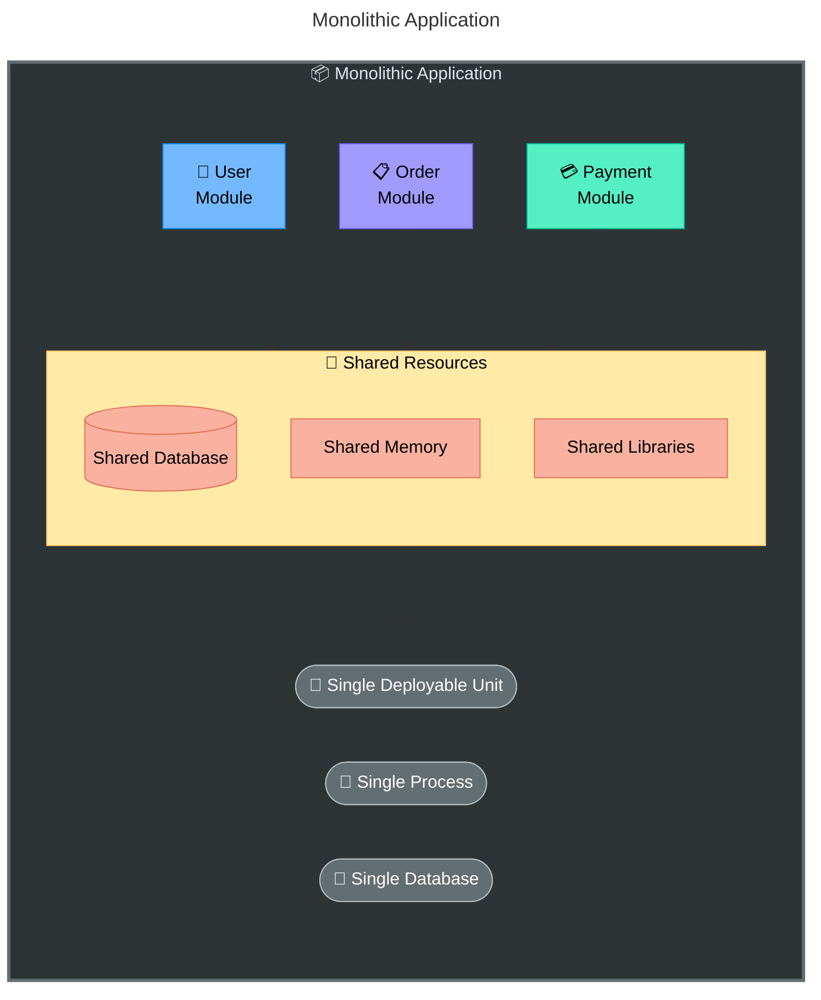
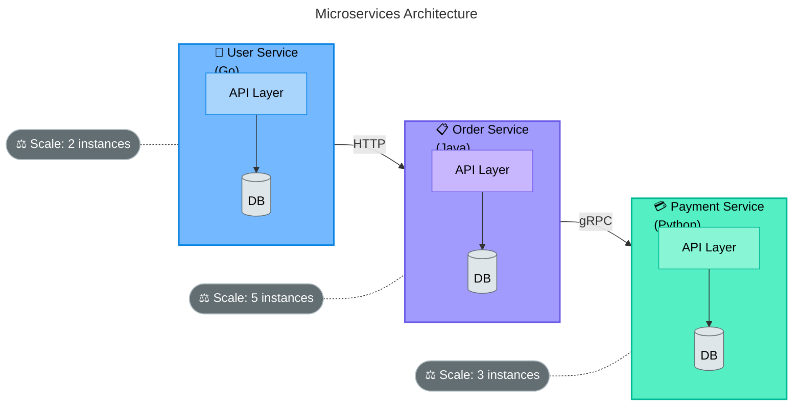
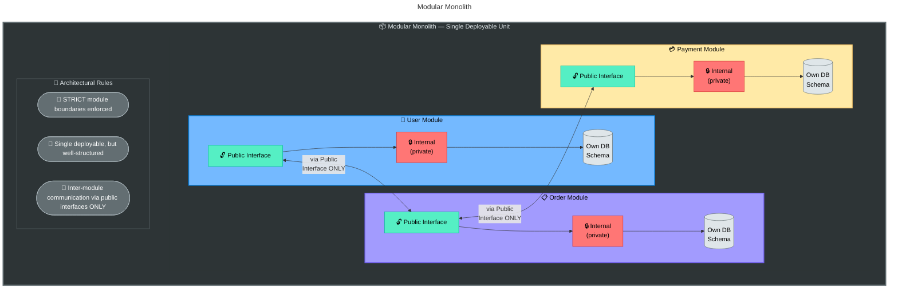
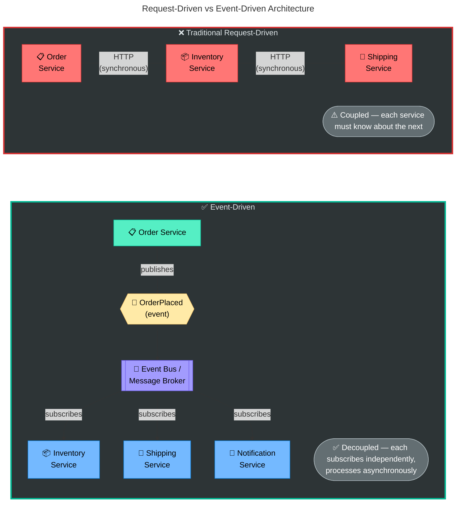
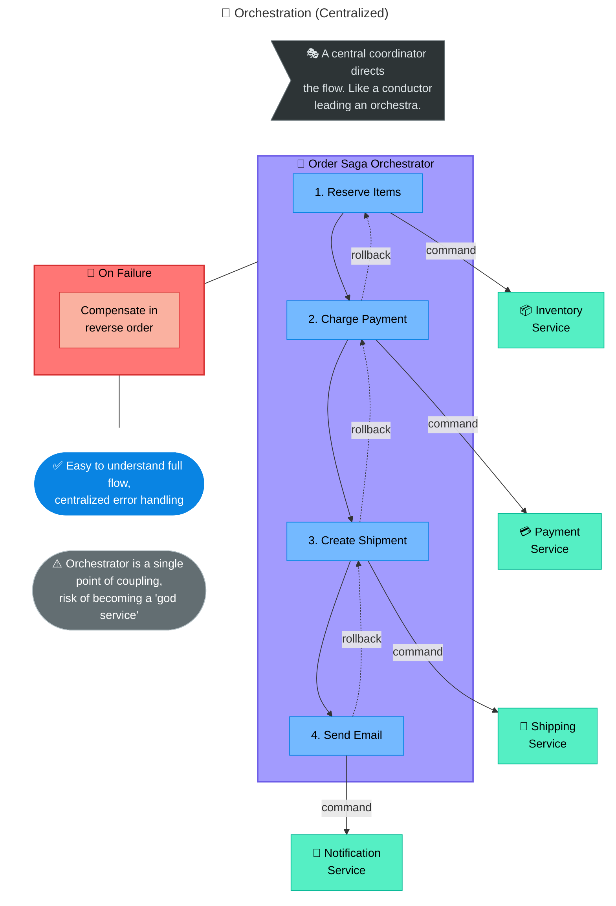
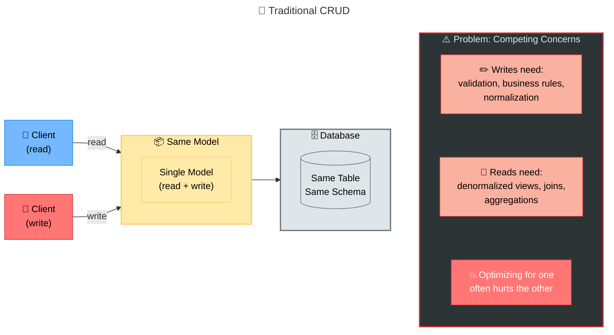
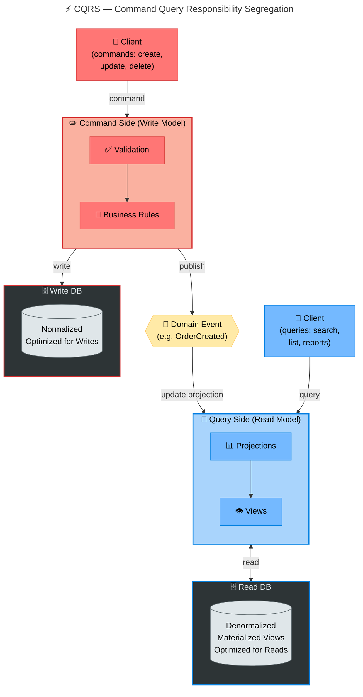
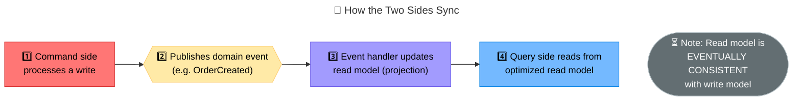
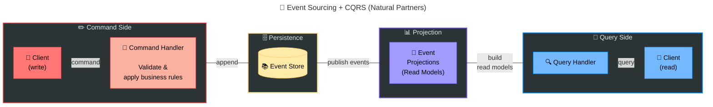

## Part III: Architectural Styles

### Table of Contents

- [Microservices vs. Monolith vs. Modular Monolith](#microservices-vs-monolith-vs-modular-monolith)
  - [The Monolith](#the-monolith)
  - [Microservices](#microservices)
  - [Modular Monolith](#modular-monolith)
  - [Decision Framework](#decision-framework)
- [Event-Driven Architecture (EDA), CQRS & Event Sourcing](#event-driven-architecture-eda-cqrs-and-event-sourcing)
  - [Event-Driven Architecture (EDA)](#event-driven-architecture-eda)
  - [CQRS — Command Query Responsibility Segregation](#cqrs-command-query-responsibility-segregation)
  - [Event Sourcing](#event-sourcing)
- [API Protocols](#api-protocols)
  - [REST (Representational State Transfer)](#rest-representational-state-transfer)
  - [GraphQL](#graphql)
  - [gRPC (Google Remote Procedure Call)](#grpc-google-remote-procedure-call)
  - [WebSockets](#websockets)
  - [Server-Sent Events (SSE)](#server-sent-events-sse)
  - [API Protocol Comparison Summary](#api-protocol-comparison-summary)
  - [Choosing the Right Protocol](#choosing-the-right-protocol)


---

### Microservices vs. Monolith vs. Modular Monolith

#### The Monolith



```
Pros:
  ✓ Simple to develop, test, and debug initially
  ✓ Easy cross-module refactoring (everything in one codebase)
  ✓ No network latency between modules (in-process calls)
  ✓ ACID transactions across all modules (single database)
  ✓ Simple deployment (one artifact)
  ✓ Easy to achieve strong consistency

Cons:
  ✗ Team scaling is hard (everyone works in same codebase)
  ✗ Deployment risk: one change deploys everything
  ✗ Technology lock-in: one language, one framework
  ✗ Scaling is all-or-nothing (can't scale just one module)
  ✗ Tight coupling tends to grow over time (Big Ball of Mud)
  ✗ Long build/test times as codebase grows
  ✗ Single point of failure (one bug can crash the whole app)
```

#### Microservices


Each service:
  - Own codebase, own repo (or mono-repo with boundaries)
  - Own database (Database per Service pattern)
  - Own deployment pipeline
  - Own team ownership
  - Can use different technology stack
  - Communicates via network (HTTP, gRPC, messaging)


```
Pros:
  ✓ Independent deployment (deploy one service without affecting others)
  ✓ Independent scaling (scale hot services only)
  ✓ Technology heterogeneity (right tool for each job)
  ✓ Team autonomy (small teams own their services end-to-end)
  ✓ Fault isolation (one service crash doesn't bring down others)
  ✓ Organizational scalability (Conway's Law alignment)

Cons:
  ✗ Distributed system complexity (network failures, latency, consistency)
  ✗ Data consistency challenges (no cross-service ACID transactions)
  ✗ Operational overhead (monitoring, logging, tracing across services)
  ✗ Service discovery, load balancing, circuit breaking needed
  ✗ Integration testing is hard
  ✗ Debugging across service boundaries is complex
  ✗ "Distributed monolith" risk if services are tightly coupled
  ✗ Infrastructure cost (more compute, networking, tooling)
```

#### Modular Monolith



```
Key principles:
  1. Modules communicate ONLY through well-defined public interfaces
  2. No direct database access across modules (schema isolation)
  3. Module internals are private (enforced by language features or conventions)
  4. Can evolve into microservices by extracting modules when needed

Pros:
  ✓ Monolith simplicity (single deploy, no network calls, ACID transactions)
  ✓ Microservice-like modularity (clear boundaries, team ownership)
  ✓ Easy to extract to microservices later (interfaces already defined)
  ✓ No distributed system complexity yet
  ✓ Fast inter-module communication (in-process)

Cons:
  ✗ Still a single deployable (deploy everything together)
  ✗ Still technology homogeneous (one language/framework)
  ✗ Requires discipline to enforce module boundaries
  ✗ Scaling is still all-or-nothing (until you extract)
```

#### Decision Framework

```
Start here: What's your situation?
━━━━━━━━━━━━━━━━━━━━━━━━━━━━━━━━

  Small team (< 10 devs)?
  New product / startup?
  Uncertain requirements?
  ──► START WITH MONOLITH or MODULAR MONOLITH
  
  Why? You need speed of iteration, not scalability.
  "If you can't build a well-structured monolith, what makes
   you think you can build microservices?" — Simon Brown


  Growing team (10-50+ devs)?
  Clear domain boundaries?
  Independent scaling needs?
  Multiple teams with different release cadences?
  ──► CONSIDER MICROSERVICES (extract from modular monolith)
  
  Why? Conway's Law — your architecture will mirror your
  organization structure. Multiple teams need independent 
  deployment and ownership boundaries.


  The path: Monolith → Modular Monolith → Microservices
  (NOT: Jump to microservices on day one)
```

---

### Event-Driven Architecture (EDA), CQRS & Event Sourcing

#### Event-Driven Architecture (EDA)



**Key Concepts:**

```
Event: An immutable record that something happened
  {
    "type": "OrderPlaced",
    "timestamp": "2024-01-15T10:30:00Z",
    "data": {
      "orderId": "ord-123",
      "customerId": "cust-456",
      "items": [{"sku": "WIDGET-A", "qty": 2}],
      "totalAmount": 49.99
    }
  }

Events are:
  ✓ Immutable (facts about the past can't be changed)
  ✓ Named in past tense (OrderPlaced, not PlaceOrder)
  ✓ Contain enough context for consumers to act independently
  ✓ Part of the public contract (changing them is a breaking change)

Three types of events:
  1. Domain Events: Business-meaningful (OrderPlaced, PaymentReceived)
  2. Integration Events: Cross-service communication (published to bus)
  3. Notification Events: "Something happened" (minimal payload, consumers 
     fetch details if needed)
```

**EDA Patterns:**

```
1. Event Notification:
   Producer publishes event with minimal data.
   Consumer receives notification, queries producer for full details if needed.
   
   + Loose coupling
   - Extra call to get details (latency)

2. Event-Carried State Transfer:
   Producer publishes event with FULL data payload.
   Consumer has all data it needs — no callback required.
   
   + Consumer is fully autonomous (no coupling back to producer)
   + Consumer can build its own local data store
   - Events are larger (more bandwidth)
   - Consumer may have stale view (eventual consistency)

3. Event Sourcing (covered below):
   Events ARE the source of truth (not just notifications).
```

**Choreography vs. Orchestration:**

```mermaid
---
title: "💃 Choreography (Decentralized)"
---
flowchart LR
    C_ORD["📋 Order\nService"]
    C_EVT1{{"OrderPlaced"}}
    C_INV["📦 Inventory\nService"]
    C_EVT2{{"ItemsReserved"}}
    C_PAY["💳 Payment\nService"]
    C_EVT3{{"PaymentProcessed"}}
    C_SHP["🚚 Shipping\nService"]
    C_EVT4{{"ShipmentCreated"}}
    C_NOT["🔔 Notification\nService"]
    C_EVT5{{"EmailSent"}}

    C_ORD --> C_EVT1
    C_EVT1 -- "reserve items" --> C_INV
    C_INV --> C_EVT2
    C_EVT2 -- "charge card" --> C_PAY
    C_PAY --> C_EVT3
    C_EVT3 -- "create shipment" --> C_SHP
    C_SHP --> C_EVT4
    C_EVT4 -- "email customer" --> C_NOT
    C_NOT --> C_EVT5

    subgraph EVAL[" "]
        direction LR
        PRO(["✅ Loosely coupled, each service is autonomous"])
        CON(["⚠️ Hard to understand full flow, difficult to debug,\ncomplex failure / compensation handling"])
    end

    C_EVT5 ~~~ EVAL

    NOTE>"🎭 No central coordinator.\nLike a dance where everyone\nknows their steps."]

    NOTE ~~~ C_ORD

    style C_ORD  fill:#55efc4,stroke:#00b894,color:#000
    style C_INV  fill:#55efc4,stroke:#00b894,color:#000
    style C_PAY  fill:#55efc4,stroke:#00b894,color:#000
    style C_SHP  fill:#55efc4,stroke:#00b894,color:#000
    style C_NOT  fill:#55efc4,stroke:#00b894,color:#000

    style C_EVT1 fill:#ffeaa7,stroke:#fdcb6e,color:#000
    style C_EVT2 fill:#ffeaa7,stroke:#fdcb6e,color:#000
    style C_EVT3 fill:#ffeaa7,stroke:#fdcb6e,color:#000
    style C_EVT4 fill:#ffeaa7,stroke:#fdcb6e,color:#000
    style C_EVT5 fill:#ffeaa7,stroke:#fdcb6e,color:#000

    style EVAL fill:none,stroke:none
    style PRO  fill:#00b894,stroke:#00b894,color:#fff
    style CON  fill:#636e72,stroke:#b2bec3,color:#fff
    style NOTE fill:#2d3436,stroke:#636e72,color:#dfe6e9
```





---

#### CQRS — Command Query Responsibility Segregation
s


---



---



```
Example: E-commerce Product Catalog

Write Model (normalized, PostgreSQL):
  products: id, name, description, price, category_id
  categories: id, name
  inventory: product_id, warehouse_id, quantity
  reviews: id, product_id, user_id, rating, text

Read Model (denormalized, Elasticsearch):
  {
    "id": "prod-123",
    "name": "Ergonomic Keyboard",
    "description": "...",
    "price": 89.99,
    "category": "Electronics",
    "totalInventory": 342,
    "averageRating": 4.5,
    "reviewCount": 128,
    "topReviews": [...],
    "relatedProducts": [...]
  }
  
  One document has EVERYTHING needed for the product page!
  No joins, no aggregations at query time.
```

```
When to use CQRS:
  ✓ Read and write workloads have very different scale
    (100x more reads than writes)
  ✓ Read and write models are very different shapes
  ✓ Different teams own read vs. write paths
  ✓ Complex domain with rich business rules on writes
  
When NOT to use:
  ✗ Simple CRUD application (massive overkill)
  ✗ Team can't handle eventual consistency
  ✗ Read model = write model (no benefit)
```

---

#### Event Sourcing


Traditional State Storage:

Store the CURRENT STATE of an entity:
  
  accounts table:
| id  | balance | last_updated     |
| -----| ---------| ------------------|
| 123 | 750.00  | 2024-01-15 10:30 |
  
  History is LOST. How did we get to $750? Unknown.


Event Sourcing:

Store the SEQUENCE OF EVENTS that led to current state:
  
  account_events table:
  | event_id | account_id | type              | data          | timestamp           |
  |----------|------------|-------------------|---------------|---------------------|
  | 1        | 123        | AccountOpened     | {balance: 0}  | 2024-01-01 09:00   |
  | 2        | 123        | MoneyDeposited    | {amount: 1000}| 2024-01-05 14:00   |
  | 3        | 123        | MoneyWithdrawn    | {amount: 200} | 2024-01-10 11:00   |
  | 4        | 123        | MoneyDeposited    | {amount: 50}  | 2024-01-12 16:00   |
  | 5        | 123        | MoneyWithdrawn    | {amount: 100} | 2024-01-15 10:30   |
  
  Current balance = replay all events:
  0 + 1000 - 200 + 50 - 100 = 750 ✓
  
  Full audit trail! Can reconstruct state at ANY point in time.


```
Core Concepts:

1. Event Store: Append-only log of events (never update, never delete)

2. Aggregate: Domain entity that events belong to
   Account #123 is an aggregate
   Its event stream: [AccountOpened, MoneyDeposited, MoneyWithdrawn, ...]

3. Rebuilding State (Replay):
   current_state = initial_state
   for event in event_store.get_events(aggregate_id):
       current_state = apply(current_state, event)
   return current_state

4. Snapshots (optimization):
   Replaying 1 million events is slow!
   Solution: Periodically save a snapshot of current state
   
   Snapshot at event #999,000: {balance: 45,230.00}
   To rebuild: load snapshot + replay events 999,001 → current
   
   ┌──────────────────────────────────────────────────────┐
   │ Events 1...999,000 │ Snapshot │ Events 999,001...N   │
   └──────────────────────────────────────────────────────┘
                           ▲
                    Start replay from here
```

```python
# Event Sourcing Example

from dataclasses import dataclass
from typing import List
import datetime

@dataclass(frozen=True)
class Event:
    aggregate_id: str
    timestamp: datetime.datetime

@dataclass(frozen=True)
class AccountOpened(Event):
    initial_balance: float = 0.0

@dataclass(frozen=True)
class MoneyDeposited(Event):
    amount: float = 0.0

@dataclass(frozen=True)
class MoneyWithdrawn(Event):
    amount: float = 0.0

class BankAccount:
    """Aggregate root — state rebuilt from events"""
    
    def __init__(self, account_id: str):
        self.account_id = account_id
        self.balance = 0.0
        self.is_open = False
        self.version = 0
        self._pending_events: List[Event] = []
    
    # --- Command handlers (business logic) ---
    
    def open(self, initial_balance: float = 0.0):
        if self.is_open:
            raise ValueError("Account already open")
        self._raise_event(AccountOpened(
            aggregate_id=self.account_id,
            timestamp=datetime.datetime.utcnow(),
            initial_balance=initial_balance
        ))
    
    def deposit(self, amount: float):
        if amount <= 0:
            raise ValueError("Deposit amount must be positive")
        if not self.is_open:
            raise ValueError("Account is not open")
        self._raise_event(MoneyDeposited(
            aggregate_id=self.account_id,
            timestamp=datetime.datetime.utcnow(),
            amount=amount
        ))
    
    def withdraw(self, amount: float):
        if amount <= 0:
            raise ValueError("Withdrawal amount must be positive")
        if amount > self.balance:
            raise ValueError("Insufficient funds")
        self._raise_event(MoneyWithdrawn(
            aggregate_id=self.account_id,
            timestamp=datetime.datetime.utcnow(),
            amount=amount
        ))
    
    # --- Event applicators (pure state transitions) ---
    
    def _apply(self, event: Event):
        if isinstance(event, AccountOpened):
            self.is_open = True
            self.balance = event.initial_balance
        elif isinstance(event, MoneyDeposited):
            self.balance += event.amount
        elif isinstance(event, MoneyWithdrawn):
            self.balance -= event.amount
        self.version += 1
    
    def _raise_event(self, event: Event):
        self._apply(event)
        self._pending_events.append(event)
    
    # --- Rebuild from event history ---
    
    @classmethod
    def from_events(cls, account_id: str, events: List[Event]):
        account = cls(account_id)
        for event in events:
            account._apply(event)
        return account
```



```
  Write side: Events are the source of truth (Event Store)
  Read side:  Projections built from events (optimized for queries)
  
  Benefits of combining:
  ✓ Complete audit log (event sourcing)
  ✓ Optimized read performance (CQRS projections)
  ✓ Can rebuild read models from events at any time
  ✓ Can add new read models without changing write side
  ✓ Time travel: query state at any historical point
```

```
When to use Event Sourcing:
  ✓ Full audit trail is a business requirement (finance, healthcare, legal)
  ✓ Complex domain with many state transitions
  ✓ Need temporal queries ("what was the balance on Jan 5th?")
  ✓ Need to derive multiple views from same events
  ✓ Event-driven architecture already in use
  
When NOT to use:
  ✗ Simple CRUD with no audit requirements
  ✗ Team unfamiliar with the pattern (steep learning curve)
  ✗ Queries require complex cross-aggregate joins
  ✗ Need to delete data (GDPR compliance requires crypto-shredding 
    or tombstone events — adds complexity)
  ✗ Performance-sensitive reads without CQRS (replaying is slow)
```

---

### API Protocols

#### REST (Representational State Transfer)

```
Architectural style for web APIs based on HTTP.

Principles:
  1. Stateless: Each request contains all information needed
  2. Resource-based: URLs identify resources (nouns, not verbs)
  3. Standard HTTP methods: GET, POST, PUT, PATCH, DELETE
  4. Uniform interface: Consistent URL patterns and response formats

Example:
  GET    /api/users              → List all users
  GET    /api/users/42           → Get user 42
  POST   /api/users              → Create new user
  PUT    /api/users/42           → Replace user 42 entirely
  PATCH  /api/users/42           → Partially update user 42
  DELETE /api/users/42           → Delete user 42

  GET    /api/users/42/orders    → Get orders for user 42

Response with HTTP status codes:
  200 OK                → Successful read
  201 Created           → Successful create (with Location header)
  204 No Content        → Successful delete
  400 Bad Request       → Client error (validation)
  401 Unauthorized      → Authentication required
  403 Forbidden         → Authenticated but not authorized
  404 Not Found         → Resource doesn't exist
  409 Conflict          → State conflict (e.g., duplicate)
  429 Too Many Requests → Rate limited
  500 Internal Error    → Server error

Richardson Maturity Model:
  Level 0: Single URL, single HTTP method (RPC over HTTP)
  Level 1: Multiple URLs (resources), but single HTTP method
  Level 2: Multiple URLs + proper HTTP methods + status codes
  Level 3: HATEOAS (Hypermedia links in responses)
```

```
Pros:
  ✓ Simple, widely understood, massive ecosystem
  ✓ Browser-native (works with fetch, curl, any HTTP client)
  ✓ Cacheable (GET requests, ETag, Cache-Control headers)
  ✓ Great tooling (OpenAPI/Swagger, Postman)
  ✓ Stateless → easy to scale horizontally

Cons:
  ✗ Over-fetching: GET /users/42 returns ALL fields, even if you need 2
  ✗ Under-fetching: Need user + orders + reviews = 3 API calls
  ✗ No built-in schema/type safety (rely on OpenAPI spec)
  ✗ No server push (client must poll for updates)
  ✗ Text-based (JSON) → larger payloads than binary protocols
```

---

#### GraphQL

```
A query language and runtime for APIs (developed by Facebook, 2015).

Key concept: Client specifies EXACTLY what data it needs.

Schema Definition:
  type User {
    id: ID!
    name: String!
    email: String!
    orders: [Order!]!
  }
  
  type Order {
    id: ID!
    total: Float!
    items: [OrderItem!]!
    status: OrderStatus!
  }
  
  type Query {
    user(id: ID!): User
    users(limit: Int, offset: Int): [User!]!
  }
  
  type Mutation {
    createUser(input: CreateUserInput!): User!
    placeOrder(input: PlaceOrderInput!): Order!
  }

Client Query (only get what you need):
  query {
    user(id: "42") {
      name
      email
      orders {
        id
        total
        status
      }
    }
  }

Response (matches query shape exactly):
  {
    "data": {
      "user": {
        "name": "Alice",
        "email": "alice@example.com",
        "orders": [
          { "id": "ord-1", "total": 49.99, "status": "SHIPPED" },
          { "id": "ord-2", "total": 129.50, "status": "PENDING" }
        ]
      }
    }
  }

One request, exact data needed. No over-fetching, no under-fetching.
```

```
Pros:
  ✓ No over-fetching or under-fetching (client controls response shape)
  ✓ Single endpoint (POST /graphql) — simpler URL management
  ✓ Strongly typed schema (self-documenting, auto-generated docs)
  ✓ Introspection (clients can discover the schema)
  ✓ Great for mobile (bandwidth-constrained, varied data needs)
  ✓ Subscriptions for real-time (over WebSocket)
  ✓ Versionless API (add fields without breaking clients)

Cons:
  ✗ Complexity on the server (resolvers, dataloaders, N+1 problem)
  ✗ Hard to cache (single POST endpoint, dynamic queries)
  ✗ Security: malicious queries can be deeply nested (query depth limiting needed)
  ✗ File uploads not natively supported (need multipart spec)
  ✗ Steeper learning curve for backend teams
  ✗ Overkill for simple CRUD APIs
```

```
N+1 Problem in GraphQL:

  query { users { orders { items { product { name } } } } }
  
  Naive resolution:
    1 query for users (returns 100 users)
    100 queries for orders (one per user)
    500 queries for items (one per order)
    2000 queries for products (one per item)
    = 2601 database queries!
  
  Solution: DataLoader (batching + caching)
    Collect all product IDs needed in one tick
    Execute ONE query: SELECT * FROM products WHERE id IN (...)
    Cache results for the duration of the request
```

---

#### gRPC (Google Remote Procedure Call)

```
High-performance RPC framework using Protocol Buffers and HTTP/2.

Protocol Buffer Definition (.proto file):
  syntax = "proto3";
  
  service UserService {
    rpc GetUser(GetUserRequest) returns (User);
    rpc ListUsers(ListUsersRequest) returns (stream User);  // server streaming
    rpc CreateUser(CreateUserRequest) returns (User);
    rpc Chat(stream ChatMessage) returns (stream ChatMessage);  // bidirectional
  }
  
  message User {
    string id = 1;
    string name = 2;
    string email = 3;
    int32 age = 4;
  }
  
  message GetUserRequest {
    string id = 1;
  }

From this .proto file, code is auto-generated for any language:
  Python, Go, Java, C++, Rust, TypeScript, etc.
```

```
Communication Patterns:

1. Unary RPC (request-response, like REST):
   Client ──request──► Server ──response──► Client

2. Server Streaming:
   Client ──request──► Server ──response1──► Client
                                ──response2──► Client
                                ──response3──► Client
   Use case: Real-time stock prices, log tailing

3. Client Streaming:
   Client ──request1──► Server
           ──request2──►
           ──request3──► ──response──► Client
   Use case: File upload, sensor data ingestion

4. Bidirectional Streaming:
   Client ◄──► Server (both send messages independently)
   Use case: Chat, multiplayer games, collaborative editing
```

```
Pros:
  ✓ Very fast (binary serialization, 10x smaller than JSON)
  ✓ HTTP/2 (multiplexing, header compression, bidirectional streaming)
  ✓ Strongly typed (proto schema, code generation, compile-time checks)
  ✓ Streaming support (all four patterns above)
  ✓ Deadline/timeout propagation (built into the protocol)
  ✓ Interceptors (middleware for auth, logging, metrics)
  ✓ Language-agnostic (generate client/server in any supported language)

Cons:
  ✗ Not browser-friendly (requires gRPC-Web proxy or Connect)
  ✗ Not human-readable (binary format, can't inspect with curl)
  ✗ Less ecosystem/tooling than REST
  ✗ Schema evolution requires care (field numbering)
  ✗ Load balancing is trickier with HTTP/2 (long-lived connections)
  ✗ Steeper learning curve (protobuf, code generation pipeline)
```

---

#### WebSockets

```
Full-duplex, persistent communication channel over a single TCP connection.

Connection Lifecycle:
  
  1. HTTP Upgrade Handshake:
     Client ──► GET /chat HTTP/1.1
                Upgrade: websocket
                Connection: Upgrade
                Sec-WebSocket-Key: dGhlIHNhbXBsZSBub25jZQ==
     
     Server ──► HTTP/1.1 101 Switching Protocols
                Upgrade: websocket
                Connection: Upgrade
                Sec-WebSocket-Accept: s3pPLMBiTxaQ9kYGzzhZRbK+xOo=
  
  2. Persistent Connection (full-duplex):
     Client ◄════════════════════════► Server
             Both sides can send messages
             at any time, independently
             No request-response pattern needed
  
  3. Close:
     Either side sends close frame
     Connection terminated

Message Flow:
  Client: "Hello"          ──►  Server receives "Hello"
  Server: "Hi!"            ◄──  Server sends "Hi!"
  Server: "News: stock up" ◄──  Server pushes without client asking!
  Client: "Subscribe AAPL" ──►  Server receives subscription
  Server: "AAPL: $150.25"  ◄──  Server pushes in real time
  Server: "AAPL: $150.30"  ◄──  
  Server: "AAPL: $150.28"  ◄──  
```

```
Pros:
  ✓ True real-time bidirectional communication
  ✓ Low overhead (no HTTP headers per message after handshake)
  ✓ Server can push to client without client requesting (no polling)
  ✓ Lower latency than HTTP polling
  ✓ Browser-native (WebSocket API in all modern browsers)

Cons:
  ✗ Stateful connections (harder to scale horizontally)
  ✗ No built-in reconnection (must implement in application)
  ✗ Load balancer complexity (sticky sessions or L7 WS-aware)
  ✗ Firewall/proxy issues (some corporate proxies block WS)
  ✗ No built-in message format (must define your own protocol)
  ✗ Resource intensive (one connection per client, held open)

Use cases:
  ✓ Chat applications
  ✓ Live dashboards / real-time analytics
  ✓ Multiplayer games
  ✓ Collaborative editing (Google Docs-style)
  ✓ Live sports scores / stock tickers
  ✓ IoT device communication
```

---

#### Server-Sent Events (SSE)

```
Unidirectional server-to-client push over HTTP.

How it works:
  Client ──GET /events──► Server
  
  Server holds connection open and sends events:
  
  HTTP/1.1 200 OK
  Content-Type: text/event-stream
  Cache-Control: no-cache
  Connection: keep-alive
  
  data: {"price": 150.25, "symbol": "AAPL"}
  
  data: {"price": 150.30, "symbol": "AAPL"}
  
  event: alert
  data: {"message": "Price threshold reached!"}
  
  id: 42
  data: {"price": 150.28, "symbol": "AAPL"}
  
  retry: 5000
  
Features:
  - Named events (event: field)
  - Event IDs (id: field) — enables resume after disconnect
  - Retry interval (retry: field) — client auto-reconnects
  - Multi-line data
```

```
Client-side (Browser):
  const eventSource = new EventSource('/api/events');
  
  eventSource.onmessage = (event) => {
    console.log('Received:', JSON.parse(event.data));
  };
  
  eventSource.addEventListener('alert', (event) => {
    console.log('Alert:', JSON.parse(event.data));
  });
  
  eventSource.onerror = (event) => {
    console.log('Connection lost, auto-reconnecting...');
    // Browser automatically reconnects!
  };

Server-side (Node.js):
  app.get('/api/events', (req, res) => {
    res.setHeader('Content-Type', 'text/event-stream');
    res.setHeader('Cache-Control', 'no-cache');
    res.setHeader('Connection', 'keep-alive');
    
    const interval = setInterval(() => {
      const data = JSON.stringify({ price: getStockPrice() });
      res.write(`data: ${data}\n\n`);
    }, 1000);
    
    req.on('close', () => clearInterval(interval));
  });
```

```
Pros:
  ✓ Simple (just HTTP — works through firewalls, proxies, CDNs)
  ✓ Auto-reconnection built into browser API
  ✓ Event IDs enable resume from last received event
  ✓ Lightweight (no WebSocket upgrade, no new protocol)
  ✓ Text-based (easy to debug, monitor, log)

Cons:
  ✗ Unidirectional only (server → client)
  ✗ Limited to ~6 connections per domain in HTTP/1.1 (browser limit)
     (HTTP/2 multiplexing solves this)
  ✗ Text only (no binary data)
  ✗ No built-in support in all HTTP clients (mainly browsers)
  ✗ Less efficient than WebSockets for high-frequency updates
```

#### API Protocol Comparison Summary

```
                REST        GraphQL      gRPC         WebSocket    SSE
─────────────  ──────────  ───────────  ───────────  ───────────  ──────────
Protocol       HTTP/1.1    HTTP         HTTP/2       TCP (via     HTTP
               or HTTP/2                              HTTP upgrade)

Format         JSON/XML    JSON         Protobuf     Any          Text
                                        (binary)     (custom)

Direction      Request-    Request-     4 patterns   Bidirectional Server→
               Response    Response     (incl.       full-duplex   Client
                                        streaming)                 only

Type Safety    Optional    Strong       Strong       None          None
               (OpenAPI)   (schema)     (proto)      (custom)      

Real-time      Polling     Subscriptions Streaming   Native        Native

Browser        ✓ Native    ✓ (via       ✗ (needs     ✓ Native     ✓ Native
Support                      fetch)       proxy)       API          API

Best For       Public      Mobile apps, Inter-service Chat, games, Notifi-
               APIs,       varied data  comms, high  live collab,  cations,
               CRUD,       needs, BFF   performance  IoT          feeds,
               simple                    internal                  dashboards
               services                 APIs

Caching        HTTP cache  Difficult    Not built-in Not applicable HTTP cache
               (GET, ETag) (POST)                    (stateful)    (limited)
```

#### Choosing the Right Protocol

```
Decision Tree:

  Is it a public API for third-party developers?
  └── YES → REST (universally understood, great docs tooling)
  └── NO ↓

  Is it internal service-to-service communication?
  └── YES → gRPC (fast, typed, streaming support)
  └── NO ↓

  Does the client need flexible data queries? (mobile, varied UIs)
  └── YES → GraphQL (client-driven queries, avoids over/under-fetching)
  └── NO ↓

  Do you need real-time bidirectional communication?
  └── YES → WebSockets (chat, games, collaborative editing)
  └── NO ↓

  Do you need server-to-client push only? (notifications, feeds)
  └── YES → SSE (simple, auto-reconnect, works through proxies)
  └── NO → REST (default choice for most scenarios)
```

---

