# 1. Rendering Strategies & Framework Theory

## Table of Contents

- [1.1 Client-Side Rendering (CSR)](#11-client-side-rendering-csr)
  - [What Is It?](#what-is-it)
  - [The CSR Lifecycle](#the-csr-lifecycle)
  - [The Minimal HTML Shell](#the-minimal-html-shell)
  - [Key Characteristics](#key-characteristics)
  - [Advantages](#advantages)
  - [Disadvantages](#disadvantages)
  - [When to Use CSR](#when-to-use-csr)
- [1.2 Server-Side Rendering (SSR)](#12-server-side-rendering-ssr)
  - [What Is It?](#what-is-it)
  - [The SSR Lifecycle](#the-ssr-lifecycle)
  - [Example: Next.js SSR (App Router)](#example-nextjs-ssr-app-router)
  - [Key Characteristics](#key-characteristics)
  - [Advantages](#advantages)
  - [Disadvantages](#disadvantages)
  - [The Uncanny Valley Problem](#the-uncanny-valley-problem)
- [1.3 Static Site Generation (SSG)](#13-static-site-generation-ssg)
  - [What Is It?](#what-is-it)
  - [The SSG Lifecycle](#the-ssg-lifecycle)
  - [Example: Next.js SSG](#example-nextjs-ssg)
  - [Key Characteristics](#key-characteristics)
  - [Advantages](#advantages)
  - [Disadvantages](#disadvantages)
- [1.4 Incremental Static Regeneration (ISR)](#14-incremental-static-regeneration-isr)
  - [What Is It?](#what-is-it)
  - [How ISR Works](#how-isr-works)
  - [Revalidation Strategies](#revalidation-strategies)
    - [Time-Based Revalidation](#time-based-revalidation)
    - [On-Demand Revalidation](#on-demand-revalidation)
  - [Key Characteristics](#key-characteristics)
  - [Stale-While-Revalidate Pattern](#stale-while-revalidate-pattern)
- [1.5 React Server Components (RSC)](#15-react-server-components-rsc)
  - [What Is It?](#what-is-it)
  - [The Key Mental Model](#the-key-mental-model)
  - [Server Components vs. Client Components](#server-components-vs-client-components)
  - [What Can and Cannot Be Used Where](#what-can-and-cannot-be-used-where)
  - [The RSC Wire Format (Payload)](#the-rsc-wire-format-payload)
- [1.6 Hydration Process & Rehydration Strategies](#16-hydration-process-and-rehydration-strategies)
  - [What Is Hydration?](#what-is-hydration)
  - [The Hydration Process (Step by Step)](#the-hydration-process-step-by-step)
  - [Traditional Full Hydration — The Problem](#traditional-full-hydration-the-problem)
  - [Rehydration Strategies](#rehydration-strategies)
    - [1. Progressive Hydration](#1-progressive-hydration)
    - [2. Selective Hydration (React 18+)](#2-selective-hydration-react-18)
    - [3. Resumability (Qwik's Approach)](#3-resumability-qwiks-approach)
- [1.7 Island Architecture](#17-island-architecture)
  - [What Is It?](#what-is-it)
  - [Conceptual Visualization](#conceptual-visualization)
  - [Example: Astro Islands](#example-astro-islands)
  - [Astro Hydration Directives](#astro-hydration-directives)
  - [Why Islands Matter](#why-islands-matter)
- [1.8 Rendering Strategies Comparison](#18-rendering-strategies-comparison)
  - [Comprehensive Comparison Table](#comprehensive-comparison-table)


Understanding **when** and **where** HTML is generated is the single most impactful architectural decision you will make in a frontend project. Every strategy represents a different trade-off between **Time-to-First-Byte (TTFB)**, **Time-to-Interactive (TTI)**, **SEO**, **server cost**, and **developer experience**.

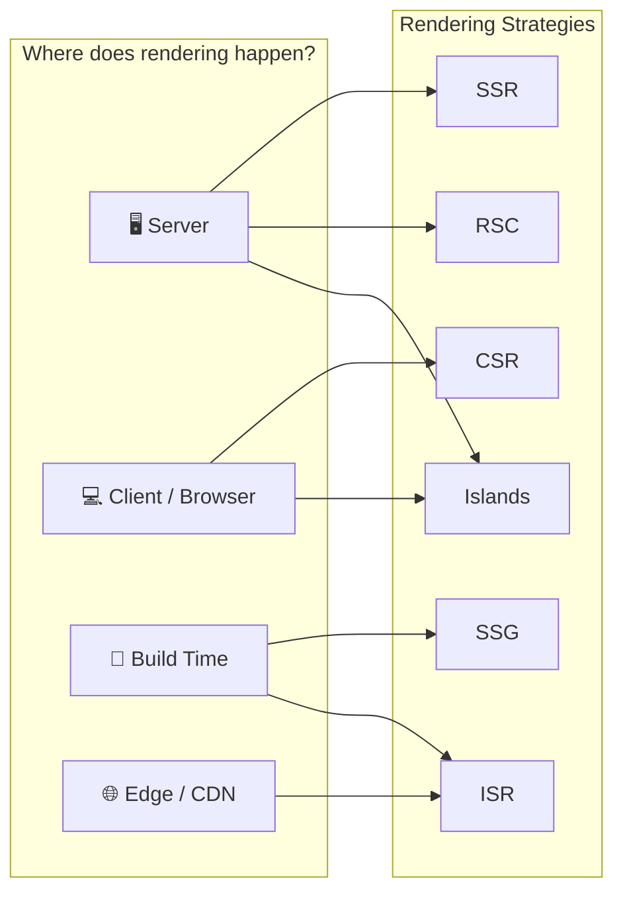

---

## 1.1 Client-Side Rendering (CSR)

### What Is It?

In CSR, the server sends a **minimal HTML shell** (often just a `<div id="root"></div>`) along with JavaScript bundles. The browser downloads, parses, and executes the JavaScript, which then builds the entire DOM on the client.

### The CSR Lifecycle

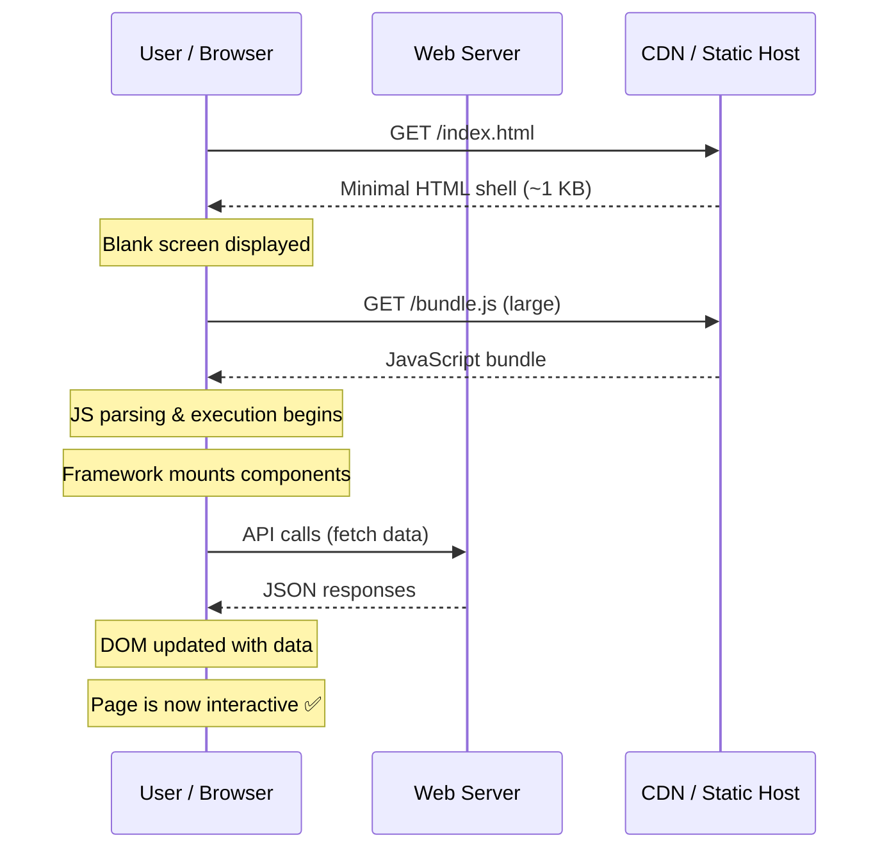

### The Minimal HTML Shell

```html
<!DOCTYPE html>
<html lang="en">
<head>
    <meta charset="UTF-8" />
    <title>My CSR App</title>
    <link rel="stylesheet" href="/styles.css" />
</head>
<body>
    <!-- This is ALL the server sends for the page structure -->
    <div id="root"></div>

    <!-- The entire app lives inside this bundle -->
    <script src="/bundle.js" defer></script>
</body>
</html>
```

### Key Characteristics

| Aspect | Detail |
|---|---|
| **Initial Load** | Slow — user sees blank/loading screen until JS executes |
| **SEO** | Poor by default — crawlers may not execute JS (Google does, but inconsistently) |
| **Server Load** | Very low — server only serves static files |
| **Interactivity** | Fast once loaded — all logic is already in the browser |
| **Caching** | Easy — everything is a static asset |
| **Use Cases** | Dashboards, admin panels, apps behind authentication |

### Advantages

- **Simple deployment** — static files can go on any CDN
- **Rich interactivity** — no round-trips for page transitions
- **Cheap hosting** — no server compute needed
- **Great for authenticated apps** — SEO often irrelevant

### Disadvantages

- **Poor perceived performance** — users stare at a blank screen or spinner
- **Large JS bundles** — entire app must download before anything renders
- **SEO challenges** — search engines may index a blank page
- **Waterfall problem** — HTML → JS → Data creates sequential delays

### When to Use CSR

✅ Internal tools and dashboards  
✅ Apps behind login (SEO not needed)  
✅ Highly interactive SPAs (e.g., Figma, Notion)  
❌ Marketing pages, blogs, e-commerce (use SSR/SSG instead)

---

## 1.2 Server-Side Rendering (SSR)

### What Is It?

In SSR, the server **executes your application code on every request**, generates a complete HTML page, and sends it to the browser. The browser can display content immediately, even before JavaScript loads. Once JS loads, the page **hydrates** and becomes interactive.

### The SSR Lifecycle

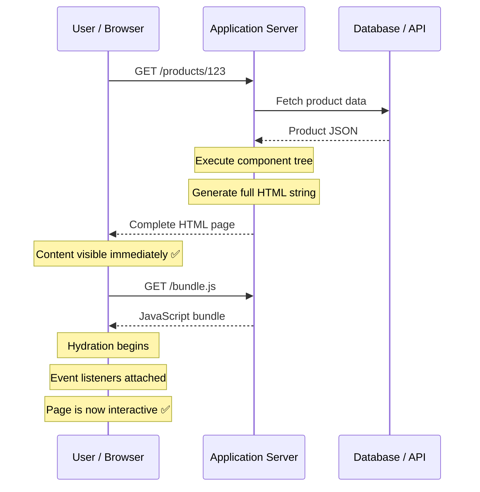

### Example: Next.js SSR (App Router)

```typescript
// app/products/[id]/page.tsx

// This function runs on the server for EVERY request
export default async function ProductPage({ 
  params 
}: { 
  params: { id: string } 
}) {
  // Data fetching happens on the server
  const product = await fetch(
    `https://api.example.com/products/${params.id}`,
    { cache: 'no-store' }  // 'no-store' ensures fresh data on each request
  ).then(res => res.json());

  // This JSX is rendered to HTML on the server
  return (
    <main>
      <h1>{product.name}</h1>
      <p>{product.description}</p>
      <span>${product.price}</span>
    </main>
  );
}
```

### Key Characteristics

| Aspect | Detail |
|---|---|
| **Initial Load** | Fast content visibility (good FCP), but TTFB is higher than SSG |
| **SEO** | Excellent — full HTML is available for crawlers |
| **Server Load** | High — server must render on every request |
| **Interactivity** | Delayed — interactive only after hydration completes |
| **Caching** | Possible with CDN/edge caching but more complex |
| **Use Cases** | Dynamic pages that need SEO: e-commerce, social media, news |

### Advantages

- **Excellent SEO** — crawlers receive fully rendered HTML
- **Fast First Contentful Paint (FCP)** — content visible before JS loads
- **Dynamic data** — always serves the freshest content
- **Social sharing** — OpenGraph tags rendered server-side for link previews

### Disadvantages

- **Higher TTFB** — server must fetch data and render before responding
- **Server cost** — every request consumes compute
- **Hydration overhead** — page is visible but not interactive until JS executes
- **Complexity** — must handle server/client code boundaries carefully

### The Uncanny Valley Problem

```mermaid
gantt
    title SSR Timeline — The Interactivity Gap
    dateFormat X
    axisFormat %s

    section Server
    Data Fetching & Render     :s1, 0, 3

    section Network
    HTML Transfer              :n1, 3, 4

    section Browser
    Content Visible (FCP)      :milestone, m1, 4, 0
    JS Download                :b1, 4, 7
    Hydration                  :b2, 7, 9
    Interactive (TTI)          :milestone, m2, 9, 0

    section User Experience
    Can SEE but NOT CLICK      :crit, gap, 4, 9
```

> ⚠️ **The Interactivity Gap**: Between FCP and TTI, users can *see* buttons and links but clicking them does **nothing**. This is the "uncanny valley" of SSR. Strategies like progressive hydration, streaming SSR, and React Server Components aim to minimize this gap.

---

## 1.3 Static Site Generation (SSG)

### What Is It?

SSG generates all HTML pages **at build time**. The pages are pre-rendered once, then deployed to a CDN as static files. No server-side computation happens at request time.

### The SSG Lifecycle

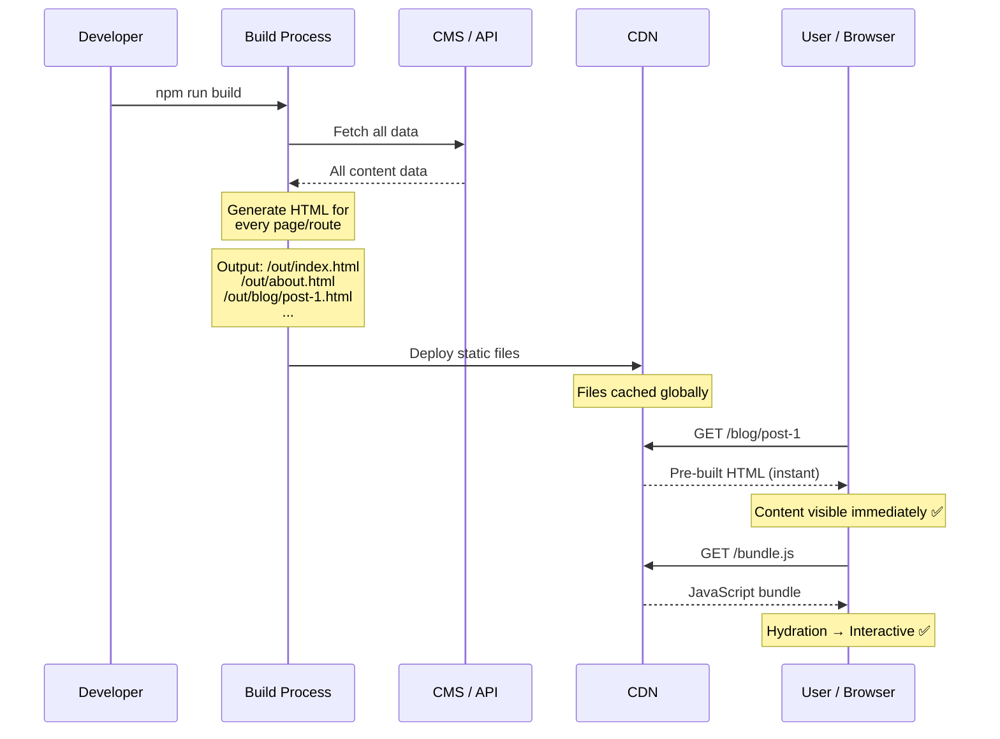

### Example: Next.js SSG

```typescript
// app/blog/[slug]/page.tsx

// Tell Next.js which pages to pre-generate at build time
export async function generateStaticParams() {
  const posts = await fetch('https://cms.example.com/posts').then(r => r.json());
  
  return posts.map((post: { slug: string }) => ({
    slug: post.slug,
  }));
}

// This runs once at BUILD TIME, not on each request
export default async function BlogPost({ 
  params 
}: { 
  params: { slug: string } 
}) {
  const post = await fetch(
    `https://cms.example.com/posts/${params.slug}`
  ).then(r => r.json());

  return (
    <article>
      <h1>{post.title}</h1>
      <time>{post.publishedAt}</time>
      <div dangerouslySetInnerHTML={{ __html: post.htmlContent }} />
    </article>
  );
}
```

### Key Characteristics

| Aspect | Detail |
|---|---|
| **Initial Load** | Fastest possible — just static file serving from CDN edge |
| **SEO** | Excellent — complete HTML available |
| **Server Load** | Zero at runtime — all work done at build |
| **Data Freshness** | Stale — content only updates when you rebuild |
| **Build Time** | Can be very long for sites with thousands of pages |
| **Use Cases** | Blogs, documentation, marketing pages, portfolios |

### Advantages

- **Blazing fast** — CDN-served static files, lowest possible TTFB
- **Extremely cheap** — no server compute at runtime
- **Highly secure** — no server to attack, no database exposed
- **Perfectly reliable** — static files never crash
- **Globally distributed** — CDN serves from nearest edge

### Disadvantages

- **Stale data** — content only updates after a full rebuild and deploy
- **Build time scaling** — 10,000 pages = potentially very long builds
- **No personalization** — everyone gets the same HTML (can combine with client-side fetching)
- **Unsuitable for dynamic content** — user-specific or frequently changing data

---

## 1.4 Incremental Static Regeneration (ISR)

### What Is It?

ISR is a **hybrid approach** pioneered by Next.js. It combines the performance benefits of SSG with the ability to **update individual pages after deployment** without a full site rebuild. Pages are statically generated, but can be **revalidated** in the background after a configurable time interval.

### How ISR Works

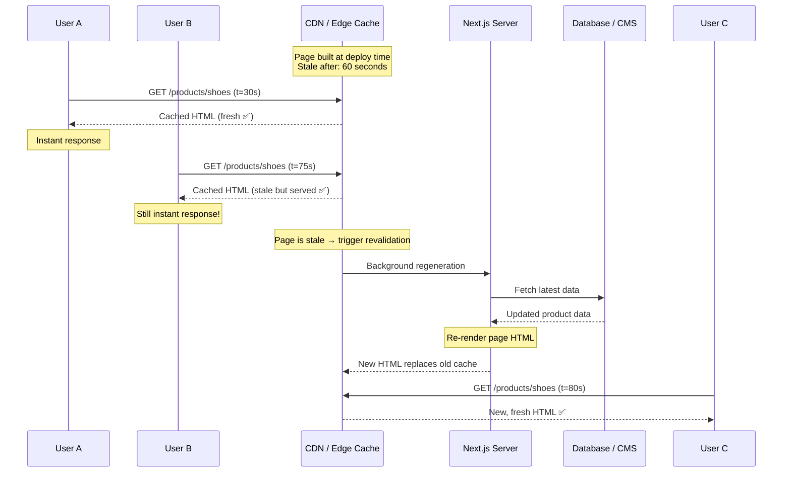

### Revalidation Strategies

#### Time-Based Revalidation

```typescript
// app/products/[id]/page.tsx

export default async function ProductPage({ params }: { params: { id: string } }) {
  const product = await fetch(`https://api.example.com/products/${params.id}`, {
    next: { revalidate: 60 }  // Revalidate at most every 60 seconds
  }).then(res => res.json());

  return (
    <main>
      <h1>{product.name}</h1>
      <p>Price: ${product.price}</p>
      <p>Stock: {product.stock} remaining</p>
    </main>
  );
}
```

#### On-Demand Revalidation

```typescript
// app/api/revalidate/route.ts
import { revalidatePath, revalidateTag } from 'next/cache';
import { NextRequest, NextResponse } from 'next/server';

export async function POST(request: NextRequest) {
  const { secret, path, tag } = await request.json();
  
  // Verify the webhook secret to prevent abuse
  if (secret !== process.env.REVALIDATION_SECRET) {
    return NextResponse.json({ message: 'Invalid secret' }, { status: 401 });
  }

  // Revalidate by path
  if (path) {
    revalidatePath(path);
    return NextResponse.json({ revalidated: true, path });
  }

  // Revalidate by cache tag
  if (tag) {
    revalidateTag(tag);
    return NextResponse.json({ revalidated: true, tag });
  }

  return NextResponse.json({ message: 'Missing path or tag' }, { status: 400 });
}
```

```typescript
// Using cache tags for granular control
const product = await fetch(`https://api.example.com/products/${id}`, {
  next: { tags: ['products', `product-${id}`] }
}).then(res => res.json());

// Now a CMS webhook can call POST /api/revalidate with { tag: "product-123" }
// and ONLY that specific product page regenerates!
```

### Key Characteristics

| Aspect | Detail |
|---|---|
| **Initial Load** | Same as SSG — static file from CDN |
| **Data Freshness** | Configurable — can be near-real-time with on-demand revalidation |
| **Build Time** | Short — only build critical pages; rest generated on first visit |
| **Server Cost** | Low — regeneration happens only when stale pages are requested |
| **Use Cases** | E-commerce catalogs, blogs with frequent updates, news sites |

### Stale-While-Revalidate Pattern

ISR implements the `stale-while-revalidate` caching philosophy:

```
1. User requests a page
2. If cached version exists → serve it immediately (even if stale)
3. If page is stale → trigger background regeneration
4. Next visitor gets the freshly regenerated page
```

> 💡 **Key Insight**: The user who triggers revalidation does NOT wait for it. They get the stale page instantly. Only subsequent users benefit from the update. This ensures no user ever experiences slow response times.

---

## 1.5 React Server Components (RSC)

### What Is It?

React Server Components represent a **paradigm shift** in React architecture. They introduce a new type of component that **executes exclusively on the server**, never shipping their JavaScript to the client. RSC is not merely SSR — it is a component-level rendering model that allows fine-grained decisions about where each component runs.

### The Key Mental Model

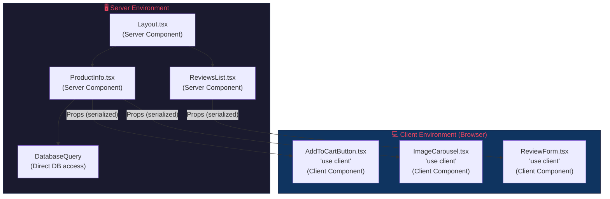

### Server Components vs. Client Components

```typescript
// ✅ SERVER COMPONENT (default in Next.js App Router)
// This component's code is NEVER sent to the browser
// app/products/[id]/page.tsx

import { db } from '@/lib/database';
import { AddToCartButton } from './AddToCartButton';
import { PriceDisplay } from './PriceDisplay';

export default async function ProductPage({ params }: { params: { id: string } }) {
  // ✅ Direct database access — impossible in client components
  const product = await db.products.findUnique({
    where: { id: params.id },
    include: { reviews: true, category: true }
  });

  // ✅ Access server-only resources
  const recommendations = await db.products.findMany({
    where: { categoryId: product.categoryId },
    take: 4,
  });

  // ✅ Use secrets without exposing them
  const inventory = await fetch('https://internal-api.company.com/stock', {
    headers: { Authorization: `Bearer ${process.env.INTERNAL_API_KEY}` }
  }).then(r => r.json());

  return (
    <main>
      {/* Server Component — no JS shipped for this */}
      <h1>{product.name}</h1>
      <p>{product.description}</p>
      <PriceDisplay price={product.price} currency="USD" />

      {/* Client Component — JS shipped for interactivity */}
      <AddToCartButton productId={product.id} stock={inventory.count} />

      {/* Server Component rendering a list */}
      <section>
        <h2>Reviews ({product.reviews.length})</h2>
        {product.reviews.map(review => (
          <div key={review.id}>
            <strong>{review.author}</strong>
            <p>{review.content}</p>
          </div>
        ))}
      </section>
    </main>
  );
}
```

```typescript
// ✅ CLIENT COMPONENT — marked with 'use client' directive
// app/products/[id]/AddToCartButton.tsx
'use client';

import { useState, useTransition } from 'react';
import { addToCart } from '@/actions/cart';

export function AddToCartButton({ 
  productId, 
  stock 
}: { 
  productId: string; 
  stock: number 
}) {
  const [quantity, setQuantity] = useState(1);
  const [isPending, startTransition] = useTransition();

  // ✅ useState, useEffect, onClick — all browser APIs are fine here
  const handleAddToCart = () => {
    startTransition(async () => {
      await addToCart(productId, quantity);
    });
  };

  return (
    <div>
      <select 
        value={quantity} 
        onChange={(e) => setQuantity(Number(e.target.value))}
      >
        {Array.from({ length: Math.min(stock, 10) }, (_, i) => (
          <option key={i + 1} value={i + 1}>{i + 1}</option>
        ))}
      </select>

      <button onClick={handleAddToCart} disabled={isPending || stock === 0}>
        {isPending ? 'Adding...' : stock === 0 ? 'Out of Stock' : 'Add to Cart'}
      </button>
    </div>
  );
}
```

### What Can and Cannot Be Used Where

| Feature | Server Component | Client Component |
|---|:---:|:---:|
| `async/await` in component body | ✅ | ❌ |
| Direct database/filesystem access | ✅ | ❌ |
| Access environment secrets | ✅ | ❌ |
| `useState`, `useEffect` | ❌ | ✅ |
| `onClick`, `onChange`, event handlers | ❌ | ✅ |
| Browser APIs (`window`, `document`) | ❌ | ✅ |
| Import Server Components | ✅ | ❌* |
| Import Client Components | ✅ | ✅ |
| Ship JS to the browser | ❌ (zero KB) | ✅ |

> \* Client Components cannot *import* Server Components, but they can *accept them* as `children` or other props (the "donut pattern").

### The RSC Wire Format (Payload)

RSC does not send HTML or JSON — it sends a **custom streaming format** called the **RSC payload**. This is a serialized representation of the React tree that the client can reconstruct without re-running server logic.

```
// Simplified example of RSC payload
M1:{"id":"./AddToCartButton","chunks":["chunk-abc"],"name":"AddToCartButton"}
J0:["$","main",null,{"children":[
  ["$","h1",null,{"children":"Premium Widget"}],
  ["$","p",null,{"children":"A wonderful product."}],
  ["$","$L1",null,{"productId":"123","stock":42}]
]}]
```

- `M1` — Module reference (tells the client where to find the `AddToCartButton` code)
- `J0` — The rendered component tree as a serializable structure
- `$L1` — A placeholder that says "insert Client Component M1 here with these props"

---

## 1.6 Hydration Process & Rehydration Strategies

### What Is Hydration?

Hydration is the process of making server-rendered HTML **interactive**. When the server sends HTML, it is a static, non-interactive document. The browser must then download the JavaScript, execute it, rebuild the component tree in memory, and **attach event listeners** to the existing DOM nodes — making the page "come alive."

### The Hydration Process (Step by Step)

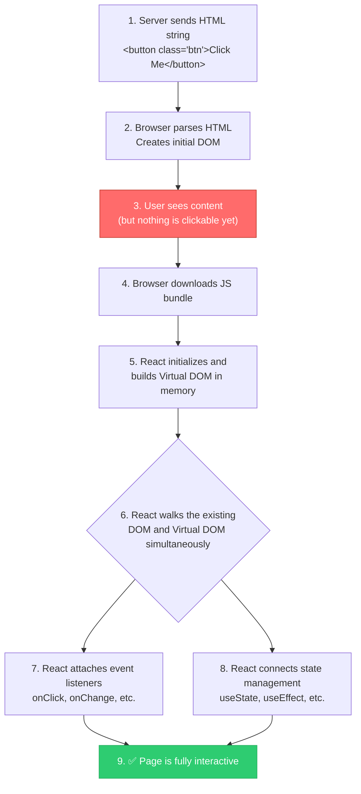

### Traditional Full Hydration — The Problem

```typescript
// PROBLEM: Full hydration must process the ENTIRE component tree
// Even components that have zero interactivity must be hydrated

function ProductPage() {
  return (
    <main>
      {/* These are purely static — but STILL hydrated */}
      <Header />           {/* Just a logo and nav links */}
      <Breadcrumbs />      {/* Just text: Home > Products > Shoes */}
      <ProductTitle />     {/* Just an h1 tag */}
      <ProductDescription /> {/* Just paragraphs of text */}
      <ReviewsList />      {/* A long list of static reviews */}
      
      {/* Only THESE actually need JavaScript */}
      <AddToCartButton />  {/* onClick handler */}
      <ImageCarousel />    {/* Swipe/click interactions */}
      <ReviewForm />       {/* Form with validation */}
      
      <Footer />           {/* More static content */}
    </main>
  );
}

// Result: Browser downloads and executes JS for ALL components
// even though only 3 out of 9 need interactivity
```

### Rehydration Strategies

#### 1. Progressive Hydration

Hydrate components **in order of priority**, starting with the most critical interactive elements.

```mermaid
gantt
    title Progressive Hydration Timeline
    dateFormat X
    axisFormat %s

    section Full Hydration
    Hydrate entire page          :crit, f1, 0, 10

    section Progressive
    Hydrate AddToCartButton      :active, p1, 0, 2
    Hydrate ImageCarousel        :active, p2, 2, 4
    Hydrate ReviewForm           :p3, 4, 6
    Hydrate non-critical UI      :p4, 6, 8
```

#### 2. Selective Hydration (React 18+)

React 18's `<Suspense>` enables selective hydration. If a user clicks on a component that hasn't hydrated yet, React **prioritizes its hydration**.

```typescript
import { Suspense, lazy } from 'react';

function ProductPage() {
  return (
    <main>
      {/* Hydrated immediately — critical interactive component */}
      <AddToCartButton />

      {/* Hydrated when idle — wrapped in Suspense */}
      <Suspense fallback={<div>Loading reviews...</div>}>
        <ReviewSection />
      </Suspense>

      {/* If user clicks this area before hydration completes,
          React will PRIORITIZE its hydration */}
      <Suspense fallback={<div>Loading comments...</div>}>
        <CommentSection />
      </Suspense>
    </main>
  );
}
```

#### 3. Resumability (Qwik's Approach)

Instead of replaying component logic to attach listeners, **Qwik serializes the listener information directly into HTML** and lazily loads handler code only when the user actually interacts.

```html
<!-- Qwik output: event handler info embedded in HTML attributes -->
<button 
  on:click="./chunk-abc.js#handleClick[0]"
  q:id="1"
>
  Click Me
</button>

<!-- No hydration needed! When user clicks, Qwik:
     1. Downloads chunk-abc.js (tiny file)
     2. Calls handleClick with serialized state
     Result: Near-zero startup JavaScript -->
```

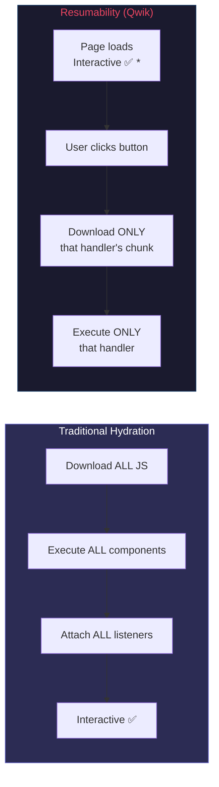

---

## 1.7 Island Architecture

### What Is It?

Island Architecture treats the page as a **sea of static HTML** with **islands of interactivity**. Each island hydrates independently — static content ships **zero JavaScript**. This is the core model behind frameworks like **Astro**, **Fresh (Deno)**, and **Eleventy**.

### Conceptual Visualization

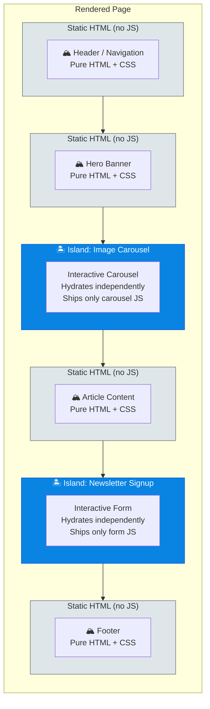

### Example: Astro Islands

```astro
---
// src/pages/index.astro
// This is the "server" part — runs at build time
import Header from '../components/Header.astro';      // Static (Astro component)
import Footer from '../components/Footer.astro';      // Static (Astro component)
import Carousel from '../components/Carousel.tsx';     // React component (island)
import Newsletter from '../components/Newsletter.vue'; // Vue component (island!)

const posts = await fetch('https://api.blog.com/posts').then(r => r.json());
---

<html>
  <body>
    <!-- Static: zero JavaScript -->
    <Header />

    <main>
      <h1>Welcome to Our Blog</h1>

      <!-- 🏝️ Island: Hydrates on page load -->
      <Carousel client:load images={posts[0].images} />

      <!-- Static: zero JavaScript -->
      {posts.map(post => (
        <article>
          <h2>{post.title}</h2>
          <p>{post.excerpt}</p>
        </article>
      ))}

      <!-- 🏝️ Island: Hydrates only when scrolled into view -->
      <Newsletter client:visible />

      <!-- 🏝️ Island: Hydrates only when browser is idle -->
      <SomeWidget client:idle />

      <!-- 🏝️ Island: Hydrates only on specific media query -->
      <MobileMenu client:media="(max-width: 768px)" />
    </main>

    <!-- Static: zero JavaScript -->
    <Footer />
  </body>
</html>
```

### Astro Hydration Directives

| Directive | Behavior |
|---|---|
| `client:load` | Hydrate immediately on page load |
| `client:idle` | Hydrate once the browser is idle (`requestIdleCallback`) |
| `client:visible` | Hydrate when the component scrolls into view (`IntersectionObserver`) |
| `client:media="query"` | Hydrate when a CSS media query matches |
| `client:only="react"` | Skip SSR entirely; render only on client (like CSR for this component) |
| *(no directive)* | **Never hydrate** — render as static HTML only |

### Why Islands Matter

```
Traditional SPA (React):     Bundle: 250 KB JS
Full SSR + Hydration:        Bundle: 250 KB JS (same — all components hydrate)
Island Architecture:         Bundle: 15 KB JS  (only interactive islands ship JS)
```

> 💡 **Key Insight**: For content-heavy sites, 80-95% of the page is typically static. Islands ensure you only pay the JavaScript cost for the parts that genuinely need interactivity.

---

## 1.8 Rendering Strategies Comparison

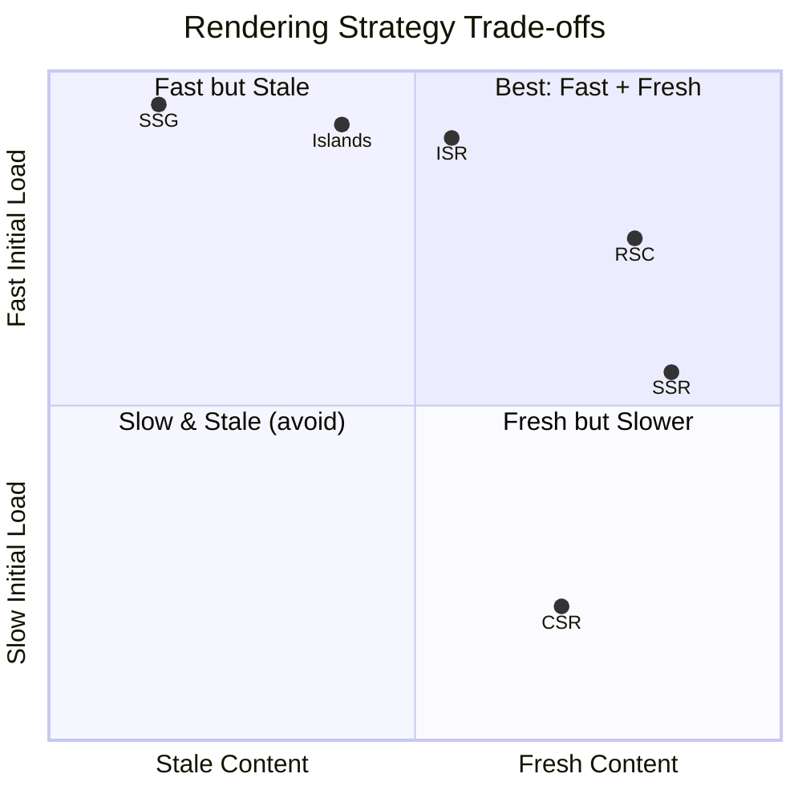

### Comprehensive Comparison Table

| Feature | CSR | SSR | SSG | ISR | RSC |
|---|---|---|---|---|---|
| **TTFB** | ⚡ Fast (static shell) | 🐌 Slow (render + data) | ⚡ Fastest (CDN) | ⚡ Fast (CDN) | ⚡ Fast (streaming) |
| **FCP** | 🐌 Slow (wait for JS) | ⚡ Fast (HTML ready) | ⚡ Fastest | ⚡ Fast | ⚡ Fast |
| **TTI** | 🐌 Slow (same as FCP) | ⚠️ Delayed (hydration) | ⚠️ Delayed (hydration) | ⚠️ Delayed (hydration) | ⚡ Minimal hydration |
| **SEO** | ❌ Poor | ✅ Excellent | ✅ Excellent | ✅ Excellent | ✅ Excellent |
| **Data Freshness** | ✅ Real-time | ✅ Per-request | ❌ Build-time only | ⚠️ Configurable | ✅ Per-request |
| **JS Shipped** | 🔴 All | 🔴 All (hydration) | 🔴 All (hydration) | 🔴 All (hydration) | 🟢 Client components only |
| **Server Cost** | None | High | None | Low | Medium |
| **Build Time** | Fast | Fast | Slow (many pages) | Fast | Fast |
| **Complexity** | Low | Medium | Low | Medium | High |

---

