# 2. Browser Internals & Performance

## Table of Contents

- [1.1 Critical Rendering Path](#11-critical-rendering-path)
  - [The Complete Pipeline](#the-complete-pipeline)
  - [Step 1: DOM Construction](#step-1-dom-construction)
  - [Step 2: CSSOM Construction](#step-2-cssom-construction)
  - [Step 3: Render Tree](#step-3-render-tree)
  - [Step 4: Layout (Reflow)](#step-4-layout-reflow)
  - [Step 5: Paint](#step-5-paint)
  - [Step 6: Composite](#step-6-composite)
  - [Cost Hierarchy of Visual Changes](#cost-hierarchy-of-visual-changes)
- [1.2 Browser Event Loop](#12-browser-event-loop)
  - [The Single-Threaded Reality](#the-single-threaded-reality)
  - [Complete Event Loop Architecture](#complete-event-loop-architecture)
  - [The Event Loop Cycle](#the-event-loop-cycle)
  - [Microtasks vs. Macrotasks](#microtasks-vs-macrotasks)
  - [The Critical Rule](#the-critical-rule)
  - [Web Workers: True Parallelism](#web-workers-true-parallelism)
  - [Web Worker Limitations](#web-worker-limitations)
- [1.3 Core Web Vitals](#13-core-web-vitals)
  - [LCP — Largest Contentful Paint](#lcp-largest-contentful-paint)
    - [Optimization Strategies for LCP](#optimization-strategies-for-lcp)
  - [INP — Interaction to Next Paint](#inp-interaction-to-next-paint)
    - [INP Breakdown](#inp-breakdown)
    - [Optimization Strategies for INP](#optimization-strategies-for-inp)
  - [CLS — Cumulative Layout Shift](#cls-cumulative-layout-shift)
    - [CLS Score Calculation](#cls-score-calculation)
    - [Common Causes and Fixes](#common-causes-and-fixes)
  - [Core Web Vitals Targets Summary](#core-web-vitals-targets-summary)
- [1.4 Assets Optimization](#14-assets-optimization)
  - [Code Splitting](#code-splitting)
    - [Route-Based Splitting (React)](#route-based-splitting-react)
    - [Component-Level Splitting](#component-level-splitting)
  - [Tree Shaking](#tree-shaking)
    - [Making Your Code Tree-Shakeable](#making-your-code-tree-shakeable)
  - [Lazy Loading](#lazy-loading)
  - [HTTP/2 & HTTP/3 Multiplexing](#http2-and-http3-multiplexing)
    - [HTTP/1.1 vs HTTP/2 vs HTTP/3 Comparison](#http11-vs-http2-vs-http3-comparison)
    - [Implications for Bundling Strategy](#implications-for-bundling-strategy)


Understanding how the browser transforms bytes of HTML, CSS, and JavaScript into pixels on screen is essential for writing performant frontend code.

---

## 1.1 Critical Rendering Path

The **Critical Rendering Path (CRP)** is the sequence of steps the browser takes to convert HTML, CSS, and JS into rendered pixels.

### The Complete Pipeline

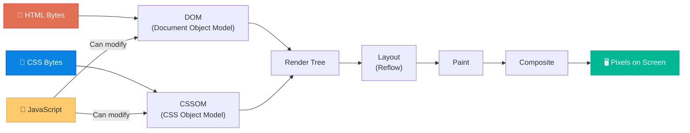

### Step 1: DOM Construction

The browser parses raw HTML bytes into a **tree of nodes** called the Document Object Model.

```
HTML Bytes → Characters → Tokens → Nodes → DOM Tree
```

```html
<!DOCTYPE html>
<html>
  <head>
    <title>Example</title>
    <link rel="stylesheet" href="styles.css">
  </head>
  <body>
    <h1 class="title">Hello</h1>
    <p>World</p>
  </body>
</html>
```

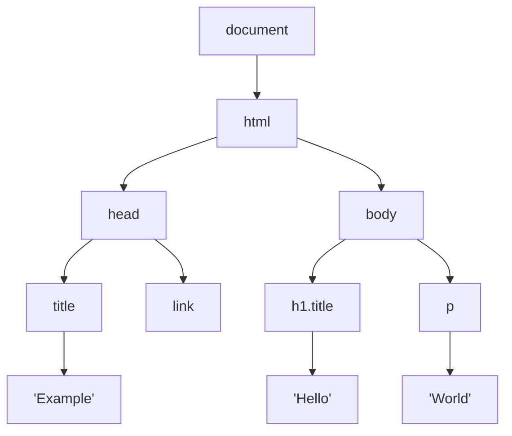

> ⚠️ **Parser-Blocking Resources**: When the HTML parser encounters a `<script>` tag (without `async` or `defer`), it **stops** DOM construction, downloads the script, executes it, then resumes parsing. This is why script placement and loading strategies matter enormously.

### Step 2: CSSOM Construction

Similarly, the browser parses CSS into the **CSS Object Model** — a tree structure representing style rules and specificity.

```css
/* styles.css */
body { font-size: 16px; color: #333; }
h1.title { font-size: 2em; color: #000; font-weight: bold; }
p { line-height: 1.6; }
```

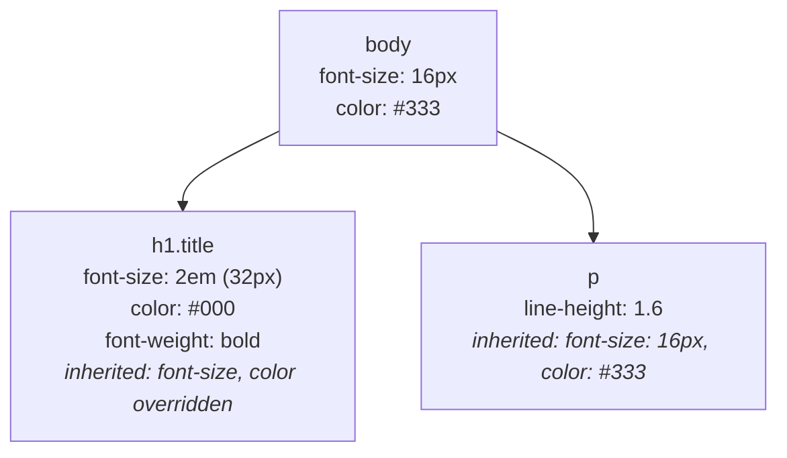

> ⚠️ **Render-Blocking**: CSS is **render-blocking** by default. The browser will not paint anything until the CSSOM is fully constructed. This prevents a "Flash of Unstyled Content" (FOUC) but means CSS delivery is critical for performance.

### Step 3: Render Tree

The browser combines the DOM and CSSOM into the **Render Tree** — which contains only **visible** nodes with their computed styles.

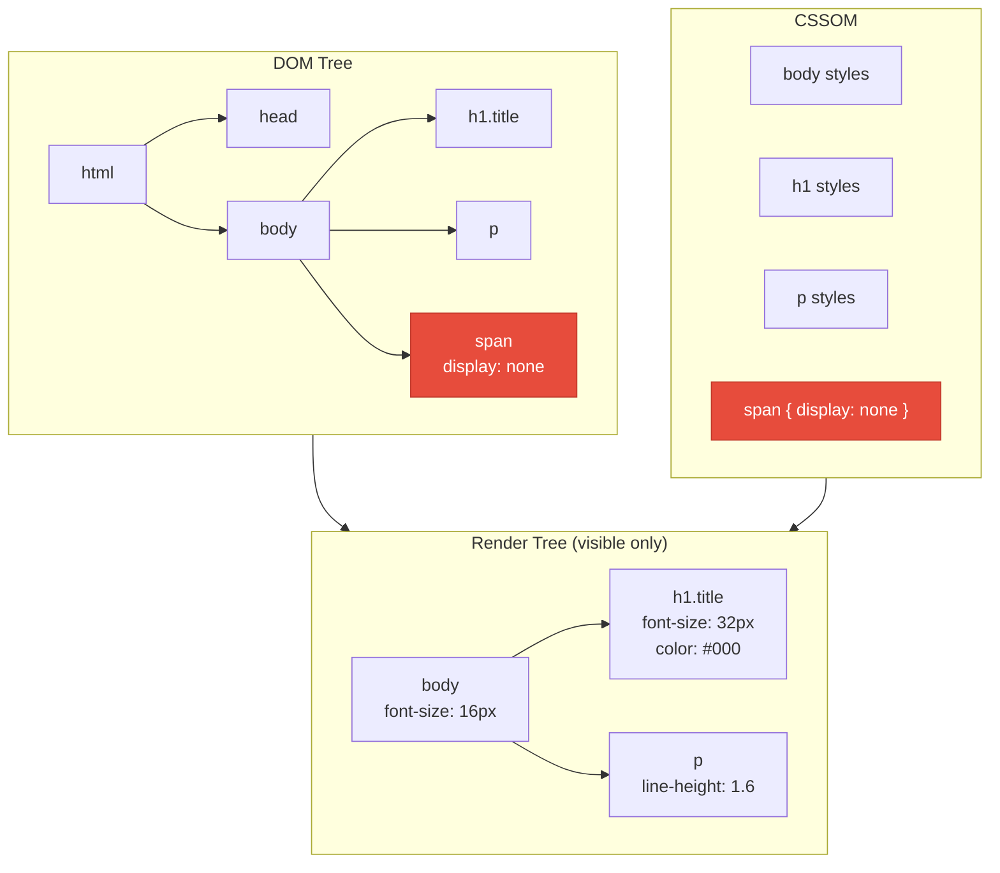

> Nodes with `display: none`, `<head>`, `<script>`, and `<meta>` are **excluded** from the Render Tree. Elements with `visibility: hidden` ARE included (they take up space but are invisible).

### Step 4: Layout (Reflow)

The browser calculates the **exact position and size** of every element in the Render Tree based on the viewport dimensions.

```
Viewport: 1200px × 800px

body:     x=0, y=0, width=1200px, height=auto
  h1:     x=0, y=0, width=1200px, height=44px
  p:      x=0, y=60px, width=1200px, height=26px
```

> ⚠️ **Layout Thrashing**: Reading layout properties (like `offsetHeight`, `getBoundingClientRect()`) and then immediately writing style changes forces the browser to perform synchronous layout calculations. This is one of the most common performance pitfalls.

```javascript
// ❌ BAD — Layout Thrashing (forced synchronous layout)
elements.forEach(el => {
  const height = el.offsetHeight;      // READ → forces layout
  el.style.height = (height * 2) + 'px'; // WRITE → invalidates layout
  // Next iteration's READ forces another layout calculation!
});

// ✅ GOOD — Batch reads, then batch writes
const heights = elements.map(el => el.offsetHeight); // All READs first
elements.forEach((el, i) => {
  el.style.height = (heights[i] * 2) + 'px';        // All WRITEs after
});
```

### Step 5: Paint

The browser fills in **pixels** for every visual element — text, colors, images, borders, shadows. It creates **paint records**: an ordered list of drawing instructions.

Modern browsers break the page into **layers** for efficient painting:

```
Layer 1 (root): Background, text content
Layer 2: Fixed navigation header
Layer 3: Modal overlay
Layer 4: CSS animation on a card element
```

Elements that get their own layer (compositing layer):
- Elements with `will-change: transform`
- Elements with 3D transforms (`transform: translateZ(0)`)
- `<video>`, `<canvas>` elements
- Elements with CSS animations on `opacity` or `transform`

### Step 6: Composite

The browser sends layers to the **GPU**, which combines (composites) them into the final image displayed on screen. This is the cheapest step and happens on a **separate thread**.

### Cost Hierarchy of Visual Changes

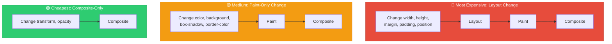

> 💡 **Performance Rule**: Prefer `transform` and `opacity` for animations. They can be handled entirely by the compositor thread without triggering layout or paint.

```css
/* ❌ SLOW — triggers Layout → Paint → Composite */
.animate-bad {
  transition: left 0.3s, top 0.3s;
  left: 100px;
  top: 50px;
}

/* ✅ FAST — triggers only Composite */
.animate-good {
  transition: transform 0.3s;
  transform: translate(100px, 50px);
  will-change: transform;
}
```

---

## 1.2 Browser Event Loop

### The Single-Threaded Reality

JavaScript runs on a **single main thread**. The event loop is the mechanism that coordinates code execution, event handling, and rendering.

### Complete Event Loop Architecture

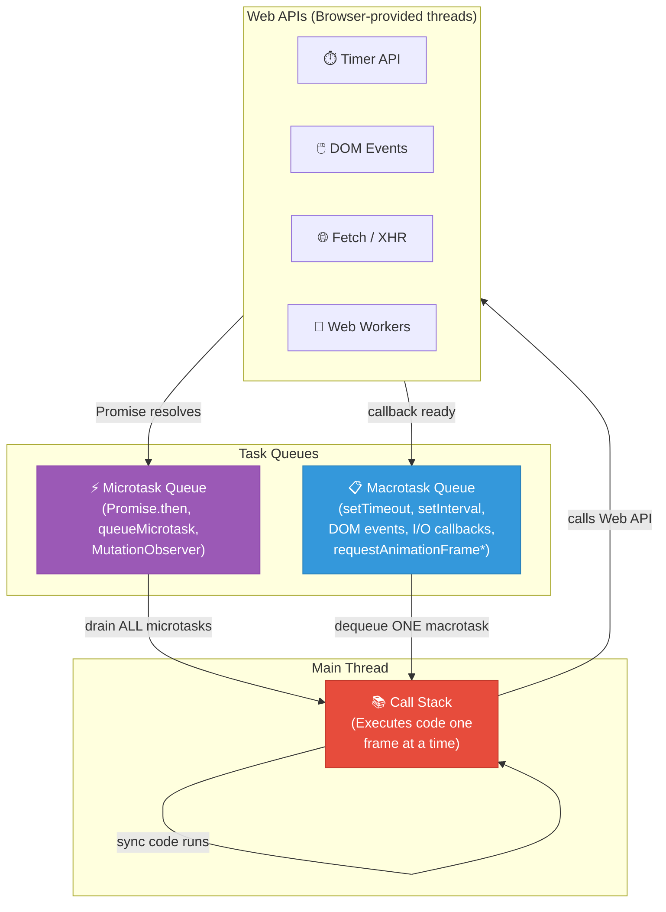

### The Event Loop Cycle

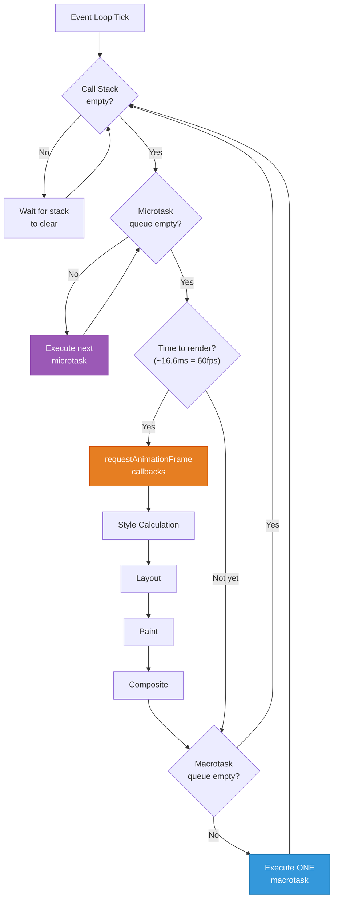

### Microtasks vs. Macrotasks

```javascript
console.log('1: Sync start');                          // 1️⃣ Runs immediately

setTimeout(() => {
  console.log('5: setTimeout (macrotask)');             // 5️⃣ Macrotask
}, 0);

Promise.resolve()
  .then(() => {
    console.log('3: Promise.then (microtask)');         // 3️⃣ Microtask
    
    // Microtasks spawned by microtasks run before ANY macrotask
    return Promise.resolve();
  })
  .then(() => {
    console.log('4: Chained Promise (microtask)');      // 4️⃣ Microtask
  });

queueMicrotask(() => {
  console.log('3.5: queueMicrotask (microtask)');      // Between 3 and 4
});

console.log('2: Sync end');                            // 2️⃣ Runs immediately

// OUTPUT:
// 1: Sync start
// 2: Sync end
// 3: Promise.then (microtask)
// 3.5: queueMicrotask (microtask)
// 4: Chained Promise (microtask)
// 5: setTimeout (macrotask)
```

### The Critical Rule

```
┌─────────────────────────────────────────────────────────────┐
│                    EVENT LOOP PRIORITY                       │
│                                                             │
│  1. Execute all synchronous code on the call stack          │
│  2. Drain ALL microtasks (including newly spawned ones)     │
│  3. Render (if due) → rAF → Style → Layout → Paint         │
│  4. Execute ONE macrotask                                   │
│  5. Go to step 1                                            │
│                                                             │
│  ⚠️ Microtasks can STARVE rendering & macrotasks!           │
│     An infinite microtask loop freezes the page.            │
└─────────────────────────────────────────────────────────────┘
```

| Microtasks | Macrotasks |
|---|---|
| `Promise.then/catch/finally` | `setTimeout` |
| `queueMicrotask()` | `setInterval` |
| `MutationObserver` | DOM event callbacks (`click`, `input`) |
| `process.nextTick()` (Node.js) | `requestAnimationFrame`* |
| | `MessageChannel` |
| | I/O callbacks |
| | `setImmediate()` (Node.js) |

> \* `requestAnimationFrame` technically runs before paint in the render step, but is often grouped with macrotasks conceptually. It has its own dedicated phase in the event loop.

### Web Workers: True Parallelism

Web Workers provide **real multi-threading** in the browser, running JavaScript on a separate OS thread.

```javascript
// main.js — Main Thread
const worker = new Worker('/heavy-worker.js');

// Send data to the worker
worker.postMessage({
  type: 'PROCESS_IMAGE',
  imageData: largeImageBuffer,
});

// Receive results from the worker
worker.onmessage = (event) => {
  const { processedImage, stats } = event.data;
  console.log('Processing complete!', stats);
  displayImage(processedImage);
};

worker.onerror = (error) => {
  console.error('Worker error:', error.message);
};
```

```javascript
// heavy-worker.js — Worker Thread (separate thread)
self.onmessage = (event) => {
  const { type, imageData } = event.data;

  if (type === 'PROCESS_IMAGE') {
    // CPU-intensive work runs here without blocking the UI
    const result = applyComplexFilters(imageData);
    const stats = calculateHistogram(imageData);

    // Send results back to main thread
    self.postMessage({
      processedImage: result,
      stats: stats,
    });
  }
};

function applyComplexFilters(data) {
  // Heavy computation — would freeze UI if on main thread
  for (let i = 0; i < data.length; i += 4) {
    data[i]     = Math.min(255, data[i] * 1.2);     // R
    data[i + 1] = Math.min(255, data[i + 1] * 1.1); // G
    data[i + 2] = Math.min(255, data[i + 2] * 0.9); // B
  }
  return data;
}
```

### Web Worker Limitations

```mermaid
flowchart LR
    subgraph MT["Main Thread"]
        DOM["DOM Access ✅"]
        Window["window object ✅"]
        UI["UI Updates ✅"]
        WA["Web APIs ✅"]
    end

    subgraph WT["Worker Thread"]
        Compute["Heavy Computation ✅"]
        Fetch2["fetch() ✅"]
        WS["WebSocket ✅"]
        IDB["IndexedDB ✅"]
        NoDOM["DOM Access ❌"]
        NoWindow["window ❌"]
        NoUI["UI Updates ❌"]
    end

    MT <-->|"postMessage()<br/>(structured clone)"| WT

    style MT fill:#2ecc71,stroke:#27ae60,color:#fff
    style WT fill:#3498db,stroke:#2980b9,color:#fff
```

---

## 1.3 Core Web Vitals

Core Web Vitals are Google's standardized metrics for measuring real-world user experience. They directly impact **search rankings** and represent the three pillars of user experience: **loading**, **interactivity**, and **visual stability**.

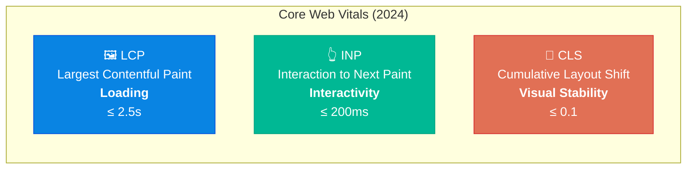

### LCP — Largest Contentful Paint

**What it measures**: The time from when the page starts loading to when the **largest content element** (image, video, text block) in the viewport is fully rendered.

**What counts as LCP elements?**
- `` elements
- `<image>` inside `<svg>`
- `<video>` poster images
- Elements with `background-image` loaded via CSS
- Block-level text elements (`<h1>`, `<p>`, etc.)

```mermaid
gantt
    title LCP Timeline — What Happens
    dateFormat X
    axisFormat %s

    section Network
    DNS + TCP + TLS        :n1, 0, 1
    TTFB (server response) :n2, 1, 3
    HTML Download           :n3, 3, 4

    section Parse
    DOM Construction        :p1, 4, 5
    CSSOM Construction      :p2, 4, 6

    section Resources
    Hero Image Download     :r1, 5, 8
    Font Download           :r2, 5, 7

    section Render
    First Paint (FP)        :milestone, m1, 6, 0
    LCP Element Rendered    :milestone, m2, 8, 0
    
    section Targets
    Good LCP (≤2.5s)     :crit, t1, 0, 25
```

#### Optimization Strategies for LCP

```html
<!-- 1. PRELOAD critical resources -->
<head>
  <!-- Tell the browser to start downloading the hero image immediately -->
  <link rel="preload" as="image" href="/hero-image.webp" 
        fetchpriority="high" />
  
  <!-- Preload critical fonts -->
  <link rel="preload" as="font" href="/fonts/Inter.woff2" 
        type="font/woff2" crossorigin />
  
  <!-- Preconnect to third-party origins -->
  <link rel="preconnect" href="https://cdn.example.com" />
  <link rel="dns-prefetch" href="https://analytics.example.com" />
</head>
```

```html
<!-- 2. OPTIMIZE the LCP image -->


<!-- Use responsive images to avoid downloading oversized images -->

```

```javascript
// 3. SERVER-SIDE: Reduce TTFB
// - Use a CDN to serve from the nearest edge
// - Use streaming SSR to send HTML in chunks
// - Avoid synchronous database calls that block the response
// - Cache aggressively at the edge

// 4. ELIMINATE render-blocking CSS
// Inline critical CSS in <head>
// Defer non-critical CSS
const linkEl = document.createElement('link');
linkEl.rel = 'stylesheet';
linkEl.href = '/non-critical-styles.css';
linkEl.media = 'print'; // Load as print stylesheet (non-blocking)
linkEl.onload = () => { linkEl.media = 'all'; }; // Switch to all on load
document.head.appendChild(linkEl);
```

### INP — Interaction to Next Paint

**What it measures**: The latency between a user interaction (click, tap, or keyboard input) and the next visual update (paint). INP reports the **worst interaction** (approximately the p98 — 98th percentile) throughout the page lifecycle.

> INP replaced FID (First Input Delay) in March 2024. Unlike FID which only measured the *first* interaction's delay, INP measures *all* interactions throughout the page's lifetime.

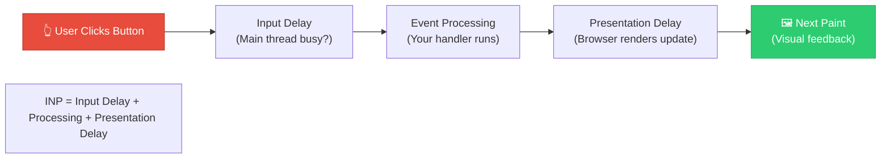

#### INP Breakdown

| Phase | What's Happening | How to Optimize |
|---|---|---|
| **Input Delay** | Main thread is blocked by other tasks when user interacts | Break up long tasks; yield to main thread |
| **Processing Time** | Your event handler code runs | Keep handlers fast; defer non-critical work |
| **Presentation Delay** | Browser calculates styles, layout, paints | Minimize DOM updates; use `content-visibility` |

#### Optimization Strategies for INP

```javascript
// ❌ BAD — Long task blocks the main thread (>50ms is a "long task")
button.addEventListener('click', () => {
  // Synchronous heavy computation
  const result = heavyComputation(data);     // 200ms
  updateDOM(result);                          // 50ms
  sendAnalytics(result);                      // 100ms
  // Total: 350ms — terrible INP!
});

// ✅ GOOD — Break up work and yield to the browser
button.addEventListener('click', async () => {
  // Show immediate visual feedback
  button.textContent = 'Processing...';
  button.disabled = true;

  // Yield to let the browser paint the feedback
  await yieldToMain();

  // Do heavy work in smaller chunks
  const result = await processInChunks(data);
  updateDOM(result);

  // Defer non-critical work
  requestIdleCallback(() => {
    sendAnalytics(result);
  });
});

// Helper: Yield control back to the browser
function yieldToMain() {
  return new Promise(resolve => {
    // setTimeout(resolve, 0) puts this at the back of the macrotask queue
    // allowing the browser to render between now and when we resume
    setTimeout(resolve, 0);
  });
}

// Modern alternative: scheduler.yield() (Chrome 115+)
async function yieldToMainModern() {
  if ('scheduler' in window && 'yield' in scheduler) {
    await scheduler.yield();
  } else {
    await new Promise(resolve => setTimeout(resolve, 0));
  }
}

// Process data in chunks to avoid long tasks
async function processInChunks(data, chunkSize = 100) {
  const results = [];
  for (let i = 0; i < data.length; i += chunkSize) {
    const chunk = data.slice(i, i + chunkSize);
    results.push(...chunk.map(processItem));
    
    // Yield after each chunk so browser can handle events & render
    if (i + chunkSize < data.length) {
      await yieldToMain();
    }
  }
  return results;
}
```

```javascript
// ✅ Use CSS `content-visibility` for off-screen content
// This tells the browser it can skip rendering off-screen elements
```

```css
/* Huge performance win for long pages with many sections */
.below-the-fold-section {
  content-visibility: auto;
  contain-intrinsic-size: 0 500px; /* Estimated height for layout */
}
```

### CLS — Cumulative Layout Shift

**What it measures**: The total of all **unexpected layout shifts** that occur during the page's lifetime. A layout shift happens when a visible element changes its position from one rendered frame to the next, without being triggered by user input.

#### CLS Score Calculation

```
Layout Shift Score = Impact Fraction × Distance Fraction

Impact Fraction = Area of viewport affected by shift / Total viewport area
Distance Fraction = Largest distance any element moved / Viewport height (or width)
```

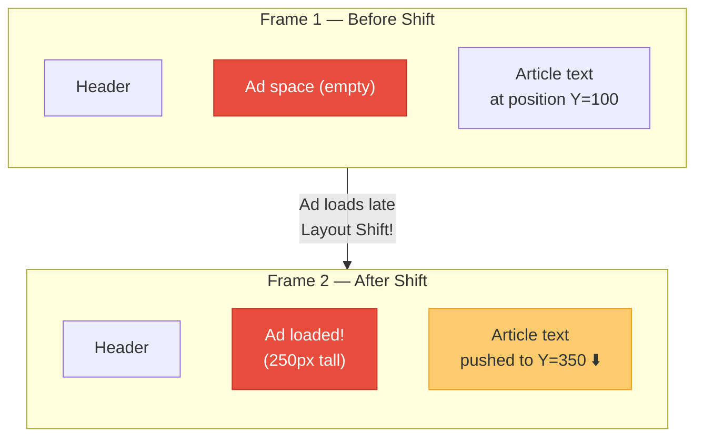

#### Common Causes and Fixes

```html
<!-- ❌ BAD — Image without dimensions causes layout shift -->


<!-- ✅ GOOD — Always set width and height -->


<!-- ✅ GOOD — Use CSS aspect-ratio for responsive images -->
<style>
  .responsive-img {
    width: 100%;
    aspect-ratio: 16 / 9;
    object-fit: cover;
  }
</style>

```

```html
<!-- ❌ BAD — Ad/embed without reserved space -->
<div class="content">
  <p>Article text...</p>
  <div id="ad-slot"></div>  <!-- Size unknown until ad loads -->
  <p>More text...</p>
</div>

<!-- ✅ GOOD — Reserve space for dynamic content -->
<div class="content">
  <p>Article text...</p>
  <div id="ad-slot" style="min-height: 250px; background: #f0f0f0;">
    <!-- Ad will load here — space is reserved -->
  </div>
  <p>More text...</p>
</div>
```

```css
/* ❌ BAD — Web fonts cause text to reflow (FOUT) */
body {
  font-family: 'CustomFont', sans-serif;
}

/* ✅ GOOD — Use font-display to control swap behavior */
@font-face {
  font-family: 'CustomFont';
  src: url('/fonts/CustomFont.woff2') format('woff2');
  font-display: optional; /* Best for CLS — uses fallback if font isn't cached */
  /* alternatives:
     swap   — always shows text, swaps when loaded (can cause shift)
     block  — hides text briefly, then swaps (can cause shift)
     optional — uses font only if already cached (no shift, best CLS)
  */
}
```

```javascript
// ❌ BAD — Injecting content above existing content
function loadNotification() {
  const banner = document.createElement('div');
  banner.textContent = 'New update available!';
  banner.style.height = '50px';
  // This pushes ALL content down — layout shift!
  document.body.prepend(banner);
}

// ✅ GOOD — Use transform for enter animations (no layout shift)
function loadNotification() {
  const banner = document.createElement('div');
  banner.textContent = 'New update available!';
  banner.style.cssText = `
    position: fixed;
    top: 0;
    left: 0;
    right: 0;
    transform: translateY(-100%);
    transition: transform 0.3s ease;
    z-index: 1000;
  `;
  document.body.appendChild(banner);
  requestAnimationFrame(() => {
    banner.style.transform = 'translateY(0)';
  });
}
```

### Core Web Vitals Targets Summary

| Metric | Good | Needs Improvement | Poor |
|---|:---:|:---:|:---:|
| **LCP** | ≤ 2.5s | 2.5s – 4.0s | > 4.0s |
| **INP** | ≤ 200ms | 200ms – 500ms | > 500ms |
| **CLS** | ≤ 0.1 | 0.1 – 0.25 | > 0.25 |

---

## 1.4 Assets Optimization

### Code Splitting

Code splitting breaks your JavaScript bundle into **smaller chunks** that load on demand, rather than forcing users to download the entire application upfront.

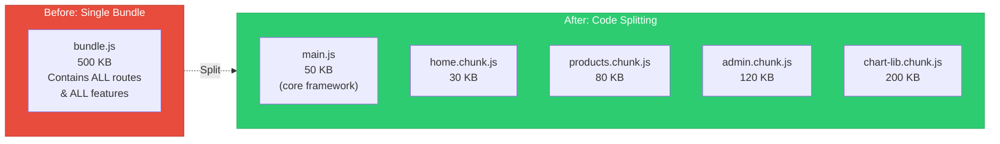

#### Route-Based Splitting (React)

```typescript
import { lazy, Suspense } from 'react';
import { Routes, Route } from 'react-router-dom';

// These imports create separate chunks — downloaded only when needed
const Home = lazy(() => import('./pages/Home'));
const Products = lazy(() => import('./pages/Products'));
const ProductDetail = lazy(() => import('./pages/ProductDetail'));
const AdminDashboard = lazy(() => import('./pages/AdminDashboard'));

function App() {
  return (
    <Suspense fallback={<LoadingSpinner />}>
      <Routes>
        <Route path="/" element={<Home />} />
        <Route path="/products" element={<Products />} />
        <Route path="/products/:id" element={<ProductDetail />} />
        <Route path="/admin" element={<AdminDashboard />} />
      </Routes>
    </Suspense>
  );
}
```

#### Component-Level Splitting

```typescript
import { lazy, Suspense, useState } from 'react';

// Heavy component loaded only when needed
const HeavyChartLibrary = lazy(() => import('./components/AnalyticsChart'));
const MarkdownEditor = lazy(() => import('./components/MarkdownEditor'));

function Dashboard() {
  const [showChart, setShowChart] = useState(false);

  return (
    <div>
      <h1>Dashboard</h1>

      <button onClick={() => setShowChart(true)}>
        Show Analytics
      </button>

      {showChart && (
        <Suspense fallback={<div>Loading chart library...</div>}>
          <HeavyChartLibrary data={analyticsData} />
        </Suspense>
      )}
    </div>
  );
}
```

### Tree Shaking

Tree shaking is a **dead code elimination** technique that removes unused exports from your bundle at build time. It relies on **ES Module static analysis**.

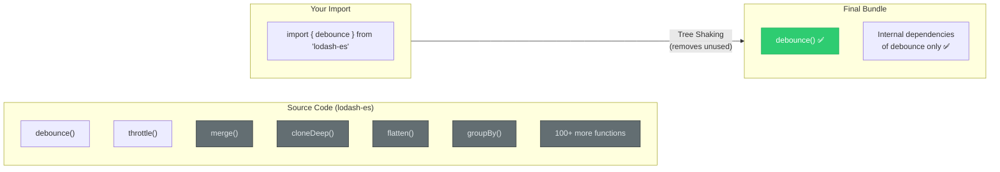

```javascript
// ❌ BAD — Imports entire library; tree shaking may not help with CJS
const _ = require('lodash');
_.debounce(fn, 300);

// ❌ MEDIOCRE — Named import from CJS doesn't tree shake well
import _ from 'lodash';
_.debounce(fn, 300);

// ✅ GOOD — Named import from ES module package
import { debounce } from 'lodash-es';
debounce(fn, 300);

// ✅ BEST — Direct path import (most reliable)
import debounce from 'lodash-es/debounce';
debounce(fn, 300);
```

#### Making Your Code Tree-Shakeable

```javascript
// ✅ GOOD — Named exports enable tree shaking
// utils.js
export function formatDate(date) { /* ... */ }
export function formatCurrency(amount) { /* ... */ }
export function formatPercentage(value) { /* ... */ }

// consumer.js — Only formatDate will be in the bundle
import { formatDate } from './utils';

// ❌ BAD — Default export of an object defeats tree shaking
// utils.js
export default {
  formatDate(date) { /* ... */ },
  formatCurrency(amount) { /* ... */ },
  formatPercentage(value) { /* ... */ },
};

// consumer.js — The ENTIRE object is included
import utils from './utils';
utils.formatDate(new Date());
```

```json
// package.json — Mark your package as side-effect free
{
  "name": "my-library",
  "sideEffects": false,
  // Or specify files with side effects:
  "sideEffects": [
    "*.css",
    "./src/polyfills.js"
  ]
}
```

### Lazy Loading

Lazy loading defers the loading of resources until they are needed — most commonly for images, videos, and below-the-fold content.

```html
<!-- Native lazy loading for images -->

  width="400" 
  height="300"
/>

<!-- ⚠️ NEVER lazy-load the LCP image! -->

  fetchpriority="high"
/>

<!-- Native lazy loading for iframes -->
<iframe 
  src="https://www.youtube.com/embed/xyz" 
  loading="lazy"
  width="560" 
  height="315"
></iframe>
```

```javascript
// Intersection Observer — for custom lazy loading
const observer = new IntersectionObserver(
  (entries) => {
    entries.forEach(entry => {
      if (entry.isIntersecting) {
        const img = entry.target;
        img.src = img.dataset.src;          // Load real image
        img.srcset = img.dataset.srcset;    // Load srcset
        img.classList.remove('lazy');
        observer.unobserve(img);            // Stop watching
      }
    });
  },
  {
    rootMargin: '200px',  // Start loading 200px before entering viewport
  }
);

document.querySelectorAll('img.lazy').forEach(img => {
  observer.observe(img);
});
```

### HTTP/2 & HTTP/3 Multiplexing

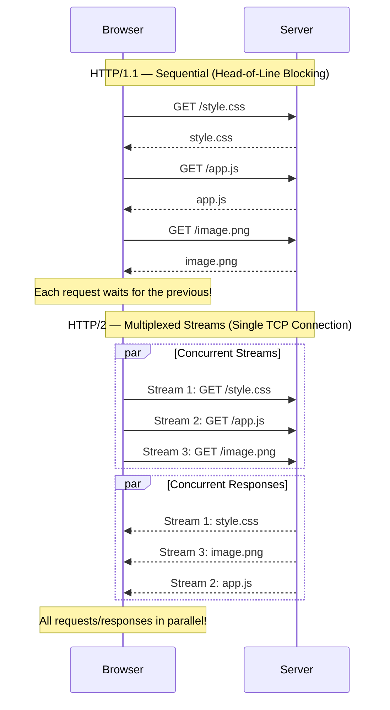

#### HTTP/1.1 vs HTTP/2 vs HTTP/3 Comparison

| Feature | HTTP/1.1 | HTTP/2 | HTTP/3 |
|---|---|---|---|
| **Transport** | TCP | TCP | QUIC (UDP-based) |
| **Multiplexing** | ❌ One request per connection | ✅ Multiple streams, one TCP connection | ✅ Multiple streams, independent |
| **Head-of-Line Blocking** | ❌ TCP level | ⚠️ TCP level still (packet loss blocks all streams) | ✅ None — streams are independent |
| **Header Compression** | ❌ None | ✅ HPACK | ✅ QPACK |
| **Server Push** | ❌ | ✅ (deprecated in practice) | ✅ (rarely used) |
| **Connection Setup** | TCP 3-way + TLS = ~3 RTT | TCP + TLS = ~2-3 RTT | 0-1 RTT (0-RTT resumption!) |
| **Connection Migration** | ❌ New connection if IP changes | ❌ Same | ✅ Seamless (connection ID, not IP-based) |

#### Implications for Bundling Strategy

```
HTTP/1.1 Era:
  - Bundle everything into few large files (reduce connections)
  - Use domain sharding for parallel downloads
  - Concatenate CSS into one big file
  - Sprite sheets for icons

HTTP/2+ Era:
  - Many small files is fine (multiplexing handles it)
  - Code splitting is cheap — no connection overhead
  - Ship individual modules on demand
  - Granular caching — change one module, only that module invalidates
```

```javascript
// Modern bundler configuration (Vite / webpack)
// Optimized for HTTP/2+ with granular chunks
export default defineConfig({
  build: {
    rollupOptions: {
      output: {
        manualChunks: {
          // Vendor splitting — large libraries get their own chunks
          'react-vendor': ['react', 'react-dom'],
          'router': ['react-router-dom'],
          'chart': ['chart.js', 'react-chartjs-2'],
          'utils': ['date-fns', 'clsx'],
        },
      },
    },
    // Generate small, granular chunks
    chunkSizeWarningLimit: 500,  // Warn if chunk > 500 KB
  },
});
```

---

