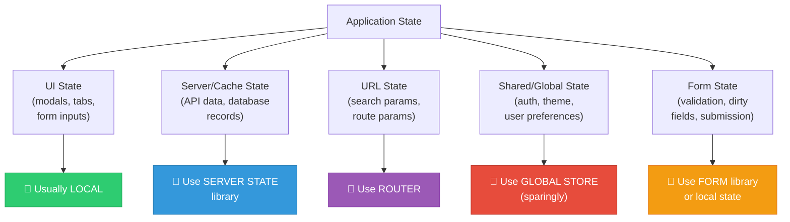
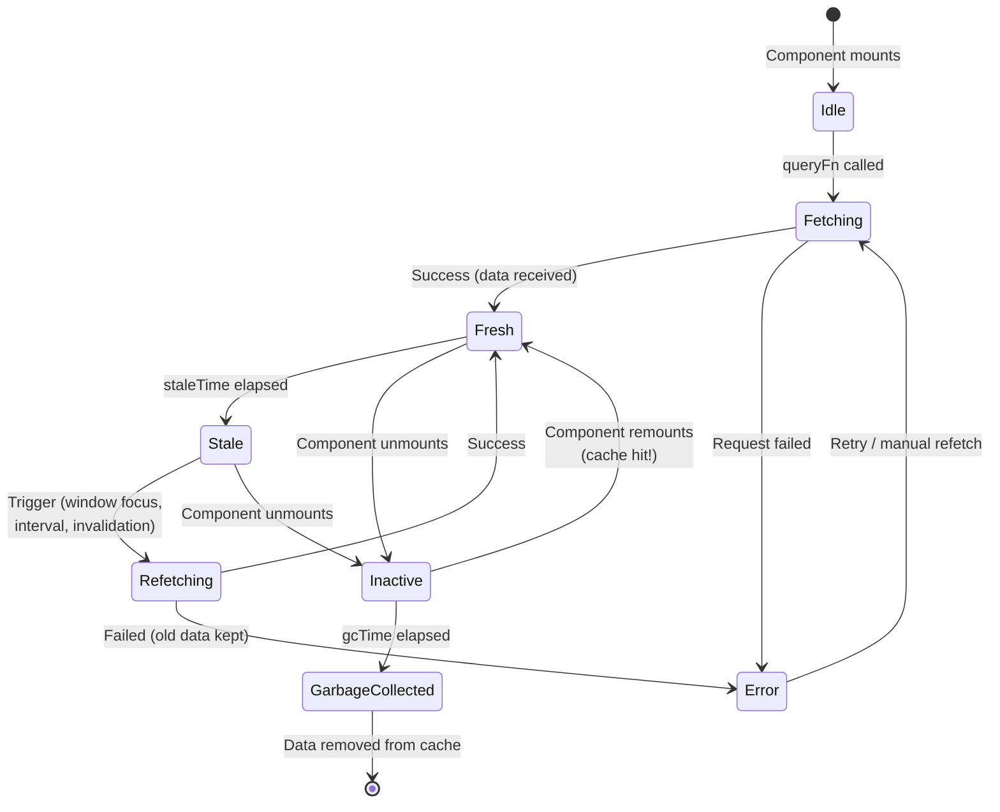
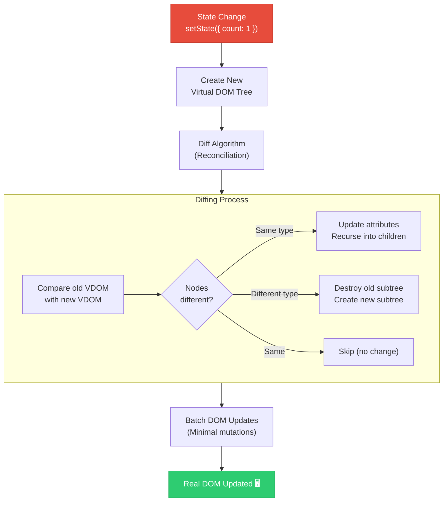
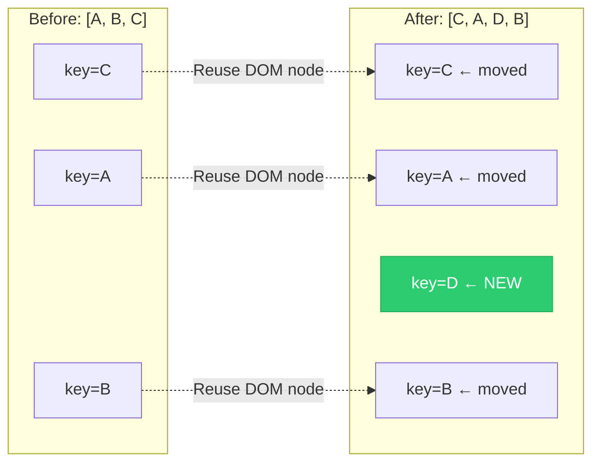
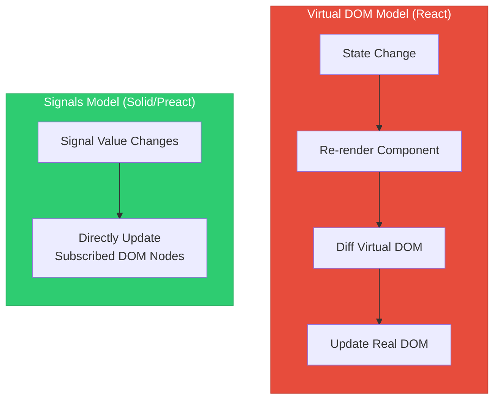
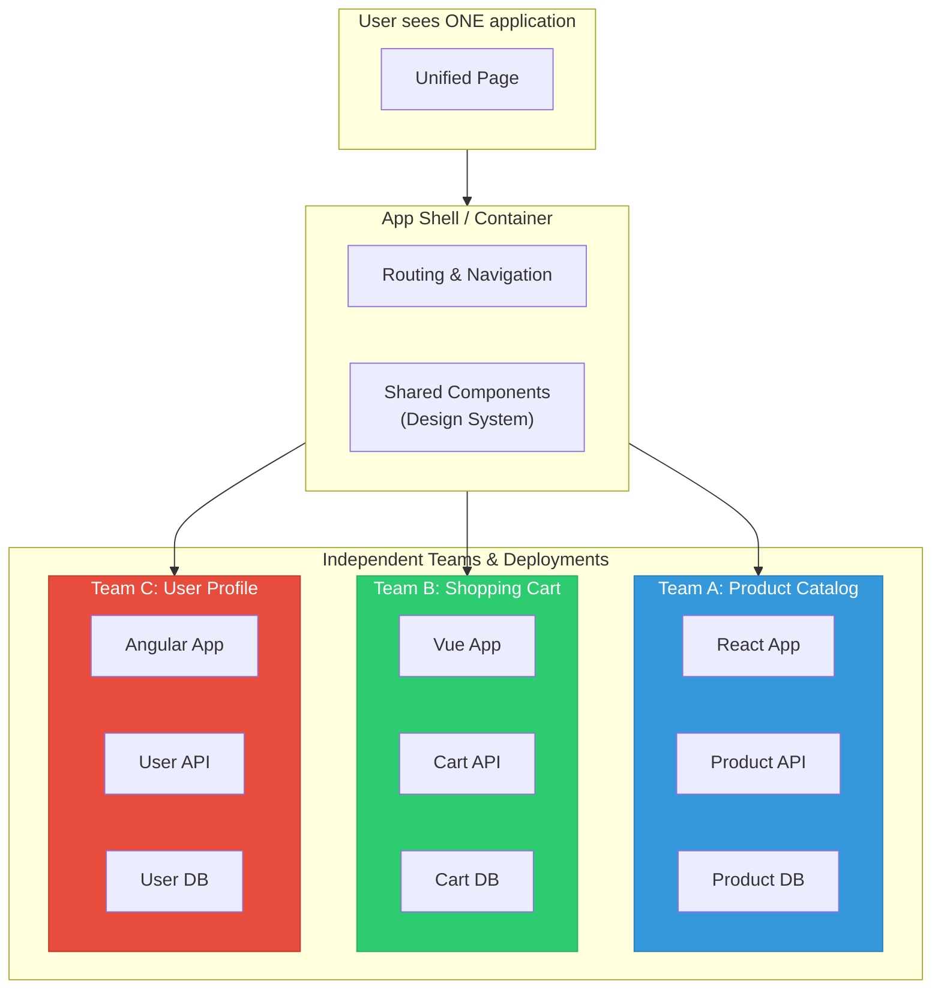
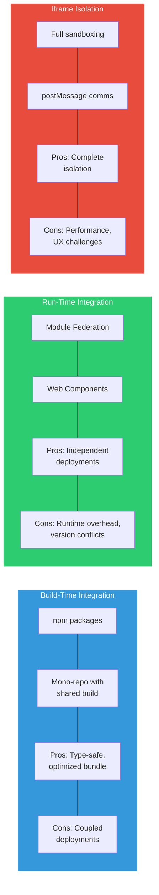
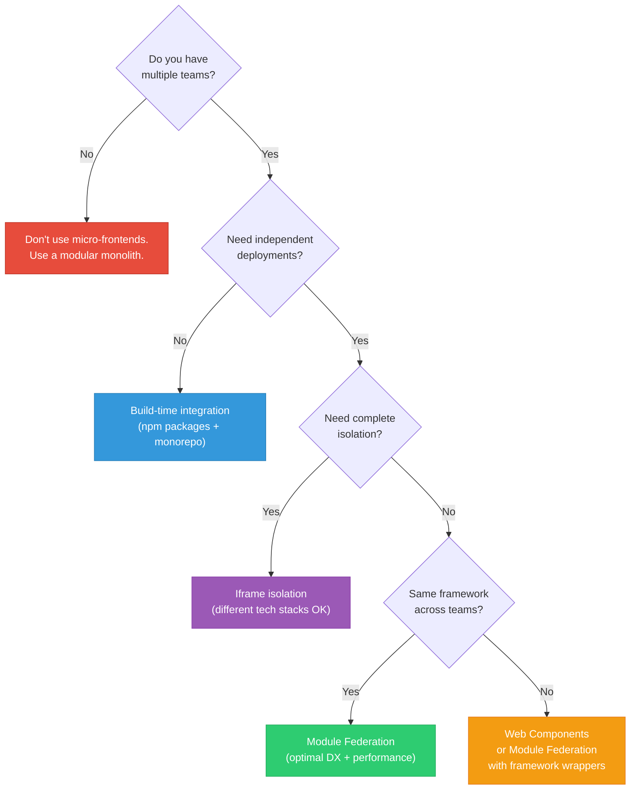
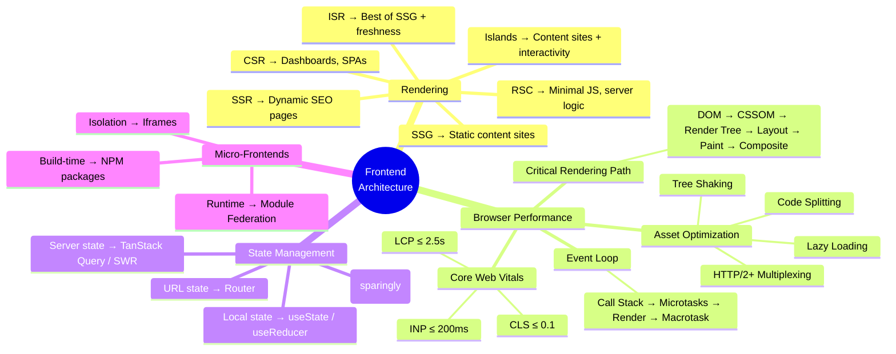

# 3. State Management & Application Design

## Table of Contents

- [3.1 Global vs. Local State](#31-global-vs-local-state)
  - [State Categories](#state-categories)
  - [The Decision Framework](#the-decision-framework)
  - [Local State](#local-state)
  - [Global State (Zustand Example)](#global-state-zustand-example)
  - [React Context — When and Why](#react-context-when-and-why)
- [3.2 Server State Management](#32-server-state-management)
  - [TanStack Query (React Query) — Comprehensive Example](#tanstack-query-react-query-comprehensive-example)
  - [Query Lifecycle Visualization](#query-lifecycle-visualization)
  - [SWR Comparison](#swr-comparison)
  - [TanStack Query vs SWR](#tanstack-query-vs-swr)
- [3.3 Reactivity Models](#33-reactivity-models)
  - [Virtual DOM Reconciliation (React)](#virtual-dom-reconciliation-react)
    - [How React's Diffing Works](#how-reacts-diffing-works)
    - [The Importance of Keys in Lists](#the-importance-of-keys-in-lists)
  - [Signals (Fine-Grained Reactivity)](#signals-fine-grained-reactivity)
    - [SolidJS Signals Example](#solidjs-signals-example)
    - [Preact Signals in React](#preact-signals-in-react)
  - [Signals vs. Virtual DOM Comparison](#signals-vs-virtual-dom-comparison)
- [3.4 Micro-Frontends](#34-micro-frontends)
  - [What Are Micro-Frontends?](#what-are-micro-frontends)
  - [Integration Patterns](#integration-patterns)
  - [Pattern 1: Module Federation (Webpack 5 / Vite)](#pattern-1-module-federation-webpack-5-vite)
  - [Pattern 2: Iframe Isolation](#pattern-2-iframe-isolation)
  - [Pattern 3: Build-Time Integration](#pattern-3-build-time-integration)
  - [Communication Between Micro-Frontends](#communication-between-micro-frontends)
  - [Micro-Frontend Decision Matrix](#micro-frontend-decision-matrix)
  - [Integration Patterns Comparison](#integration-patterns-comparison)
  - [Golden Rules](#golden-rules)


---

## 3.1 Global vs. Local State

### State Categories

Not all state is created equal. A common mistake is putting everything in a global store. Understanding state categories helps you choose the right tool.



### The Decision Framework

```
"Where should this state live?"

1. Is it used by only ONE component? 
   → useState (local state)

2. Is it used by a parent and a few children?
   → Lift state up / props / composition

3. Is it used by many components in a subtree?
   → React Context (for low-frequency updates)

4. Is it data from an API?
   → TanStack Query / SWR (server state)

5. Is it in the URL?
   → useSearchParams / useParams (URL state)

6. Is it truly global and changes frequently?
   → Zustand / Jotai / Redux (global store)
```

### Local State

```typescript
import { useState, useReducer } from 'react';

// Simple local state — used by this component only
function SearchBar() {
  const [query, setQuery] = useState('');
  const [isExpanded, setIsExpanded] = useState(false);

  return (
    <div>
      <button onClick={() => setIsExpanded(!isExpanded)}>
        🔍 Search
      </button>
      {isExpanded && (
        <input 
          value={query}
          onChange={(e) => setQuery(e.target.value)}
          placeholder="Search..."
        />
      )}
    </div>
  );
}

// Complex local state — useReducer for multiple related values
interface FormState {
  values: Record<string, string>;
  errors: Record<string, string>;
  isSubmitting: boolean;
  isDirty: boolean;
}

type FormAction = 
  | { type: 'SET_FIELD'; field: string; value: string }
  | { type: 'SET_ERROR'; field: string; error: string }
  | { type: 'SUBMIT_START' }
  | { type: 'SUBMIT_END' }
  | { type: 'RESET' };

function formReducer(state: FormState, action: FormAction): FormState {
  switch (action.type) {
    case 'SET_FIELD':
      return {
        ...state,
        values: { ...state.values, [action.field]: action.value },
        isDirty: true,
      };
    case 'SET_ERROR':
      return {
        ...state,
        errors: { ...state.errors, [action.field]: action.error },
      };
    case 'SUBMIT_START':
      return { ...state, isSubmitting: true };
    case 'SUBMIT_END':
      return { ...state, isSubmitting: false };
    case 'RESET':
      return { values: {}, errors: {}, isSubmitting: false, isDirty: false };
    default:
      return state;
  }
}
```

### Global State (Zustand Example)

```typescript
import { create } from 'zustand';
import { persist, devtools } from 'zustand/middleware';

// ✅ Small, focused store — not a kitchen sink
interface AuthStore {
  user: User | null;
  token: string | null;
  isAuthenticated: boolean;
  
  login: (credentials: Credentials) => Promise<void>;
  logout: () => void;
  updateProfile: (updates: Partial<User>) => void;
}

const useAuthStore = create<AuthStore>()(
  devtools(
    persist(
      (set, get) => ({
        user: null,
        token: null,
        isAuthenticated: false,

        login: async (credentials) => {
          const response = await api.login(credentials);
          set({
            user: response.user,
            token: response.token,
            isAuthenticated: true,
          });
        },

        logout: () => {
          set({ user: null, token: null, isAuthenticated: false });
        },

        updateProfile: (updates) => {
          const currentUser = get().user;
          if (currentUser) {
            set({ user: { ...currentUser, ...updates } });
          }
        },
      }),
      { name: 'auth-storage' }  // Persists to localStorage
    ),
    { name: 'AuthStore' }       // DevTools label
  )
);

// Usage in components — only re-renders when selected state changes
function UserAvatar() {
  // ✅ Selecting only what's needed — component won't re-render
  //    when `token` changes, only when `user` changes
  const user = useAuthStore(state => state.user);
  
  if (!user) return null;
  return ;
}

function LogoutButton() {
  const logout = useAuthStore(state => state.logout);
  return <button onClick={logout}>Log Out</button>;
}
```

### React Context — When and Why

```typescript
// Context is ideal for LOW-FREQUENCY updates that many components need
// Examples: theme, locale, auth status

// ❌ PROBLEM: Context causes ALL consumers to re-render on ANY change
const AppContext = React.createContext({
  theme: 'light',
  user: null,
  cart: [],            // Cart updates often
  notifications: [],   // Notifications update often
  locale: 'en',
});

// ✅ SOLUTION: Split contexts by update frequency
const ThemeContext = React.createContext({ theme: 'light', toggle: () => {} });
const AuthContext = React.createContext({ user: null });
const LocaleContext = React.createContext({ locale: 'en', t: (key: string) => key });

// Fast-changing state should NOT use Context — use Zustand/Jotai instead
```

---

## 3.2 Server State Management

Server state is **fundamentally different** from client state. It is:
- Persisted remotely (database, API)
- Asynchronous
- Shared ownership (other users can modify it)
- Potentially stale

Libraries like **TanStack Query** and **SWR** treat server state as a **cache** with automatic management of loading, error, caching, revalidation, and deduplication.

### TanStack Query (React Query) — Comprehensive Example

```typescript
import { 
  useQuery, 
  useMutation, 
  useQueryClient,
  QueryClient,
  QueryClientProvider 
} from '@tanstack/react-query';

// Configure the query client
const queryClient = new QueryClient({
  defaultOptions: {
    queries: {
      staleTime: 1000 * 60 * 5,      // Data is "fresh" for 5 minutes
      gcTime: 1000 * 60 * 30,         // Garbage collect after 30 minutes
      retry: 3,                        // Retry failed requests 3 times
      refetchOnWindowFocus: true,      // Refetch when user returns to tab
      refetchOnReconnect: true,        // Refetch when internet reconnects
    },
  },
});

// API layer
const api = {
  getProducts: async (filters: ProductFilters): Promise<Product[]> => {
    const params = new URLSearchParams(filters as Record<string, string>);
    const response = await fetch(`/api/products?${params}`);
    if (!response.ok) throw new Error('Failed to fetch products');
    return response.json();
  },

  getProduct: async (id: string): Promise<Product> => {
    const response = await fetch(`/api/products/${id}`);
    if (!response.ok) throw new Error('Product not found');
    return response.json();
  },

  updateProduct: async ({ id, data }: { id: string; data: Partial<Product> }) => {
    const response = await fetch(`/api/products/${id}`, {
      method: 'PATCH',
      headers: { 'Content-Type': 'application/json' },
      body: JSON.stringify(data),
    });
    if (!response.ok) throw new Error('Update failed');
    return response.json();
  },
};

// Custom hooks that encapsulate server state logic
function useProducts(filters: ProductFilters) {
  return useQuery({
    queryKey: ['products', filters],    // Cache key — includes filters
    queryFn: () => api.getProducts(filters),
    staleTime: 1000 * 60 * 2,          // Override default: 2 min fresh
    placeholderData: (previousData) => previousData,  // Keep old data while fetching new filters
  });
}

function useProduct(id: string) {
  return useQuery({
    queryKey: ['product', id],
    queryFn: () => api.getProduct(id),
    enabled: !!id,                      // Don't fetch if no id
  });
}

function useUpdateProduct() {
  const queryClient = useQueryClient();

  return useMutation({
    mutationFn: api.updateProduct,
    
    // Optimistic update — update UI immediately, rollback on error
    onMutate: async ({ id, data }) => {
      // Cancel outgoing queries so they don't overwrite our optimistic update
      await queryClient.cancelQueries({ queryKey: ['product', id] });

      // Snapshot previous value for rollback
      const previousProduct = queryClient.getQueryData(['product', id]);

      // Optimistically update the cache
      queryClient.setQueryData(['product', id], (old: Product) => ({
        ...old,
        ...data,
      }));

      return { previousProduct };
    },

    onError: (err, variables, context) => {
      // Rollback to previous value on error
      if (context?.previousProduct) {
        queryClient.setQueryData(
          ['product', variables.id], 
          context.previousProduct
        );
      }
    },

    onSettled: (data, error, variables) => {
      // Always refetch to ensure cache is in sync with server
      queryClient.invalidateQueries({ queryKey: ['product', variables.id] });
      queryClient.invalidateQueries({ queryKey: ['products'] });
    },
  });
}

// Component usage
function ProductPage({ productId }: { productId: string }) {
  const { data: product, isLoading, error } = useProduct(productId);
  const updateProduct = useUpdateProduct();

  if (isLoading) return <Skeleton />;
  if (error) return <ErrorMessage error={error} />;
  if (!product) return <NotFound />;

  return (
    <div>
      <h1>{product.name}</h1>
      <p>${product.price}</p>
      
      <button
        onClick={() => updateProduct.mutate({
          id: productId,
          data: { featured: !product.featured },
        })}
        disabled={updateProduct.isPending}
      >
        {updateProduct.isPending ? 'Updating...' : 'Toggle Featured'}
      </button>
    </div>
  );
}
```

### Query Lifecycle Visualization



### SWR Comparison

```typescript
// SWR — Similar concept, different API philosophy
import useSWR from 'swr';

const fetcher = (url: string) => fetch(url).then(r => r.json());

function ProductPage({ id }: { id: string }) {
  const { data, error, isLoading, mutate } = useSWR(
    `/api/products/${id}`,
    fetcher,
    {
      revalidateOnFocus: true,
      revalidateOnReconnect: true,
      dedupingInterval: 2000,      // Dedupe requests within 2s
    }
  );

  const handleUpdate = async (updates: Partial<Product>) => {
    // Optimistic update with SWR
    await mutate(
      async () => {
        const response = await fetch(`/api/products/${id}`, {
          method: 'PATCH',
          body: JSON.stringify(updates),
        });
        return response.json();
      },
      {
        optimisticData: { ...data, ...updates },
        rollbackOnError: true,
        revalidate: true,
      }
    );
  };

  // ... render
}
```

### TanStack Query vs SWR

| Feature | TanStack Query | SWR |
|---|---|---|
| **Devtools** | ✅ Excellent built-in | ⚠️ Community plugin |
| **Mutations** | ✅ First-class `useMutation` | ⚠️ Via `mutate()` helper |
| **Offline support** | ✅ Built-in | ⚠️ Limited |
| **Infinite queries** | ✅ `useInfiniteQuery` | ✅ `useSWRInfinite` |
| **Query invalidation** | ✅ Granular (by key/tag) | ✅ Via `mutate` |
| **Bundle size** | ~13 KB gzipped | ~4 KB gzipped |
| **Learning curve** | Steeper | Simpler |
| **Framework support** | React, Vue, Svelte, Solid, Angular | React |

---

## 3.3 Reactivity Models

### Virtual DOM Reconciliation (React)

React uses a **Virtual DOM (VDOM)** — an in-memory JavaScript representation of the real DOM. When state changes, React creates a new VDOM tree, **diffs** it against the previous one, and applies the minimum set of changes to the real DOM.



#### How React's Diffing Works

```typescript
// React's reconciliation rules:
// 1. Different element TYPE → tear down and rebuild entire subtree
// 2. Same element TYPE → update only changed attributes
// 3. Lists: use `key` prop to match elements across renders

// Example: Before and after state change
// BEFORE:
<div className="container">
  <h1>Hello</h1>
  <p className="text">World</p>
  <button onClick={handleClick}>Click</button>
</div>

// AFTER (count changed):
<div className="container">
  <h1>Hello</h1>
  <p className="text highlight">World</p>     {/* class changed */}
  <button onClick={handleClick}>Clicked 1</button> {/* text changed */}
</div>

// React's diff result:
// 1. <div> — same type, same props → skip
// 2. <h1> — same type, same content → skip
// 3. <p> — same type, className changed → update className attribute only
// 4. <button> — same type, text changed → update text node only
// Result: 2 DOM mutations instead of rebuilding everything
```

#### The Importance of Keys in Lists

```typescript
// ❌ BAD — No keys or index as key
// React can't track which items moved, were added, or removed
{items.map((item, index) => (
  <ListItem key={index} data={item} />  // Index key breaks on reorder!
))}

// ✅ GOOD — Stable, unique keys
{items.map(item => (
  <ListItem key={item.id} data={item} />  // Unique ID survives reorder
))}
```



### Signals (Fine-Grained Reactivity)

Signals are a reactive primitive used by **SolidJS**, **Preact Signals**, **Angular Signals**, **Qwik**, and **Vue (ref/reactive)**. Instead of re-rendering entire component trees, signals **directly update only the specific DOM nodes** that depend on the changed value.



#### SolidJS Signals Example

```typescript
import { createSignal, createEffect, createMemo } from 'solid-js';

function Counter() {
  // createSignal returns [getter, setter]
  const [count, setCount] = createSignal(0);
  const [name, setName] = createSignal('World');

  // Derived/computed value — only recalculates when `count` changes
  const doubled = createMemo(() => count() * 2);

  // Side effect — runs when dependencies change
  createEffect(() => {
    console.log(`Count is now: ${count()}`);
    // SolidJS automatically tracks that this effect depends on `count`
    // It does NOT depend on `name`, so name changes won't trigger this
  });

  return (
    <div>
      {/* When count() changes, ONLY this <span> updates */}
      {/* The rest of the DOM is untouched — no re-render */}
      <h1>Hello, {name()}!</h1>
      <span>Count: {count()}</span>
      <span>Doubled: {doubled()}</span>
      <button onClick={() => setCount(c => c + 1)}>+1</button>
    </div>
  );
  // ⚠️ This entire function runs ONCE — it's a setup function, not a render function
}
```

#### Preact Signals in React

```typescript
import { signal, computed, effect } from '@preact/signals-react';

// Signals can live OUTSIDE components — they're just reactive values
const count = signal(0);
const doubled = computed(() => count.value * 2);

// Effects run automatically when dependencies change
effect(() => {
  document.title = `Count: ${count.value}`;
});

function Counter() {
  return (
    <div>
      {/* Signal updates bypass React's re-render cycle entirely */}
      <span>Count: {count}</span>
      <span>Doubled: {doubled}</span>
      <button onClick={() => count.value++}>+1</button>
    </div>
  );
}

function ResetButton() {
  // This component also uses `count` but DOES NOT re-render
  // when count changes — the signal updates the DOM directly
  return (
    <button onClick={() => count.value = 0}>
      Reset
    </button>
  );
}
```

### Signals vs. Virtual DOM Comparison

```mermaid
flowchart TB
    subgraph VDOM_UPDATE["Virtual DOM: count changes from 0 to 1"]
        V1["1. setState(1)"] --> V2["2. Schedule re-render"]
        V2 --> V3["3. Call Counter() function again"]
        V3 --> V4["4. Generate NEW Virtual DOM tree"]
        V4 --> V5["5. Diff old vs new VDOM"]
        V5 --> V6["6. Find: only text '0'→'1' changed"]
        V6 --> V7["7. Patch real DOM: textNode.data = '1'"]
    end

    subgraph SIGNAL_UPDATE["Signals: count changes from 0 to 1"]
        S1["1. count.value = 1"] --> S2["2. Notify subscribed DOM nodes"]
        S2 --> S3["3. textNode.data = '1'"]
    end

    style VDOM_UPDATE fill:#2c2c54,stroke:#706fd3,color:#fff
    style SIGNAL_UPDATE fill:#1a1a2e,stroke:#0f3460,color:#e94560
```



| Aspect | Virtual DOM (React) | Signals (Solid/Preact) |
|---|---|---|
| **Granularity** | Component-level re-renders | DOM-node-level updates |
| **Overhead** | VDOM creation + diffing on every update | Near-zero — direct DOM mutation |
| **Mental Model** | "Render everything, diff to find changes" | "Track dependencies, update only what changed" |
| **Component Function** | Runs on every render (can be expensive) | Runs once (setup function) |
| **Memory** | Two VDOM trees in memory | Dependency graph (smaller) |
| **Ecosystem** | Massive (React ecosystem) | Growing (Solid, Angular, Vue, Qwik) |
| **Debugging** | DevTools show re-renders | DevTools show dependency graphs |
| **Optimization** | `memo`, `useMemo`, `useCallback` needed | Mostly unnecessary — granular by default |

---

## 3.4 Micro-Frontends

### What Are Micro-Frontends?

Micro-frontends extend the microservices concept to the frontend: **independent, deployable frontend applications** that compose together into a unified user experience. Each team owns a vertical slice of functionality — from database to UI.



### Integration Patterns



### Pattern 1: Module Federation (Webpack 5 / Vite)

Module Federation allows separate builds to **share modules at runtime** — one application can dynamically load components from another deployed application.

```javascript
// HOST APPLICATION: webpack.config.js (App Shell)
const { ModuleFederationPlugin } = require('webpack').container;

module.exports = {
  plugins: [
    new ModuleFederationPlugin({
      name: 'shell',
      remotes: {
        // These point to separately deployed applications
        productApp: 'productApp@https://products.example.com/remoteEntry.js',
        cartApp: 'cartApp@https://cart.example.com/remoteEntry.js',
        userApp: 'userApp@https://users.example.com/remoteEntry.js',
      },
      shared: {
        // Share these dependencies — avoid loading React multiple times
        react: { singleton: true, requiredVersion: '^18.0.0' },
        'react-dom': { singleton: true, requiredVersion: '^18.0.0' },
        'design-system': { singleton: true },
      },
    }),
  ],
};
```

```javascript
// REMOTE APPLICATION: webpack.config.js (Product Team)
const { ModuleFederationPlugin } = require('webpack').container;

module.exports = {
  plugins: [
    new ModuleFederationPlugin({
      name: 'productApp',
      filename: 'remoteEntry.js',  // Entry point that host loads
      exposes: {
        // Expose specific components for the host to consume
        './ProductList': './src/components/ProductList',
        './ProductDetail': './src/components/ProductDetail',
        './ProductSearch': './src/components/ProductSearch',
      },
      shared: {
        react: { singleton: true, requiredVersion: '^18.0.0' },
        'react-dom': { singleton: true, requiredVersion: '^18.0.0' },
        'design-system': { singleton: true },
      },
    }),
  ],
};
```

```typescript
// HOST APPLICATION: Using remote components
// app-shell/src/pages/ProductsPage.tsx

import React, { Suspense } from 'react';
import ErrorBoundary from './ErrorBoundary';

// Dynamic import of federated module
const RemoteProductList = React.lazy(
  () => import('productApp/ProductList')
);

const RemoteCart = React.lazy(
  () => import('cartApp/MiniCart')
);

function ProductsPage() {
  return (
    <div className="products-page">
      <ErrorBoundary fallback={<div>Product module failed to load</div>}>
        <Suspense fallback={<ProductListSkeleton />}>
          <RemoteProductList 
            category="electronics"
            onAddToCart={(productId: string) => {
              // Cross-micro-frontend communication
              window.dispatchEvent(
                new CustomEvent('cart:add', { detail: { productId } })
              );
            }}
          />
        </Suspense>
      </ErrorBoundary>

      <ErrorBoundary fallback={<div>Cart unavailable</div>}>
        <Suspense fallback={<CartSkeleton />}>
          <RemoteCart />
        </Suspense>
      </ErrorBoundary>
    </div>
  );
}
```

### Pattern 2: Iframe Isolation

```typescript
// Host Application — Iframe-based Micro-Frontend
function MicroFrontendIframe({ 
  src, 
  title,
  onMessage 
}: { 
  src: string; 
  title: string;
  onMessage: (data: any) => void;
}) {
  const iframeRef = useRef<HTMLIFrameElement>(null);

  useEffect(() => {
    const handleMessage = (event: MessageEvent) => {
      // ⚠️ ALWAYS validate origin for security
      if (event.origin !== new URL(src).origin) return;
      onMessage(event.data);
    };

    window.addEventListener('message', handleMessage);
    return () => window.removeEventListener('message', handleMessage);
  }, [src, onMessage]);

  // Send messages TO the iframe
  const sendMessage = (data: any) => {
    iframeRef.current?.contentWindow?.postMessage(data, new URL(src).origin);
  };

  return (
    <iframe
      ref={iframeRef}
      src={src}
      title={title}
      style={{ 
        border: 'none', 
        width: '100%', 
        height: '600px' 
      }}
      sandbox="allow-scripts allow-same-origin allow-forms"
      loading="lazy"
    />
  );
}

// Usage
<MicroFrontendIframe
  src="https://checkout.example.com/embed"
  title="Checkout Module"
  onMessage={(data) => {
    if (data.type === 'CHECKOUT_COMPLETE') {
      router.push('/order-confirmation');
    }
  }}
/>
```

### Pattern 3: Build-Time Integration

```typescript
// Build-time integration: Micro-frontends as npm packages
// package.json of the host app
{
  "dependencies": {
    "@company/product-module": "^2.1.0",
    "@company/cart-module": "^1.5.0",
    "@company/user-module": "^3.0.0",
    "@company/design-system": "^4.2.0"
  }
}

// Host app uses them like normal components
import { ProductList } from '@company/product-module';
import { MiniCart } from '@company/cart-module';
import { UserMenu } from '@company/user-module';

function App() {
  return (
    <Layout>
      <Header>
        <UserMenu />
        <MiniCart />
      </Header>
      <Main>
        <ProductList />
      </Main>
    </Layout>
  );
}
```

### Communication Between Micro-Frontends

```typescript
// Option 1: Custom Events (loosely coupled)
// Producer (Cart micro-frontend)
function addToCart(product: Product) {
  cart.add(product);
  window.dispatchEvent(
    new CustomEvent('cart:updated', { 
      detail: { itemCount: cart.items.length, total: cart.total } 
    })
  );
}

// Consumer (Header micro-frontend)
useEffect(() => {
  const handler = (e: CustomEvent) => {
    setCartCount(e.detail.itemCount);
  };
  window.addEventListener('cart:updated', handler);
  return () => window.removeEventListener('cart:updated', handler);
}, []);


// Option 2: Shared Event Bus
class EventBus {
  private events: Map<string, Set<Function>> = new Map();

  on(event: string, callback: Function) {
    if (!this.events.has(event)) this.events.set(event, new Set());
    this.events.get(event)!.add(callback);
    return () => this.events.get(event)?.delete(callback);
  }

  emit(event: string, data?: any) {
    this.events.get(event)?.forEach(cb => cb(data));
  }
}

// Shared singleton (on window or via module federation shared)
const bus = (window as any).__EVENT_BUS__ ??= new EventBus();


// Option 3: Shared State Store (via Module Federation shared)
// All micro-frontends share the same Zustand store instance
// Configured as a singleton in Module Federation's `shared` config
```

### Micro-Frontend Decision Matrix



### Integration Patterns Comparison

| Aspect | Build-Time (NPM) | Runtime (Federation) | Iframe |
|---|---|---|---|
| **Deployment Independence** | ❌ Must redeploy host | ✅ Fully independent | ✅ Fully independent |
| **Performance** | ✅ Best (single optimized bundle) | ⚠️ Good (runtime overhead) | ❌ Heaviest (separate document) |
| **Isolation** | ❌ Shared global scope | ⚠️ Partial (shared runtime) | ✅ Complete sandbox |
| **Shared Dependencies** | ✅ Deduped at build | ✅ Shared at runtime | ❌ Duplicated per iframe |
| **Communication** | ✅ Direct imports | ✅ Props, events, shared state | ⚠️ postMessage only |
| **Different Frameworks** | ⚠️ Possible but awkward | ✅ Supported | ✅ Anything goes |
| **CSS Conflicts** | ⚠️ Possible | ⚠️ Possible | ✅ None (isolated) |
| **SEO** | ✅ Good | ⚠️ Depends on SSR setup | ❌ Iframes not indexed well |
| **Complexity** | Low | Medium-High | Medium |
| **Team Autonomy** | Low | High | Highest |

---

# Summary & Key Takeaways



### Golden Rules

1. **Choose your rendering strategy based on your use case**, not hype. Most apps benefit from a hybrid (SSG for marketing, SSR for dynamic pages, CSR for dashboards).

2. **Minimize JavaScript shipped to the browser.** RSC and Islands Architecture are the frontier here.

3. **Understand the Critical Rendering Path** to avoid accidental performance bottlenecks. Prefer `transform`/`opacity` animations, avoid layout thrashing.

4. **Not all state belongs in a global store.** Server state should use a dedicated cache library (TanStack Query). Most UI state should be local.

5. **Micro-frontends solve organizational problems, not technical ones.** Don't adopt them for a single team — the overhead isn't worth it.

6. **Measure before optimizing.** Use Lighthouse, Chrome DevTools Performance tab, and real-user monitoring (RUM) to find actual bottlenecks.

---
