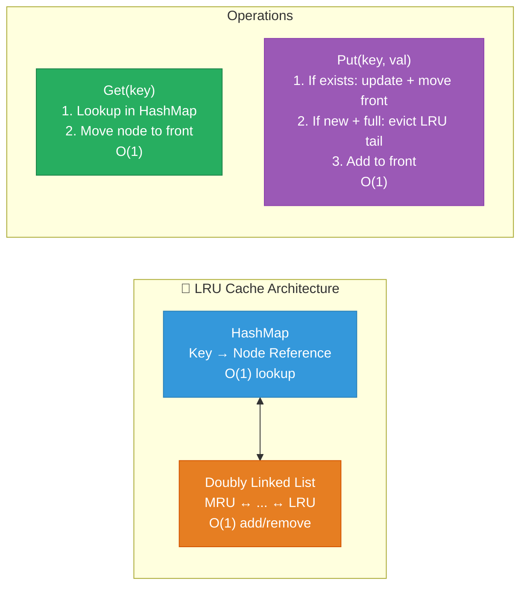
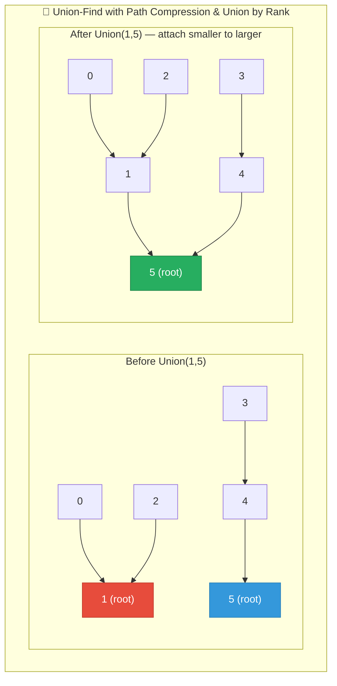
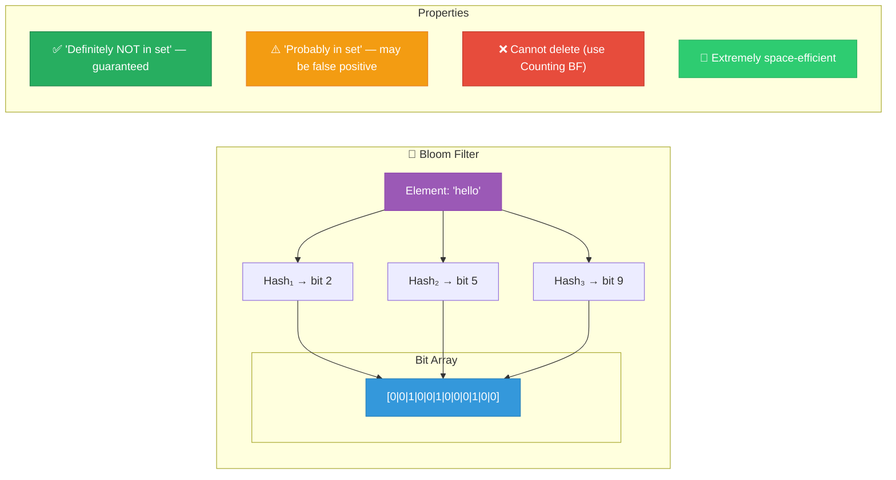

# 1. Advanced Structures

## Table of Contents

- [1.1 LRU Cache (Hash Map + Doubly Linked List)](#11-lru-cache-hash-map-doubly-linked-list)
- [1.2 Disjoint Set / Union-Find](#12-disjoint-set-union-find)
- [1.3 Bloom Filter — Probabilistic Data Structure](#13-bloom-filter-probabilistic-data-structure)
- [1.4 Skip List — Probabilistic Alternative to Balanced BST](#14-skip-list-probabilistic-alternative-to-balanced-bst)

---


## 1.1 LRU Cache (Hash Map + Doubly Linked List)



```csharp
/// <summary>
/// LRU (Least Recently Used) Cache — Top interview question.
/// All operations O(1) time.
/// </summary>
public class LRUCache
{
    private class DLinkedNode
    {
        public int Key, Value;
        public DLinkedNode? Prev, Next;
    }

    private readonly int _capacity;
    private readonly Dictionary<int, DLinkedNode> _cache = new();

    // Sentinel nodes to avoid null checks
    private readonly DLinkedNode _head = new(); // Most recently used
    private readonly DLinkedNode _tail = new(); // Least recently used

    public LRUCache(int capacity)
    {
        _capacity = capacity;
        _head.Next = _tail;
        _tail.Prev = _head;
    }

    // O(1)
    public int Get(int key)
    {
        if (!_cache.TryGetValue(key, out var node))
            return -1;

        MoveToHead(node); // Mark as recently used
        return node.Value;
    }

    // O(1)
    public void Put(int key, int value)
    {
        if (_cache.TryGetValue(key, out var existing))
        {
            existing.Value = value;
            MoveToHead(existing);
            return;
        }

        var newNode = new DLinkedNode { Key = key, Value = value };
        _cache[key] = newNode;
        AddToHead(newNode);

        if (_cache.Count > _capacity)
        {
            var lru = _tail.Prev!;
            RemoveNode(lru);
            _cache.Remove(lru.Key);
        }
    }

    private void AddToHead(DLinkedNode node)
    {
        node.Prev = _head;
        node.Next = _head.Next;
        _head.Next!.Prev = node;
        _head.Next = node;
    }

    private void RemoveNode(DLinkedNode node)
    {
        node.Prev!.Next = node.Next;
        node.Next!.Prev = node.Prev;
    }

    private void MoveToHead(DLinkedNode node)
    {
        RemoveNode(node);
        AddToHead(node);
    }
}
```

## 1.2 Disjoint Set / Union-Find



```csharp
/// <summary>
/// Union-Find with path compression + union by rank.
/// Nearly O(1) amortized per operation (inverse Ackermann).
/// Use: Kruskal's MST, connected components, network connectivity,
///      detecting cycles in undirected graphs.
/// </summary>
public class UnionFind
{
    private readonly int[] _parent;
    private readonly int[] _rank;
    public int Components { get; private set; }

    public UnionFind(int n)
    {
        _parent = new int[n];
        _rank = new int[n];
        Components = n;

        for (int i = 0; i < n; i++)
            _parent[i] = i; // Each element is its own root
    }

    // α(n) ≈ O(1) amortized — with path compression
    public int Find(int x)
    {
        if (_parent[x] != x)
            _parent[x] = Find(_parent[x]); // Path compression: point directly to root

        return _parent[x];
    }

    // α(n) ≈ O(1) amortized — with union by rank
    public bool Union(int x, int y)
    {
        int rootX = Find(x), rootY = Find(y);

        if (rootX == rootY) return false; // Already connected

        // Union by rank: attach shorter tree under taller tree
        if (_rank[rootX] < _rank[rootY])
            _parent[rootX] = rootY;
        else if (_rank[rootX] > _rank[rootY])
            _parent[rootY] = rootX;
        else
        {
            _parent[rootY] = rootX;
            _rank[rootX]++;
        }

        Components--;
        return true;
    }

    public bool Connected(int x, int y) => Find(x) == Find(y);
}
```

### Number of Islands (Union-Find Approach)

```csharp
/// <summary>
/// Count number of islands in a grid using Union-Find.
/// Time: O(M × N × α(M×N)) ≈ O(M × N)
/// </summary>
public static int NumIslands(char[][] grid)
{
    int rows = grid.Length, cols = grid[0].Length;
    var uf = new UnionFind(rows * cols);
    int waterCount = 0;

    for (int r = 0; r < rows; r++)
    {
        for (int c = 0; c < cols; c++)
        {
            if (grid[r][c] == '0')
            {
                waterCount++;
                continue;
            }

            // Union with right and down neighbors
            if (r + 1 < rows && grid[r + 1][c] == '1')
                uf.Union(r * cols + c, (r + 1) * cols + c);

            if (c + 1 < cols && grid[r][c + 1] == '1')
                uf.Union(r * cols + c, r * cols + c + 1);
        }
    }

    return uf.Components - waterCount;
}
```

## 1.3 Bloom Filter — Probabilistic Data Structure



```csharp
/// <summary>
/// Bloom Filter — Space-efficient probabilistic set membership.
/// False positives possible, false negatives IMPOSSIBLE.
/// Use: Caching (is this URL seen?), spam filters, database query optimization.
/// </summary>
public class BloomFilter
{
    private readonly BitArray _bits;
    private readonly int _numHashes;
    private readonly int _size;

    /// <param name="expectedItems">Expected number of items</param>
    /// <param name="falsePositiveRate">Desired false positive rate (e.g., 0.01)</param>
    public BloomFilter(int expectedItems, double falsePositiveRate = 0.01)
    {
        // Optimal size: m = -n * ln(p) / (ln(2))²
        _size = (int)(-expectedItems * Math.Log(falsePositiveRate) / (Math.Log(2) * Math.Log(2)));
        // Optimal hash count: k = (m/n) * ln(2)
        _numHashes = (int)(_size / (double)expectedItems * Math.Log(2));

        _bits = new BitArray(_size);
    }

    public void Add(string item)
    {
        foreach (int index in GetHashIndices(item))
            _bits[index] = true;
    }

    /// <summary>
    /// Returns true if item MIGHT be in the set.
    /// Returns false if item is DEFINITELY NOT in the set.
    /// </summary>
    public bool MightContain(string item)
    {
        foreach (int index in GetHashIndices(item))
        {
            if (!_bits[index]) return false; // Definitely not present
        }
        return true; // Probably present (could be false positive)
    }

    private IEnumerable<int> GetHashIndices(string item)
    {
        int hash1 = item.GetHashCode();
        int hash2 = item.GetHashCode() ^ (item.GetHashCode() >> 16);

        for (int i = 0; i < _numHashes; i++)
        {
            int combinedHash = hash1 + i * hash2;
            int index = ((combinedHash % _size) + _size) % _size;
            yield return index;
        }
    }
}
```

## 1.4 Skip List — Probabilistic Alternative to Balanced BST

```mermaid
graph LR
    subgraph "🏃 Skip List — Layered Linked Lists"
        subgraph "Level 3 (express)"
            L3_H["HEAD"] --> L3_6["6"] --> L3_T["TAIL"]
        end
        subgraph "Level 2"
            L2_H["HEAD"] --> L2_3["3"] --> L2_6["6"] --> L2_9["9"] --> L2_T["TAIL"]
        end
        subgraph "Level 1"
            L1_H["HEAD"] --> L1_1["1"] --> L1_3["3"] --> L1_5["5"] --> L1_6["6"] --> L1_7["7"] --> L1_9["9"] --> L1_T["TAIL"]
        end
    end

    style L3_6 fill:#e74c3c,stroke:#c0392b,color:#fff
    style L2_3 fill:#3498db,stroke:#2980b9,color:#fff
    style L2_6 fill:#3498db,stroke:#2980b9,color:#fff
    style L2_9 fill:#3498db,stroke:#2980b9,color:#fff
    style L1_1 fill:#27ae60,stroke:#1e8449,color:#fff
    style L1_3 fill:#27ae60,stroke:#1e8449,color:#fff
    style L1_5 fill:#27ae60,stroke:#1e8449,color:#fff
    style L1_6 fill:#27ae60,stroke:#1e8449,color:#fff
    style L1_7 fill:#27ae60,stroke:#1e8449,color:#fff
    style L1_9 fill:#27ae60,stroke:#1e8449,color:#fff
```



> **Used by:** Redis sorted sets, LevelDB, MemSQL. Expected O(log n) for search/insert/delete without complex rotations.
