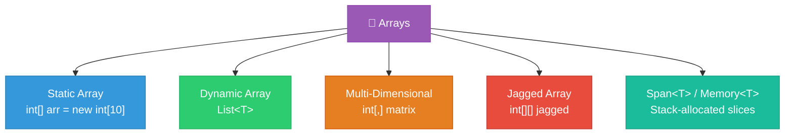
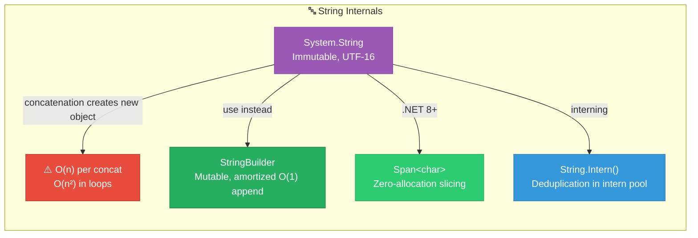

# 1. Arrays & Strings

## Table of Contents

- [1.1 Array Taxonomy](#11-array-taxonomy)
- [1.2 Complexity Table](#12-complexity-table)
- [1.3 Core Array Patterns for Interviews](#13-core-array-patterns-for-interviews)
- [1.4 Strings in C# — What Principals Must Know](#14-strings-in-c-what-principals-must-know)

---


## 1.1 Array Taxonomy



## 1.2 Complexity Table

| Operation | Static Array | `List<T>` (Dynamic) | Notes |
|---|---|---|---|
| Access by index | **O(1)** | **O(1)** | Direct pointer arithmetic |
| Search (unsorted) | O(n) | O(n) | Linear scan |
| Search (sorted) | **O(log n)** | **O(log n)** | Binary search |
| Insert at end | N/A | **O(1)** amortized | May trigger resize |
| Insert at index | O(n) | O(n) | Shift elements right |
| Delete at index | O(n) | O(n) | Shift elements left |
| Space | O(n) | O(n) | List uses ~2x due to capacity |

## 1.3 Core Array Patterns for Interviews

### Pattern 1: Two Pointers

```csharp
/// <summary>
/// Determines if a sorted array contains two numbers that sum to a target.
/// Time: O(n) | Space: O(1)
/// </summary>
public static (int, int)? TwoSumSorted(int[] nums, int target)
{
    int left = 0, right = nums.Length - 1;

    while (left < right)
    {
        int sum = nums[left] + nums[right];

        if (sum == target)
            return (left, right);
        else if (sum < target)
            left++;     // Need a larger sum
        else
            right--;    // Need a smaller sum
    }

    return null; // No pair found
}
```

### Pattern 2: Sliding Window

```csharp
/// <summary>
/// Finds the maximum sum subarray of size k.
/// Time: O(n) | Space: O(1)
/// </summary>
public static int MaxSumSubarray(int[] nums, int k)
{
    if (nums.Length < k)
        throw new ArgumentException("Array smaller than window");

    // Build initial window
    int windowSum = 0;
    for (int i = 0; i < k; i++)
        windowSum += nums[i];

    int maxSum = windowSum;

    // Slide the window: add right, remove left
    for (int i = k; i < nums.Length; i++)
    {
        windowSum += nums[i] - nums[i - k];
        maxSum = Math.Max(maxSum, windowSum);
    }

    return maxSum;
}
```

### Pattern 3: Kadane's Algorithm (Maximum Subarray)

```csharp
/// <summary>
/// Finds the contiguous subarray with the largest sum.
/// Time: O(n) | Space: O(1)
/// Classic DP problem — critical for interviews.
/// </summary>
public static int MaxSubArray(int[] nums)
{
    int currentMax = nums[0];
    int globalMax = nums[0];

    for (int i = 1; i < nums.Length; i++)
    {
        // Either extend the previous subarray or start fresh
        currentMax = Math.Max(nums[i], currentMax + nums[i]);
        globalMax = Math.Max(globalMax, currentMax);
    }

    return globalMax;
}
```

### Pattern 4: Prefix Sum

```csharp
/// <summary>
/// Build a prefix sum array for O(1) range-sum queries.
/// Preprocessing: O(n) | Query: O(1) | Space: O(n)
/// </summary>
public class PrefixSum
{
    private readonly long[] _prefix;

    public PrefixSum(int[] nums)
    {
        _prefix = new long[nums.Length + 1];
        for (int i = 0; i < nums.Length; i++)
            _prefix[i + 1] = _prefix[i] + nums[i];
    }

    /// <summary>Returns sum of nums[left..right] inclusive.</summary>
    public long RangeSum(int left, int right)
        => _prefix[right + 1] - _prefix[left];
}
```

## 1.4 Strings in C# — What Principals Must Know



```csharp
/// <summary>
/// String manipulation interview essential: 
/// Check if two strings are anagrams.
/// Time: O(n) | Space: O(1) — fixed 26-letter alphabet
/// </summary>
public static bool AreAnagrams(string s, string t)
{
    if (s.Length != t.Length) return false;

    Span<int> counts = stackalloc int[26]; // Zero-allocation!

    for (int i = 0; i < s.Length; i++)
    {
        counts[s[i] - 'a']++;
        counts[t[i] - 'a']--;
    }

    foreach (int count in counts)
    {
        if (count != 0) return false;
    }

    return true;
}
```
