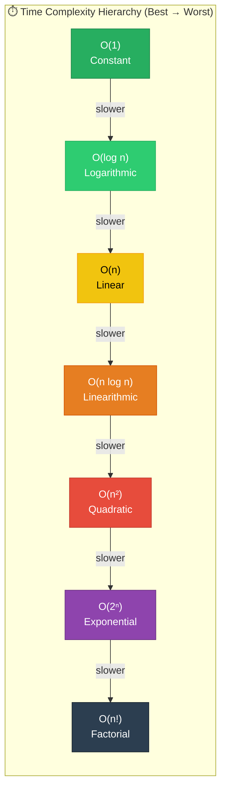
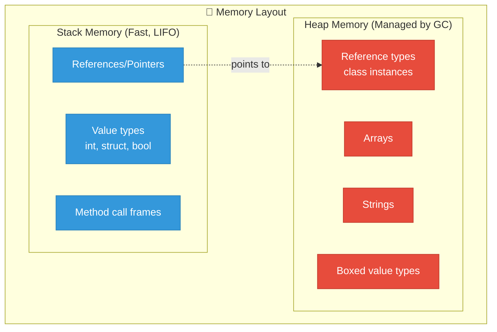

# 1. Foundations & Complexity Analysis

## Table of Contents

- [1.1 Big-O at a Glance](#11-big-o-at-a-glance)
- [1.2 Amortized Analysis — Why It Matters at Principal Level](#12-amortized-analysis-why-it-matters-at-principal-level)
- [1.3 Memory Layout Mental Model](#13-memory-layout-mental-model)

---


## 1.1 Big-O at a Glance



## 1.2 Amortized Analysis — Why It Matters at Principal Level

> **Key Insight:** A single expensive operation averaged over many cheap operations can still be efficient. This is critical for `List<T>.Add()`, `StringBuilder`, and `Dictionary<K,V>` resizing.

```csharp
// Example: Dynamic Array amortized cost
// Doubling strategy: When capacity is full, allocate 2x
// Cost of n insertions = n + (1 + 2 + 4 + 8 + ... + n) = n + 2n - 1 ≈ 3n
// Amortized cost per insertion = 3n / n = O(1)

public class AmortizedDemo
{
    public static void Demonstrate()
    {
        var list = new List<int>(); // Initial capacity: 0
        for (int i = 0; i < 17; i++)
        {
            list.Add(i);
            // Capacity doubles: 0→4→8→16→32
            Console.WriteLine($"Count={list.Count}, Capacity={list.Capacity}");
        }
    }
}
```

## 1.3 Memory Layout Mental Model



> **Principal-Level Talking Point:** Cache locality matters. Arrays and `Span<T>` give contiguous memory, which is CPU-cache friendly. Linked structures scatter across the heap, causing cache misses. This is why `List<T>` often outperforms `LinkedList<T>` in practice despite theoretical advantages of linked lists.
