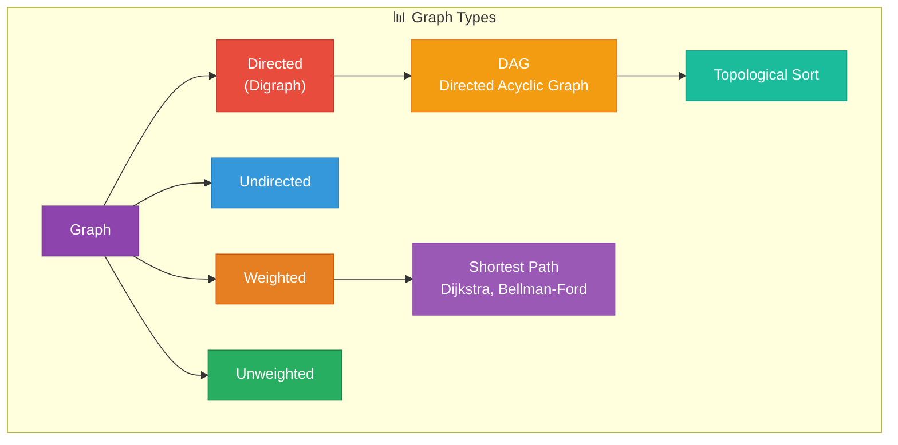
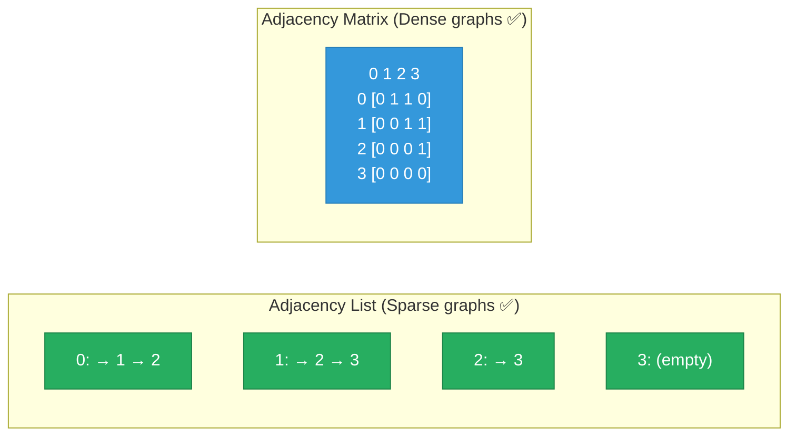
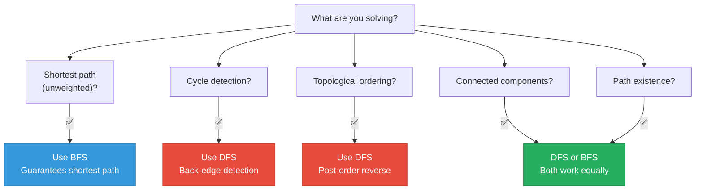

# 1. Graphs

## Table of Contents

- [1.1 Graph Terminology & Types](#11-graph-terminology-types)
- [1.2 Representation Comparison](#12-representation-comparison)
- [1.3 Graph Implementation](#13-graph-implementation)
- [1.4 BFS vs DFS Decision Framework](#14-bfs-vs-dfs-decision-framework)
- [1.5 Topological Sort (Kahn's Algorithm — BFS)](#15-topological-sort-kahns-algorithm-bfs)
- [1.6 Dijkstra's Shortest Path](#16-dijkstras-shortest-path)
- [1.7 Shortest Path Algorithm Comparison](#17-shortest-path-algorithm-comparison)
- [1.8 Cycle Detection in Directed Graph](#18-cycle-detection-in-directed-graph)

---


## 1.1 Graph Terminology & Types



## 1.2 Representation Comparison



| Feature | Adjacency List | Adjacency Matrix |
|---|---|---|
| Space | **O(V + E)** | O(V²) |
| Check edge exists | O(degree) | **O(1)** |
| List all neighbors | **O(degree)** | O(V) |
| Add edge | **O(1)** | **O(1)** |
| Best for | **Sparse** graphs (most real-world) | **Dense** graphs, quick lookups |

## 1.3 Graph Implementation

```csharp
/// <summary>
/// Adjacency list graph supporting directed/undirected, weighted/unweighted.
/// </summary>
public class Graph<T> where T : notnull
{
    private readonly Dictionary<T, List<(T neighbor, double weight)>> _adj = new();
    private readonly bool _directed;

    public Graph(bool directed = false) => _directed = directed;

    public void AddVertex(T vertex)
    {
        if (!_adj.ContainsKey(vertex))
            _adj[vertex] = new List<(T, double)>();
    }

    public void AddEdge(T from, T to, double weight = 1.0)
    {
        AddVertex(from);
        AddVertex(to);

        _adj[from].Add((to, weight));

        if (!_directed)
            _adj[to].Add((from, weight));
    }

    public IEnumerable<T> GetVertices() => _adj.Keys;

    public IEnumerable<(T neighbor, double weight)> GetNeighbors(T vertex)
        => _adj.TryGetValue(vertex, out var neighbors) 
            ? neighbors 
            : Enumerable.Empty<(T, double)>();

    // ===== BFS — Level-order traversal =====
    // Time: O(V + E) | Space: O(V)
    // Use: Shortest path (unweighted), level detection, connectivity
    public List<T> BFS(T start)
    {
        var visited = new HashSet<T>();
        var queue = new Queue<T>();
        var result = new List<T>();

        visited.Add(start);
        queue.Enqueue(start);

        while (queue.Count > 0)
        {
            var current = queue.Dequeue();
            result.Add(current);

            foreach (var (neighbor, _) in GetNeighbors(current))
            {
                if (visited.Add(neighbor)) // Add returns false if already present
                {
                    queue.Enqueue(neighbor);
                }
            }
        }

        return result;
    }

    // ===== DFS — Deep exploration =====
    // Time: O(V + E) | Space: O(V)
    // Use: Cycle detection, topological sort, connected components
    public List<T> DFS(T start)
    {
        var visited = new HashSet<T>();
        var result = new List<T>();
        DFSHelper(start, visited, result);
        return result;
    }

    private void DFSHelper(T current, HashSet<T> visited, List<T> result)
    {
        if (!visited.Add(current)) return;

        result.Add(current);

        foreach (var (neighbor, _) in GetNeighbors(current))
        {
            DFSHelper(neighbor, visited, result);
        }
    }

    // ===== DFS Iterative (using explicit stack) =====
    public List<T> DFSIterative(T start)
    {
        var visited = new HashSet<T>();
        var stack = new Stack<T>();
        var result = new List<T>();

        stack.Push(start);

        while (stack.Count > 0)
        {
            var current = stack.Pop();

            if (!visited.Add(current)) continue;

            result.Add(current);

            foreach (var (neighbor, _) in GetNeighbors(current))
            {
                if (!visited.Contains(neighbor))
                    stack.Push(neighbor);
            }
        }

        return result;
    }
}
```

## 1.4 BFS vs DFS Decision Framework



## 1.5 Topological Sort (Kahn's Algorithm — BFS)

```csharp
/// <summary>
/// Topological sort for DAG using Kahn's algorithm (BFS with in-degrees).
/// Time: O(V + E) | Space: O(V)
/// Use: Build systems, course prerequisites, task scheduling.
/// </summary>
public static List<int> TopologicalSort(int numVertices, int[][] edges)
{
    var adj = new List<List<int>>();
    var inDegree = new int[numVertices];

    for (int i = 0; i < numVertices; i++)
        adj.Add(new List<int>());

    foreach (var edge in edges)
    {
        adj[edge[0]].Add(edge[1]);
        inDegree[edge[1]]++;
    }

    // Start with all vertices having 0 in-degree
    var queue = new Queue<int>();
    for (int i = 0; i < numVertices; i++)
    {
        if (inDegree[i] == 0)
            queue.Enqueue(i);
    }

    var result = new List<int>();

    while (queue.Count > 0)
    {
        int vertex = queue.Dequeue();
        result.Add(vertex);

        foreach (int neighbor in adj[vertex])
        {
            inDegree[neighbor]--;
            if (inDegree[neighbor] == 0)
                queue.Enqueue(neighbor);
        }
    }

    // If result doesn't contain all vertices → cycle exists!
    if (result.Count != numVertices)
        throw new InvalidOperationException("Graph has a cycle — not a DAG");

    return result;
}
```

## 1.6 Dijkstra's Shortest Path

```csharp
/// <summary>
/// Single-source shortest path for NON-NEGATIVE weighted graphs.
/// Time: O((V + E) log V) with priority queue
/// Space: O(V)
/// </summary>
public static Dictionary<T, double> Dijkstra<T>(Graph<T> graph, T source) where T : notnull
{
    var dist = new Dictionary<T, double>();
    var visited = new HashSet<T>();

    // Initialize all distances to infinity
    foreach (var v in graph.GetVertices())
        dist[v] = double.PositiveInfinity;

    dist[source] = 0;

    // Min-heap: (distance, vertex)
    var pq = new PriorityQueue<T, double>();
    pq.Enqueue(source, 0);

    while (pq.Count > 0)
    {
        var current = pq.Dequeue();

        if (!visited.Add(current)) continue; // Already processed

        foreach (var (neighbor, weight) in graph.GetNeighbors(current))
        {
            double newDist = dist[current] + weight;

            if (newDist < dist[neighbor])
            {
                dist[neighbor] = newDist;
                pq.Enqueue(neighbor, newDist);
            }
        }
    }

    return dist;
}
```

## 1.7 Shortest Path Algorithm Comparison

| Algorithm | Time | Space | Negative Weights? | Use Case |
|---|---|---|---|---|
| **BFS** | O(V+E) | O(V) | N/A (unweighted) | Unweighted shortest path |
| **Dijkstra** | O((V+E) log V) | O(V) | ❌ No | Non-negative weighted |
| **Bellman-Ford** | O(V·E) | O(V) | ✅ Yes | Negative weights, cycle detection |
| **Floyd-Warshall** | O(V³) | O(V²) | ✅ Yes | All-pairs shortest path |
| **A*** | O(E) best case | O(V) | ❌ No | Heuristic-guided (maps, games) |

## 1.8 Cycle Detection in Directed Graph

```csharp
/// <summary>
/// Detects cycle in directed graph using DFS coloring.
/// White (0) = unvisited, Gray (1) = in progress, Black (2) = done
/// A cycle exists if we visit a Gray node.
/// Time: O(V + E) | Space: O(V)
/// </summary>
public static bool HasCycleDirected(int numVertices, List<List<int>> adj)
{
    var color = new int[numVertices]; // 0=white, 1=gray, 2=black

    for (int i = 0; i < numVertices; i++)
    {
        if (color[i] == 0 && DFSCycle(i, adj, color))
            return true;
    }

    return false;
}

private static bool DFSCycle(int v, List<List<int>> adj, int[] color)
{
    color[v] = 1; // Mark gray (in progress)

    foreach (int neighbor in adj[v])
    {
        if (color[neighbor] == 1)
            return true;  // Back edge → CYCLE!
        if (color[neighbor] == 0 && DFSCycle(neighbor, adj, color))
            return true;
    }

    color[v] = 2; // Mark black (complete)
    return false;
}
```
