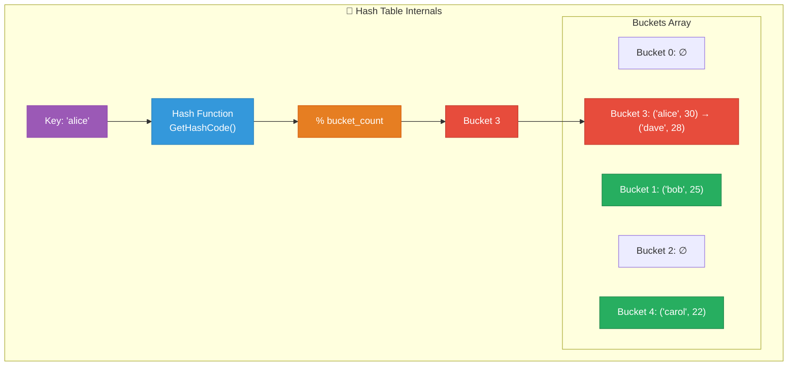
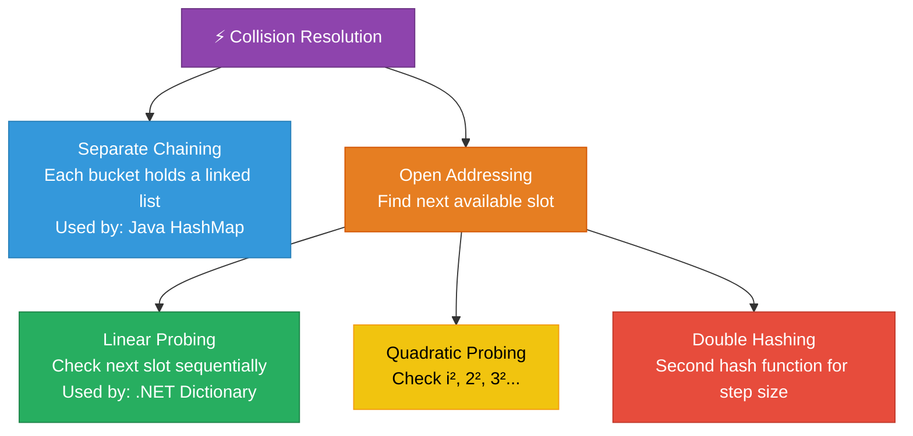

# 1. Hash Tables & Dictionaries

## Table of Contents

- [1.1 Hash Table Architecture](#11-hash-table-architecture)
- [1.2 Collision Resolution Strategies](#12-collision-resolution-strategies)
- [1.3 Complexity](#13-complexity)
- [1.4 .NET Hash Family Comparison](#14-net-hash-family-comparison)
- [1.5 Custom Hash Table Implementation](#15-custom-hash-table-implementation)
- [1.6 Classic Interview: Two Sum (Unsorted)](#16-classic-interview-two-sum-unsorted)
- [1.7 Classic Interview: Group Anagrams](#17-classic-interview-group-anagrams)

---


## 1.1 Hash Table Architecture



## 1.2 Collision Resolution Strategies



## 1.3 Complexity

| Operation | Average | Worst (all collisions) |
|---|---|---|
| Insert | **O(1)** | O(n) |
| Lookup | **O(1)** | O(n) |
| Delete | **O(1)** | O(n) |
| Space | O(n) | O(n) |

> **Load Factor = n / capacity.** .NET `Dictionary` resizes when load factor ≈ 1.0 (using prime-sized buckets). After resize, all entries are rehashed — O(n) but amortized away.

## 1.4 .NET Hash Family Comparison

| Type | Ordered? | Dupl Keys? | Thread-Safe? | Notes |
|---|---|---|---|---|
| `Dictionary<K,V>` | ❌ | ❌ | ❌ | Workhorse. O(1) average |
| `HashSet<T>` | ❌ | N/A | ❌ | Set operations (union, intersect) |
| `SortedDictionary<K,V>` | ✅ | ❌ | ❌ | Red-Black Tree. O(log n) |
| `SortedSet<T>` | ✅ | N/A | ❌ | Red-Black Tree. O(log n) |
| `ConcurrentDictionary<K,V>` | ❌ | ❌ | ✅ | Fine-grained locking, striped |
| `FrozenDictionary<K,V>` | ❌ | ❌ | ✅ | .NET 8+, immutable, fastest reads |

## 1.5 Custom Hash Table Implementation

```csharp
/// <summary>
/// Hash table with separate chaining.
/// Demonstrates: hashing, collision resolution, dynamic resizing.
/// </summary>
public class HashTable<TKey, TValue> where TKey : notnull
{
    private class Entry
    {
        public TKey Key;
        public TValue Value;
        public Entry? Next; // Chaining

        public Entry(TKey key, TValue value) { Key = key; Value = value; }
    }

    private Entry?[] _buckets;
    private int _count;
    private const double LoadFactorThreshold = 0.75;

    public HashTable(int capacity = 16)
    {
        _buckets = new Entry?[capacity];
    }

    private int GetBucketIndex(TKey key)
        => (key.GetHashCode() & 0x7FFFFFFF) % _buckets.Length; // Ensure positive

    // Amortized O(1)
    public void Put(TKey key, TValue value)
    {
        if ((double)_count / _buckets.Length >= LoadFactorThreshold)
            Resize();

        int index = GetBucketIndex(key);
        var current = _buckets[index];

        // Update existing key
        while (current is not null)
        {
            if (EqualityComparer<TKey>.Default.Equals(current.Key, key))
            {
                current.Value = value;
                return;
            }
            current = current.Next;
        }

        // Insert at head of chain
        var newEntry = new Entry(key, value) { Next = _buckets[index] };
        _buckets[index] = newEntry;
        _count++;
    }

    // O(1) average
    public TValue Get(TKey key)
    {
        int index = GetBucketIndex(key);
        var current = _buckets[index];

        while (current is not null)
        {
            if (EqualityComparer<TKey>.Default.Equals(current.Key, key))
                return current.Value;
            current = current.Next;
        }

        throw new KeyNotFoundException($"Key '{key}' not found");
    }

    // O(1) average
    public bool Remove(TKey key)
    {
        int index = GetBucketIndex(key);
        Entry? prev = null;
        var current = _buckets[index];

        while (current is not null)
        {
            if (EqualityComparer<TKey>.Default.Equals(current.Key, key))
            {
                if (prev is null)
                    _buckets[index] = current.Next;
                else
                    prev.Next = current.Next;

                _count--;
                return true;
            }
            prev = current;
            current = current.Next;
        }

        return false;
    }

    // O(n) — rehash all entries
    private void Resize()
    {
        var oldBuckets = _buckets;
        _buckets = new Entry?[oldBuckets.Length * 2];
        _count = 0;

        foreach (var bucket in oldBuckets)
        {
            var current = bucket;
            while (current is not null)
            {
                Put(current.Key, current.Value);
                current = current.Next;
            }
        }
    }
}
```

## 1.6 Classic Interview: Two Sum (Unsorted)

```csharp
/// <summary>
/// Find indices of two numbers that sum to target.
/// Time: O(n) | Space: O(n)
/// </summary>
public static int[] TwoSum(int[] nums, int target)
{
    var map = new Dictionary<int, int>(); // value → index

    for (int i = 0; i < nums.Length; i++)
    {
        int complement = target - nums[i];

        if (map.TryGetValue(complement, out int j))
            return [j, i];

        map[nums[i]] = i;
    }

    throw new ArgumentException("No two sum solution");
}
```

## 1.7 Classic Interview: Group Anagrams

```csharp
/// <summary>
/// Groups words that are anagrams of each other.
/// Time: O(n * k log k) where k = max word length
/// Space: O(n * k)
/// </summary>
public static IList<IList<string>> GroupAnagrams(string[] strs)
{
    var groups = new Dictionary<string, IList<string>>();

    foreach (string s in strs)
    {
        // Sorted characters form a canonical key for anagram groups
        char[] chars = s.ToCharArray();
        Array.Sort(chars);
        string key = new string(chars);

        if (!groups.ContainsKey(key))
            groups[key] = new List<string>();

        groups[key].Add(s);
    }

    return groups.Values.ToList();
}
```
