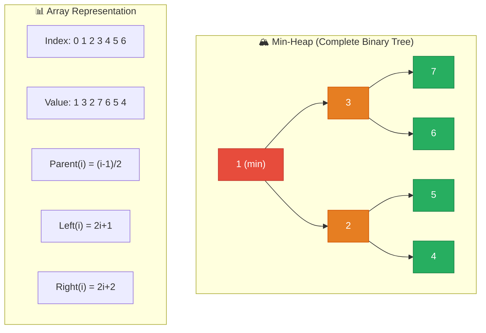

# 1. Heaps & Priority Queues

## Table of Contents

- [1.1 Heap Structure](#11-heap-structure)
- [1.2 Complexity](#12-complexity)
- [1.3 Full Heap Implementation](#13-full-heap-implementation)
- [1.4 .NET 6+ PriorityQueue](#14-net-6-priorityqueue)
- [1.5 Top K Elements Pattern](#15-top-k-elements-pattern)
- [1.6 Median Finder (Two Heaps)](#16-median-finder-two-heaps)

---


## 1.1 Heap Structure



## 1.2 Complexity

| Operation | Time | Notes |
|---|---|---|
| Insert (push) | **O(log n)** | Bubble up |
| Extract min/max | **O(log n)** | Bubble down |
| Peek min/max | **O(1)** | Root element |
| Build heap from array | **O(n)** | Not O(n log n)! Bottom-up |
| Search | O(n) | Heap is NOT a search structure |
| Heapify (sift down) | O(log n) | Core operation |

## 1.3 Full Heap Implementation

```csharp
/// <summary>
/// Generic min-heap with custom comparison support.
/// Used in: Dijkstra's, K closest points, median finding, task scheduling.
/// </summary>
public class MinHeap<T>
{
    private readonly List<T> _data = new();
    private readonly IComparer<T> _comparer;

    public int Count => _data.Count;
    public bool IsEmpty => _data.Count == 0;

    public MinHeap(IComparer<T>? comparer = null)
    {
        _comparer = comparer ?? Comparer<T>.Default;
    }

    // O(log n) — Add to end, bubble up
    public void Push(T item)
    {
        _data.Add(item);
        BubbleUp(_data.Count - 1);
    }

    // O(1)
    public T Peek()
    {
        if (IsEmpty) throw new InvalidOperationException("Heap is empty");
        return _data[0];
    }

    // O(log n) — Swap root with last, remove last, bubble down
    public T Pop()
    {
        if (IsEmpty) throw new InvalidOperationException("Heap is empty");

        T min = _data[0];
        int lastIndex = _data.Count - 1;

        _data[0] = _data[lastIndex];
        _data.RemoveAt(lastIndex);

        if (_data.Count > 0)
            BubbleDown(0);

        return min;
    }

    private void BubbleUp(int index)
    {
        while (index > 0)
        {
            int parent = (index - 1) / 2;

            if (_comparer.Compare(_data[index], _data[parent]) >= 0)
                break;

            Swap(index, parent);
            index = parent;
        }
    }

    private void BubbleDown(int index)
    {
        int count = _data.Count;

        while (true)
        {
            int smallest = index;
            int left = 2 * index + 1;
            int right = 2 * index + 2;

            if (left < count && _comparer.Compare(_data[left], _data[smallest]) < 0)
                smallest = left;
            if (right < count && _comparer.Compare(_data[right], _data[smallest]) < 0)
                smallest = right;

            if (smallest == index) break;

            Swap(index, smallest);
            index = smallest;
        }
    }

    private void Swap(int i, int j)
        => (_data[i], _data[j]) = (_data[j], _data[i]);
}
```

## 1.4 .NET 6+ PriorityQueue

```csharp
/// <summary>
/// .NET's built-in PriorityQueue<TElement, TPriority>.
/// Min-priority by default.
/// </summary>
public static void DotNetPriorityQueueDemo()
{
    // Element type, Priority type
    var pq = new PriorityQueue<string, int>();

    pq.Enqueue("Low priority task", 10);
    pq.Enqueue("CRITICAL task", 1);
    pq.Enqueue("Medium task", 5);

    while (pq.Count > 0)
    {
        Console.WriteLine(pq.Dequeue());
        // Output: CRITICAL task → Medium task → Low priority task
    }
}
```

## 1.5 Top K Elements Pattern

```csharp
/// <summary>
/// Find K largest elements in an unsorted array.
/// Time: O(n log k) | Space: O(k)
/// Strategy: Use a MIN-heap of size k. The root is always the k-th largest.
/// </summary>
public static int[] TopKLargest(int[] nums, int k)
{
    // .NET PriorityQueue is min-priority
    var minHeap = new PriorityQueue<int, int>();

    foreach (int num in nums)
    {
        minHeap.Enqueue(num, num);

        if (minHeap.Count > k)
            minHeap.Dequeue(); // Remove smallest — keeps only k largest
    }

    var result = new int[k];
    for (int i = k - 1; i >= 0; i--)
        result[i] = minHeap.Dequeue();

    return result;
}
```

## 1.6 Median Finder (Two Heaps)

```csharp
/// <summary>
/// Find median from a data stream.
/// Uses two heaps: maxHeap for lower half, minHeap for upper half.
/// AddNum: O(log n) | FindMedian: O(1)
/// </summary>
public class MedianFinder
{
    // Max-heap for lower half (negate values to simulate max-heap)
    private readonly PriorityQueue<int, int> _maxHeap = new();
    // Min-heap for upper half
    private readonly PriorityQueue<int, int> _minHeap = new();

    public void AddNum(int num)
    {
        // Always add to maxHeap first (negate for max-heap behavior)
        _maxHeap.Enqueue(num, -num);

        // Balance: ensure maxHeap's max ≤ minHeap's min
        _minHeap.Enqueue(_maxHeap.Peek(), _maxHeap.Peek());
        _maxHeap.Dequeue();

        // Keep sizes: maxHeap can have at most 1 more element
        if (_minHeap.Count > _maxHeap.Count)
        {
            _maxHeap.Enqueue(_minHeap.Peek(), -_minHeap.Peek());
            _minHeap.Dequeue();
        }
    }

    public double FindMedian()
    {
        if (_maxHeap.Count > _minHeap.Count)
            return _maxHeap.Peek();

        return (_maxHeap.Peek() + _minHeap.Peek()) / 2.0;
    }
}
```
