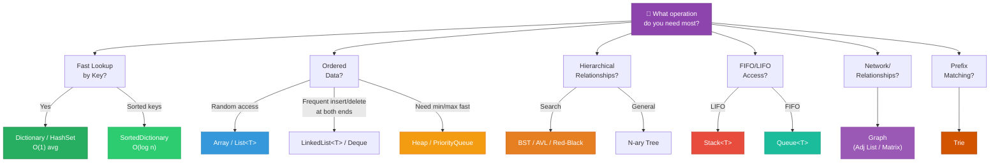
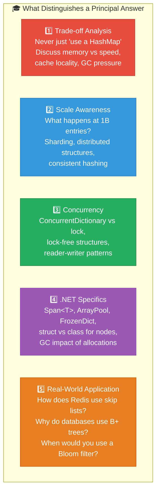
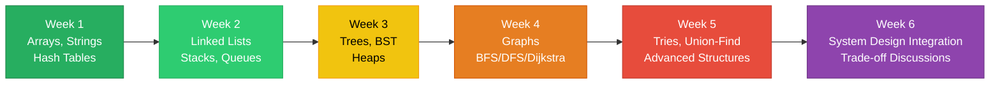

# 1. Interview Decision Framework

## Table of Contents

- [1.1 Master Data Structure Selection Flowchart](#11-master-data-structure-selection-flowchart)
- [1.2 Complexity Cheat Sheet](#12-complexity-cheat-sheet)
- [1.3 Principal-Level Interview Tips](#13-principal-level-interview-tips)
- [✅ Study Progression Recommendation](#study-progression-recommendation)

---


## 1.1 Master Data Structure Selection Flowchart



## 1.2 Complexity Cheat Sheet

| Data Structure | Access | Search | Insert | Delete | Space |
|---|---|---|---|---|---|
| **Array** | **O(1)** | O(n) | O(n) | O(n) | O(n) |
| **List\<T\>** | **O(1)** | O(n) | O(1)* / O(n) | O(n) | O(n) |
| **LinkedList** | O(n) | O(n) | **O(1)** | **O(1)** | O(n) |
| **Stack** | **O(1)** top | O(n) | **O(1)** | **O(1)** | O(n) |
| **Queue** | **O(1)** front | O(n) | **O(1)** | **O(1)** | O(n) |
| **HashSet/Dict** | N/A | **O(1)** | **O(1)** | **O(1)** | O(n) |
| **SortedDict** | N/A | **O(log n)** | **O(log n)** | **O(log n)** | O(n) |
| **Binary Heap** | **O(1)** min | O(n) | **O(log n)** | **O(log n)** | O(n) |
| **BST (balanced)** | N/A | **O(log n)** | **O(log n)** | **O(log n)** | O(n) |
| **Trie** | N/A | **O(m)** | **O(m)** | **O(m)** | O(n·m·σ) |
| **Graph (adj list)** | N/A | O(V+E) | **O(1)** edge | O(E) edge | O(V+E) |

## 1.3 Principal-Level Interview Tips



### Key Phrases That Signal Principal-Level Thinking

```
✅ "The amortized cost is O(1) because..."
✅ "In practice, array-backed structures win due to cache locality..."
✅ "At this scale, we'd need to partition the data structure across nodes..."
✅ "The GC pressure from this many heap allocations would be problematic..."
✅ "We could use a probabilistic structure here since false positives are acceptable..."
✅ "The read/write ratio suggests we should optimize for..."
✅ "struct-based nodes on the stack with Span<T> would avoid GC entirely..."
```

---

## ✅ Study Progression Recommendation



---

> **This guide covers the full data structures landscape expected at the principal engineer level. Each section is designed to go beyond "textbook" answers — emphasizing trade-offs, real-world applications, .NET internals, and the kind of depth interviewers expect from someone leading technical direction.** Good luck with your interview! 🚀
